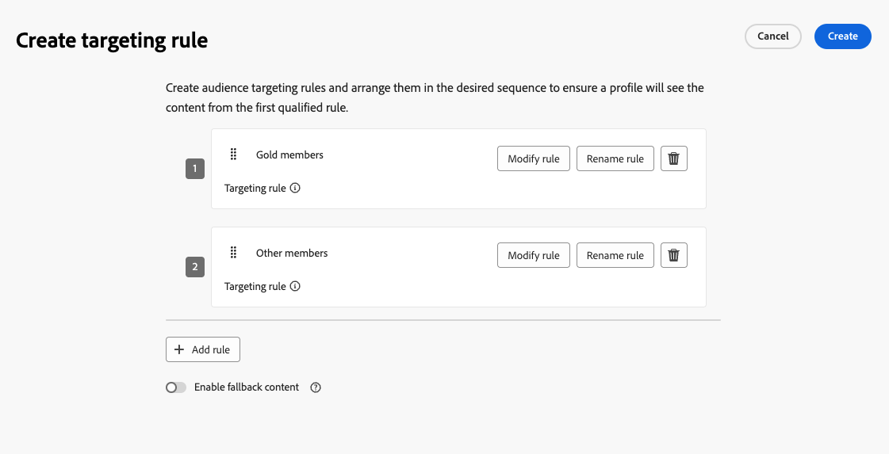

# Aktivität optimieren {#journey-path-optimization}

>[!CONTEXTUALHELP]
>id="ajo_journey_optimize"
>title="Aktivität optimieren"
>abstract="Mit **Aktivität „Optimieren** können Sie festlegen, wie Kontakte über Ihren Journey fortschreiten, indem Sie mehrere Pfade auf der Grundlage bestimmter Kriterien wie Experimentieren, Targeting und bestimmter Bedingungen erstellen."

>[!AVAILABILITY]
>
>Diese Funktion ist nur eingeschränkt verfügbar. Wenden Sie sich an den Adobe-Support, um Zugang zu erhalten.

Mit der Aktivität **Optimieren** können Sie festlegen, wie Kontakte über Ihren Journey voranschreiten, indem Sie mehrere **Pfade** basierend auf bestimmten Kriterien erstellen, einschließlich Experimentieren, Targeting und bestimmten Bedingungen. So stellen Sie ein Höchstmaß an Interaktion und Erfolg sicher, um hochgradig angepasste und effektive Journey zu erstellen.

Ein Journey **Pfad** kann aus einer der folgenden Variablen bestehen: Sequenzierung der Kommunikation, dazwischen liegende Zeit, Anzahl der Kommunikationen oder eine beliebige Kombination dieser drei Variablen.

Ein Pfad kann beispielsweise eine E-Mail enthalten, ein anderer zwei SMS-Nachrichten und ein dritter eine E-Mail, einen Warteknoten von zwei Stunden und dann eine SMS-Nachricht.

<!--With this feature, [!DNL Journey Optimizer] empowers you with the tools to deliver personalized and optimized paths to your audience, ensuring maximum engagement and success to create highly customized and effective journeys.-->

Durch die Aktivität **Optimieren** können Sie die folgenden Aktionen für die resultierenden Pfade ausführen:

* Ausführen [Pfadexperimenten](#experimentation)
* Nutzen [Targeting](#targeting)-Regeln in jedem Journey-Pfad
* Anwenden [Bedingungen](#conditions) auf Ihre Pfade

Sobald die Journey live ist, werden die Profile anhand der definierten Kriterien bewertet. Anhand übereinstimmender Kriterien werden sie dann vom Journey in den entsprechenden Pfad weitergeleitet.

## Verwenden von Experimenten {#experimentation}

Mit Experimenten können Sie verschiedene Pfade auf der Grundlage einer zufälligen Aufspaltung testen, um anhand vordefinierter Erfolgsmetriken zu bestimmen, welche am besten abschneidet.

Gehen Sie wie folgt vor, um Pfadexperimente auf einer Journey einzurichten.

Angenommen, Sie möchten drei Pfade vergleichen:

* ein Pfad mit einer E-Mail;
* einen zweiten Pfad mit einem **[!UICONTROL Warte]**-Knoten von zwei Tagen und einer E-Mail;
* einem dritten Pfad mit einer E-Mail-Adresse und einer SMS-Nachricht.

1. Ziehen Sie aus dem Abschnitt **[!UICONTROL Orchestrierung]** die Aktivität **[!UICONTROL Optimieren]** per Drag-and-Drop auf die Journey-Arbeitsfläche.

1. Fügen Sie eine optionale Beschriftung hinzu, die nützlich sein kann, um die Aktivität in Reporting- und Testmodusprotokollen zu identifizieren.

1. Wählen Sie **[!UICONTROL Experiment]** aus der **[!UICONTROL Methode]** Dropdown-Liste aus.

   {width=75%}

1. Klicken Sie **[!UICONTROL Experiment erstellen]**.

1. Wählen Sie die **[!UICONTROL Erfolgsmetrik]**, die Sie für Ihr Experiment festlegen möchten.

   <!--Need to have the list of all default metrics + a description for each.
    Explain why the metric selection is important.
    Are there custom metrics? If so explain.
    If possible, add best practices and examples for each metrics (could even be a dedicated section).
    Consider adding an example in this step: For this example, select this metric to test xxx.
    -->

   {width=80%}

1. Sie können eine &quot;**[!UICONTROL &quot;-]** zu Ihrem Versand hinzufügen. Diese Gruppe gibt keinen Pfad aus diesem Experiment ein.

   >[!NOTE]
   >
   >Wenn Sie den Umschalter aktivieren, werden automatisch 10 % Ihrer Population übernommen. Sie können diesen Prozentsatz bei Bedarf anpassen.

   <!--
    DOES THIS APPLY TO PATH EXPERIMENT?
    IMPORTANT: When a holdout group is used in an action for path experimentation, the holdout assignment only applies to that specific action. After the action is completed, profiles in the holdout group will continue down the journey path and can receive messages from other actions. Therefore, ensure that any subsequent messages do not rely on the receipt of a message by a profile that might be in a holdout group. If they do, you may need to remove the holdout assignment.-->

1. Sie können jeder **[!UICONTROL Variante“ einen bestimmten Prozentsatz zuweisen]** einfach den Umschalter **[!UICONTROL Gleichmäßig verteilen]** aktivieren.

   {width=80%}

1. Klicken Sie auf **[!UICONTROL Erstellen]**.

1. Definieren Sie die gewünschten Elemente für jede Verzweigung, die aus dem Experiment resultiert, z. B.:

   * Ziehen Sie eine [E-Mail](../email/create-email.md)-Aktivität auf den ersten Zweig (**Abwandlung A**).

   * Ziehen Sie eine [Warten](wait-activity.md)-Aktivität von zwei Tagen auf den ersten Zweig, gefolgt von einer [E-Mail](../email/create-email.md)-Aktivität (**Behandlung B**).

   * Ziehen Sie eine Aktivität [E-Mail](../email/create-email.md) auf den dritten Zweig, gefolgt von einer Aktivität [SMS](../sms/create-sms.md) (**Abwandlung C**).

   {width=100%}

1. Verwenden Sie optional den **[!UICONTROL Alternativen Pfad hinzufügen, falls eine Zeitüberschreitung oder ein Fehler auftritt]** um eine Ausweichaktion zu definieren. [Weitere Informationen](using-the-journey-designer.md#paths)

1. Wählen Sie eine Kanalaktion aus und verwenden Sie die Schaltfläche **[!UICONTROL Inhalt bearbeiten]**, um auf die Design-Tools zuzugreifen.

   {width=70%}

1. Von dort aus können Sie mithilfe des linken Bereichs zwischen den verschiedenen Inhalten für jede Aktion in Ihrem Experiment navigieren. Wählen Sie jeden Inhalt aus und entwerfen Sie ihn nach Bedarf.

   {width=100%}

1. [Veröffentlichen](publishing-the-journey.md) Ihres Journey.

Sobald die Journey live ist, werden die Benutzenden nach dem Zufallsprinzip zugewiesen, verschiedene Pfade zu durchlaufen. [!DNL Journey Optimizer] verfolgt, welcher Pfad am besten funktioniert, und liefert verwertbare Einblicke.

<!--Follow the success of your journey with the Journey Path Experiment report.Reporting page on Journey Path Experimentation to be created - such as what we have for [Experimentation campaign report](../reports/campaign-global-report-cja-experimentation.md)-->

### Anwendungsfälle für Experimente {#uc-experiment}

Die folgenden Beispiele zeigen, wie Sie mit der Aktivität **[!UICONTROL Optimieren]** mit der Methode **[!UICONTROL Experiment]** ermitteln, welcher Pfad insgesamt am besten funktioniert.

+++Kanaleffektivität

Testen Sie, ob das Senden der ersten Nachricht per E-Mail oder SMS zu höheren Konversionen führt.

➡️ Konversionsrate als Optimierungsmetrik verwenden (z. B.: Käufe, Anmeldungen).

+++

+++Nachrichtenfrequenz

➡️ Führen Sie ein Experiment aus, um zu überprüfen, ob der Versand einer E-Mail im Vergleich zu drei E-Mails pro Woche zu mehr Käufen führt.

Verwenden Sie Käufe oder die Abmelderate als Optimierungsmetrik.

+++

+++Wartezeit zwischen Nachrichten

Vergleich einer Wartezeit von 24 Stunden mit einer Wartezeit von 72 Stunden vor einer Nachbeobachtung, um zu bestimmen, welcher Zeitpunkt die Interaktion maximiert.

➡️ Verwenden Sie die Clickthrough-Rate oder den Umsatz als Optimierungsmetrik.

+++

## Verwenden von Targeting {#targeting}

Mit Targeting-Regeln können Sie bestimmte Regeln oder Qualifikationen festlegen, die eine Kundin oder ein Kunde basierend auf bestimmten Zielgruppensegmenten erfüllen muss, um für den Eintritt in einen der Journey-Pfade berechtigt zu <!-- depending on profile attributes or contextual attributes-->.

Im Gegensatz zu Experimenten, bei denen es sich um eine zufällige Zuweisung eines bestimmten Pfads handelt, ist die Zielgruppenbestimmung deterministisch, indem sichergestellt wird, dass die richtige Zielgruppe oder das richtige Profil in den angegebenen Pfad eintritt.

<!--With targeting, specific rules can be defined based on:

* **User profile attributes** such as location (eg. geo-targeting), age, or preferences. For example, users in the US receive a "Golden Gate" promotion, while users in France receive an "Eiffel Tower" promotion.

* **Contextual data** such as device type (eg. device-targeting), time of day, or session details. For example, desktop users receive desktop-optimized content, while mobile users receive mobile-optimized content.

* **Audiences** which can be used to include or exclude profiles that have a particular audience membership.-->

Gehen Sie wie folgt vor, um das Targeting auf einer Journey einzurichten.

1. Ziehen Sie aus dem Abschnitt **[!UICONTROL Orchestrierung]** die Aktivität **[!UICONTROL Optimieren]** per Drag-and-Drop auf die Journey-Arbeitsfläche.

1. Fügen Sie eine optionale Beschriftung hinzu, die nützlich sein kann, um die Aktivität in Reporting- und Testmodusprotokollen zu identifizieren.

1. Wählen **[!UICONTROL Zielgruppenbestimmungsregel]** aus der Dropdown **[!UICONTROL Liste]** Methode“ aus.

   {width=70%}

1. Klicken Sie **[!UICONTROL Zielgruppenregel erstellen]**.

1. Verwenden Sie den Regel-Builder, um Ihre Kriterien festzulegen. Definieren Sie beispielsweise eine Regel für Gold-Mitglieder des Treueprogramms (`loyalty.status.equals("Gold", false)`) und eine Regel für die anderen Mitglieder (`loyalty.status.notEqualTo("Gold", false)`).

   

1. Wählen Sie nach Bedarf **[!UICONTROL Fallback-Inhalte aktivieren]** aus. Mit Fallback-Inhalten kann Ihre Zielgruppe Standardinhalte empfangen, wenn keine Targeting-Regeln qualifiziert sind. Wenn Sie diese Option nicht auswählen, gibt jede Zielgruppe, die sich nicht für eine der oben definierten Zielgruppenbestimmungsregeln qualifiziert, keinen Fallback-Pfad ein.

1. Klicken Sie **[!UICONTROL Erstellen]** um Ihre Einstellungen für die Zielgruppenregel zu speichern.

1. Legen Sie bestimmte Aktionen auf der Journey ab, um jeden Pfad anzupassen. Erstellen Sie beispielsweise eine E-Mail mit personalisierten Angeboten für Mitglieder des Treueprogramms Gold und eine SMS-Erinnerung für alle anderen Mitglieder.

   

1. Verwenden Sie optional den **[!UICONTROL Alternativen Pfad hinzufügen, falls eine Zeitüberschreitung oder ein Fehler auftritt]** um eine Ausweichaktion zu definieren. [Weitere Informationen](using-the-journey-designer.md#paths)

1. Entwerfen Sie geeignete Inhalte für jede Aktion, die jeder durch Ihre Zielgruppenregeleinstellungen definierten Gruppe entspricht. Sie können für jede Aktion nahtlos zwischen den verschiedenen Inhalten navigieren.

   

   In diesem Beispiel entwerfen Sie eine E-Mail mit Sonderangeboten für Gold-Mitglieder und einer SMS-Erinnerung für die anderen Mitglieder.

1. [Veröffentlichen](publishing-the-journey.md) Ihres Journey.

Sobald die Journey live ist, wird der für jedes Segment angegebene Pfad verarbeitet, sodass Gold-Mitglieder den Pfad mit den E-Mail-Angeboten eingeben, während die anderen Mitglieder den Pfad mit der SMS-Erinnerung eingeben.

<!--Follow the success of your journey with the Journey Path Targeting report.Reporting page on Journey Path Targeting to be created - such as what we have for [Experimentation campaign report](../reports/campaign-global-report-cja-experimentation.md)-->

### Anwendungsfälle für Targeting-Regeln {#uc-targeting}

Die folgenden Beispiele zeigen, wie die Aktivität **[!UICONTROL Optimieren]** mit der Methode **[!UICONTROL Targeting-Regel]** verwendet wird, um Pfade für verschiedene Unterzielgruppen zu personalisieren.

+++Segmentspezifische Kanäle

Mitglieder des Treueprogramms mit Gold-Status können personalisierte Angebote per E-Mail erhalten, während alle anderen Mitglieder zu SMS-Erinnerungen weitergeleitet werden.

➡️ Verwenden Sie den Umsatz pro Profil oder die Konversionsrate als Optimierungsmetrik.

+++

+++Verhaltensbasiertes Targeting

Kunden, die eine E-Mail geöffnet, aber nicht geklickt haben, können eine Push-Benachrichtigung erhalten, während diejenigen, die überhaupt nicht geöffnet haben, eine SMS erhalten.

➡️ Verwenden Sie die Clickthrough-Rate oder nachgelagerte Konversionen als Optimierungsmetrik.

+++

+++Zielgruppenbestimmung bezüglich des Kaufverlaufs

Kunden, die kürzlich gekauft haben, können einen kurzen „Danke + Crosssell“-Weg einschlagen, während Kunden ohne Kaufhistorie eine längere Pflege-Journey erhalten.

➡️ Verwenden Sie die Wiederholungskaufrate oder Interaktionsrate als Optimierungsmetrik.

+++

## Hinzufügen einer Bedingung {#conditions}

Sie können eine Bedingung hinzufügen, um zu definieren, wie Kontakte durch Ihren Journey voranschreiten, indem Sie mehrere Pfade auf der Grundlage bestimmter Kriterien erstellen. Sie können auch einen alternativen Pfad konfigurieren, um mit Timeouts oder Fehlern umzugehen und so ein nahtloses Erlebnis sicherzustellen.

Erfahren Sie in ([ Abschnitt), wie Sie eine Bedingung ](conditions.md).

Folgende Bedingungstypen sind verfügbar:

* [Bedingung der Datenquelle](condition-activity.md#data_source_condition)
* [Bedingung für die Uhrzeit](condition-activity.md#time_condition)
* [Prozentuale Aufspaltung](condition-activity.md#percentage_split)
* [Bedingung für das Datum](condition-activity.md#date_condition)
* [Profilbegrenzung](condition-activity.md#profile_cap)
