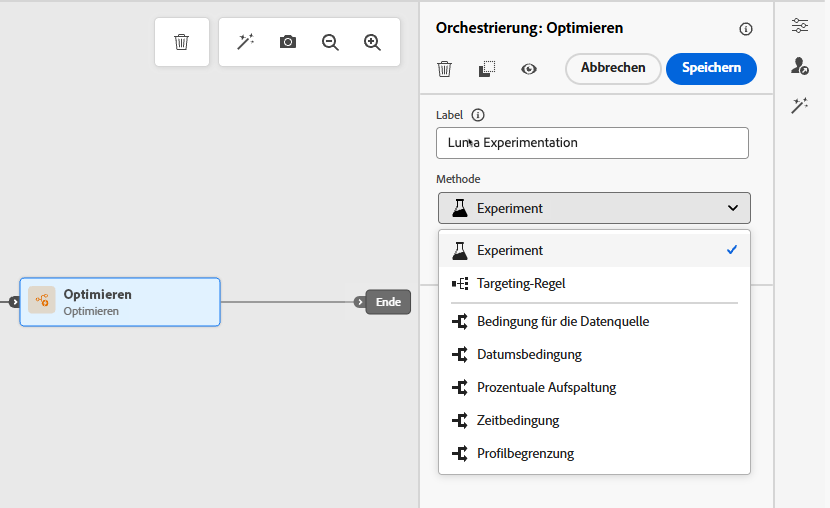
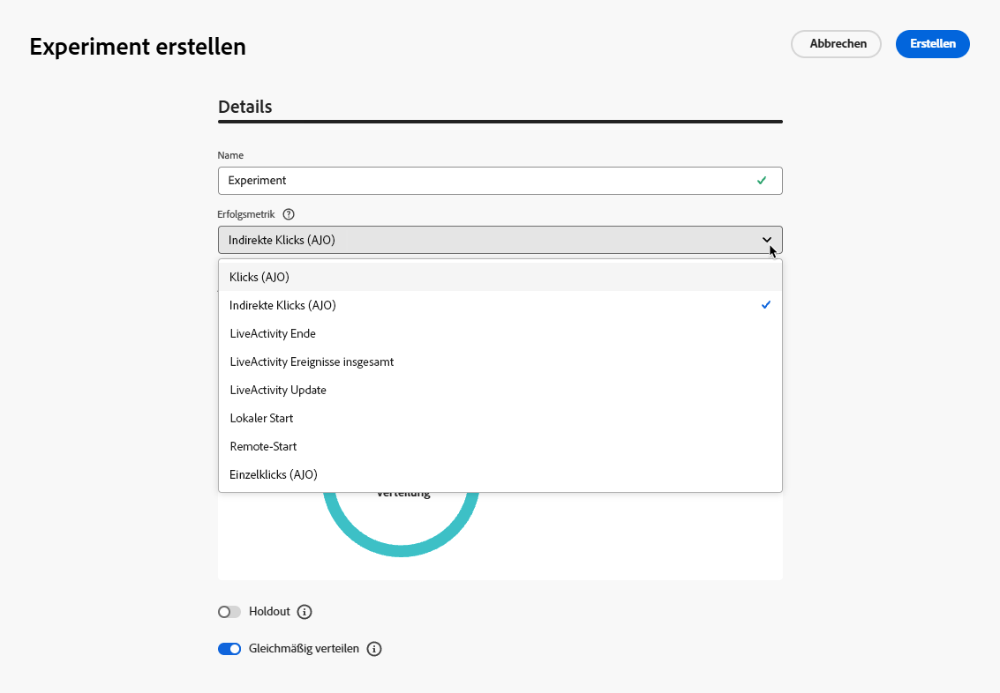
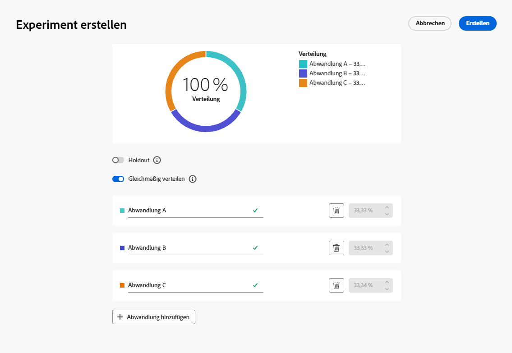
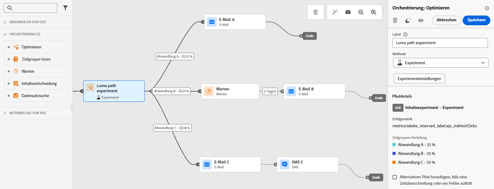
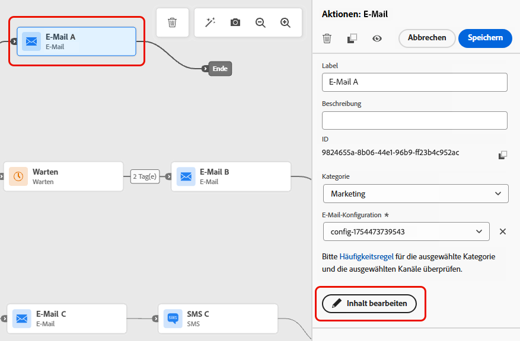
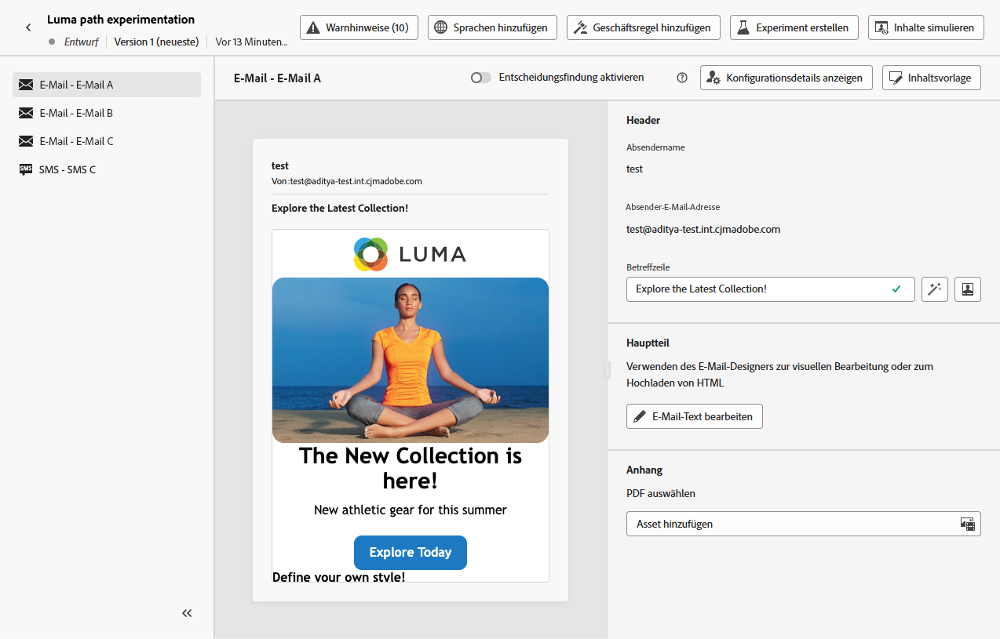
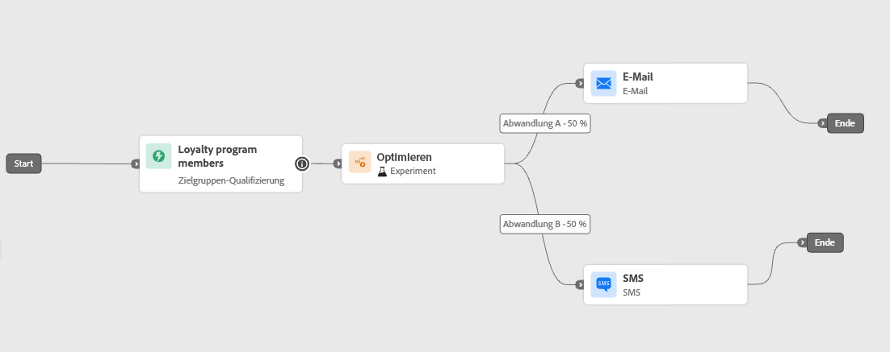
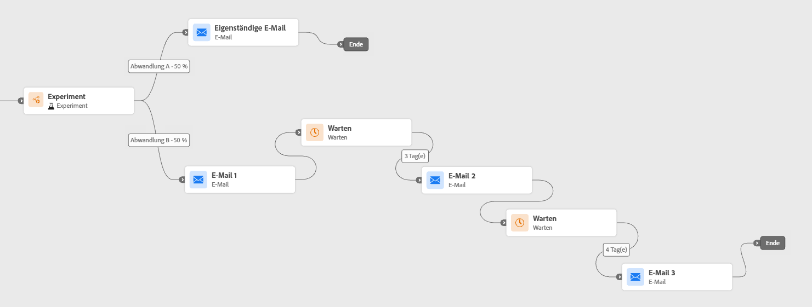
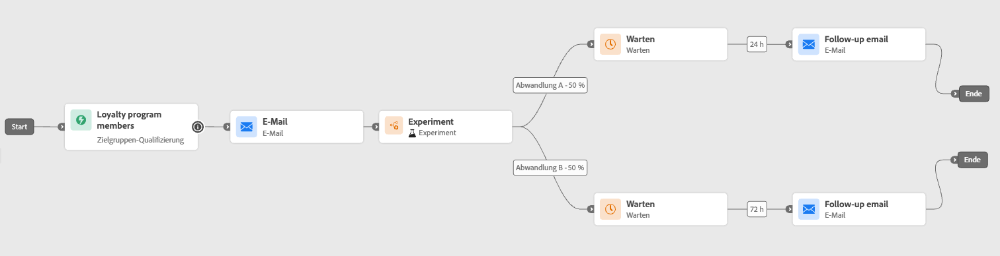

# Pfadexperiment verwenden {#experimentation}

>[!CONTEXTUALHELP]
>id="ajo_path_experiment_success_metric"
>title="Erfolgsmetrik"
>abstract="Die Erfolgsmetrik wird verwendet, um die Abwandlung mit der besten Leistung in einem Experiment zu verfolgen und zu bewerten."
>additional-url="https://experienceleague.adobe.com/de/docs/journey-optimizer/using/orchestrate-journeys/create-journey/success-metrics" text="Konfigurieren und Verfolgen der Journey-Metriken"

Mit Experimenten können Sie verschiedene Pfade auf der Grundlage einer zufälligen Aufteilung testen, um anhand vordefinierter Erfolgsmetriken zu ermitteln, welcher Pfad am besten funktioniert.

Gehen Sie folgendermaßen vor, um Pfadexperimente in einer Journey einzurichten:

Angenommen, Sie möchten drei Pfade vergleichen:

* einen Pfad mit einer E-Mail,
* einen zweiten Pfad mit einem **[!UICONTROL Warteknoten]** von zwei Tagen und einer E-Mail,
* einen dritten Pfad mit einer E-Mail und dann einer SMS-Nachricht.

1. Ziehen Sie aus dem Abschnitt **[!UICONTROL Orchestrierung]** die Aktivität **[!UICONTROL Optimieren]** per Drag-and-Drop auf die Journey-Arbeitsfläche.

1. Fügen Sie ein optionales Label hinzu, damit sich die Aktivität in den Reporting- und Testmodusprotokollen leicht identifizieren lässt.

1. Wählen Sie **[!UICONTROL Experiment]** aus der Dropdown-Liste **[!UICONTROL Methode]** aus.

   {width=65%}

1. Klicken Sie auf **[!UICONTROL Experiment erstellen]**.

1. Wählen Sie die **[!UICONTROL Erfolgsmetrik]**, die Sie für Ihr Experiment festlegen möchten. Weitere Informationen zu den verfügbaren Metriken und zur Konfiguration der Liste finden Sie in [diesem Abschnitt](success-metrics.md).

   {width=80%}

1. Wählen Sie **[!UICONTROL Experimenttyp]** für Ihr Pfadexperiment aus:

   * **[!UICONTROL A/B-Experiment]** - Definiert die Traffic-Aufteilung zwischen Abwandlungen zu Beginn des Tests. Die Leistung wird anhand der von Ihnen gewählten primären Metrik bewertet. Berichte zeigen die beobachtete Steigerung zwischen den Behandlungen.

   * **[!UICONTROL Multi-Armed Bandit]** - Die Aufteilung des Traffics auf die Behandlungen erfolgt automatisch. Alle 7 Tage wird die Leistung der primären Metrik überprüft und die Gewichtungen werden entsprechend angepasst. Die Berichterstellung zeigt weiterhin die Steigerung an, wie bei A/B-Tests.

   {width=80%}

   ➡️ [Erfahren Sie mehr über den Unterschied zwischen A/B- und Experimenten mit mehrarmigen Banditen](../content-management/mab-vs-ab.md)

1. Bei Bedarf können Sie Ihrem Versand eine **[!UICONTROL Holdout]**-Gruppe hinzufügen. Diese Gruppe wird keinen Pfad aus diesem Experiment beschreiten.

   >[!NOTE]
   >
   >Wenn Sie den Umschalter aktivieren, werden automatisch 10 % Ihrer Population übernommen. Sie können diesen Prozentsatz bei Bedarf anpassen.

   <!--
    DOES THIS APPLY TO PATH EXPERIMENT?
    IMPORTANT: When a holdout group is used in an action for path experimentation, the holdout assignment only applies to that specific action. After the action is completed, profiles in the holdout group will continue down the journey path and can receive messages from other actions. Therefore, ensure that any subsequent messages do not rely on the receipt of a message by a profile that might be in a holdout group. If they do, you may need to remove the holdout assignment.-->

1. Sie können dann jeder **[!UICONTROL Abwandlung]** einen bestimmten Prozentsatz zuweisen oder einfach den Umschalter **[!UICONTROL Gleichmäßig verteilen]** aktivieren.

   {width=80%}

1. Die Aktivierung des Experiments mit automatischer Skalierung ermöglicht die automatische Einführung der erfolgreichsten Variante Ihres Experiments. [Weitere Informationen zur Skalierung der erfolgreichsten Variante](#scale-winner)

1. Klicken Sie auf **[!UICONTROL Erstellen]**.

1. Definieren Sie die gewünschten Elemente für jede Verzweigung, die aus dem Experiment resultiert, z. B.:

   * Ziehen Sie eine Aktivität des Typs [E-Mail](../email/create-email.md) auf die erste Verzweigung (**Abwandlung A**).

   * Ziehen Sie eine Aktivität des Typs [Warten](wait-activity.md) von zwei Tagen auf die erste Verzweigung, gefolgt von einer Aktivität des Typs [E-Mail](../email/create-email.md) (**Abwandlung B**).

   * Ziehen Sie eine Aktivität des Typs [E-Mail](../email/create-email.md) auf die dritte Verzweigung, gefolgt von einer Aktivität des Typs [SMS](../sms/create-sms.md) (**Abwandlung C**).

   {width=100%}

1. Verwenden Sie optional den **[!UICONTROL Alternativen Pfad hinzufügen, falls eine Zeitüberschreitung oder ein Fehler auftritt]** um eine Ausweichaktion zu definieren. [Weitere Informationen](using-the-journey-designer.md#paths)

1. [Veröffentlichen](publish-journey.md) Sie Ihre Journey.

<!--

    Select a channel action and use the **[!UICONTROL Edit content]** button to access the design tools.

    {width=70%}

    From there, using the left pane you can navigate between the different contents for each action in your experiment. Select each content and design it as needed.

    {width=100%}

-->

Sobald die Journey live ist, werden die Benutzenden nach dem Zufallsprinzip zugewiesen, um verschiedene Pfade zu durchlaufen. [!DNL Journey Optimizer] verfolgt, welcher Pfad am besten abschneidet, und stellt verwertbare Erkenntnisse zur Verfügung.

Verfolgen Sie den Erfolg Ihrer Journey mit dem Bericht zu Journey-Pfadexperimenten. [Weitere Informationen](../reports/journey-global-report-cja-experimentation.md)

<!--REMOVED WITH GA

>[!CAUTION]
>
>Do not edit the metadata of a path experiment once it has been published. Editing the metadata will disrupt the calculation and reporting of experiment results.
-->

## Anwendungsfälle für Experimente {#uc-experiment}

Die folgenden Beispiele zeigen, wie Sie mit der Aktivität **[!UICONTROL Optimieren]** zusammen mit der Methode **[!UICONTROL Experiment]** ermitteln, welcher Pfad insgesamt am besten funktioniert.

+++Kanaleffektivität

Testen Sie, ob das Senden der ersten Nachricht per E-Mail oder per SMS zu höheren Konversionen führt.

➡️ Verwenden Sie die Konversionsrate als Erfolgsmetrik (z. B. Käufe, Anmeldungen).

+++

+++Nachrichtenfrequenz

Führen Sie ein Experiment durch, um zu überprüfen, ob der Versand einer E-Mail im Vergleich zu drei E-Mails pro Woche zu mehr Käufen führt.

➡️ Verwenden Sie Käufe oder die Abmelderate als Erfolgsmetrik.

+++

+++Wartezeit zwischen Nachrichten

Vergleichen Sie eine Wartezeit von 24 Stunden mit einer Wartezeit von 72 Stunden vor einem Nachfassen, um zu ermitteln, welcher Zeitraum die Interaktion maximiert.

➡️ Verwenden Sie die Klickrate oder den Umsatz als Erfolgsmetrik.

+++

## Skalieren der erfolgreichsten Variante {#scale-winner}

>[!AVAILABILITY]
>
>Bei Pfadexperimenten ist die Funktion Gewinner skalieren nur in unitären Journey verfügbar (ereignisausgelöst und Zielgruppenqualifikationen).
>
>Sie ist nicht für Journey unter Zielgruppe lesen verfügbar.

Mit der Funktion zum Skalieren der erfolgreichsten Variante können Sie die erfolgreichste Variante eines Experiments automatisch oder manuell für Ihre gesamte Zielgruppe einführen. Diese Funktion stellt sicher, dass die Reichweite und Effektivität der erfolgreichsten Variante gesteigert wird, ohne das Experiment ständig überwachen zu müssen.

Zwei Modi stehen zur Auswahl:

* **Automatische Skalierung**: Beim Erstellen des Experiments werden die Einstellungen für die automatische Skalierung konfiguriert, entweder durch die Auswahl des Zeitpunkts und der Bedingungen für die Skalierung der erfolgreichsten Abwandlung oder einer Fallback-Option, falls keine erfolgreichste Abwandlung ermittelt wird.

* **Manuelle Skalierung** Die Experimentergebnisse werden manuell überprüft und der Rollout der erfolgreichsten Abwandlung wird mit vollständiger Kontrolle über Zeitpunkt und Entscheidungen initiiert.

### Automatische Skalierung {#autoscaling}

Bei der automatischen Skalierung legen vordefinierte Regeln fest, wann die erfolgreichste Abwandlung oder die Fallback-Option basierend auf den Ergebnissen des Experiments eingeführt wird.

Nach der automatischen Skalierung ist die manuelle Skalierung nicht mehr verfügbar.

Aktivieren der automatische Skalierung in Experimenten:

1. Richten Sie Ihren Journey ein und konfigurieren Sie Ihr Experiment nach Bedarf. [Weitere Informationen](#experimentation)

1. Aktivieren Sie bei der Einrichtung des Experiments die Option der automatischen Skalierung.

   

1. Wählen Sie aus, wann die erfolgreichste Abwandlung skaliert werden soll:

   * Sobald die erfolgreichste Abwandlung gefunden ist.
   * Nachdem das Experiment für einen bestimmten Zeitraum live ist.

   Die automatische Skalierung muss vor dem Enddatum des Experiments geplant werden. Wenn der Zeitraum nach dem Enddatum liegt, wird eine Validierungswarnung angezeigt und die Journey wird nicht veröffentlicht.

   

1. Auswählen des Fallback-Verhaltens, wenn nach der Skalierungszeit keine erfolgreichste Abwandlung gefunden wird:

   * Setzen Sie das Experiment bis zum Ende planmäßig fort.
   * Skalieren Sie die alternative Abwandlung nach einer bestimmten Zeit.

Sobald alle Parameter erfüllt sind, wird die erfolgreichste oder die alternative Abwandlung an die Zielgruppe gesendet.

### Manuelle Skalierung {#manual-scaling}

Mit der manuellen Skalierung können Sie die Experimentergebnisse überprüfen und entscheiden, wann die erfolgreichste Abwandlung nach Ihrem eigenen Zeitplan eingeführt werden soll.

Beachten Sie, dass die automatische Skalierung abgebrochen wird, wenn die erfolgreichste Abwandlung vor der geplanten Zeit der automatischen Skalierung manuell skaliert wird.

Manuelles Skalieren der erfolgreichsten Abwandlung des Experiments:

1. Richten Sie Ihren Journey ein und konfigurieren Sie Ihr Experiment nach Bedarf. [Weitere Informationen](#experimentation)

1. Das Experiment muss laufen, bis eine erfolgreichste Abwandlung identifiziert oder statistische Signifikanz erreicht wird.

1. Öffnen Sie Ihre Journey und wählen Sie die Aktivität **[!UICONTROL Optimieren]** aus, die das Pfadexperiment enthält.

   Überprüfen Sie die Ergebnisse in der Ansicht **[!UICONTROL Pfadexperiment]**, um die Abwandlung mit der besten Leistung zu ermitteln.

   

1. Klicken Sie auf **[!UICONTROL Abwandlung skalieren]**, um die erfolgreichste Abwandlung an die restliche Zielgruppe zu senden.

   <!---->

1. Wählen Sie die zu skalierenden Abwandlung aus dem Dropdown-Menü aus und klicken Sie auf **[!UICONTROL Skalieren]**.

   {width=80%}

Beachten Sie, dass die Skalierung der Abwandlung bis zu einer Stunde dauern kann. Nach Abschluss des manuellen Skalierungsprozess erhalten Sie eine Benachrichtigung.
