# Pfad-Targeting nutzen {#targeting}

>[!CONTEXTUALHELP]
>id="ajo_path_targeting_fallback"
>title="Was ist ein Fallback-Pfad?"
>abstract="Mit Fallback-Pfaden kann Ihre Zielgruppe einen alternativen Pfad beschreiten, falls keine der Targeting-Regeln erfüllt ist.  Wenn Sie diese Option nicht aktivieren, werden Zielgruppen, die sich nicht für eine Targeting-Regel qualifizieren, nicht in den Fallback-Pfad aufgenommen und die Journey wird beendet."

>[!AVAILABILITY]
>
>Diese Funktion ist derzeit nur eingeschränkt verfügbar. Wenden Sie sich an Ihren Adobe-Support-Mitarbeiter, um Zugriff anzufordern.

Mit Targeting-Regeln können Sie auf der Grundlage bestimmter Zielgruppensegmente bestimmte Regeln oder Qualifizierungen festlegen, die erfüllt sein müssen, damit eine Kundin oder ein Kunde zum Eintritt in einen der Journey-Pfade berechtigt ist<!-- depending on profile attributes or contextual attributes-->.

Im Gegensatz zu Experimenten, bei denen es sich um eine zufällige Zuweisung eines bestimmten Pfads handelt, ist das Targeting deterministisch, da sichergestellt wird, dass die richtige Zielgruppe oder das richtige Profil in den angegebenen Pfad eintritt.

<!--
With targeting, specific rules can be defined based on:

* **User profile attributes** such as location (eg. geo-targeting), age, or preferences. For example, users in the US receive a "Golden Gate" promotion, while users in France receive an "Eiffel Tower" promotion.

* **Contextual data** such as device type (eg. device-targeting), time of day, or session details. For example, desktop users receive desktop-optimized content, while mobile users receive mobile-optimized content.

* **Audiences** which can be used to include or exclude profiles that have a particular audience membership.
-->

Gehen Sie folgendermaßen vor, um das Targeting in einer Journey einzurichten.

1. Ziehen Sie aus dem Abschnitt **[!UICONTROL Orchestrierung]** die Aktivität **[!UICONTROL Optimieren]** per Drag-and-Drop auf die Journey-Arbeitsfläche.

1. Fügen Sie ein optionales Label hinzu, damit sich die Aktivität in den Reporting- und Testmodusprotokollen leicht identifizieren lässt.

1. Wählen Sie **[!UICONTROL Targeting-Regel]** aus der Dropdown-Liste **[!UICONTROL Methode]** aus.

   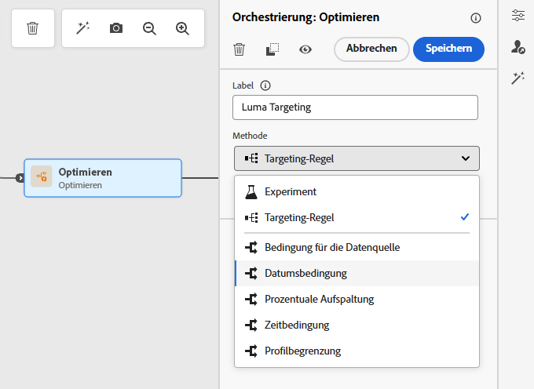{width=60%}

1. Klicken Sie auf **[!UICONTROL Targeting-Regel erstellen]**.

1. Klicken Sie auf **[!UICONTROL Regel erstellen]** > **[!UICONTROL Neu erstellen]** und verwenden Sie den Regel-Builder, um Ihre Kriterien zu definieren.

   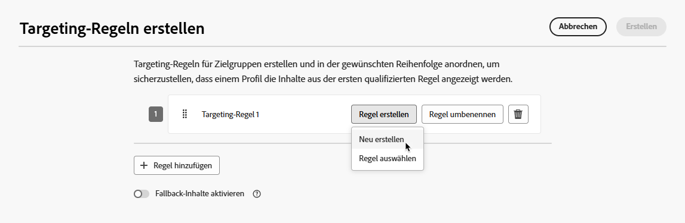{width=100%}

   Definieren Sie beispielsweise eine Regel für Gold-Mitglieder des Treueprogramms (`loyalty.status.equals("Gold", false)`) und eine weitere Regel für die anderen Mitglieder (`loyalty.status.notEqualTo("Gold", false)`).

   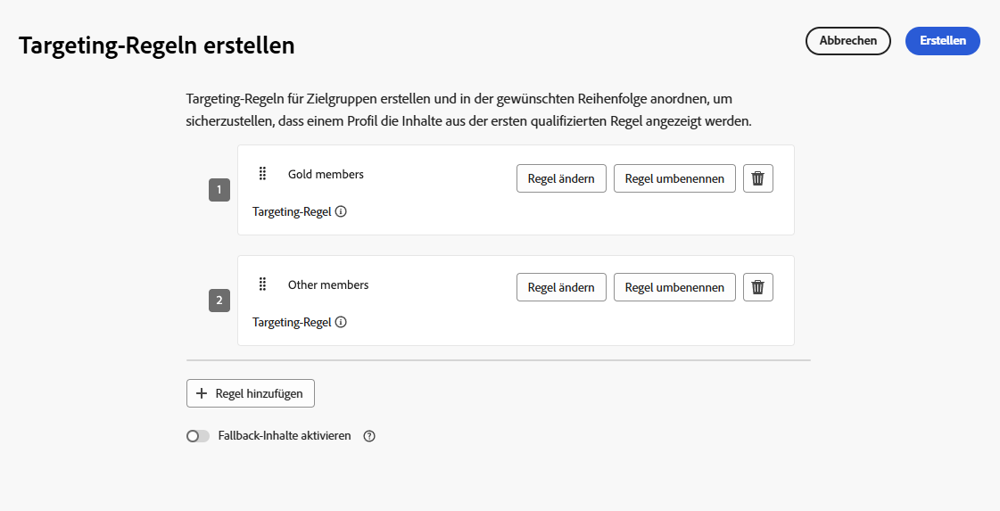

1. Sie können auch auf **[!UICONTROL Regel erstellen]** > **[!UICONTROL Regel auswählen]** klicken, um eine vorhandene Zielgruppenregel auszuwählen, die im Menü **[!UICONTROL Regeln]** erstellt wurde. [Weitere Informationen](../experience-decisioning/rules.md)

   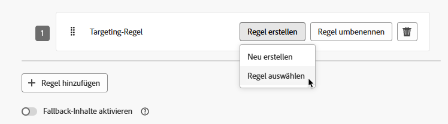{width=70%}

   In diesem Fall wird die Formel, aus der die Regel besteht, einfach in die Journey-Aktivität kopiert. Spätere Änderungen an dieser Regel im Menü **[!UICONTROL Regeln]** wirken sich nicht auf die Kopie der Journey aus.

   >[!AVAILABILITY]
   >
   >Das [Erstellen von Targeting-Regeln](../experience-decisioning/rules.md#create) im dedizierten [!DNL Journey Optimizer]-Menü ist derzeit für Organisationen verfügbar, die das Entscheidungsfindungs-Add-on erworben haben. Für andere Organisationen ist dies auf Anfrage verfügbar (eingeschränkte Verfügbarkeit).
   >
   >Diese Kapazität wird nach und nach für alle Kundinnen und Kunden eingeführt. Wenden Sie sich in der Zwischenzeit an den Adobe-Support, um Zugriff zu erhalten.

1. Nachdem Sie eine Regel hinzugefügt haben, können Sie sie noch ändern. Wählen Sie **[!UICONTROL Inline bearbeiten]**, um sie mithilfe des Regel-Builders schnell zu aktualisieren, oder **[!UICONTROL Regel auswählen]**, um eine andere vorhandene Regel auszuwählen.

   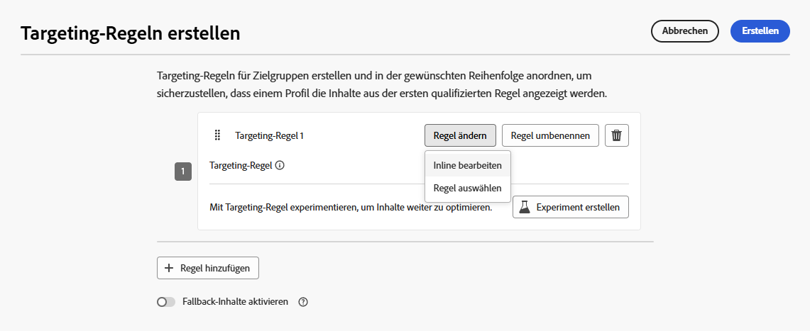{width=100%}

   >[!NOTE]
   >
   >Die Inline-Bearbeitung einer Regel hat keine Auswirkungen auf die vorhandene Regel, von der sie stammt.

1. Aktivieren Sie bei Bedarf die Option **[!UICONTROL Fallback-Pfad aktivieren]**. Diese Aktion erstellt einen Fallback-Pfad für die Zielgruppe, die keine der oben definierten Targeting-Regeln erfüllt.

   >[!NOTE]
   >
   >Wenn Sie diese Option nicht aktivieren, treten alle Zielgruppen, die sich nicht für eine Targeting-Regel qualifizieren, nicht in den Fallback-Pfad ein und die Journey wird beendet.

1. Klicken Sie auf **[!UICONTROL Erstellen]**, um Ihre Einstellungen für die Targeting-Regel zu speichern.

1. Kehren Sie zur Journey zurück und fügen Sie bestimmte Aktionen hinzu, um jeden Pfad anzupassen. Erstellen Sie beispielsweise eine E-Mail mit personalisierten Angeboten für Gold-Mitglieder des Treueprogramms und eine SMS-Erinnerung für alle anderen Mitglieder.

   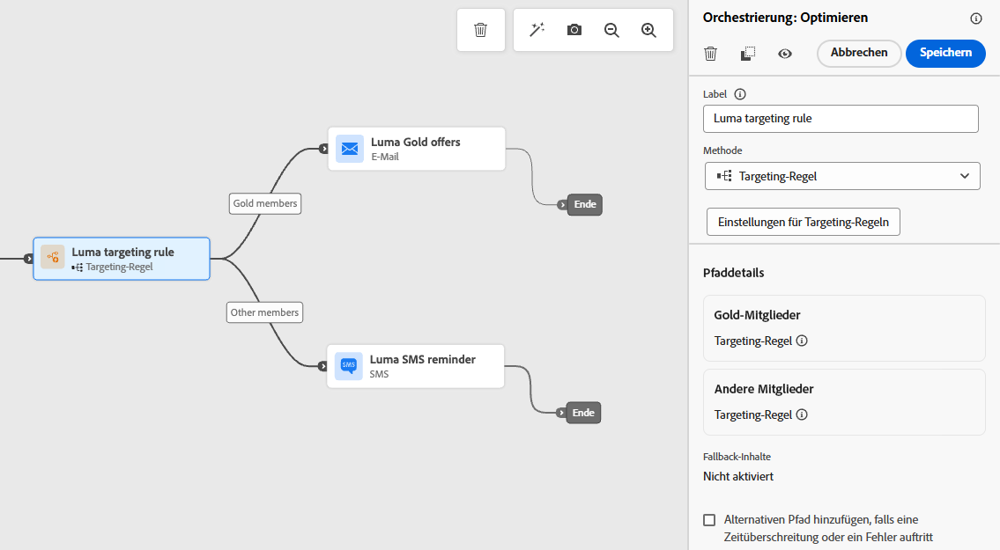

1. Wenn Sie beim Definieren der Regeleinstellungen die Option **[!UICONTROL Fallback-Inhalte aktivieren]** ausgewählt haben, definieren Sie für den automatisch hinzugefügten Fallback-Pfad eine oder mehrere Aktionen.

   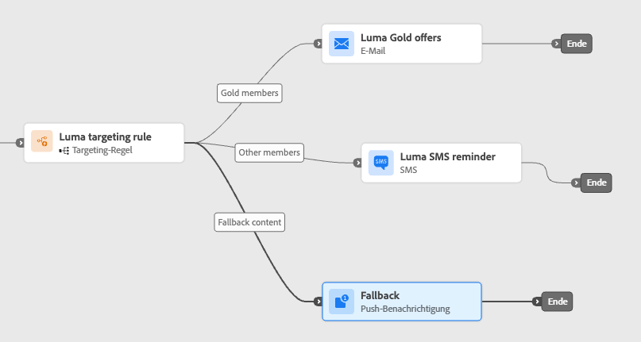{width=70%}

1. Verwenden Sie optional den **[!UICONTROL Alternativen Pfad hinzufügen, falls eine Zeitüberschreitung oder ein Fehler auftritt]** um eine alternative Aktion zu definieren, falls Probleme auftreten. [Weitere Informationen](using-the-journey-designer.md#paths)

1. Entwerfen Sie geeignete Inhalte für jede Aktion, die jeder durch Ihre Zielgruppenregeleinstellungen definierten Gruppe entspricht.

   In diesem Beispiel entwerfen Sie eine E-Mail mit Sonderangeboten für Gold-Mitglieder und einer SMS-Erinnerung für die anderen Mitglieder.<!--You can seamlessly navigate between the different contents for each action. 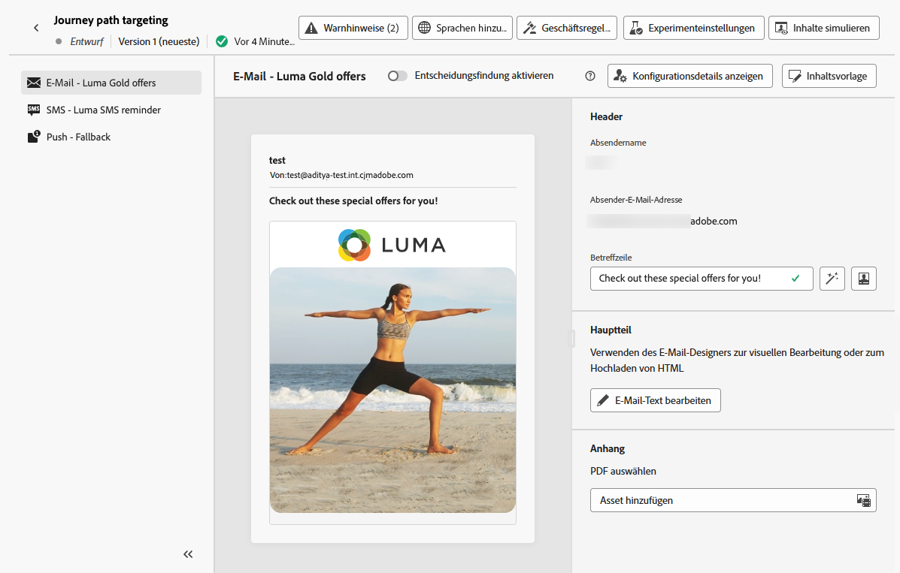-->

1. [Veröffentlichen](publish-journey.md) Sie Ihre Journey.

Sobald die Journey live ist, wird der für jedes Segment angegebene Pfad verarbeitet, sodass Gold-Mitglieder in den Pfad mit den E-Mail-Angeboten eintreten, während die anderen Mitglieder in den Pfad mit der SMS-Erinnerung eintreten.

Verfolgen Sie den Erfolg Ihrer Journey mit dem Journey-Bericht. [Weitere Informationen](../reports/journey-global-report-cja.md#targeting)

## Anwendungsfälle für Targeting-Regeln {#uc-targeting}

Die folgenden Beispiele zeigen, wie die Aktivität **[!UICONTROL Optimieren]** mit der Methode **[!UICONTROL Targeting-Regel]** verwendet wird, um Pfade für verschiedene Unterzielgruppen zu personalisieren.

+++Segmentspezifische Kanäle

Mitglieder des Treueprogramms mit Gold-Status können personalisierte Angebote per E-Mail erhalten, während alle anderen Mitglieder zu SMS-Erinnerungen weitergeleitet werden.

<!--➡️ Use the revenue per profile or conversion rate as the optimization metric.-->

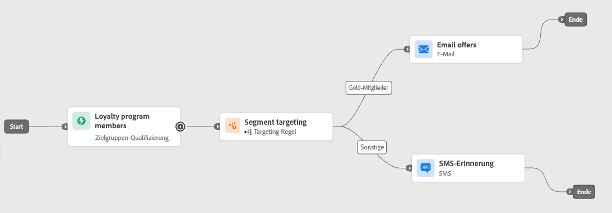

+++

+++Verhaltensbasiertes Targeting

Kundinnen und Kunden, die eine E-Mail geöffnet, aber nicht geklickt haben, können eine Push-Benachrichtigung erhalten, während diejenigen, die sie überhaupt nicht geöffnet haben, eine SMS erhalten.

<!--➡️ Use the click-through rate or downstream conversions as the optimization metric.-->

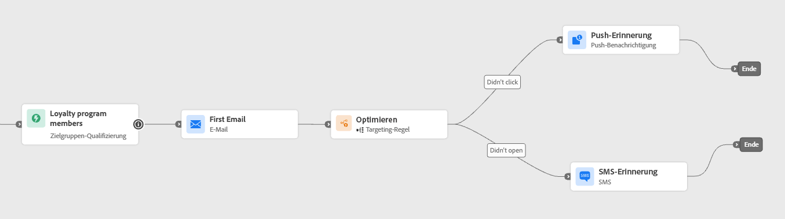

+++

+++Targeting bezüglich des Kaufverlaufs

Kundinnen und Kunden, die kürzlich gekauft haben, können in einen kurzen Pfad „Danke + Crossselling“ eintreten, während Kundinnen und Kunden ohne Kaufhistorie eine längere Nurturing-Journey durchlaufen.

<!--➡️ Use the repeat purchase rate or engagement rate as the optimization metric.-->

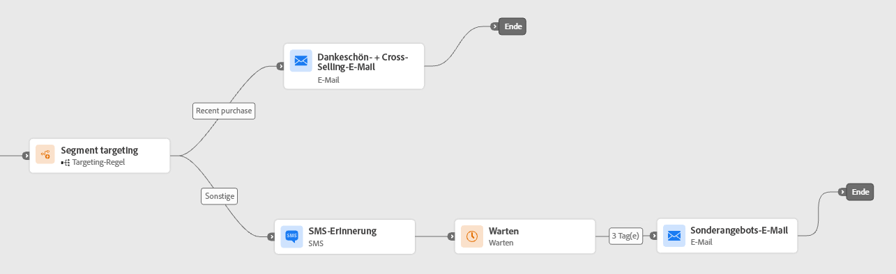

+++
