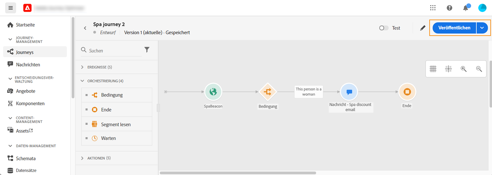
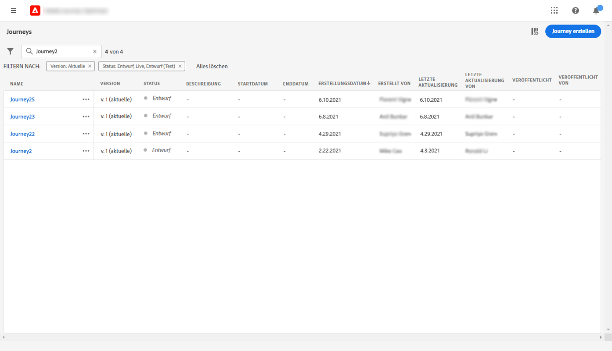
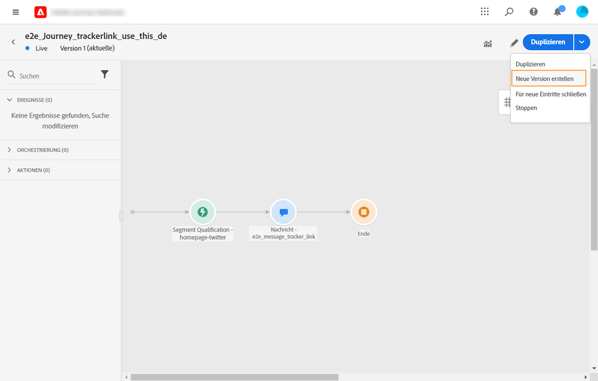

# Veröffentlichen Ihrer Journey {#publishing-the-journey}

>[!BEGINSHADEBOX]

**Auf dieser Seite** Erfahren Sie, wie Sie eine Journey veröffentlichen, um sie live zu schalten, einschließlich der Voraussetzungen, des Veröffentlichungsprozesses, der Versionsverwaltung und der Anforderungen für die erneute Veröffentlichung.

>[!ENDSHADEBOX]

Beim Veröffentlichen wird eine Journey aktiviert: Sie wechselt in den **[!UICONTROL Live]**-Status, wird für neue Profile verfügbar und wechselt in den schreibgeschützten Modus. Sie können keine fehlerhafte Journey veröffentlichen.

>[!NOTE]
>
>Wenn Sie eine Journey speichern oder veröffentlichen, validiert Journey Optimizer die gesamte Payload-Größe der Journey und kann Sie warnen oder die Veröffentlichung blockieren, wenn Sie sich dem Limit nähern oder es überschreiten. Weitere Informationen finden Sie unter [Validierung der Journey-Payload-Größe](../start/guardrails.md#journey-payload-size).

➡️ [Funktion im Video kennenlernen](#video)

## Vor der Veröffentlichung {#before-you-publish}

Stellen Sie vor dem Veröffentlichen sicher, dass Ihr Journey die folgenden Voraussetzungen erfüllt:

* **Keine Validierungsfehler** - Sie können keine fehlerhafte Journey veröffentlichen. [Testen Sie zunächst ](testing-the-journey.md) Journey und [beheben Sie etwaige Aktivitätsfehler](../building-journeys/troubleshooting.md#activity-errors).
* **Veröffentlichungsberechtigung** - Für die Veröffentlichung ist die Berechtigung **[!DNL Publish journeys]** auf hoher Ebene erforderlich. Weitere Informationen zu [Verwalten von Zugriffsrechten](../administration/permissions-overview.md).
* **Payload im Limit** - Die Journey-Payload muss innerhalb des konfigurierten Limits (standardmäßig 4 MB) liegen. Siehe [Validierung der Journey-Payload-Größe](../start/guardrails.md#journey-payload-size).
* **Genehmigung eingeholt** - Wenn Ihre Journey einer Genehmigungsrichtlinie unterliegt, fordern Sie vor der Veröffentlichung eine Genehmigung an. [Weitere Informationen](../test-approve/gs-approval.md).

>[!TIP]
>
>Validieren Sie Ihren Journey vor der Veröffentlichung mit einer der verfügbaren Testoptionen:
>
>* [Simulation](simulate-journey-gs.md) - Testen Sie mit simulierten Benutzern, ohne persistente Testprofile in Adobe Experience Platform zu verwenden.
>* [Testmodus](testing-the-journey.md) - Testen mit persistenten Profilen, die als Testprofile in Adobe Experience Platform gekennzeichnet sind.
>* [Probelauf](journey-dry-run.md) - Testen mit echten Produktionsdaten, ohne Profile zu kontaktieren.

## Veröffentlichungsprozess {#journey-publication}

Die Schritte zum Veröffentlichen einer Journey werden nachfolgend beschrieben:

1. Stellen Sie sicher, dass die Journey gültig und fehlerfrei ist und die (oben genannten [) ](#before-you-publish).

1. Klicken Sie zum Veröffentlichen der Journey oben rechts im Dropdown-Menü auf die Option **[!UICONTROL Veröffentlichen]**.

   >[!NOTE]
   >
   > Wenn Ihre Journey einer Genehmigungsrichtlinie unterliegt, müssen Sie eine Genehmigung anfordern, um Ihre Journey veröffentlichen zu können. [Weitere Informationen](../test-approve/gs-approval.md)

   

Nachdem die Journey veröffentlicht wurde, ist sie **schreibgeschützt**. Im schreibgeschützten Modus können Sie nur die Labels und Beschreibungen der Aktivitäten, den Namen der Journey und die Beschreibung der Journey ändern. Wenn Sie zusätzliche Änderungen an einer veröffentlichten Journey vornehmen müssen, erstellen Sie [eine neue Version](journey-ui.md#journey-filter) Ihrer Journey.

### Journey-Status {#journey-statuses}

Nach der Veröffentlichung durchläuft eine Journey mehrere Status:

* **[!UICONTROL Live]** - Die Journey wird veröffentlicht und kann von Profilen eingegeben werden.
* **[!UICONTROL Geschlossen]** - Eine frühere Version, die automatisch beendet wurde, wenn eine neue Version veröffentlicht wurde. Ein Eintritt ist nicht möglich.
* **[!UICONTROL Fertig]** - Die Journey wurde gemäß den Endkriterien abgeschlossen. Eine genaue Beschreibung, wann eine Journey als fertig betrachtet wird, finden Sie unter [Wie Journey enden](end-journey.md#journey-finished-definition).

### Stoppen einer Journey {#stop-journey}

Wenn Sie eine Journey stoppen, wird sie dauerhaft gestoppt. Alle Personen, die die Journey durchlaufen, werden dauerhaft gestoppt und die Journey lässt keine neuen Eintritte mehr zu. Wenn Sie die Journey erneut ausführen müssen, duplizieren Sie sie und veröffentlichen Sie die neue Journey. Weitere Informationen zum Ende von Journey finden Sie unter [Ende von Journey](end-journey.md).

### Anforderungen an die erneute Veröffentlichung {#republishing}

In einigen Fällen müssen Sie eine Journey erneut veröffentlichen, damit Änderungen oder Assets wirksam bleiben:

>[!IMPORTANT]
>
>* Wenn Änderungen an einer Angebotsentscheidung vorgenommen werden, die in einer Journey-Nachricht verwendet wird, müssen Sie die Veröffentlichung der Journey aufheben und sie dann erneut veröffentlichen. Dadurch wird sichergestellt, dass die Änderungen in die Journey-Nachricht integriert werden und die Nachricht den neuesten Aktualisierungen entspricht.
>
>* Assets/Bilder sind in bereitgestellten Inhalten für bis zu 2 Jahre (730 Tage) ab ihrer ersten Veröffentlichung in einem Fragment/einer Inline-Nachricht verfügbar. Nach Ablauf dieses Zeitraums (nach 730 Tagen) ist eine erneute Veröffentlichung erforderlich, um sie für weitere 2 Jahre verfügbar zu machen. Eine erneute Veröffentlichung innerhalb von 730 Tagen nach der ersten Veröffentlichung verlängert den Ablauf der Assets/Bilder nicht um weitere 730 Tage.

## Journey-Versionen {#journey-versions}

In der Liste der Journeys werden alle Journey-Versionen mit der Versionsnummer angezeigt. Wenn Sie nach einer Journey suchen, werden beim ersten Öffnen der Anwendung die neuesten Versionen oben in der Liste angezeigt. Anschließend können Sie die gewünschte Sortierung definieren und die Anwendung behält sie als Benutzerpräferenz bei. Die Version der Journey wird auch oben auf der Journey-Bearbeitungsoberfläche über der Arbeitsfläche angezeigt.

>[!NOTE]
>
>In der Regel kann ein Profil nicht mehrmals zur gleichen Zeit in derselben Journey für alle aktiven Journey-Versionen vorhanden sein. Wenn der erneute Eintritt aktiviert ist, kann ein Profil erneut in eine Journey eintreten, aber erst dann, wenn es die vorherige Instanz der Journey vollständig verlassen hat. [Weitere Informationen](entry-management.md).

### Erstellen einer neuen Version einer Journey {#journey-create-new-version}

Wenn Sie eine Live-Journey ändern müssen, erstellen Sie eine neue Version Ihrer Journey. Gehen Sie wie folgt vor, um eine neue Version einer vorhandenen Journey zu erstellen:

1. Öffnen Sie die neueste Version Ihrer Live-Journey, klicken Sie auf **[!UICONTROL Neue Version erstellen]** und bestätigen Sie.

   

   >[!NOTE]
   >
   >Sie können eine neue Version nur über die letzte Version einer Journey erstellen.

1. Nehmen Sie Ihre Änderungen vor, klicken Sie auf **[!UICONTROL Veröffentlichen]** und bestätigen Sie.

Ab dem Zeitpunkt der Veröffentlichung der Journey treten Personen in die neueste Version der Journey ein. Personen, die bereits in einer früheren Version eingetreten sind, bleiben bis zum Ende der Journey darin. Bei einem späteren erneuten Eintritt in dieselbe Journey treten sie in die neueste Version ein.

Journey-Versionen können einzeln angehalten werden. Alle Versionen einer Journey haben denselben Namen.

Wenn Sie eine neue Version einer Journey veröffentlichen, endet die vorherige Version automatisch und wechselt in den Status **Geschlossen**. Es kann kein Eintritt in die Journey stattfinden. Selbst wenn Sie die aktuelle Version stoppen, bleibt die vorherige Version geschlossen.

>[!NOTE]
>
>Für die Versionierung der Journeys gelten bestimmte Schutzmechanismen und Einschränkungen. Weitere Informationen finden Sie auf [dieser Seite](../start/guardrails.md#journey-versions-g).

## Häufig gestellte Fragen {#faq}

**Warum kann ich meinen Journey nicht veröffentlichen?**

Der häufigste Grund ist, dass die Journey Validierungsfehler enthält - Sie können keine Journey mit Fehlern veröffentlichen. Andere Blocker umfassen das Überschreiten [Payload-Größenbeschränkung](../start/guardrails.md#journey-payload-size), das Fehlen der **[!DNL Publish journeys]** oder eine ausstehende [Genehmigung](../test-approve/gs-approval.md). Siehe [Vor der Veröffentlichung](#before-you-publish) und [Fehlerbehebung bei ](../building-journeys/troubleshooting.md#activity-errors).

**Kann ich eine Journey nach ihrer Veröffentlichung bearbeiten?**

Eine veröffentlichte Journey befindet sich im schreibgeschützten Modus. Sie können nur Aktivitätsbeschriftungen und -beschreibungen, den Namen der Journey und die Beschreibung der Journey ändern. Für jede andere Änderung [ Sie (eine neue Version erstellen](#journey-create-new-version) der Journey.

**Was passiert mit Profilen, die sich bereits auf der Journey befinden, wenn ich eine neue Version veröffentliche?**

Neue Profile fließen in die neueste Version. Profile, die bereits in einer früheren Version vorhanden sind, bleiben dort, bis sie beendet werden. Wenn sie später erneut eintreten, gehen sie in die neueste Version über. Die vorherige Version wechselt automatisch zu **[!UICONTROL Geschlossen]** und akzeptiert keine neuen Einträge. Siehe [Journey-Versionen](#journey-versions).

**Wie führe ich eine gestoppte Journey erneut aus?**

Das Anhalten einer Journey ist dauerhaft. Um sie erneut auszuführen, duplizieren Sie sie und veröffentlichen Sie die neue Journey. Siehe [Stoppen einer Journey](#stop-journey).

**Muss ich nach dem Ändern einer Angebotsentscheidung oder dem Aktualisieren von Assets erneut veröffentlichen?**

Ja. Wenn Sie eine in einer Journey-Nachricht verwendete Angebotsentscheidung ändern, heben Sie die Veröffentlichung der Journey auf und veröffentlichen Sie sie erneut, damit die Änderung angewendet wird. Assets und Bilder laufen 730 Tage nach der ersten Veröffentlichung ab. Nach diesem Zeitraum erneut veröffentlichen, um sie verfügbar zu halten. Siehe [Erneutes Veröffentlichen von Anforderungen](#republishing).

**Kann ich eine genehmigungsbedürftige Journey veröffentlichen?**

Wenn für Ihren Journey eine Genehmigungsrichtlinie gilt, müssen Sie vor der Veröffentlichung eine Genehmigung anfordern. [Weitere Informationen zur Genehmigung](../test-approve/gs-approval.md).

## Verwandte Themen {#related-topics}

* [Journey testen](testing-the-journey.md) - Validieren Sie Ihren Journey vor der Veröffentlichung mit Testprofilen
* [Journey-Simulation](simulate-journey-gs.md) - Validieren Sie Ihren Journey mit simulierten Benutzern vor der Veröffentlichung
* [Journey Probelauf](journey-dry-run.md) - Testen mit echten Produktionsdaten ohne Kontaktaufnahme mit Profilen
* [Fehlerbehebung](../building-journeys/troubleshooting.md#activity-errors) - Beheben von Aktivitäts- und Veröffentlichungsfehlern
* [Wie Journey enden](end-journey.md#journey-finished-definition) - Verstehen von Journey-Abschluss und -Status
* [Verwaltung des Profileintritts](entry-management.md) - Konfigurieren, wie Profile in Journey eintreten und erneut eintreten
* [Leitplanken und Einschränkungen für das Journey](../start/guardrails.md#journeys-guardrails-journeys) - Leitplanken für Veröffentlichungen und Versionierungen überprüfen

## Anleitungsvideo {#video}

In diesem Video erfahren Sie, wie Sie eine Journey veröffentlichen:

>[!VIDEO](https://video.tv.adobe.com/v/3424998?quality=12)

+++ KI-Wissensreferenz

Dieser Abschnitt enthält strukturiertes Wissen zur Unterstützung von Interpretation, Abrufen und Antworten auf Fragen zu diesem Thema.

Zum vollständigen Verständnis sollten diese Informationen mit der Dokumentation auf dieser Seite kombiniert werden. Keine der beiden Quellen ist für Einzelpersonen gedacht. Die Seite beschreibt die Funktion, während dieser Abschnitt zusätzlichen Kontext bietet, der dabei hilft, Begriffe, Absichten, Anwendbarkeit und Begrenzungen zu unterscheiden.

* **TL;DR:** Auf dieser Seite wird beschrieben, wie Sie eine Adobe Journey Optimizer-Journey veröffentlichen, Journey-Versionen verwalten und die Einschränkungen verstehen, die gelten, sobald eine Journey live ist.

**intents:**
* Journey veröffentlichen, um sie live zu schalten und für die Profileingabe verfügbar zu machen
* Überprüfen der Journey-Gültigkeit und Beheben von Fehlern vor der Veröffentlichung
* Erstellen einer neuen Version einer Live-Journey, um Änderungen vorzunehmen
* Schreibgeschützte Einschränkungen verstehen, die nach der Veröffentlichung einer Journey gelten
* Journey dauerhaft anhalten oder Übergänge zwischen Versionen verwalten

**Glossar:**
* **Journey-Version**: Eine nummerierte Iteration einer Journey. Neue Versionen werden erstellt, um eine Live-Journey zu ändern, ohne bereits laufende Profile zu unterbrechen *(produktspezifisch)*
* **Abgeschlossener Status**: Der Status, in den eine vorherige Journey-Version automatisch eintritt, wenn eine neue Version veröffentlicht wird. Neue Profile können nicht auf eine abgeschlossene Journey-*zugreifen (produktspezifisch)*
* **Genehmigungsrichtlinie**: Ein optionaler Governance-Workflow, der eine explizite Genehmigung erfordert, bevor eine Journey veröffentlicht werden kann *(produktspezifisch)*

**Leitplanken:**
* Eine fehlerhafte Journey kann nicht veröffentlicht werden.
* Journey Optimizer validiert die gesamte Journey-Payload-Größe zum Zeitpunkt des Speicherns und der Veröffentlichung. Die Veröffentlichung kann blockiert werden, wenn das Limit überschritten wird.
* Nach der Veröffentlichung befindet sich eine Journey im schreibgeschützten Modus. Nur Beschriftungen, Beschreibungen und der Name der Journey können bearbeitet werden.
* Eine neue Version kann nur von der neuesten Version einer Journey erstellt werden.
* Wenn ein Journey gestoppt wird, wird er dauerhaft gestoppt. Er muss dupliziert werden, damit er erneut ausgeführt werden kann.
* Assets und Bilder in bereitgestellten Inhalten sind bis zu 730 Tage nach der ersten Veröffentlichung verfügbar. Nach diesem Zeitraum ist eine erneute Veröffentlichung erforderlich.
* Wenn sich eine in einer Journey-Nachricht verwendete Angebotsentscheidung ändert, muss die Veröffentlichung der Journey aufgehoben und die Veröffentlichung erneut durchgeführt werden.
* Spezifische Leitplanken gelten für die Journey-Versionierung (siehe Seite mit Leitplanken).

**Terminologie:**
* Kanonischer Name: Veröffentlichen Journey — Akronym: none — Varianten: Journey aktivieren, live gehen
* Synonyme: „Publish“ = „Aktivieren“ = „Live schalten“
* Verwechseln Sie nicht: &quot;Journey anhalten“ ≠ &quot;Journey schließen“ (Anhalten ist eine manuelle Aktion; „Geschlossen“ ist ein automatischer Status, der auf frühere Versionen angewendet wird, wenn eine neue Version veröffentlicht wird)

**FAQ:**
* **F: Kann ich eine Journey nach ihrer Veröffentlichung bearbeiten?** — Nur Beschriftungen, Beschreibungen und der Journey-Name können geändert werden. Um weitere Änderungen vorzunehmen, erstellen Sie eine neue Version der Journey.
* **F: Was passiert mit Profilen in einer älteren Journey-Version, wenn eine neue Version veröffentlicht wird?** — Profile, die bereits in der vorherigen Version vorhanden sind, bleiben dort, bis sie abgeschlossen sind. Neue Profile geben die neueste Version ein.
* **F: Kann ich eine geschlossene Journey-Version erneut veröffentlichen?** — Nein. Sobald eine frühere Version geschlossen ist, bleibt sie geschlossen, selbst wenn die neueste Version angehalten wird.
* **F: Was sollte ich tun, wenn sich eine auf der Journey verwendete Angebotsentscheidung ändert?** — Heben Sie die Veröffentlichung der Journey auf und veröffentlichen Sie sie erneut, um die aktualisierte Angebotsentscheidung einzubinden.
* **F: Ist vor der Veröffentlichung eine Genehmigung erforderlich?** — Nur wenn für Ihren Journey eine Genehmigungsrichtlinie gilt. In diesem Fall müssen Sie zunächst eine Genehmigung anfordern.

+++
