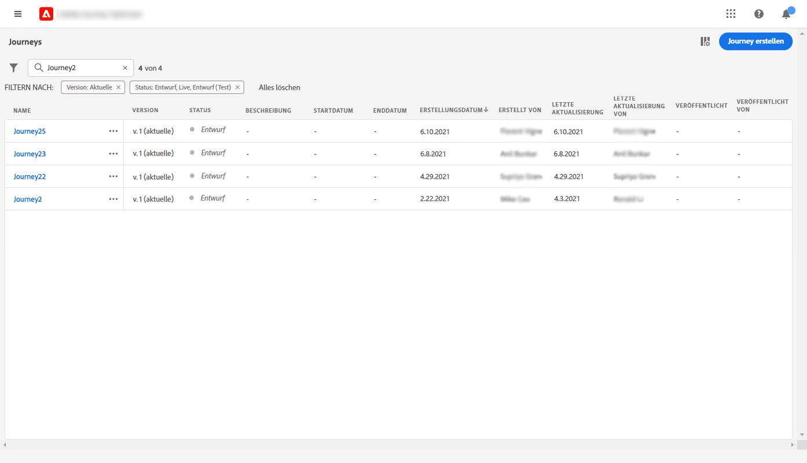

# Veröffentlichen Ihrer Journey {#publishing-the-journey}

Sie müssen eine Journey veröffentlichen, um sie zu aktivieren und für den Eintritt neuer Profile verfügbar zu machen. Stellen Sie vor der Veröffentlichung Ihrer Journey sicher, dass sie gültig ist und keine Fehler vorliegen. Es ist nicht möglich, eine fehlerhafte Journey zu veröffentlichen.

>[!NOTE]
>
>Wenn Sie eine Journey speichern oder veröffentlichen, validiert Journey Optimizer die gesamte Payload-Größe der Journey und kann Sie warnen oder die Veröffentlichung blockieren, wenn Sie sich dem Limit nähern oder es überschreiten. Weitere Informationen finden Sie unter [Validierung der Journey-Payload-Größe](../start/guardrails.md#journey-payload-size).

➡️ [Funktion im Video kennenlernen](#video)

## Veröffentlichungsprozess {#journey-publication}

Die Schritte zum Veröffentlichen einer Journey werden nachfolgend beschrieben:

1. Stellen Sie vor der Veröffentlichung Ihrer Journey sicher, dass sie gültig ist und keine Fehler vorliegen. Es ist nicht möglich, eine fehlerhafte Journey zu veröffentlichen.

   * Auf [dieser Seite](testing-the-journey.md) erfahren Sie, wie Sie Journeys testen können.
   * In [diesem Abschnitt](../building-journeys/troubleshooting.md#activity-errors) erfahren Sie, wie Sie Fehler in Ihrer Journey beheben können.

1. Klicken Sie zum Veröffentlichen der Journey oben rechts im Dropdown-Menü auf die Option **[!UICONTROL Veröffentlichen]**.

   >[!NOTE]
   >
   > Wenn Ihre Journey einer Genehmigungsrichtlinie unterliegt, müssen Sie eine Genehmigung anfordern, um Ihre Journey veröffentlichen zu können. [Weitere Informationen](../test-approve/gs-approval.md)

   

Nachdem die Journey veröffentlicht wurde, ist sie **schreibgeschützt**. Im schreibgeschützten Modus können Sie nur die Labels und Beschreibungen der Aktivitäten, den Namen der Journey und die Beschreibung der Journey ändern. Wenn Sie zusätzliche Änderungen an einer veröffentlichten Journey vornehmen müssen, erstellen Sie [eine neue Version](journey-ui.md#journey-filter) Ihrer Journey.

Wenn Sie eine Journey stoppen, wird sie dauerhaft gestoppt. Alle Personen, die die Journey durchlaufen, werden dauerhaft gestoppt und die Journey lässt keine neuen Eintritte mehr zu. Wenn Sie die Journey erneut ausführen müssen, duplizieren Sie sie und veröffentlichen Sie die neue Journey.

>[!IMPORTANT]
>
>* Wenn Änderungen an einer Angebotsentscheidung vorgenommen werden, die in einer Journey-Nachricht verwendet wird, müssen Sie die Veröffentlichung der Journey aufheben und sie dann erneut veröffentlichen. Dadurch wird sichergestellt, dass die Änderungen in die Journey-Nachricht integriert werden und die Nachricht den neuesten Aktualisierungen entspricht.
>
>* Assets/Bilder sind in bereitgestellten Inhalten für bis zu 2 Jahre (730 Tage) ab ihrer ersten Veröffentlichung in einem Fragment/einer Inline-Nachricht verfügbar. Nach Ablauf dieses Zeitraums (nach 730 Tagen) ist eine erneute Veröffentlichung erforderlich, um sie für weitere 2 Jahre verfügbar zu machen. Eine erneute Veröffentlichung innerhalb von 730 Tagen nach der ersten Veröffentlichung verlängert den Ablauf der Assets/Bilder nicht um weitere 730 Tage.

## Journey-Versionen {#journey-versions}

In der Liste der Journeys werden alle Journey-Versionen mit der Versionsnummer angezeigt. Wenn Sie nach einer Journey suchen, werden beim ersten Öffnen der Anwendung die neuesten Versionen oben in der Liste angezeigt. Anschließend können Sie die gewünschte Sortierung definieren und die Anwendung behält sie als Benutzerpräferenz bei. Die Version der Journey wird auch oben auf der Journey-Bearbeitungsoberfläche über der Arbeitsfläche angezeigt.

>[!NOTE]
>
>In der Regel kann ein Profil nicht mehrmals zur gleichen Zeit in derselben Journey für alle aktiven Journey-Versionen vorhanden sein. Wenn der erneute Eintritt aktiviert ist, kann ein Profil erneut in eine Journey eintreten, aber erst dann, wenn es die vorherige Instanz der Journey vollständig verlassen hat. [Weitere Informationen](entry-management.md).

### Erstellen einer neuen Version einer Journey {#journey-create-new-version}

Wenn Sie eine Live-Journey ändern müssen, erstellen Sie eine neue Version Ihrer Journey. Gehen Sie wie folgt vor, um eine neue Version einer vorhandenen Journey zu erstellen:

1. Öffnen Sie die neueste Version Ihrer Live-Journey, klicken Sie auf **[!UICONTROL Neue Version erstellen]** und bestätigen Sie.

   

   >[!NOTE]
   >
   >Sie können eine neue Version nur über die letzte Version einer Journey erstellen.

1. Nehmen Sie Ihre Änderungen vor, klicken Sie auf **[!UICONTROL Veröffentlichen]** und bestätigen Sie.

Ab dem Zeitpunkt der Veröffentlichung der Journey treten Personen in die neueste Version der Journey ein.  Personen, die bereits in einer früheren Version eingetreten sind, bleiben bis zum Ende der Journey darin. Bei einem späteren erneuten Eintritt in dieselbe Journey treten sie in die neueste Version ein.

Journey-Versionen können einzeln angehalten werden. Alle Versionen einer Journey haben denselben Namen.

Wenn Sie eine neue Version einer Journey veröffentlichen, endet die vorherige Version automatisch und wechselt in den Status **Geschlossen**. Es kann kein Eintritt in die Journey stattfinden. Selbst wenn Sie die aktuelle Version stoppen, bleibt die vorherige Version geschlossen.

>[!NOTE]
>
>Für die Versionierung der Journeys gelten bestimmte Schutzmechanismen und Einschränkungen. Weitere Informationen finden Sie auf [dieser Seite](../start/guardrails.md#journey-versions-g).

## Anleitungsvideo {#video}

In diesem Video erfahren Sie, wie Sie eine Journey veröffentlichen:

>[!VIDEO](https://video.tv.adobe.com/v/3427932?captions=ger&quality=12)