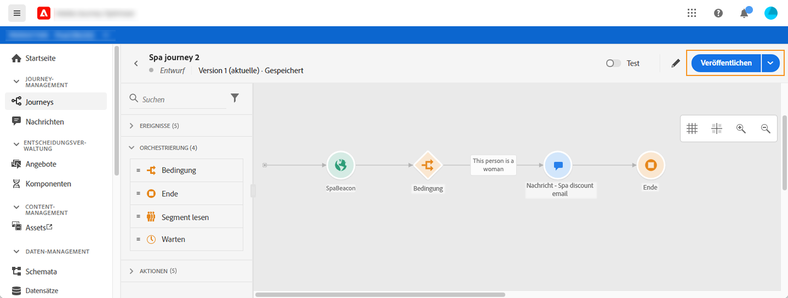

# Veröffentlichen der Journey{#concept_mtc_lrt_52b}

Sie können eine Journey veröffentlichen, nachdem Sie ihre Gültigkeit getestet haben.

Wenn Sie eine veröffentlichte Journey ändern möchten, müssen Sie eine neue Version Ihrer Journey erstellen. Weitere Informationen finden Sie auf [dieser Seite](../building-journeys/journey-versions.md). Wenn eine Journey schreibgeschützt ist, können Sie nur die Titel und Beschreibungen der Aktivitäten, den Namen der Journey und die Beschreibung der Journey ändern.

Wenn Sie eine Journey stoppen, wird sie dauerhaft angehalten. Alle Personen, die sich in der Journey aufhalten, werden dauerhaft gestoppt und die Journey lässt keine neuen Eintritte mehr zu. Wenn Sie die Journey erneut verwenden möchten, müssen Sie sie duplizieren und veröffentlichen.

1. Vergewissern Sie sich vor der Veröffentlichung, dass die Journey gültig ist und keine Fehler vorliegen. Sie können keine fehlerbehafteten Journeys veröffentlichen. Weitere Informationen finden Sie in [diesem Abschnitt](../building-journeys/troubleshooting.md#section_h3q_kqk_fhb). Es wird auch empfohlen, die Journey vor der Veröffentlichung zu testen. Weitere Informationen finden Sie auf [dieser Seite](../building-journeys/testing-the-journey.md).
1. Klicken Sie zum Veröffentlichen der Journey oben rechts im Dropdown-Menü auf die Option **[!UICONTROL Veröffentlichen]**.

   

Nachdem die Journey veröffentlicht wurde, ist sie schreibgeschützt.
