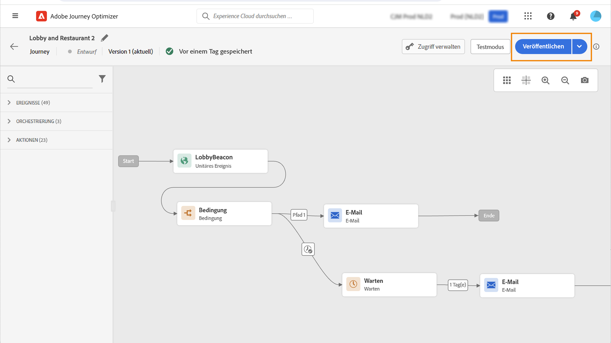

# Veröffentlichen Ihrer Journey {#publishing-the-journey}

Sie müssen eine Journey veröffentlichen, um sie zu aktivieren und für neue Profile verfügbar zu machen, damit diese in sie eintreten können. Stellen Sie vor der Veröffentlichung Ihrer Journey sicher, dass diese gültig ist und keine Fehler vorliegen. Es ist nicht möglich, eine fehlerhafte Journey zu veröffentlichen.

➡️ [Entdecken Sie diese Funktion im Video](#video)

Die Schritte zum Veröffentlichen einer Journey werden nachfolgend beschrieben:

1. Stellen Sie vor der Veröffentlichung Ihrer Journey sicher, dass diese gültig ist und keine Fehler vorliegen. Sie können keine fehlerhaften Journeys veröffentlichen.

   * Auf [ Seite erfahren Sie, wie Sie Ihren Journey testen ](testing-the-journey.md).
   * In [diesem Abschnitt](../building-journeys/troubleshooting.md#checking-for-errors-before-testing) erfahren Sie, wie Sie Fehler in Ihrer Journey beheben können.

1. Klicken Sie zum Veröffentlichen der Journey oben rechts im Dropdown-Menü auf die Option **[!UICONTROL Veröffentlichen]**.

   >[!NOTE]
   >
   > Wenn Ihre Journey einer Genehmigungsrichtlinie unterliegt, müssen Sie eine Genehmigung anfordern, um Ihre Journey veröffentlichen zu können. [Weitere Informationen](../test-approve/gs-approval.md)

   

Nachdem die Journey veröffentlicht wurde, ist sie **schreibgeschützt**. Wenn eine Journey schreibgeschützt ist, können Sie nur die Titel und Beschreibungen der Aktivitäten, den Namen der Journey und die Beschreibung der Journey ändern. Wenn Sie Änderungen an einer veröffentlichten Journey vornehmen müssen, erstellen Sie [ eine neue Version](journey-ui.md#journey-versions) Ihrer Journey.

Wenn Sie eine Journey stoppen, wird sie dauerhaft gestoppt: Alle Personen, die die Journey durchlaufen, werden dauerhaft gestoppt, und die Journey erlaubt keine neuen Eintritte mehr. Wenn Sie die Journey erneut ausführen müssen, müssen Sie sie duplizieren und die neue Journey veröffentlichen.

>[!IMPORTANT]
>
>Wenn Änderungen an einer Angebotsentscheidung vorgenommen werden, die in einer Journey-Nachricht verwendet wird, müssen Sie die Veröffentlichung der Journey aufheben und sie dann erneut veröffentlichen.  Dadurch wird sichergestellt, dass die Änderungen in die Journey aufgenommen werden und die Nachricht den neuesten Aktualisierungen entspricht.

## Anleitungsvideo {#video}

In diesem Video erfahren Sie, wie Sie eine Journey veröffentlichen:

>[!VIDEO](https://video.tv.adobe.com/v/3424998?quality=12)