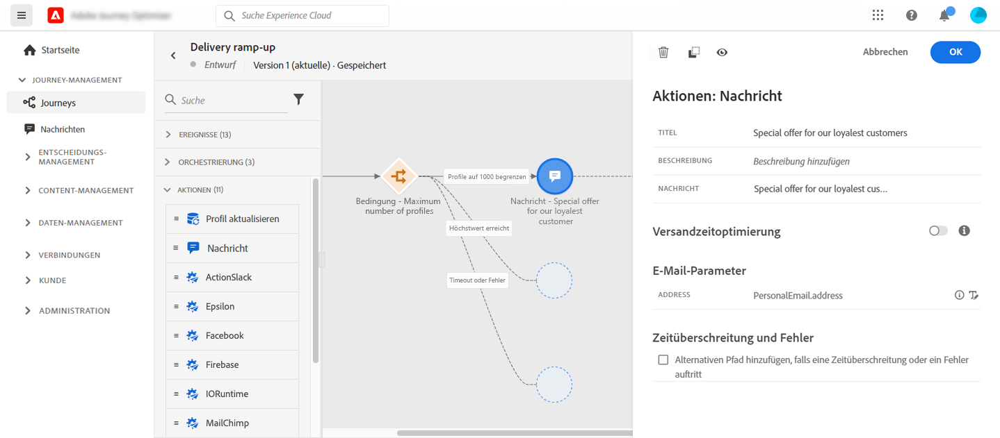

# Anwendungsfall: Steigern der Versandaktivität{#use-case-ramp-up-your-deliveries}

Wenn Sie kürzlich Ihren E-Mail-Dienstleister, Ihre IP-Adresse, Ihre E-Mail-Domain oder Ihre Subdomain gewechselt haben, müssen Sie erst Ihre Reputation als Absender aufbauen. Andernfalls könnten Ihre Sendungen blockiert oder in den Spam-Ordner des Postfachs der Empfänger verschoben werden. Im Handbuch zu [Best Practices bei der Zustellbarkeit](https://experienceleague.adobe.com/docs/deliverability-learn/deliverability-best-practice-guide/additional-resources/generic-resources/increase-reputation-with-ip-warming.html?lang=de){target="_blank"} finden sich Informationen dazu, wie die E-Mail-Reputation mit IP-Warming verbessert werden kann.

Um die Reputation Ihrer IP-Adresse zu verbessern, können Sie die Anzahl Ihrer Sendungen schrittweise erhöhen. Mehr dazu erfahren Sie unter [Zustellbarkeit in Journey Optimizer optimieren](../reports/deliverability.md).

In diesem Anwendungsbeispiel wird eine Journey erstellt, um die Versandaktivität Ihrer E-Mails zu steigern. Gehen Sie wie folgt vor, um diese Journey zu konfigurieren:

1. Erstellen Sie eine Journey. [Weitere Informationen](journey-gs.md).

1. Fügen Sie zur Journey die Aktivität **[!UICONTROL Bedingung]** hinzu. [Weitere Informationen](condition-activity.md).

1. Legen Sie in den Einstellungen für die Aktivität **[!UICONTROL Bedingung]** die maximale Empfängeranzahl für Ihren Versand fest:

   1. Wählen Sie in den Einstellungen für die Aktivität **[!UICONTROL Bedingung]** für das Feld **[!UICONTROL Typ]** die Option **[!UICONTROL Profilbegrenzung]** aus. [Weitere Informationen](condition-activity.md#profile_cap).

   1. Legen Sie das Feld **[!UICONTROL Limit]** auf die maximale Anzahl an Empfängern für diesen Versand fest.

   

   Sie können dieses Limit schrittweise auf die Gesamtzahl Ihrer Abonnenten erhöhen.

1. Fügen Sie im nominalen Pfad nach der Aktivität **[!UICONTROL Bedingung]** die Aktionsaktivität **[!UICONTROL E-Mail]** hinzu.

   

   Wenn die Journey ausgeführt wird, wird die Nachricht bis zu der von Ihnen angegebenen Höchstzahl an Profilen an die eingehenden Profile gesendet. Wenn dieses Limit erreicht ist, nehmen die eingehenden Profile den alternativen Pfad.

1. Vervollständigen Sie die Journey mit den Aktivitäten Ihrer Wahl.

Nach dem Aufwärmen Ihrer IP können Sie diese Bedingung entfernen.
