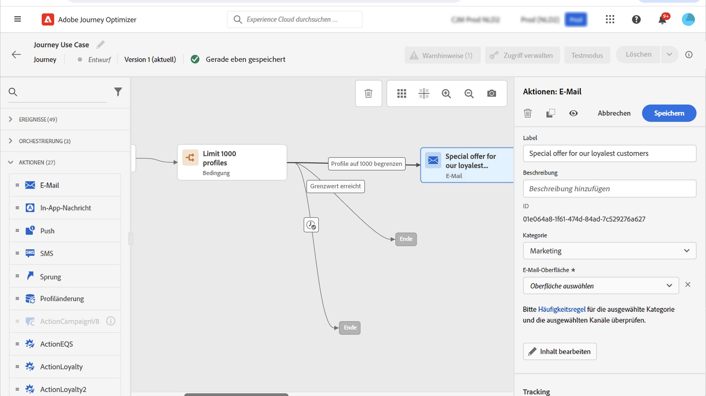

# Anwendungsfall: Sendungen vorantreiben{#use-case-ramp-up-your-deliveries}

Wenn Sie kürzlich zu einem anderen E-Mail-Dienstleister, einer IP-Adresse, einer E-Mail-Domain oder einer Subdomäne gewechselt haben, müssen Sie Ihre Reputation als Absender nachweisen. Andernfalls könnten Ihre Sendungen blockiert oder in den Spam-Ordner des Postfachs der Empfänger verschoben werden. Erfahren Sie, wie Sie Ihre E-Mail-Reputation mit IP-Warming im [Best Practices für die Zustellbarkeit](https://experienceleague.adobe.com/docs/deliverability-learn/deliverability-best-practice-guide/additional-resources/generic-resources/increase-reputation-with-ip-warming.html){target=&quot;_blank&quot;}.

Um Ihre IP-Adresse aufzuwärmen, können Sie die Anzahl Ihrer Sendungen schrittweise erhöhen. Mehr dazu [Zustellbarkeit in Journey Optimizer optimieren](../reports/deliverability.md).

Dieser Anwendungsfall dient der Erstellung einer Journey zur Beschleunigung Ihrer E-Mail-Sendungen. Gehen Sie wie folgt vor, um diese Journey zu konfigurieren:

1. Erstellen Sie eine Journey. [Mehr dazu](journey-gs.md).

1. Hinzufügen einer **[!UICONTROL Condition]** Aktivität zur Journey hinzu. [Mehr dazu](condition-activity.md).

1. Im **[!UICONTROL Condition]** in den Aktivitätseinstellungen die maximale Empfängeranzahl für Ihren Versand festlegen:

   1. Im **[!UICONTROL Condition]** Aktivitätseinstellungen festlegen, legen Sie die **[!UICONTROL Type]** -Feld zu **[!UICONTROL Profile cap]**. [Mehr dazu](condition-activity.md#profile_cap).

   1. Legen Sie die **[!UICONTROL Limit]** zur maximalen Anzahl an Empfängern für diesen Versand.

   

   Sie können diese Begrenzung schrittweise auf die Gesamtzahl Ihrer Abonnenten erhöhen.

1. Hinzufügen einer **[!UICONTROL Email]** Aktionsaktivität zum nominalen Pfad nach der **[!UICONTROL Condition]** Aktivität.

   

   Wenn die Journey ausgeführt wird, wird die Nachricht an die Eingabeprofile gesendet, bis zu der von Ihnen angegebenen Höchstzahl an Profilen. Wenn diese Grenze erreicht ist, nehmen die Eingabeprofile den alternativen Pfad an.

1. Schließen Sie die Journey mit den Aktivitäten Ihrer Wahl ab.

Nachdem sich Ihre IP erwärmt hat, können Sie diese Bedingung entfernen.
