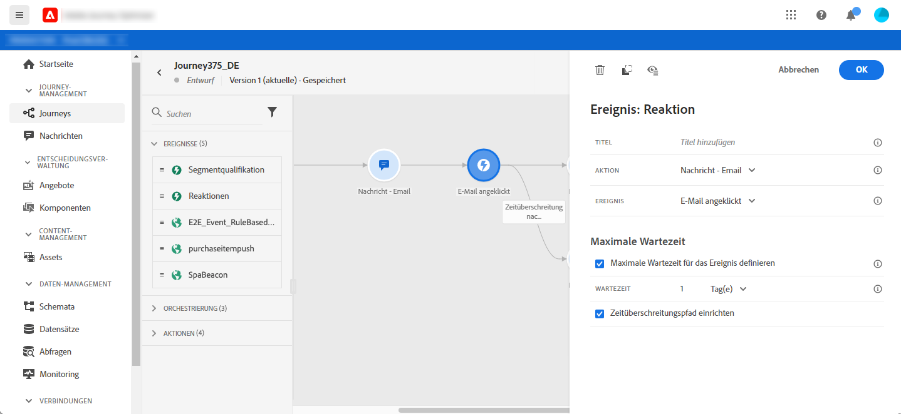

# Reaktionsereignisse {#section_dhx_gss_dgb}

Unter den verschiedenen Ereignisaktivitäten, die in der Palette verfügbar sind, finden Sie das integrierte **[!UICONTROL Reaktionsereignis]**. Mit dieser Aktivität können Sie auf Verfolgungsdaten im Zusammenhang mit einer Nachricht reagieren, die innerhalb derselben Journey gesendet wird. Wir erfassen diese Informationen in Echtzeit, sobald sie für Adobe Experience Platform freigegeben werden. Bei Push-Benachrichtigungen können Sie auf angeklickte, gesendete oder fehlgeschlagene Nachrichten reagieren. Bei SMS-Nachrichten können Sie auf gesendete oder fehlgeschlagene Nachrichten reagieren. Bei E-Mails können Sie auf angeklickte, gesendete, geöffnete oder fehlgeschlagene Nachrichten reagieren.

Sie können diesen Mechanismus auch verwenden, um eine Aktion auszuführen, wenn keine Reaktion auf Ihre Nachrichten erfolgt. Erstellen Sie dazu einen zweiten Pfad parallel zur Reaktionsaktivität und fügen Sie eine Warteaktivität hinzu. Wenn während des in der Warteaktivität definierten Zeitraums keine Reaktion erfolgt, wird der zweite Pfad ausgewählt. Sie können beispielsweise eine Folgenachricht senden.

Beachten Sie, dass Sie auf der Arbeitsfläche nur dann eine Aktivität der Reaktion verwenden können, wenn eine **Meldung**-Aktivität vorliegt.

Siehe [Informationen zu Aktionsaktivitäten](../building-journeys/about-journey-activities.md#action-activities).

Im Folgenden werden die verschiedenen Schritte zum Konfigurieren der Reaktionsereignisse beschrieben:

1. Fügen Sie der Reaktion einen **[!UICONTROL Titel]** hinzu.  Dieser Schritt ist optional.
1. Wählen Sie aus der Dropdown-Liste die Aktionsaktivität aus, auf die Sie reagieren möchten. Sie können jede Aktionsaktivität auswählen, die in den vorherigen Schritten des Pfades platziert wurde.
1. Wählen Sie je nach ausgewählter Aktion, auf welche Aktion Sie reagieren möchten.
1. Sie können die maximale Wartezeit für ein Ereignis (zwischen 40 Sekunden und 30 Tagen) und einen Pfad für die maximale Wartezeit definieren. Dadurch wird ein zweiter Pfad für Personen erstellt, die nicht während der festgelegten Zeitspanne reagiert haben. Beim Testen einer Journey, die ein Reaktionseeignis verwendet, beträgt der Standard- und Mindestwert für die **[!UICONTROL Wartezeit]** im Testmodus 40 Sekunden. Weitere Informationen finden Sie in [diesem Abschnitt](../building-journeys/testing-the-journey.md).

>[!NOTE]
>
>
>Ereignis mit Reaktionsfunktion können Meldungen, die in einer anderen Journey stattfinden, nicht verfolgen.
>
>Ereignis der Reaktion verfolgen Klicks auf Links des Typs &quot;verfolgt&quot;. Abmeldungs- und Mirrorseiten-Links werden nicht berücksichtigt.

>[!IMPORTANT]
>
>E-Mail-Clients wie Gmail erlauben die Blockierung von Bildern. Das Öffnen von E-Mails wird anhand eines in der E-Mail enthaltenen 0-Pixel-Bildes nachverfolgt. Wenn Bilder blockiert werden, wird das Öffnen von E-Mails nicht berücksichtigt.
