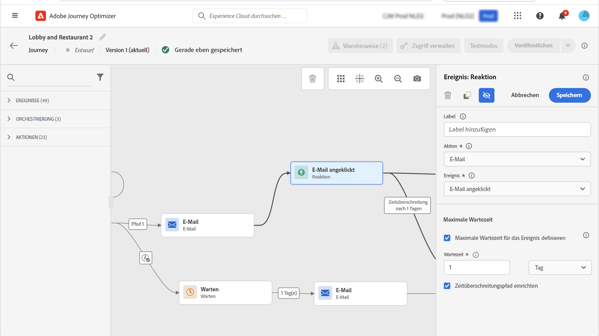

# Reaktionsereignisse {#reaction-events}

>[!CONTEXTUALHELP]
>id="ajo_journey_event_reaction"
>title="Reaktionsereignisse"
>abstract="Mit dieser Aktivität können Sie auf Tracking-Daten reagieren, die sich auf eine innerhalb derselben Journey gesendete Nachricht beziehen. Wir erfassen diese Informationen in Echtzeit in dem Moment, in dem sie mit [!DNL Adobe Experience Platform] geteilt werden."

## Überblick {#overview}

Unter den verschiedenen Ereignisaktivitäten, die in der Palette verfügbar sind, finden Sie das integrierte **[!UICONTROL Reaktionsereignis]**. Mit dieser Aktivität können Sie auf Tracking-Daten reagieren, die sich auf eine innerhalb derselben Journey gesendete Nachricht beziehen. Wir erfassen diese Informationen in Echtzeit in dem Moment, in dem sie mit [!DNL Adobe Experience Platform] geteilt werden.

Sie können auf angeklickte oder geöffnete Nachrichten reagieren. Beispielsweise können Sie eine weitere Nachricht senden, wenn eine Person die vorherige E-Mail geöffnet oder darin geklickt hat, oder eine andere Folgenachricht senden, wenn sie nicht mit Ihrer Kommunikation interagiert hat.

Siehe [Aktionsaktivitäten](../building-journeys/about-journey-activities.md#action-activities).

Sie können die Aktivität **[!UICONTROL Reaktion]** auch verwenden, um eine Aktion auszuführen, wenn keinerlei Reaktion auf Ihre Nachrichten erfolgt. Erstellen Sie hierfür einen zweiten Pfad parallel zur Aktivität **[!UICONTROL Reaktion]** und fügen Sie eine Aktivität **[!UICONTROL Warten]** hinzu. Wenn während des in der Aktivität **[!UICONTROL Warten]** definierten Zeitraums keine Reaktion erfolgt, wird der zweite Pfad gewählt. Sie können beispielsweise eine Folgenachricht senden.

## Konfigurieren von Reaktionsereignissen {#configure}

Führen Sie diese Schritte aus, um die Reaktionsereignisse zu konfigurieren:

1. Platzieren Sie eine Aktivität **[!UICONTROL Reaktion]** in der Journey-Arbeitsfläche **unmittelbar** nach einer [Kanalaktionsaktivität](journeys-message.md).
1. Fügen Sie der Reaktion ein **[!UICONTROL Label]** hinzu. Dieser Schritt ist optional.
1. Wählen Sie aus der Dropdown-Liste die Aktionsaktivität aus, auf die Sie reagieren möchten. Sie können jede Aktionsaktivität auswählen, die in den vorherigen Schritten des Pfades platziert wurde.
1. Wählen Sie je nach ausgewählter Aktion, auf was Sie reagieren möchten.
1. Sie können das Timeout für ein Ereignis (zwischen 40 Sekunden und 90 Tagen) und einen Timeout-Pfad definieren. Dadurch wird ein zweiter Pfad für Personen erstellt, die nicht innerhalb der festgelegten Zeitspanne reagiert haben. Beim Testen einer Journey, die ein Reaktionseeignis verwendet, beträgt der Standard- und Mindestwert für die **[!UICONTROL Wartezeit]** im Testmodus 40 Sekunden. Weitere Informationen finden Sie in [diesem Abschnitt](../building-journeys/testing-the-journey.md).

## Leitlinien und Einschränkungen {#guardrails-limitations}

* Eine Aktivität **[!UICONTROL Reaktion]** muss in der Journey-Arbeitsfläche **unmittelbar** nach einer [Kanalaktionsaktivität](journeys-message.md) platziert werden.
* Eine Aktivität **[!UICONTROL Reaktion]** kann nur verwendet werden, wenn zuvor eine Kanalaktionsaktivität stattgefunden hat.
* Das Platzieren einer Aktivität **[!UICONTROL Warten]** oder einer anderen Aktivität zwischen der Kanalaktion und der Aktivität **[!UICONTROL Reaktion]** wird nicht unterstützt und kann dazu führen, dass die Reaktion nicht wie erwartet funktioniert.
* Reaktionsereignisse können nur Nachrichten verfolgen, die innerhalb derselben Journey gesendet werden. Meldungen, die in einer anderen Journey stattfinden, können nicht verfolgt werden.
* Reaktionsereignisse verfolgen Klicks auf Links des Typs „verfolgt“. Abmeldungs- und Mirrorseiten-Links werden nicht berücksichtigt.
* Das Öffnen von E-Mails wird anhand eines in der E-Mail enthaltenen 0-Pixel-Bildes nachverfolgt. Wenn E-Mail-Clients (z. B. Gmail) Bilder blockieren, werden E-Mail-Öffnungen nicht berücksichtigt.
