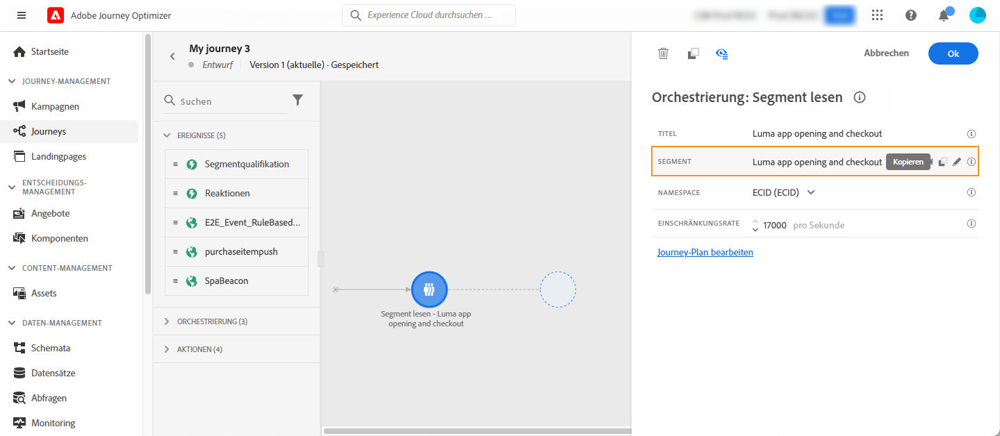
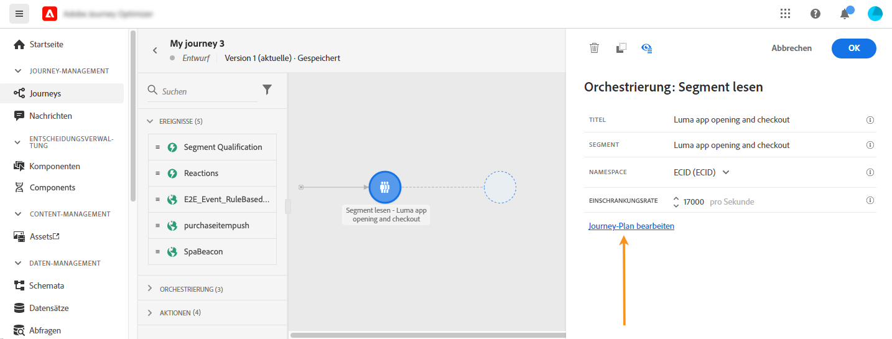
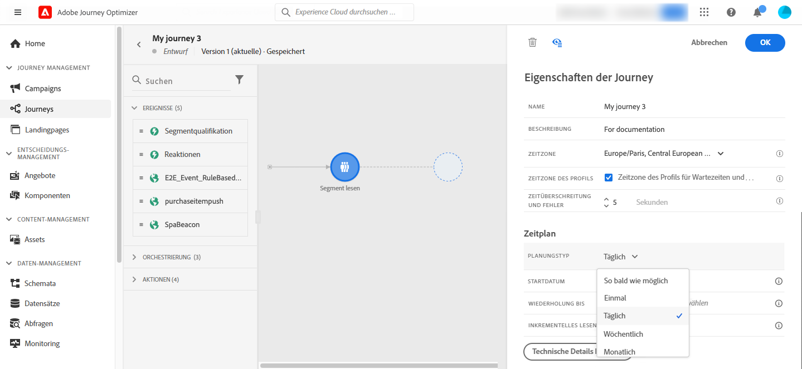
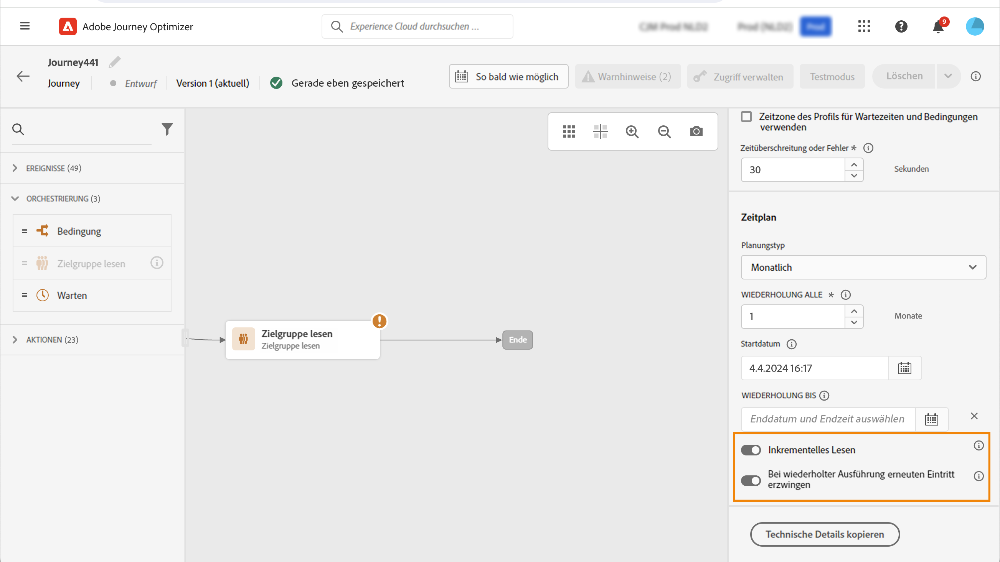
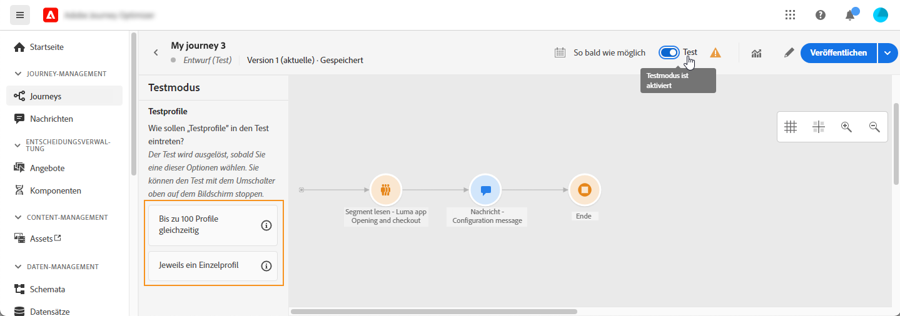
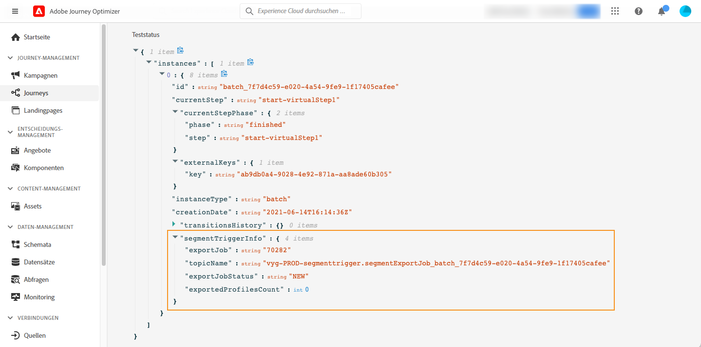
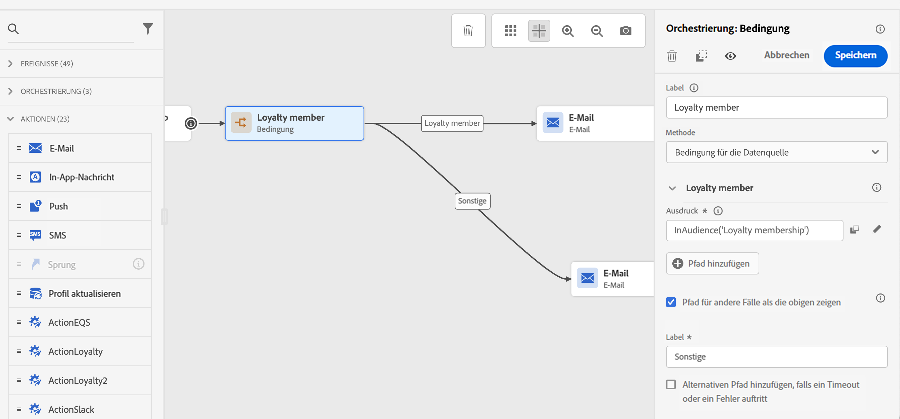
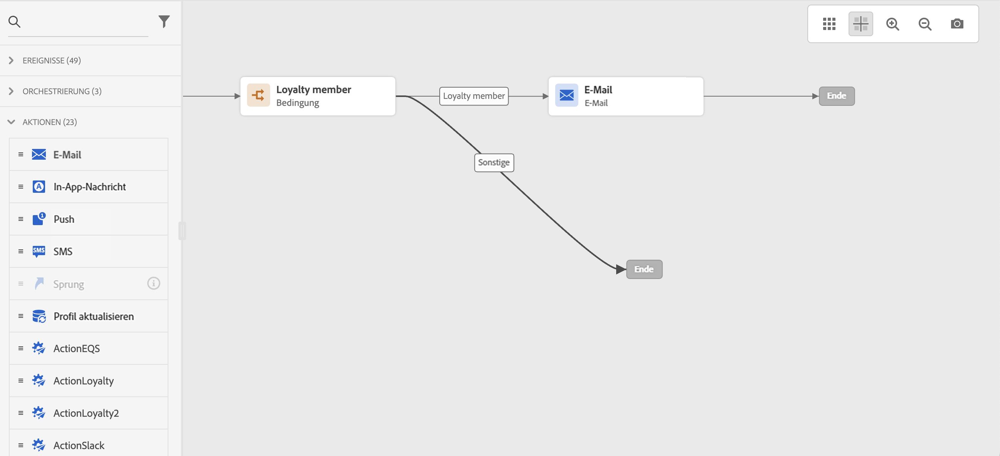
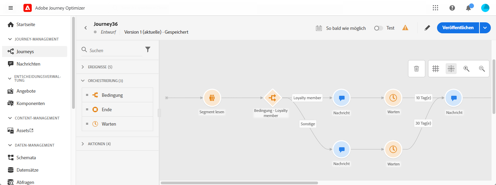

# Verwenden einer Zielgruppe in einer Journey {#segment-trigger-activity}

Verwenden Sie die Aktivität Zielgruppe lesen , um Journey mit definierten Zielgruppen zu starten. Wählen Sie die Zielgruppe und den Ausführungszeitpunkt aus. Personalisieren Sie dann [&#x200B; Pfad jedes Profils mit &#x200B;](#audience-targeting-in-journeys)Bedingungen“, Timern und Aktionen.

## Über die Aktivität „Zielgruppe lesen“ {#about-segment-trigger-activity}

>[!CONTEXTUALHELP]
>id="ajo_journey_read_segment"
>title="Aktivität „Zielgruppe lesen“"
>abstract="Fügt alle qualifizierten Profile einer ausgewählten [!DNL Adobe Experience Platform] Zielgruppe zu dieser Journey hinzu. Wird einmal oder nach einem Zeitplan ausgeführt."

Die **Zielgruppe lesen**-Aktivität ist die Journey-Einstiegspunktaktivität, die alle Profile aus einer ausgewählten [!DNL Adobe Experience Platform] Zielgruppe zu einer Journey hinzufügt. Sie können den Eintritt einmal oder nach einem wiederkehrenden Zeitplan ausführen. In -APIs und technischen Referenzen wird diese Aktivität auch als segmentbasierter oder zielgruppenbasierter Journey-Trigger bezeichnet.

**Verwendung von „Zielgruppe lesen“ vs. Zielgruppen-Qualifizierung**

| Verwenden Sie **Zielgruppe lesen** wenn | Verwenden **[Zielgruppen-Qualifizierung](audience-qualification-events.md)** wenn |
|----------------------------|-----------------------------------------------------------------------|
| Sie möchten eine Journey einmal oder nach einem Zeitplan (Batch) ausführen. | Sie benötigen Profile, um die Journey in Echtzeit aufrufen zu können, da sie sich qualifizieren. |
| Ihre Zielgruppe wird per Batch ausgewertet (z. B. täglicher Schnappschuss). | Ihre Zielgruppe streamt oder ereignisbasiert. |
| Sie können mit einer Verzögerung zwischen der Zielgruppenauswertung und dem Journey-Eintrag einverstanden sein. | Sie müssen sofort eintreten, wenn ein Profil qualifiziert ist. |

>[!TIP]
>
>**Beispiele aus der Praxis**
>* **Wöchentlicher Newsletter** → Zielgruppe lesen. Ihre Zielgruppe ist eine tägliche Batch-Momentaufnahme. Sie planen die Journey jeden Montag um 9 Uhr morgens. Alle qualifizierten Profile treten gemeinsam ein.
>* **Upgrade der Treuestufe** → Zielgruppen-Qualifizierung. Sobald ein Profil in einer Streaming-Zielgruppe den Gold-Status erreicht, gelangt es sofort auf die Journey, um eine Glückwunsch-E-Mail zu erhalten.
>* **Serie zur erneuten Interaktion** → Zielgruppe lesen. Sie führen alle 30 Tage eine wiederkehrende Journey aus, um Profile anzusprechen, die seit über 90 Tagen inaktiv sind.

**Schlüsselbeschränkungen:** eine „Zielgruppe lesen“ pro Journey (muss die erste Aktivität sein); eine Zielgruppe pro Aktivität; bis zu fünf gleichzeitige „Zielgruppe lesen“-Ausführungen pro Organisation; 20.000 Profile pro Sekunde pro Sandbox; 12-Stunden-Job-Timeout. Ausführliche Informationen finden Sie unter [Leitplanken und Einschränkungen](../start/guardrails.md#read-segment-g).

**Voraussetzungen:** Eine [!DNL Adobe Experience Platform] Zielgruppe, die erstellt und ausgewertet wird (realisierter Status), ein personenbasierter Identity-Namespace, der für die Journey ausgewählt wird, und - bei wiederkehrenden Ausführungen - ein Verständnis von [Zeitplan und Durchsatzbeschränkungen](../start/guardrails.md#read-segment-g).

Beispielsweise kann die im Anwendungsfall [Zielgruppen erstellen](../audience/about-audiences.md) erstellte `Luma app opening and checkout`-Zielgruppe als Einstiegspunkt verwendet werden. Alle qualifizierten Profile treten in die Journey ein und durchlaufen personalisierte Pfade, in denen Bedingungen, Timer, Ereignisse und Aktionen verwendet werden.

➡️ [Funktion im Video kennenlernen](#video)

>[!CAUTION]
>
>* Bevor Sie mit der Verwendung der Aktivität „Zielgruppe lesen“ beginnen, [lesen Sie die Informationen zu Leitlinien und Einschränkungen](#must-read).

## Konfigurieren der Aktivität {#configuring-segment-trigger-activity}

Sie legen Folgendes fest: **Audience** (obligatorisch), **Namespace** (obligatorisch), **Leserate** (obligatorisch, Standard 5.000/s) und **Zeitplan** (wenn die Journey ausgeführt wird). Fügen Sie optional eine **Bezeichnung** und **Zusätzliche Kennung** hinzu. Die folgenden Schritte führen Sie durch die einzelnen Einstellungen.

### Hinzufügen der Aktivität und Auswählen der Zielgruppe {#add-activity-and-select-audience}

>[!CONTEXTUALHELP]
>id="ajo_journey_read_segment_label"
>title="Label"
>abstract="Fügen Sie ein optionales Label hinzu, um die Aktivität in den Reporting- und Testmodusprotokollen zu identifizieren."

>[!CONTEXTUALHELP]
>id="ajo_journey_read_segment_audience"
>title="Zielgruppe"
>abstract="Die [!DNL Adobe Experience Platform] Zielgruppe, deren Profile in diese Journey eintreten. Alle qualifizierten Profile werden eingelesen. Batch-Zielgruppen werden für eine zuverlässige, konsistente Zählung empfohlen, und pro Aktivität kann nur eine Zielgruppe gelesen werden."

>[!CONTEXTUALHELP]
>id="ajo_journey_read_segment_namespace"
>title="Namespace"
>abstract="Die Identität (z. B. E-Mail, ECID), die zur Identifizierung von Personen verwendet wird, die die Journey betreten. Es sind nur personenbasierte Namespaces verfügbar, und Profile ohne diese Identität können nicht eingeben. Standardmäßig ist das Feld mit dem zuletzt verwendeten Namespace vorausgefüllt."

1. Erweitern Sie die Kategorie **[!UICONTROL Orchestrierung]** und legen Sie eine Aktivität vom Typ **[!UICONTROL Zielgruppe lesen]** auf Ihrer Arbeitsfläche ab.

   Die Aktivität muss als erster Schritt einer Journey positioniert werden.

1. Fügen Sie der Aktivität ein **[!UICONTROL Label]** hinzu (optional). Eine optionale Beschriftung hilft Ihnen, die Aktivität in Berichten und in Testmodus-Protokollen zu identifizieren.

1. Wählen Sie im Feld **[!UICONTROL Zielgruppe]** die [!DNL Adobe Experience Platform]-Zielgruppe aus, die in die Journey eintreten soll, und klicken Sie dann auf **[!UICONTROL Speichern]**. Sie können eine beliebige [!DNL Adobe Experience Platform]-Zielgruppe auswählen, die mit [Segmentdefinitionen](../audience/creating-a-segment-definition.md) generiert wurde.

   >[!NOTE]
   >
   >Darüber hinaus können Sie [!DNL Adobe Experience Platform] Zielgruppen ansprechen, die mithilfe von [Zielgruppenkompositionen](../audience/get-started-audience-orchestration.md) erstellt wurden.
   >Sie können auch Zielgruppen auswählen [aus einer CSV-Datei hochgeladen](https://experienceleague.adobe.com/docs/experience-platform/segmentation/ui/overview.html?lang=de#import-audience){target="_blank"}.
   >[Weitere Informationen zum Generieren und Ansprechen von Zielgruppen in Journey Optimizer](../audience/about-audiences.md).

   Beachten Sie, dass Sie die in der Liste angezeigten Spalten anpassen und sortieren können.

   ![Benutzeroberfläche zur Zielgruppenauswahl mit verfügbaren [!DNL Adobe Experience Platform] Zielgruppen](assets/read-segment-selection.png)

   Nachdem die Zielgruppe hinzugefügt wurde, können Sie mit der Schaltfläche **[!UICONTROL Kopieren]** deren Namen und ID kopieren:

   `{"name":"Luma app opening and checkout","id":"8597c5dc-70e3-4b05-8fb9-7e938f5c07a3"}`

   

   >[!NOTE]
   >
   >Nur Personen mit dem Zielgruppenzugehörigkeitsstatus **Realisiert** können in die Journey eintreten. Weitere Informationen zum Auswerten einer Zielgruppe finden Sie in der [Dokumentation zum Segmentierungs-Service](https://experienceleague.adobe.com/de/docs/experience-platform/segmentation/tutorials/evaluate-a-segment#interpret-segment-results){target="_blank"}.

1. Wählen Sie im Feld **[!UICONTROL Namespace]** den Namespace aus, der zur Identifizierung der Kontakte verwendet werden soll. Standardmäßig ist das Feld mit dem zuletzt verwendeten Namespace vorausgefüllt. [Weitere Informationen über Namespaces](../event/about-creating.md#select-the-namespace).

   >[!NOTE]
   >
   >Personen, die zu einer Zielgruppe ohne die ausgewählte Identität (den ausgewählten Namespace) gehören, können nicht in die Journey eintreten. Sie können nur einen personenbasierten Identity-Namespace auswählen. Wenn Sie einen Namespace für eine Suchtabelle definiert haben (z. B.: Produkt-ID-Namespace für eine Produktsuche), ist er nicht in der Dropdown-Liste **Namespace** verfügbar.

### Zusatzkennung {#read-audience-supplemental-id}

Optional können Sie **Zusätzliche Kennung verwenden** aktivieren, um die Journey zusätzlich zur Profil-ID im Kontext einer sekundären Kennung (z. B. einer Auftrags-ID oder Buchungs-ID) auszuführen. Dies ermöglicht mehrere Eintritte desselben Profils, wenn die zusätzliche Kennung unterschiedlich ist.

[Erfahren Sie, wie Sie zusätzliche Kennungen in Journey verwenden](supplemental-identifier.md). Bei Journey des Typs „Zielgruppe lesen“ muss die zusätzliche Kennung ein Profilattribut sein. Die Leserate ist auf 500 Profile pro Sekunde beschränkt, wenn eine zusätzliche ID verwendet wird.

### Schutzmechanismen und Empfehlungen {#must-read}

Alle Leitplanken und Einschränkungen für die Aktivität **Zielgruppe lesen** (Gleichzeitigkeit, Durchsatz, eine Zielgruppe pro Aktivität, Auftrags-Timeout, Wiederholungen und mehr) sind unter [Leitplanken und Einschränkungen](../start/guardrails.md#read-segment-g) aufgeführt.

**Recommendations**

* Verwenden Sie als Best Practice Batch-Zielgruppen in einer Aktivität vom Typ **Zielgruppe lesen**, um eine zuverlässige und konsistente Zählung zu erzielen. „Zielgruppe lesen“ wurde für Batch-Anwendungsfälle entwickelt. Wenn für Ihren Anwendungsfall Echtzeitdaten benötigt werden, verwenden Sie stattdessen die Aktivität [Zielgruppen](audience-qualification-events.md)Qualifizierung.
* Zielgruppen,[&#x200B; die aus einer CSV-Datei importiert wurden](https://experienceleague.adobe.com/docs/experience-platform/segmentation/ui/overview.html?lang=de#import-audience) oder aus [Kompositions-Workflows](../audience/get-started-audience-orchestration.md) stammen, können in der Aktivität **Zielgruppe lesen** ausgewählt werden. Diese Zielgruppen sind in der Aktivität **Zielgruppen-Qualifizierung** nicht verfügbar.
* Informationen zur Momentaufnahme der Zielgruppe, zu den Batch-Segmentierungs-Fertigstellungsfenstern und dazu, wie Sie sicherstellen, dass Ihr Journey immer mit den aktuellsten Daten ausgeführt wird, finden Sie unter [Timing und Datenweitergabe](#timing-and-data-propagation). Bei wiederkehrenden Journey sollten Sie die Option **[!UICONTROL Trigger nach Batch-Zielgruppenbewertung aktivieren]** um die Ausführung automatisch zu verzögern, bis der letzte Zielgruppen-Schnappschuss bereit ist. [Weitere Informationen](#schedule).

>[!CAUTION]
>
>[Leitlinien für Echtzeit-Kundenprofildaten und Segmentierung](https://experienceleague.adobe.com/docs/experience-platform/profile/guardrails.html?lang=de){target="_blank"} gelten auch für [!DNL Adobe Journey Optimizer].

**Weiter** Legen Sie die [Leserate](#profile-entry-and-reading-rate) und [Zeitplan](#schedule) fest und dann [testen und veröffentlichen](#testing-publishing).

### Profileintrag und Lesegeschwindigkeit {#profile-entry-and-reading-rate}

>[!CONTEXTUALHELP]
>id="ajo_journey_read_segment_reading_rate"
>title="Lesegeschwindigkeit"
>abstract="Maximale Anzahl der Profile, die pro Sekunde in die Journey eintreten (500–20.000). Der Standardwert ist 5.000."

Legen Sie die **[!UICONTROL Ableserate]** fest (obligatorisch). Dies ist die maximale Anzahl von Profilen, die pro Sekunde in die Journey eintreten können. Diese Rate gilt nur für diese und keine andere Aktivitäten in der Journey. Wenn Sie beispielsweise eine Einschränkungsrate für benutzerdefinierte Aktionen definieren möchten, müssen Sie die Einschränkungs-API verwenden. Mehr dazu erfahren Sie auf [dieser Seite](../configuration/throttling.md).

Dieser Wert wird in der Payload der Journey-Version gespeichert. Der Standardwert ist 5.000 Profile pro Sekunde. Sie können diesen Wert zwischen 500 und 20.000 Profile pro Sekunde variieren.

>[!NOTE]
>
>Die Gesamtleserate pro Sandbox ist auf 20.000 Profile pro Sekunde festgelegt. Daher ergibt die Leserate aller gleichzeitig in derselben Sandbox ausgeführten Aktivitäten „Zielgruppe lesen“ maximal 20.000 Profile pro Sekunde. Sie können diese Begrenzung nicht ändern. Weitere Informationen zu Journey-Verarbeitungsraten und -Durchsatz finden Sie in [diesem Abschnitt](entry-management.md#journey-processing-rate).

### Planen der Journey {#schedule}

>[!CONTEXTUALHELP]
>id="ajo_journey_read_segment_scheduler_start_date"
>title="Startdatum/Uhrzeit"
>abstract="Das Datum und die Uhrzeit, zu der die Journey mit dem Lesen der Zielgruppe beginnt und Profile eintreten. Kombinieren Sie dies mit den unten stehenden Wiederholungsoptionen, um wiederkehrende Ausführungen zu planen."

>[!CONTEXTUALHELP]
>id="ajo_journey_read_segment_scheduler_repeat_until"
>title="Wiederholen bis"
>abstract="Das Datum, an dem wiederkehrende Ausführungen beendet werden. Nach diesem Datum liest die Journey die Zielgruppe nicht mehr und nimmt keine neuen Profile mehr auf."

>[!CONTEXTUALHELP]
>id="ajo_journey_read_segment_scheduler_repeat_every"
>title="Wiederholen alle"
>abstract="Wie oft die Journey die Zielgruppe erneut liest und erneut ausgeführt wird, z. B. täglich oder wöchentlich. Bestimmt das Wiederholungsintervall zwischen Ausführungen, bis das Wiederholungsdatum erreicht ist."

>[!CONTEXTUALHELP]
>id="ajo_journey_read_segment_scheduler_incremental_read"
>title="Inkrementelles Lesen"
>abstract="Nach der ersten Ausführung treten nur neue Profile, die der Zielgruppe hinzugefügt wurden, in die Journey ein."

>[!CONTEXTUALHELP]
>id="ajo_journey_read_segment_scheduler_force_reentrance"
>title="Erneuten Eintritt erzwingen"
>abstract="Löscht alle Teilnehmer vom Journey, bevor jede neue Zielgruppe gelesen wird, sodass jeder Durchgang neu gestartet wird und Profile bei jedem Vorkommen erneut eintreten können."

>[!CONTEXTUALHELP]
>id="ajo_journey_read_segment_scheduler_synchronize_audience"
>title="Nach Batch-Zielgruppenauswertung auslösen"
>abstract="Verzögert jede Ausführung, bis die Batch-Zielgruppe neu ausgewertet wurde, sodass die Journey den aktuellsten Zielgruppen-Schnappschuss und nicht veraltete Daten liest. Wird für wiederkehrende Journey empfohlen, die von den neuesten Segmentierungsergebnissen abhängen."

>[!CONTEXTUALHELP]
>id="ajo_journey_read_segment_scheduler_synchronize_audience_wait_time"
>title="Wartezeit für neue Zielgruppenauswertung"
>abstract="Wie lange die Journey auf neue Zielgruppendaten wartet (1–6 Stunden, in Minuten oder Stunden)."

Standardmäßig sind Journeys so konfiguriert, dass sie nur einmal ausgeführt werden. Führen Sie die nachfolgenden Schritte aus, um ein bestimmtes Datum/eine bestimmte Uhrzeit und eine bestimmte Häufigkeit für die Journey-Ausführung zu definieren.

>[!NOTE]
>
>**Journey-Status und die globale Zeitüberschreitung von 91 Tagen:**
>
>* **Nicht wiederkehrend** Der Status „Zielgruppe lesen“ wechselt automatisch in den **Angehalten**-Status, sobald das letzte aktive Profil beendet wird - es sei denn, die Journey enthält Journey, die Wartezeiten verursachen (Warteknoten, Reaktionsknoten oder ereignisausgelöste Transitionen). In diesem Fall gilt die standardmäßige globale [91-Tage-Zeitüberschreitung](journey-properties.md#global_timeout). [Weitere Informationen](end-journey.md#auto-stop-non-recurring)
>* **Wiederkehrend** Zielgruppen-Journey mit keinem Enddatum lesen **Live bleiben** solange die Journey veröffentlicht wird. Sie wechseln 91 **nach der Ausführung ihres** Vorkommens in den Status **Beendet**.
>* Die 91-tägige maximale Wartezeit gilt für einzelne **Profile**, die die Journey durchlaufen (maximale Zeit, während der ein Profil aktiv bleiben kann), nicht für den Live-Status der Journey.
>* Das 91-tägige **Reporting-Fenster** ist ein separates Konzept: die Benutzeroberfläche zeigt Leistungsdaten für etwa die letzten 91 Tage an. Auf ältere Daten kann nicht über die Benutzeroberfläche zugegriffen werden, die Journey läuft jedoch weiter. [Weitere Informationen](journey-properties.md#global_timeout)

1. Wählen Sie in den Eigenschaften der Aktivität **[!UICONTROL Zielgruppe lesen]** die Option **[!UICONTROL Journey-Plan bearbeiten]** aus.

   

1. Die Eigenschaften der Journey werden angezeigt. Wählen Sie in der Dropdown-Liste **[!UICONTROL Planungstyp]** die Häufigkeit aus, mit der die Journey ausgeführt werden soll.

   

Für wiederkehrende Journeys stehen spezifische Optionen zur Verfügung, mit denen Sie den Eintritt der Profile in die Journey verwalten können. Erweitern Sie die folgenden Abschnitte, um weitere Informationen zu den einzelnen Optionen zu erhalten.

+++**[!UICONTROL Inkrementelles Lesen]**

Wenn eine Journey mit einer wiederkehrenden Aktivität **Zielgruppe lesen** zum ersten Mal ausgeführt wird, treten alle Profile in der Zielgruppe in die Journey ein. Mit dieser Option haben Sie die Möglichkeit, nach dem ersten Auftreten nur die Personen anzusprechen, die seit der letzten Journey-Ausführung in die Zielgruppe eingetreten sind.

Bei Verwendung dieser Option blickt das System **24 Stunden** vom Zeitpunkt des letzten Zielgruppenauswertungsauftrags zurück, der vom Segmentierungs-Service von [!DNL Adobe Experience Platform] ausgeführt wurde.

Nach Abschluss der Segmentierung beginnt ein Exportauftrag für Profil-Snapshots, mit dem Journey Optimizer neue Profile erkennen und verarbeiten kann. Wenn die Journey zwischen diesen beiden Aufträgen geplant ist, werden beim inkrementellen Lesen keine Profile erfasst, die seit der letzten Ausführung der Journey Mitglieder der Zielgruppe wurden.

So minimieren Sie das Risiko fehlender Profile:
* Aktivieren Sie die Option **[!UICONTROL Nach Batch-Zielgruppenauswertung auslösen]**, um den Lookback-Zeitraum auf den Zeitpunkt der letzten erfolgreichen Journey-Ausführung zu verlängern, unabhängig davon, wie lange er zurückliegt
* Planen Sie die Ausführung der Journey nach Abschluss der täglichen Batch-Segmentierungsaufträge (in der Regel 2–3 Std. Puffer)
* Bei zeitkritischen Anwendungsfällen, die eine sofortige Profileinbindung erfordern, sollten Sie stattdessen Aktivitäten zur [Zielgruppen-Qualifizierung](audience-qualification-events.md) mit Streaming-Zielgruppen verwenden

>[!CAUTION]
>
>Wenn Sie eine [benutzerdefinierte Upload-Zielgruppe](../audience/about-audiences.md#about-segments) auf Ihrem Journey ansprechen, werden Profile nur bei der ersten Wiederholung abgerufen, wenn diese Option auf einer wiederkehrenden Journey aktiviert ist. Diese Zielgruppen sind unveränderlich.

+++

+++**[!UICONTROL Bei wiederholter Ausführung erneuten Eintritt erzwingen]**

Mit dieser Option können Sie alle noch in der Journey vorhandenen Profile bei der nächsten Ausführung automatisch austreten lassen.

Wenn Sie beispielsweise eine Wartezeit von 2 Tagen auf einer täglich wiederkehrenden Journey haben, werden Profile bei Aktivierung dieser Option zur nächsten Journey-Ausführung verschoben. Dies geschieht am darauffolgenden Tag, unabhängig davon, ob sie sich in der Zielgruppe der nächsten Ausführung befinden oder nicht.

Wenn die Lebensdauer Ihrer Profile in dieser Journey länger als die Häufigkeit der Intervalle sein kann, aktivieren Sie diese Option nicht. So stellen Sie sicher, dass die Profile ihre Journey abschließen können.

+++

+++**[!UICONTROL Nach Batch-Zielgruppenauswertung auslösen]**

Für täglich geplante Journeys und zum Targeting von Batch-Zielgruppen können Sie ein Zeitfenster von bis zu 6 Stunden definieren, damit die Journey auf neue Zielgruppendaten aus Batch-Segmentierungsaufträgen wartet. Wenn der Segmentierungsauftrag innerhalb des Zeitfensters abgeschlossen wird, wird die Journey ausgelöst. Andernfalls wird die Journey bis zum nächsten Auftreten übersprungen. Diese Option stellt sicher, dass Journeys mit genauen und aktuellen Zielgruppendaten ausgeführt werden.

Wenn beispielsweise eine Journey für täglich 18 Uhr geplant ist, können Sie angeben, wie viele Minuten oder Stunden gewartet werden soll, bevor die Journey ausgeführt wird. Wenn die Journey um 18 Uhr aktiv wird, sucht sie nach einer neuen Zielgruppe, d. h. nach einer Zielgruppe, die neuer ist als die aus der vorherigen Journey-Ausführung. Während des angegebenen Zeitfensters wird die Journey ausgeführt, sobald die neue Zielgruppe erkannt wird. Wenn keine neue Zielgruppe erkannt wird, wird die Journey-Ausführung für diesen Tag übersprungen.

+++

<!--
### Segment filters {#segment-filters}

[!CONTEXTUALHELP]
>id="jo_segment_filters"
>title="About segment filters"
>abstract="This option targets only the individuals who entered or exited a specific segment during a specific time window. For example, it can retrieve only the customers who entered the VIP segment since last week."

You can choose to target only the individuals who entered or exited a specific segment during a specific time window. For example, you can decide to only retrieve all the customers who entered the VIP segment since last week. Only the new VIP customers will be targeted. All the customers who were already part of the VIP segment before will be excluded.

To activate this mode, click the **Segment Filters** toggle. Two fields are displayed:

**Segment membership**: choose whether you want to listen to segment entrances or exits. 

**Lookback window**: define when you want to start to listen to entrances or exits. This lookback window is expressed in hours, starting from the moment the journey is triggered.  If you set this duration to 0, the journey will target all members of the segment. For recurring journeys, it will take into account all entrances/exits since the last time the journey was triggered.
-->

## Testen und Veröffentlichen der Journey {#testing-publishing}

Mit der Aktivität **[!UICONTROL Zielgruppe lesen]** können Sie die Journey anhand eines einheitlichen Profils testen.

Dazu muss der Testmodus aktiviert werden.

Konfigurieren Sie den Testmodus und führen Sie ihn wie gewohnt aus. [Erfahren Sie, wie Sie eine Journey testen](testing-the-journey.md).

Sobald der Test ausgeführt wird, können mit der Schaltfläche **[!UICONTROL Protokolle anzeigen]** die Testergebnisse angezeigt werden. Weiterführende Informationen hierzu finden Sie in [diesem Abschnitt](testing-the-journey.md#viewing_logs)

Nach erfolgreichem Abschluss der Tests können Sie Ihre Journey veröffentlichen (siehe [Veröffentlichen der Journey](../building-journeys/publish-journey.md)). Personen, die zur Zielgruppe gehören, treten zu dem Datum und der Uhrzeit in die Journey ein, die im Abschnitt **[!UICONTROL Planung]** der Journey-Eigenschaften festgelegt sind.

>[!NOTE]
>
>Bei zielgruppenbasierten wiederkehrenden Journeys wird die Journey automatisch nach dem letzten Auftreten geschlossen. Wenn kein Enddatum/-zeitpunkt angegeben wurde, müssen Sie die Journey manuell für neue Eintritte schließen, um sie zu beenden.

## Zielgruppen-Targeting in Journey {#audience-targeting-in-journeys}

Zielgruppenbasierte Journeys beginnen immer mit der Aktivität **Zielgruppe lesen**, um Personen abzurufen, die einer [!DNL Adobe Experience Platform]-Zielgruppe angehören. Diese Profile werden einmal oder in einem wiederkehrenden Zeitplan gelesen.

Nach dem Eintritt in die Journey orchestrieren Sie sie mithilfe **Bedingung** Aktivitäten: Nach Attributen oder Verhalten segmentieren, einen Teil der Population ausschließen oder Zweige wieder zusammenführen (Vereinigung). In den folgenden Abschnitten werden die einzelnen Muster beschrieben.

**Segmentierung**

Mithilfe der Aktivität **Bedingung** können Sie eine Segmentierung anhand von Bedingungen durchführen. Sie können beispielsweise VIP-Personen auf einen bestimmten Pfad führen und alle übrigen Personen auf einen anderen Pfad.

Die Segmentierung kann basieren auf:

* Daten aus Datenquellen
* Kontext von Ereignissen, die Teil der Journey-Daten sind – Beispiel: Hat eine Person auf die Nachricht geklickt, die sie vor einer Stunde erhalten hat?
* Datum – Beispiel: Ist es Juni, wenn eine Person durch die Journey navigiert?
* Tageszeit – Beispiel: Ist es in der Zeitzone der Person morgens?
* Algorithmus, der die in die Journey geführte Zielgruppe auf der Basis eines Prozentsatzes aufteilt – Beispiel: 90 %–10 % für den Ausschluss einer Kontrollgruppe

>[!NOTE]
>
>Bei Verwendung des Planungstyps „Täglich“ mit der Aktivität **[!UICONTROL Zielgruppe lesen]** können Sie ein Zeitfenster definieren, in dem die Journey auf neue Zielgruppendaten warten soll. Dadurch wird eine präzise Zielgruppenbestimmung sichergestellt. Außerdem werden Probleme durch Verzögerungen bei Batch-Segmentierungsaufträgen vermieden. [Informationen zum Planen einer Journey](#schedule)

**Ausschluss**

Die selbe Aktivität **Bedingung**, die für die Segmentierung verwendet wird (siehe oben), ermöglicht es Ihnen auch, einen Teil der Population auszuschließen. Sie können beispielsweise VIP-Personen ausschließen, indem Sie diese in einen Zweig mit direkt anschließendem Beenden-Schritt führen.

Dieser Ausschluss kann unmittelbar nach Zielgruppenabruf, zu Zwecken der Populationszählung oder als Teil einer mehrstufigen Journey erfolgen.

**Vereinigung**

Journeys erlauben das Erstellen von N Verzweigungen, die nach einer Segmentierung zusammengeführt werden. Daher können Sie zwei Zielgruppen zu einem gemeinsamen Erlebnis zurückkehren lassen.

Ein Beispiel: Im Anschluss an ein zehntägiges differenziertes Erlebnis in einer Journey können Kundinnen und Kunden mit und ohne VIP-Status zum selben Pfad zurückkehren. Nach einer Vereinigung können Sie die Zielgruppe erneut teilen, indem Sie eine Segmentierung oder einen Ausschluss durchführen.

## Fehlerbehebung {#audience-count-mismatch}

In diesem Abschnitt erfahren Sie, wie Sie **Zielgruppengröße-Inkongruenzen** (weniger oder mehr Profile eintreten als erwartet), **keine Profile verarbeitet** (Zielgruppen-Warnhinweis lesen oder keine Einträge) und **verzögerte oder fehlende Einträge** (Timing und Datenübertragung) beheben können.

>[!NOTE]
>
>Wenn die Aktivität „Zielgruppe lesen“ ausgeführt wird, generiert das System interne Ereignisse (sogenannte `segmentExportJob`-Ereignisse), um den Lebenszyklus des Vorgangs des Zielgruppenexports zu verfolgen. Diese Ereignisse werden auf Aktivitätsebene und nicht pro einzelnem Profil aufgezeichnet und können zu Monitoring- und Fehlerbehebungszwecken abgefragt werden. Erfahren Sie mehr über das [Abfragen von Ereignissen des Typs „Zielgruppe lesen“](../reports/query-examples.md#read-segment-queries).

**Problem suchen:**

| Symptom | Gehe zu |
|---------|--------|
| Weniger (oder mehr) Profile als die Zielgruppengröße eingegeben | [Timing und Datenweitergabe](#timing-and-data-propagation), [Datenvalidierung und -überwachung](#data-validation-and-monitoring) |
| Zielgruppe lesen hat null Profile verarbeitet; Warnhinweis ausgelöst | [Keine Profile verarbeitet](#zero-profiles-processed) |
| Einträge für Batch-Zielgruppen verzögert oder fehlen | [Timing und Datenweitergabe](#timing-and-data-propagation) |
| Segmentauftragsstatus oder Namespace müssen überprüft werden | [Datenvalidierung und -überwachung](#data-validation-and-monitoring) |

### Keine Profile verarbeitet {#zero-profiles-processed}

Wenn die Aktivität **Zielgruppe lesen** kein Profil verarbeitet hat (z. B. wird die Warnung [Zielgruppe lesen](../reports/alerts.md#alert-read-audiences) angezeigt):

1. **Überprüfen, ob die Zielgruppe leer ist** - Überprüfen Sie in [!DNL Adobe Experience Platform] die Zielgruppengröße und, ob sich Profile im Status **Realisiert** befinden. Eine leere oder noch nicht ausgewertete Zielgruppe führt zu null Einträgen.
2. **Namespace überprüfen** - Der in der Aktivität „Zielgruppe lesen“ ausgewählte Namespace muss in den Profilen in Ihrer Zielgruppe vorhanden sein. Profile ohne diese Identität können nicht auf die Journey zugreifen. [Weitere Informationen über Namespaces](../event/about-creating.md#select-the-namespace).
3. **Warnungen und erneute Versuche überprüfen** - Fehler werden in &quot;**&quot;**. Das System versucht, die Erstellung von Exportvorgängen alle 10 Minuten für bis zu 1 Stunde erneut auszuführen. [Erfahren Sie mehr über weitere Zustellversuche und Warnhinweise](#read-audience-retry).

Wenn das Problem nach diesen Prüfungen weiterhin besteht, finden Sie unter [Timing und Datenweitergabe](#timing-and-data-propagation) und [Datenvalidierung und -überwachung](#data-validation-and-monitoring) Informationen zu Ursachen für Batch- und Konfigurationen.

### Timing und Datenpropagierung {#timing-and-data-propagation}

* **Abschluss des Batch-Segmentierungsauftrags**: Stellen Sie für Batch-Zielgruppen sicher, dass der tägliche Batch-Segmentierungsauftrag abgeschlossen ist und Momentaufnahmen aktualisiert werden, bevor die Journey ausgeführt wird. Batch-Zielgruppen sind etwa **2 Stunden** nach Abschluss des Segmentierungsauftrags einsatzbereit. Weitere Informationen zu [Methoden zur Zielgruppenauswertung](https://experienceleague.adobe.com/docs/experience-platform/segmentation/home.html?lang=de#evaluate-segments){target="_blank"}.

* **Zeitpunkt der Datenaufnahme**: Stellen Sie sicher, dass die Profildatenaufnahme vor der Journey-Ausführung vollständig abgeschlossen wurde. Wenn Profile kurz vor dem Start der Journey aufgenommen wurden, werden sie möglicherweise noch nicht in der Zielgruppe angezeigt. Weitere Informationen zu [Datenaufnahme in [!DNL Adobe Experience Platform]](https://experienceleague.adobe.com/docs/experience-platform/ingestion/home.html?lang=de){target="_blank"}.

* **Option „Nach Batch-Zielgruppenauswertung auslösen“ verwenden**: Bei täglich geplanten Journeys, die Batch-Zielgruppen verwenden, sollten Sie die Option **[!UICONTROL Nach Batch-Zielgruppenauswertung auslösen]** aktivieren. Dadurch wird sichergestellt, dass die Journey vor der Ausführung auf neue Zielgruppendaten wartet (bis zu 6 Stunden). [Weitere Informationen zur Planung](#schedule)

* **Warteaktivität hinzufügen**: Für Streaming-Zielgruppen mit kürzlich aufgenommenen Daten sollten Sie am Anfang der Journey eine Aktivität des Typs **Warten** hinzufügen, um Zeit für die Datenpropagierung und Profilqualifizierung zu gewähren. [Weitere Informationen zur Aktivität „Warten“](wait-activity.md)

* **`inAudience()`:** Verwendung von `inAudience()` in einem Bedingungsknoten auf einer Journey mit dem Titel „Zielgruppe lesen“ wird die Segmentzugehörigkeit aus der Batch-Projektion des Profils gelesen. Die Daten in dieser Projektion werden innerhalb von **2 Stunden** der Aufnahme aktualisiert. Ausführliche Informationen zu Propagierungs-Timing-Szenarien finden Sie in der [inAudience-Funktionsdokumentation](functions/functioninaudience.md#propagation-timing).

### Datenvalidierung {#data-validation-and-monitoring}

* **Status des Segmentierungsauftrags überprüfen** Überwachen der Abschlusszeiten von Batch-Segmentierungsaufträgen im [!DNL Adobe Experience Platform]Überwachungs[Dashboard](https://experienceleague.adobe.com/docs/experience-platform/dataflows/ui/monitor-segments.html?lang=de){target="_blank"}. Verwenden Sie sie, um zu überprüfen, wann Zielgruppendaten bereit sind.

* **Zusammenführungsrichtlinien prüfen**: Stellen Sie sicher, dass die für Ihre Zielgruppe konfigurierte Zusammenführungsrichtlinie dem erwarteten Verhalten für die Kombination von Profildaten aus verschiedenen Quellen entspricht. Weitere Informationen zu [Zusammenführungsrichtlinien in [!DNL Adobe Experience Platform]](https://experienceleague.adobe.com/docs/experience-platform/profile/merge-policies/overview.html?lang=de){target="_blank"}.

* **Segmentdefinitionen prüfen**: Prüfen Sie, ob Segmentdefinitionen korrekt konfiguriert sind, und schließen Sie alle erwarteten Qualifikationskriterien ein. Weitere Informationen zum [Erstellen von Zielgruppen](../audience/creating-a-segment-definition.md). Achten Sie besonders auf Folgendes:
   * Zeitbasierte Bedingungen, die Profile basierend auf Ereignis-Zeitstempeln ausschließen können
   * Attributqualifikationen, die von kürzlich aktualisierten Daten abhängen
   * Streaming- vs. Batch-Auswertungsmethoden

* **Namespace-Konfiguration validieren**: Stellen Sie sicher, dass der in der Aktivität **Zielgruppe lesen** ausgewählte Namespace mit der primären Identität übereinstimmt, die von Profilen in Ihrer Zielgruppe verwendet wird. Profile ohne den ausgewählten Namespace treten nicht in die Journey ein. Erfahren Sie mehr über [Identity-Namespaces](../event/about-creating.md#select-the-namespace).

### Best Practices

* **Journeys nach der Segmentierung planen**: Planen Sie die Journey-Ausführung für Batch-Zielgruppen für frühestens 2–3 Stunden nach der typischen Abschlusszeit des Batch-Segmentierungsauftrags. [Weitere Informationen zur Journey-Planung](#schedule)

* **Streaming-Zielgruppen für Echtzeit-Anwendungsfälle verwenden**: Wenn Profilqualifizierung und Journey-Eintritt sofort erfolgen sollen, verwenden Sie Aktivitäten des Typs [Zielgruppen-Qualifizierung](audience-qualification-events.md) mit Streaming-Zielgruppen anstelle des Typs **Zielgruppe lesen** mit Batch-Zielgruppen.

* **Zuerst mit kleineren Zielgruppen testen**: Bevor Sie große Journeys starten, testen Sie sie mit einer kleineren Teilmenge, um zu prüfen, ob die Anzahl der Profile den Erwartungen entspricht. [Weitere Informationen zum Testen einer Journey](testing-the-journey.md)

* **Regelmäßig überwachen**: Richten Sie eine regelmäßige Überwachung der Zielgruppengrößen und Journey-Eintrittsmetriken ein, um Diskrepanzen frühzeitig zu erkennen. Weitere Informationen zu [Journey-Verarbeitungsraten und zur Eintrittsverwaltung](entry-management.md).

### Kontaktaufnahme mit dem Support

Wenn nach den oben genannten Schritten weiterhin Inkongruenzen bei der Zählung oder Nullprofilausführungen auftreten, wenden Sie sich an den Adobe-Support. Halten Sie bereit: Zielgruppenname/ID, Journey-Name/ID, geplante Laufzeit(en), Sandbox und eine kurze Beschreibung der Diskrepanz (z. B. „Zielgruppe zeigt 10K realisiert an, nur 2K ist am [Datum] auf die Journey gelangt).

## Weitere Zustellversuche {#read-audience-retry}

Beim Abrufen des Exportauftrags werden standardmäßig weitere Versuche bei zielgruppenseitig ausgelösten Journeys durchgeführt (beginnend mit der Aktivität **Zielgruppe lesen** oder einem **Geschäftsereignis**). Tritt bei der Erstellung des Exportauftrags ein Fehler auf, werden alle 10 Minuten, aber höchstens eine Stunde lang, weitere Versuche unternommen. Danach wird von einem Fehler ausgegangen. Diese Journey-Typen können daher bis zu einer Stunde nach der geplanten Zeit ausgeführt werden.

Erfolglose **Zielgruppe lesen**-Trigger werden erfasst und in **Warnhinweisen** angezeigt. Der Warnhinweis **Zielgruppe lesen** warnt Sie, wenn eine Aktivität **Zielgruppe lesen** 10 Minuten nach der geplanten Ausführungszeit kein Profil verarbeitet hat. Dieser Fehler kann durch technische Probleme oder eine leere Zielgruppe verursacht werden. Wenn der Fehler auf technische Probleme zurückzuführen ist, können je nach Problemtyp weiterhin weitere Zustellversuche unternommen werden. Wenn die Erstellung des Exportvorgangs beispielsweise fehlschlägt, versuchen wir alle 10 Minuten bis zu 1 Stunde erneut. [Weitere Informationen](../reports/alerts.md#alert-read-audiences)

Eine vollständige Liste der Leitplanken für „Zielgruppe lesen“ (einschließlich Wiederholungs- und Durchsatzbeschränkungen) finden Sie unter [Leitplanken und Einschränkungen](../start/guardrails.md#read-segment-g).

## Verwandte Themen

* [Zielgruppen erstellen](../audience/about-audiences.md) - Erstellen und verwalten Sie die Zielgruppensegmente, die Sie in Ihren Journey mit der Option „Zielgruppe lesen“ ansprechen möchten.
* [Aktivität zur Zielgruppenqualifizierung](audience-qualification-events.md) - Trigger-Journey in Echtzeit, wenn Profile in eine Zielgruppe eintreten oder diese verlassen, anstatt sie im Batch zu verarbeiten.
* [Verwendung zusätzlicher IDs in Journey](supplemental-identifier.md) - Erweitern Sie die Journey der Zielgruppe lesen auf sekundäre Entitäten wie Buchungen, Verträge oder Abonnements, die mit einem Profil verknüpft sind.
* [Leitplanken und Einschränkungen](../start/guardrails.md#read-segment-g) - Überprüfen Sie Durchsatzbeschränkungen, das Wiederholungsverhalten und die Schwellenwerte für die Zielgruppengröße, bevor Sie in großem Umfang starten.
* [Journey-Verarbeitungsraten und Eintragsverwaltung](entry-management.md) - Erfahren Sie, wie Profile in die Journey eingespeist werden und was den Eintritt und den erneuten Eintritt steuert.
* [Journey testen](testing-the-journey.md) - Validieren Sie Ihre Journey-Logik mithilfe von Testprofilen, bevor Sie live gehen.
* [Journey veröffentlichen](../building-journeys/publish-journey.md) - Aktivieren Sie Ihren Journey und überwachen Sie die Erstausführung.
* [Nachricht an Abonnenten senden](message-to-subscribers-uc.md) - End-to-End-Anwendungsfall: Eine Abonnement-Liste mit der Journey „Zielgruppe lesen“ vom Setup bis zum Versand ansprechen.
* [Best Practices für Journey von Zielgruppen lesen](https://experienceleaguecommunities.adobe.com/t5/journey-optimizer-blogs/mastering-read-audience-journeys-in-adobe-journey-optimizer-a/ba-p/761445?profile.language=de){target="_blank"} - Community-Blog, der häufige Fallstricke, Diskrepanzen bei der Zählung und bewährte Best Practices behandelt.

## Anleitungsvideo {#video}

Machen Sie sich mit den relevanten Anwendungsfällen für eine Journey vertraut, die durch die Aktivität „Zielgruppe lesen“ ausgelöst wird. Erfahren Sie, wie Sie Batch-basierte Journeys erstellen und welche Best Practices anzuwenden sind.

>[!VIDEO](https://video.tv.adobe.com/v/3430366?captions=ger&quality=12)
