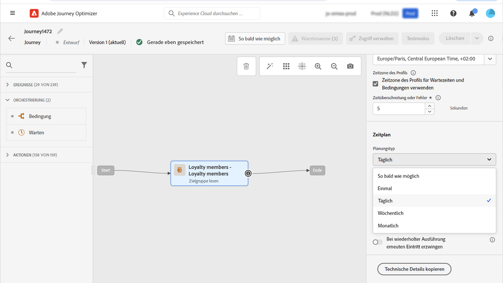
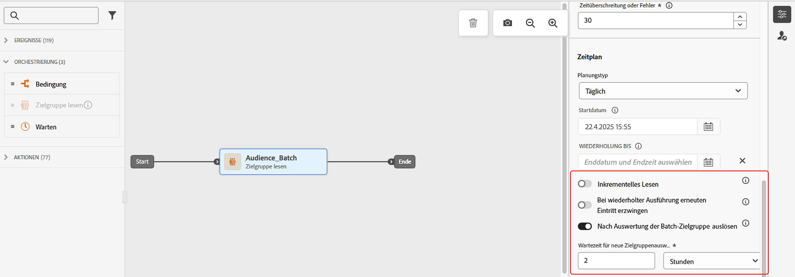
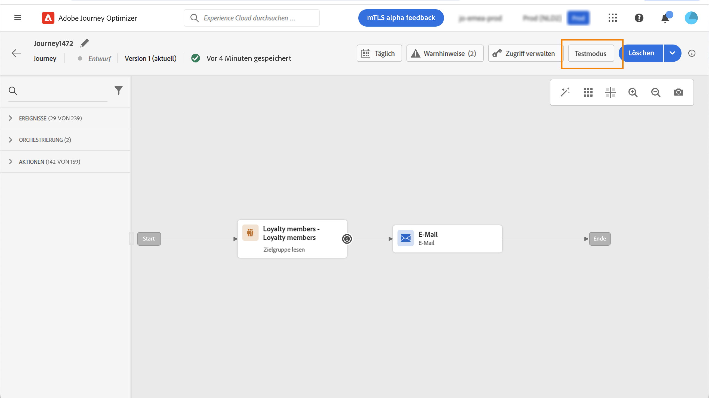
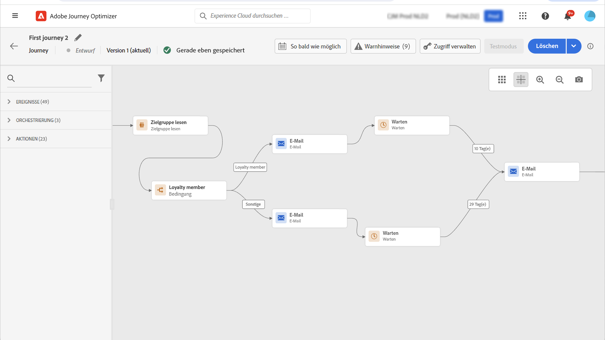

# Verwenden einer Zielgruppe in einer Journey {#segment-trigger-activity}

## Über die Aktivität „Zielgruppe lesen“ {#about-segment-trigger-actvitiy}

>[!CONTEXTUALHELP]
>id="ajo_journey_read_segment"
>title="Aktivität „Zielgruppe lesen“"
>abstract="Mit der Aktivität „Zielgruppe lesen“ können Sie alle Personen, die zu einer Adobe Experience Platform-Zielgruppe gehören, in eine Journey eintreten lassen. Der Eintritt in eine Journey kann entweder einmalig oder regelmäßig erfolgen."

Verwenden Sie die Aktivität **Zielgruppe lesen**, damit alle Personen einer Zielgruppe in die Journey eintreten. Der Eintritt in eine Journey kann entweder einmalig oder regelmäßig erfolgen.

Nehmen wir als Beispiel die Zielgruppe „Öffnen der Luma-App und Checkout“, die beim Anwendungsfall [Zielgruppen erstellen](../audience/about-audiences.md) erstellt wurde. Mit der Aktivität „Zielgruppe lesen“ können Sie alle Personen, die zu dieser Zielgruppe gehören, in eine Journey eintreten lassen und durch individuelle Journeys führen, die alle Journey-Funktionen nutzen: Bedingungen, Timer, Ereignisse, Aktionen.

➡️ [Funktion im Video kennenlernen](#video)

>[!NOTE]
>
>Wenn die Aktivität „Zielgruppe lesen“ ausgeführt wird, generiert das System interne Ereignisse (sogenannte `segmentExportJob`-Ereignisse), um den Lebenszyklus des Vorgangs des Zielgruppenexports zu verfolgen. Diese Ereignisse werden auf Aktivitätsebene und nicht pro einzelnem Profil aufgezeichnet und können zu Monitoring- und Fehlerbehebungszwecken abgefragt werden. Erfahren Sie mehr über das [Abfragen von Ereignissen des Typs „Zielgruppe lesen“](../reports/query-examples.md#read-segment-queries).

>[!CAUTION]
>
>* Bevor Sie mit der Verwendung der Aktivität des Typs „Zielgruppe lesen“ beginnen, [lesen Sie die Informationen zu Leitlinien und Einschränkungen](#must-read).

## Konfigurieren der Aktivität {#configuring-segment-trigger-activity}

Die Schritte zum Konfigurieren der Aktivität „Zielgruppe lesen“ werden im Folgenden beschrieben.

### Hinzufügen der Aktivität „Zielgruppe lesen“ und Auswählen der Zielgruppe

1. Erweitern Sie die Kategorie **[!UICONTROL Orchestrierung]** und legen Sie eine Aktivität vom Typ **[!UICONTROL Zielgruppe lesen]** auf Ihrer Arbeitsfläche ab.

   Die Aktivität muss als erster Schritt einer Journey positioniert werden.

1. Fügen Sie der Aktivität ein **[!UICONTROL Label]** hinzu (optional).

1. Wählen Sie im Feld **[!UICONTROL Zielgruppe]** die Adobe Experience Platform-Zielgruppe aus, die in die Journey eintreten soll, und klicken Sie dann auf **[!UICONTROL Speichern]**. Sie können eine beliebige Adobe Experience Platform-Zielgruppe auswählen, die mit [Segmentdefinitionen](../audience/creating-a-segment-definition.md) generiert wurde.

   >[!NOTE]
   >
   >Darüber hinaus können Sie auch Adobe Experience Platform-Zielgruppen ansprechen, die mit [Zielgruppenkompositionen](../audience/get-started-audience-orchestration.md) erstellt oder [aus einer CSV-Datei hochgeladen](https://experienceleague.adobe.com/docs/experience-platform/segmentation/ui/overview.html?lang=de#import-audience){target="_blank"} wurden.

   Beachten Sie, dass Sie die in der Liste angezeigten Spalten anpassen und sortieren können.

   

   Nachdem die Zielgruppe hinzugefügt wurde, können Sie mit der Schaltfläche **[!UICONTROL Kopieren]** deren Namen und ID kopieren:

   `{"name":"Luma app opening and checkout","id":"8597c5dc-70e3-4b05-8fb9-7e938f5c07a3"}`

   

   >[!NOTE]
   >
   >Nur Personen mit dem Zielgruppenzugehörigkeitsstatus **Realisiert** können in die Journey eintreten. Weitere Informationen zum Auswerten einer Zielgruppe finden Sie in der [Dokumentation zum Segmentierungs-Service](https://experienceleague.adobe.com/de/docs/experience-platform/segmentation/tutorials/evaluate-a-segment#interpret-segment-results){target="_blank"}.

1. Wählen Sie im Feld **[!UICONTROL Namespace]** den Namespace aus, der zur Identifizierung der Kontakte verwendet werden soll. Standardmäßig ist das Feld mit dem zuletzt verwendeten Namespace vorausgefüllt. [Weitere Informationen über Namespaces](../event/about-creating.md#select-the-namespace).

   >[!NOTE]
   >
   >Personen, die zu einer Zielgruppe ohne die ausgewählte Identität (den ausgewählten Namespace) gehören, können nicht in die Journey eintreten. Sie können nur einen personenbasierten Identity-Namespace auswählen. Wenn Sie einen Namespace für eine Suchtabelle definiert haben (z. B.: Produkt-ID-Namespace für eine Produktsuche), ist er nicht in der Dropdown-Liste **Namespace** verfügbar.

### Leitlinien und Empfehlungen {#must-read}

* In einer Journey kann nur eine Aktivität **[!UICONTROL Zielgruppe lesen]** verwendet werden. Dies muss die erste Aktivität auf der Arbeitsfläche sein.

* Die Aktivität **[!UICONTROL Zielgruppe lesen]** kann nur eine Zielgruppe ansprechen. Wenn mehrere Zielgruppen erforderlich sind, sollten Sie diese Zielgruppen vor der Verwendung zu einer Zielgruppe zusammenführen. [Informationen zum Kombinieren von Zielgruppen mithilfe von Kompositions-Workflows](../audience/get-started-audience-orchestration.md)

* Für Journeys, die eine Aktivität vom Typ **Zielgruppe lesen** verwenden, gibt es eine maximale Anzahl von Journeys, die genau zur gleichen Zeit beginnen können. Das System führt Wiederholungsversuche durch. Vermeiden Sie jedoch, dass mehr als fünf Journeys (mit **Zielgruppe lesen**, geplant oder „so bald wie möglich“ beginnend) genau zur gleichen Zeit starten. Es empfiehlt sich, sie über einen bestimmten Zeitraum zu verteilen, z. B. mit Abständen zwischen 5 und 10 Minuten.

* Erlebnisfeldgruppen können nicht in Journeys verwendet werden, die mit einer **Zielgruppe lesen**-Aktivität, einer **[Zielgruppenqualifizierung](audience-qualification-events.md)**-Aktivität oder einer Geschäftsereignis-Aktivität beginnen.

* Als Best Practice wird empfohlen, in einer Aktivität **Zielgruppe lesen** nur Batch-Zielgruppen zu verwenden. Dies ermöglicht eine zuverlässige und konsistente Zählung der in einer Journey verwendeten Zielgruppen. „Zielgruppe lesen“ wurde für Batch-Anwendungsfälle entwickelt. Wenn Ihr Anwendungsfall Echtzeitdaten benötigt, verwenden Sie bitte die Aktivität **[Zielgruppenqualifizierung](audience-qualification-events.md)**.

* Zielgruppen,[&#x200B; die aus einer CSV-Datei importiert wurden](https://experienceleague.adobe.com/docs/experience-platform/segmentation/ui/overview.html?lang=de#import-audience) oder aus [Kompositions-Workflows](../audience/get-started-audience-orchestration.md) stammen, können in der Aktivität **Zielgruppe lesen** ausgewählt werden. Diese Zielgruppen sind in der Aktivität **Zielgruppen-Qualifizierung** nicht verfügbar.

* Beschränkung der gleichzeitigen Ausführung des Typs „Zielgruppe lesen“ pro Organisation: Jede Organisation kann bis zu fünf Instanzen des Typs „Zielgruppe lesen“ gleichzeitig ausführen. Dies umfasst sowohl geplante Ausführungen als auch solche, die durch Geschäftsereignisse ausgelöst werden, und zwar über alle Sandboxes und Journeys hinweg. Diese Beschränkung wird durchgesetzt, um eine faire und ausgewogene Ressourcenzuordnung zwischen allen Organisationen zu gewährleisten.

* Sandbox-Durchsatzverwaltung: Das System verwaltet den Verarbeitungsdurchsatz pro Sandbox dynamisch, mit einer maximalen Begrenzung von 20.000 Profilen pro Sekunde, die zwischen allen Aktivitäten des Typs „Zielgruppe lesen“ geteilt werden. Einzelne Aktivitäten vom Typ „Zielgruppe lesen“ können mit einer Mindestrate von 500 Profilen pro Sekunde konfiguriert werden. Aufträge können in die Warteschlange gestellt werden, wenn Durchsatzbeschränkungen auf Sandbox-Ebene erreicht werden, um eine faire Ressourcenzuordnung zu gewährleisten.

* Maximale Wartezeit bei der Auftragsverarbeitung: Aufträge vom Typ „Zielgruppe lesen“, die aufgrund von Begrenzungen von Leitlinien nicht innerhalb von 12 Stunden verarbeitet werden können, werden automatisch bereinigt und nie ausgeführt. Dadurch wird eine Akkumulation von Aufträgen verhindert und die Systemstabilität gewährleistet.

* Stellen Sie bei der Verwendung von Batch-Segmenten sicher, dass Ihre Aufnahme und tägliche Snapshot-Updates lange vor dem Start der Journey abgeschlossen sind. Ziehen Sie eine zusätzliche Wartezeit in Betracht, wenn Segmente Daten widerspiegeln müssen, die am selben Tag aufgenommen wurden. Wenn sofortige Profilaktualisierung wichtig ist, sollten Sie einen ereignisbasierten oder Streaming-Anwendungsfall anstelle eines täglichen Batch-Ansatzes verwenden oder einen zusätzlichen Wartemechanismus einfügen, damit aktualisierte Daten vor der Journey-Auswertung propagiert werden können.

Leitlinien im Zusammenhang mit der Aktivität **Zielgruppe lesen** sind auf [dieser Seite](../start/guardrails.md#read-segment-g) aufgeführt.

>[!CAUTION]
>
>[Leitlinien für Echtzeit-Kundenprofildaten und Segmentierung](https://experienceleague.adobe.com/docs/experience-platform/profile/guardrails.html?lang=de){target="_blank"} gelten auch für Adobe Journey Optimizer.

### Verwalten der Profileinträge in der Journey

Legen Sie die **[!UICONTROL Leserate]** fest. Dies ist die maximale Anzahl von Profilen, die pro Sekunde in die Journey eintreten können. Diese Rate gilt nur für diese und keine andere Aktivitäten in der Journey. Wenn Sie beispielsweise eine Einschränkungsrate für benutzerdefinierte Aktionen definieren möchten, müssen Sie die Einschränkungs-API verwenden. Mehr dazu erfahren Sie auf [dieser Seite](../configuration/throttling.md).

Dieser Wert wird in der Payload der Journey-Version gespeichert. Der Standardwert ist 5.000 Profile pro Sekunde. Sie können diesen Wert zwischen 500 und 20.000 Profile pro Sekunde variieren.

>[!NOTE]
>
>Die Gesamtleserate pro Sandbox ist auf 20.000 Profile pro Sekunde festgelegt. Daher ergibt die Leserate aller gleichzeitig in derselben Sandbox ausgeführten Aktivitäten „Zielgruppe lesen“ maximal 20.000 Profile pro Sekunde. Sie können diese Begrenzung nicht ändern. Weitere Informationen zu Journey-Verarbeitungsraten und -Durchsatz finden Sie [&#x200B; (diesem Abschnitt](entry-management.md#journey-processing-rate).

### Planen der Journey {#schedule}

>[!CONTEXTUALHELP]
>id="ajo_journey_read_segment_scheduler_start_date"
>title="Startdatum/Uhrzeit"
>abstract="Legen Sie das Datum und die Uhrzeit zum Auslösen dieser Journey fest."

>[!CONTEXTUALHELP]
>id="ajo_journey_read_segment_scheduler_repeat_until"
>title="Wiederholen bis"
>abstract="Legen Sie das Enddatum der Wiederholung fest."

>[!CONTEXTUALHELP]
>id="ajo_journey_read_segment_scheduler_repeat_every"
>title="Wiederholen alle"
>abstract="Definieren Sie die Häufigkeit der wiederkehrenden Planung."

>[!CONTEXTUALHELP]
>id="ajo_journey_read_segment_scheduler_incremental_read"
>title="Inkrementelles Lesen"
>abstract="Nur neuen Profilen seit dem letzten Lesen erlauben, in die Journey einzutreten."

>[!CONTEXTUALHELP]
>id="ajo_journey_read_segment_scheduler_force_reentrance"
>title="Wiedereintritt erzwingen"
>abstract="Alle Journey-Teilnehmenden vor jedem Lesen der Zielgruppe entfernen."

>[!CONTEXTUALHELP]
>id="ajo_journey_read_segment_scheduler_synchronize_audience"
>title="Nach Auswertung der Batch-Zielgruppe auslösen"
>abstract="Aktivieren Sie diese Option, um die Journey-Ausführung nach einer erneuten Auswertung der Batch-Zielgruppe auszulösen."

>[!CONTEXTUALHELP]
>id="ajo_journey_read_segment_scheduler_synchronize_audience_wait_time"
>title="Wartezeit für neue Zielgruppenauswertung"
>abstract="Legen Sie fest, wie lange die Journey warten soll, bis die Batch-Zielgruppe neu ausgewertet wird. Die Wartezeit ist auf Ganzzahlwerte beschränkt, kann in Minuten oder Stunden angegeben werden und muss zwischen 1 und 6 Stunden liegen."

Standardmäßig sind Journeys so konfiguriert, dass sie nur einmal ausgeführt werden. Führen Sie die nachfolgenden Schritte aus, um ein bestimmtes Datum/eine bestimmte Uhrzeit und eine bestimmte Häufigkeit für die Journey-Ausführung zu definieren.

>[!NOTE]
>
>Einmalige „Zielgruppe lesen“-Journeys wechseln 91 Tage nach der Ausführung der Journey in den Status **Beendet** ([maximale globale Wartezeit der Journey](journey-properties.md#global_timeout)).  Folgt die Aktivität „Zielgruppe lesen“ einem Zeitplan, wird sie 91 Tage nach dem letzten Auftreten beendet.

1. Wählen Sie in den Eigenschaften der Aktivität **[!UICONTROL Zielgruppe lesen]** die Option **[!UICONTROL Journey-Plan bearbeiten]** aus.

   

1. Die Eigenschaften der Journey werden angezeigt. Wählen Sie in der Dropdown-Liste **[!UICONTROL Planungstyp]** die Häufigkeit aus, mit der die Journey ausgeführt werden soll.

   

Für wiederkehrende Journeys stehen spezifische Optionen zur Verfügung, mit denen Sie den Eintritt der Profile in die Journey verwalten können. Erweitern Sie die folgenden Abschnitte, um weitere Informationen zu den einzelnen Optionen zu erhalten.

+++**[!UICONTROL Inkrementelles Lesen]**

Wenn eine Journey mit einer wiederkehrenden Aktivität vom Typ **Zielgruppe lesen** zum ersten Mal ausgeführt wird, treten alle Profile in der Zielgruppe in die Journey ein.

Mit dieser Option haben Sie die Möglichkeit, nach dem ersten Auftreten nur die Personen anzusprechen, die seit der letzten Journey-Ausführung in die Zielgruppe eingetreten sind.

Wenn Sie auf eine [benutzerdefinierte Upload-Zielgruppe](../audience/about-audiences.md#about-segments) in Ihrer Journey abzielen, werden Profile nur bei der ersten Wiederholung abgerufen, wenn diese Option in einer wiederkehrenden Journey aktiviert ist, da diese Zielgruppen fixiert sind.

>[!CAUTION]
>
>Das inkrementelle Lesen beruht auf täglichen Profil-Momentaufnahmen, die durch den Batch-Segmentierungsprozess von Adobe Experience Platform erstellt werden. Wenn die geplante Journey-Ausführung stattfindet:
>
>* **Vor der Erstellung eines neuen Schnappschusses**: Profile, die sich nach dem letzten Schnappschuss, aber vor der Ausführung der Journey für die Zielgruppe qualifiziert haben, werden in diese Ausführung nicht einbezogen
>* **Mehr als 24 Stunden nach der letzten Ausführung** (ohne Verwendung der Option &quot;Trigger nach Batch-Zielgruppenauswertung„): Nur Profile aus dem letzten Schnappschuss innerhalb des 24-Stunden-Lookback-Fensters werden einbezogen. Profile, die sich zwischen der letzten Ausführung und 24 Stunden vor der aktuellen Ausführung qualifiziert haben, werden ausgeschlossen
>
>So minimieren Sie das Risiko, dass Profile fehlen:
>* Aktivieren Sie die Option **[!UICONTROL Trigger nach der Batch]** Zielgruppenauswertung, um den Lookback-Zeitraum auf den Zeitpunkt der letzten erfolgreichen Journey-Ausführung zu verlängern, unabhängig davon, wie lange er zurückliegt
>* Planen Sie die Ausführung der Journey nach Abschluss der täglichen Batch-Segmentierungsvorgänge (in der Regel 2-3 Std. Puffer)
>* Bei zeitkritischen Anwendungsfällen, die eine sofortige Profileinbindung erfordern, sollten Sie stattdessen Aktivitäten [Zielgruppen-](audience-qualification-events.md)) mit Streaming-Zielgruppen verwenden

+++

+++**[!UICONTROL Bei wiederholter Ausführung erneuten Eintritt erzwingen]**

Mit dieser Option können Sie alle noch in der Journey vorhandenen Profile bei der nächsten Ausführung automatisch austreten lassen. 

Wenn Sie beispielsweise eine Wartezeit von 2 Tagen in einer wiederkehrenden Journey haben, werden Profile immer zur nächsten Journey-Ausführung (also am darauffolgenden Tag) verschoben, unabhängig davon, ob sie sich in der Zielgruppe der nächsten Ausführung befinden oder nicht. 

Wenn die Lebensdauer Ihrer Profile in dieser Journey länger als die Häufigkeit der Wiederholungen sein kann, aktivieren Sie diese Option nicht. So stellen Sie sicher, dass die Profile ihre Journey abschließen können.

+++

+++**[!UICONTROL Nach Batch-Zielgruppenauswertung auslösen]**

Für täglich geplante Journeys und zum Targeting von Batch-Zielgruppen können Sie ein Zeitfenster von bis zu 6 Stunden definieren, damit die Journey auf neue Zielgruppendaten aus Batch-Segmentierungsaufträgen wartet. Wenn der Segmentierungsauftrag innerhalb des Zeitfensters abgeschlossen wird, wird die Journey ausgelöst. Andernfalls wird die Journey bis zum nächsten Auftreten übersprungen. Diese Option stellt sicher, dass Journeys mit genauen und aktuellen Zielgruppendaten ausgeführt werden.

Wenn beispielsweise eine Journey für täglich 18 Uhr geplant ist, können Sie angeben, wie viele Minuten oder Stunden gewartet werden soll, bevor die Journey ausgeführt wird. Wenn die Journey um 18 Uhr aktiv wird, sucht sie nach einer neuen Zielgruppe, d. h. nach einer Zielgruppe, die neuer ist als die aus der vorherigen Journey-Ausführung. Während des angegebenen Zeitfensters wird die Journey ausgeführt, sobald die neue Zielgruppe erkannt wird. Wenn jedoch keine neue Zielgruppe erkannt wird, wird die Journey-Ausführung für diesen Tag übersprungen.

**Lookback-Zeitraum für Journeys vom Typ „Inkrementelles Lesen“**

Wenn die Option **[!UICONTROL Nach Auswertung der Batch-Zielgruppe auslösen]** ausgewählt ist, sucht [!DNL Journey Optimizer] nach einer neuen Zielgruppenauswertung. Als Startpunkt für den Lookback-Zeitraum verwendet das System die Zeit der letzten erfolgreichen Journey-Ausführung, auch wenn diese mehr als 24 Stunden zurückliegt. Dies ist für Journeys vom Typ „Inkrementelles Lesen“ von Bedeutung, die in der Regel über einen 24-stündigen Lookback-Zeitraum verfügen.

Beispiele für tägliche Journeys vom Typ „Inkrementelles Lesen“:

* Bei aktivierter Option „Nach Auswertung der Batch-Zielgruppe auslösen“: Wenn seit dem Eintritt von inkrementellen Profilen in die Journey drei Tage vergangen sind, verlängert sich der Lookback-Zeitraum bei der Suche nach inkrementellen Profilen um drei Tage.
* Bei deaktivierter Option „Nach Auswertung der Batch-Zielgruppe auslösen“: Wenn seit dem Eintritt von inkrementellen Profile in die Journey drei Tage vergangen sind, reicht der Lookback-Zeitraum bei der Suche nach inkrementellen Profilen nur 24 Stunden zurück.

+++

<!--

### Segment filters {#segment-filters}

[!CONTEXTUALHELP]
>id="jo_segment_filters"
>title="About segment filters"
>abstract="You can choose to target only the individuals who entered or exited a specific segment during a specific time window. For example, you can decide to only retrieve all the customers who entered the VIP segment since last week."

You can choose to target only the individuals who entered or exited a specific segment during a specific time window. For example, you can decide to only retrieve all the customers who entered the VIP segment since last week. Only the new VIP customers will be targeted. All the customers who were already part of the VIP segment before will be excluded.

To activate this mode, click the **Segment Filters** toggle. Two fields are displayed:

**Segment membership**: choose whether you want to listen to segment entrances or exits. 

**Lookback window**: define when you want to start to listen to entrances or exits. This lookback window is expressed in hours, starting from the moment the journey is triggered.  If you set this duration to 0, the journey will target all members of the segment. For recurring journeys, it will take into account all entrances/exits since the last time the journey was triggered.

-->

## Testen und Veröffentlichen der Journey {#testing-publishing}

Mit der Aktivität **[!UICONTROL Zielgruppe lesen]** können Sie die Journey anhand eines einheitlichen Profils testen.

Dazu muss der Testmodus aktiviert werden.

Konfigurieren Sie den Testmodus und führen Sie ihn wie gewohnt aus. [Erfahren Sie, wie Sie eine Journey testen](testing-the-journey.md).

Sobald der Test ausgeführt wird, können mit der Schaltfläche **[!UICONTROL Protokolle anzeigen]** die Testergebnisse angezeigt werden. Weiterführende Informationen hierzu finden Sie in [diesem Abschnitt](testing-the-journey.md#viewing_logs)

Nach erfolgreichem Abschluss der Tests können Sie Ihre Journey veröffentlichen (siehe [Veröffentlichen der Journey](publish-journey.md)). Personen, die zur Zielgruppe gehören, treten zu dem Datum und der Uhrzeit in die Journey ein, die im Abschnitt **[!UICONTROL Planung]** der Journey-Eigenschaften festgelegt sind.

>[!NOTE]
>
>Bei zielgruppenbasierten wiederkehrenden Journeys wird die Journey automatisch nach dem letzten Auftreten geschlossen. Wenn kein Enddatum/-zeitpunkt angegeben wurde, müssen Sie die Journey manuell für neue Eintritte schließen, um sie zu beenden.

## Zielgruppenbestimmung bei zielgruppenbasierten Journeys

Zielgruppenbasierte Journeys beginnen immer mit der Aktivität **Zielgruppe lesen**, um Personen abzurufen, die einer Adobe Experience Platform-Zielgruppe angehören.

Die zugehörige Zielgruppe wird einmalig oder regelmäßig abgerufen.

Nach Eintritt in die Journey können Sie Anwendungsfälle für die Zielgruppen-Orchestrierung erstellen, sodass Personen aus der ersten Zielgruppe in verschiedene Zweige der Journey geleitet werden.

**Segmentierung**

Mithilfe der Aktivität **Bedingung** können Sie eine Segmentierung anhand von Bedingungen durchführen. Sie können beispielsweise VIP-Personen auf einen bestimmten Pfad führen und alle übrigen Personen auf einen anderen Pfad.

Die Segmentierung kann basieren auf:

* Daten aus Datenquellen
* Kontext von Ereignissen, die Teil der Journey-Daten sind – Beispiel: Hat eine Person auf die Nachricht geklickt, die sie vor einer Stunde erhalten hat?
* Datum – Beispiel: Sind wir im Juni, wenn eine Person durch die Journey navigiert?
* Tageszeit – Beispiel: Ist es in der Zeitzone der Person morgens?
* Algorithmus, der die in die Journey geführte Zielgruppe auf der Basis eines Prozentsatzes aufteilt – Beispiel: 90 %–10 % für den Ausschluss einer Kontrollgruppe

>[!NOTE]
>
>Bei Verwendung des Planungstyps „Täglich“ mit der Aktivität **[!UICONTROL Zielgruppe lesen]** können Sie ein Zeitfenster definieren, in dem die Journey auf neue Zielgruppendaten warten soll. Dadurch wird eine präzise Zielgruppenbestimmung sichergestellt. Außerdem werden Probleme durch Verzögerungen bei Batch-Segmentierungsaufträgen vermieden. [Informationen zum Planen einer Journey](#schedule)
>
>Die Option **[!UICONTROL Nach Auswertung der Batch-Zielgruppe auslösen]** ist nur für ausgewählte Organisationen verfügbar (eingeschränkte Verfügbarkeit). Um Zugriff zu erhalten, wenden Sie sich an den Adobe-Support.

**Ausschluss**

Die selbe Aktivität **Bedingung**, die für die Segmentierung verwendet wird (siehe oben), ermöglicht es Ihnen auch, einen Teil der Population auszuschließen. Sie können beispielsweise VIP-Personen ausschließen, indem Sie diese in einen Zweig mit direkt anschließendem Beenden-Schritt führen.

Dieser Ausschluss kann unmittelbar nach Zielgruppenabruf, zu Zwecken der Populationszählung oder als Teil einer mehrstufigen Journey erfolgen.

**Vereinigung**

Journeys erlauben das Erstellen von N Verzweigungen, die nach einer Segmentierung zusammengeführt werden. Daher können Sie zwei Zielgruppen zu einem gemeinsamen Erlebnis zurückkehren lassen.

Ein Beispiel: Im Anschluss an ein zehntägiges differenziertes Erlebnis in einer Journey können Kundinnen und Kunden mit und ohne VIP-Status zum selben Pfad zurückkehren. Nach einer Vereinigung können Sie die Zielgruppe erneut teilen, indem Sie eine Segmentierung oder einen Ausschluss durchführen.

## Fehlerbehebung bei Nichtübereinstimmungen der Zielgruppenanzahl {#audience-count-mismatch}

Wenn Sie Diskrepanzen zwischen der geschätzten Anzahl der Zielgruppen, den qualifizierten Profilen und den tatsächlichen Profilen feststellen, die in Ihren Journey eintreten, sollten Sie Folgendes beachten:

### Timing und Datenweitergabe

* **Abschluss des Batch-Segmentierungsauftrags**: Stellen Sie für Batch-Zielgruppen sicher, dass der tägliche Batch-Segmentierungsauftrag abgeschlossen ist und Momentaufnahmen aktualisiert werden, bevor die Journey ausgeführt wird. Batch-Zielgruppen sind etwa **2 Stunden** Abschluss des Segmentierungsauftrags einsatzbereit. Weitere Informationen zu [Methoden zur Zielgruppenauswertung](https://experienceleague.adobe.com/docs/experience-platform/segmentation/home.html#evaluate-segments){target="_blank"}.

* **Zeitpunkt der Datenaufnahme**: Stellen Sie sicher, dass die Profildatenaufnahme vor der Journey-Ausführung vollständig abgeschlossen wurde. Wenn Profile kurz vor dem Start der Journey aufgenommen wurden, werden sie möglicherweise noch nicht in der Zielgruppe angezeigt. Weitere Informationen zu [Datenaufnahme in Adobe Experience Platform](https://experienceleague.adobe.com/docs/experience-platform/ingestion/home.html?lang=de){target="_blank"}.

* **Option &quot;Trigger nach Batch-Zielgruppenauswertung“ verwenden**: Bei täglich geplanten Journey, die Batch-Zielgruppen verwenden, sollten Sie die Option **[!UICONTROL Trigger nach Batch-Zielgruppenauswertung]** aktivieren. Dadurch wird sichergestellt, dass die Journey vor der Ausführung auf neue Zielgruppendaten (bis zu 6 Stunden) wartet. [Weitere Informationen zur Planung](#schedule)

* **Warteaktivität hinzufügen**: Für Streaming-Zielgruppen mit kürzlich aufgenommenen Daten sollten Sie am Anfang der Journey eine **Warten**-Aktivität hinzufügen, um Zeit für die Datenweitergabe und Profilqualifizierung zu gewähren. [Weitere Informationen zur Warteaktivität](wait-activity.md)

### Datenvalidierung und -überwachung

* **Status des Segmentierungsauftrags überprüfen** Überwachen Sie die Fertigstellungszeiten des Batch-Segmentierungsauftrags im [Überwachungs-Dashboard](https://experienceleague.adobe.com/docs/experience-platform/dataflows/ui/monitor-segments.html){target="_blank"} von Adobe Experience Platform, um zu überprüfen, ob Zielgruppendaten bereit sind.

* **Zusammenführungsrichtlinien überprüfen**: Stellen Sie sicher, dass die für Ihre Zielgruppe konfigurierte Zusammenführungsrichtlinie dem erwarteten Verhalten entspricht, um Profildaten aus verschiedenen Quellen zu kombinieren. Weitere Informationen zu [Zusammenführungsrichtlinien in Adobe Experience Platform](https://experienceleague.adobe.com/docs/experience-platform/profile/merge-policies/overview.html){target="_blank"}.

* **Segmentdefinitionen überprüfen**: Überprüfen Sie, ob Segmentdefinitionen korrekt konfiguriert sind, und schließen Sie alle erwarteten Qualifikationskriterien ein. Weitere Informationen zum [&#x200B; von Zielgruppen &#x200B;](../audience/creating-a-segment-definition.md). Achten Sie besonders auf:
   * Zeitbasierte Bedingungen, die Profile basierend auf Ereignis-Zeitstempeln ausschließen können
   * Attributqualifikationen, die von kürzlich aktualisierten Daten abhängen
   * Streaming vs. Batch-Auswertungsmethoden

* **Validieren der Namespace-**: Stellen Sie sicher, dass der in der Aktivität **Zielgruppe lesen** ausgewählte Namespace mit der primären Identität übereinstimmt, die von Profilen in Ihrer Zielgruppe verwendet wird. Profile ohne den ausgewählten Namespace gelangen nicht auf die Journey. Erfahren Sie mehr über [Identity-Namespaces](../event/about-creating.md#select-the-namespace).

### Best Practices zur Vermeidung von Inkongruenzen

* **Journey nach der Segmentierung planen**: Planen Sie für Batch-Zielgruppen die Journey-Ausführung mindestens 2-3 Stunden nach der typischen Abschlusszeit des Batch-Segmentierungsauftrags. [Weitere Informationen zur Journey-Planung](#schedule)

* **Streaming-Zielgruppen für Echtzeit-Anwendungsfälle verwenden**: Wenn Sie eine sofortige Profilqualifizierung und einen Journey-Eintrag benötigen, verwenden Sie [Zielgruppen-](audience-qualification-events.md)-Aktivitäten mit Streaming-Zielgruppen anstelle von **Zielgruppe lesen** mit Batch-Zielgruppen.

* **Testen Sie zuerst mit kleineren Zielgruppen**: Bevor Sie große Journey starten, testen Sie sie mit einer kleineren Teilmenge, um zu überprüfen, ob die Zählungen den Erwartungen entsprechen. [Erfahren Sie, wie Sie eine Journey testen](testing-the-journey.md)

* **Regelmäßig überwachen**: Richten Sie eine regelmäßige Überwachung der Zielgruppengrößen und Journey-Eintragsmetriken ein, um Diskrepanzen frühzeitig zu erkennen. Erfahren Sie mehr über [Journey-Verarbeitungsraten und Eintragsverwaltung](entry-management.md).

Wenn nach Befolgung dieser Schritte weiterhin ein Zählungskonflikt besteht, wenden Sie sich mit Details zu Ihrer Audience, der Journey-Konfiguration und den festgestellten Diskrepanzen an den Adobe-Support.

## Weitere Zustellversuche {#read-audience-retry}

Beim Abrufen des Exportauftrags werden standardmäßig weitere Zustellversuche bei durch die Zielgruppe ausgelösten Journeys angewendet (beginnend mit der Aktivität **Zielgruppe lesen** oder einem **Geschäftsereignis**). Tritt bei der Erstellung des Exportauftrags ein Fehler auf, werden alle 10 Minuten, aber höchstens eine Stunde lang, weitere Versuche unternommen. Danach wird von einem Fehler ausgegangen. Diese Journey-Typen können daher bis zu einer Stunde nach der geplanten Zeit ausgeführt werden.

Nicht erfolgreiche **Zielgruppen lesen**-Trigger werden erfasst und in den **Warnhinweisen** angezeigt. Der **Warnhinweis „Zielgruppe lesen“** erscheint, wenn eine Aktivität **Zielgruppe lesen** 10 Minuten nach der festgelegten Ausführungszeit kein Profil bearbeitet hat. Dieser Fehler kann durch technische Probleme oder eine leere Zielgruppe verursacht werden. Wenn dieser Fehler auf technische Probleme zurückzuführen ist, sind je nach Problemtyp dennoch weitere Versuche möglich (wenn z. B. die Erstellung eines Exportauftrags fehlgeschlagen ist, erfolgt alle 10 Minuten, aber höchstens eine Stunde lang, ein erneuter Versuch). [Weitere Informationen](../reports/alerts.md#alert-read-audiences)

## Anleitungsvideo {#video}

Machen Sie sich mit den relevanten Anwendungsfällen für eine Journey vertraut, die durch die Aktivität „Zielgruppe lesen“ ausgelöst wird. Erfahren Sie, wie Sie Batch-basierte Journeys erstellen und welche Best Practices anzuwenden sind.

>[!VIDEO](https://video.tv.adobe.com/v/3424997?quality=12)
