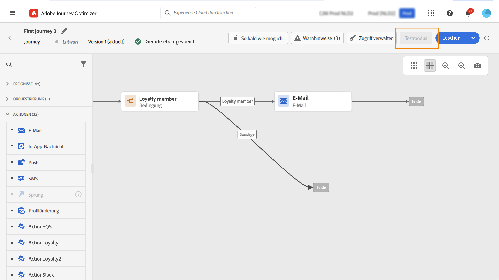

# Verwenden einer Zielgruppe in einer Journey {#segment-trigger-activity}

## Hinzufügen der Aktivität „Zielgruppe lesen“ {#about-segment-trigger-actvitiy}

>[!CONTEXTUALHELP]
>id="ajo_journey_read_segment"
>title="Aktivität „Zielgruppe lesen“"
>abstract="Mit der Aktivität „Zielgruppe lesen“ können Sie alle Personen, die zu einer Adobe Experience Platform-Zielgruppe gehören, in eine Journey eintreten lassen. Der Eintritt in eine Journey kann entweder einmalig oder regelmäßig erfolgen."

>[!CONTEXTUALHELP]
>id="ajo_journey_read_segment_scheduler_start_date"
>title="Startdatum/-zeit"
>abstract="Legen Sie das Datum und die Uhrzeit für den Trigger dieser Journey fest."

>[!CONTEXTUALHELP]
>id="ajo_journey_read_segment_scheduler_repeat_until"
>title="Wiederholen bis"
>abstract="Enddatum der Wiederholung definieren."

>[!CONTEXTUALHELP]
>id="ajo_journey_read_segment_scheduler_repeat_every"
>title="Wiederholen alle"
>abstract="Definieren Sie die Häufigkeit der wiederkehrenden Planung."

>[!CONTEXTUALHELP]
>id="ajo_journey_read_segment_scheduler_incremental_read"
>title="Inkrementelles Lesen"
>abstract="Nur neuen Profilen seit dem letzten Lesen erlauben, die Journey zu betreten."

>[!CONTEXTUALHELP]
>id="ajo_journey_read_segment_scheduler_force_reentrance"
>title="Wiedereintritt erzwingen"
>abstract="Alle Journey-Teilnehmer vor jedem Lesen der Zielgruppe ablegen."

>[!CONTEXTUALHELP]
>id="ajo_journey_read_segment_scheduler_synchronize_audience"
>title="Trigger nach der Batch-Zielgruppenbewertung"
>abstract="Schalten Sie diese Option ein, um die Journey-Ausführung nach einer erneuten Auswertung der Batch-Zielgruppe als Trigger auszuführen."

>[!CONTEXTUALHELP]
>id="ajo_journey_read_segment_scheduler_synchronize_audience_wait_time"
>title="Wartezeit für eine neue Zielgruppenbewertung"
>abstract="Geben Sie die Zeitdauer an, während der die Journey auf die frische Auswertung der Batch-Zielgruppe wartet."

Verwenden Sie die Aktivität **Zielgruppe lesen**, damit alle Personen einer Zielgruppe in die Journey eintreten. Der Eintritt in eine Journey kann entweder einmalig oder regelmäßig erfolgen.

Nehmen wir als Beispiel die Zielgruppe „Öffnen der Luma-App und Checkout“, die beim Anwendungsfall [Zielgruppen erstellen](../audience/about-audiences.md) erstellt wurde. Mit der Aktivität „Zielgruppe lesen“ können Sie alle Personen, die zu dieser Zielgruppe gehören, in eine Journey eintreten lassen und durch individuelle Journeys führen, die alle Journey-Funktionen nutzen: Bedingungen, Timer, Ereignisse, Aktionen.

➡️ [Entdecken Sie diese Funktion im Video](#video)

## Schutzmechanismen und Best Practices {#must-read}

* In einer Journey kann nur eine Aktivität **[!UICONTROL Zielgruppe lesen]** verwendet werden. Dies muss die erste Aktivität auf der Arbeitsfläche sein.

* Die Aktivität **[!UICONTROL Zielgruppe lesen]** kann nur eine Zielgruppe ansprechen. Wenn mehrere Zielgruppen erforderlich sind, sollten Sie diese Zielgruppen vor der Verwendung zu einer Zielgruppe zusammenführen. [Informationen zum Kombinieren von Zielgruppen mithilfe von Kompositions-Workflows](../audience/get-started-audience-orchestration.md)

* Für Journeys, die eine Aktivität vom Typ **Zielgruppe lesen** verwenden, gibt es eine maximale Anzahl von Journeys, die genau zur gleichen Zeit beginnen können. Das System führt Wiederholungsversuche durch. Vermeiden Sie jedoch, dass mehr als fünf Journeys (mit **Zielgruppe lesen**, geplant oder „so bald wie möglich“ beginnend) genau zur gleichen Zeit starten. Es empfiehlt sich, sie über einen bestimmten Zeitraum zu verteilen, z. B. mit Abständen zwischen 5 und 10 Minuten.

* Erlebnisfeldgruppen können nicht in Journeys verwendet werden, die mit einer **Zielgruppe lesen**-Aktivität, einer **[Zielgruppenqualifikation](audience-qualification-events.md)**-Aktivität oder einer Geschäftsereignis-Aktivität beginnen.

* Als Best Practice wird empfohlen, in einer Aktivität **Zielgruppe lesen** nur Batch-Zielgruppen zu verwenden. Dies ermöglicht eine zuverlässige und konsistente Zählung der in einer Journey verwendeten Zielgruppen. „Zielgruppe lesen“ wurde für Batch-Anwendungsfälle entwickelt. Wenn Ihr Anwendungsfall Echtzeitdaten benötigt, verwenden Sie bitte die Aktivität **[Zielgruppenqualifikation](audience-qualification-events.md)**.

* Zielgruppen,[ die aus einer CSV-Datei importiert wurden](https://experienceleague.adobe.com/docs/experience-platform/segmentation/ui/overview.html?lang=de#import-audience) oder aus [Kompositions-Workflows](../audience/get-started-audience-orchestration.md) stammen, können in der Aktivität **Zielgruppe lesen** ausgewählt werden. Diese Zielgruppen sind in der Aktivität **Zielgruppen-Qualifizierung** nicht verfügbar.

Schutzmechanismen im Zusammenhang mit der Aktivität **Zielgruppe lesen** sind auf [dieser Seite](../start/guardrails.md#read-segment-g) aufgeführt.

## Konfigurieren der Aktivität {#configuring-segment-trigger-activity}

So konfigurieren Sie die Aktivität „Zielgruppe lesen“:

1. Erweitern Sie die Kategorie **[!UICONTROL Orchestrierung]** und legen Sie eine Aktivität vom Typ **[!UICONTROL Zielgruppe lesen]** auf Ihrer Arbeitsfläche ab.

   Die Aktivität muss als erster Schritt einer Journey positioniert werden.

1. Fügen Sie der Aktivität einen **[!UICONTROL Titel]** hinzu (optional).

1. Wählen Sie im Feld **[!UICONTROL Zielgruppe]** die Adobe Experience Platform-Zielgruppe aus, die in die Journey eintreten soll, und klicken Sie dann auf **[!UICONTROL Speichern]**. Sie können eine beliebige Adobe Experience Platform-Zielgruppe auswählen, die mit [Segmentdefinitionen](../audience/creating-a-segment-definition.md) generiert wurde.

   >[!NOTE]
   >
   >Darüber hinaus können Sie auch Adobe Experience Platform-Zielgruppen auswählen, die mit [Zielgruppenkompositionen](../audience/get-started-audience-orchestration.md) oder [aus einer CSV-Datei hochgeladen) erstellt ](https://experienceleague.adobe.com/docs/experience-platform/segmentation/ui/overview.html?lang=de#import-audience){target="_blank"}.

   Beachten Sie, dass Sie die in der Liste angezeigten Spalten anpassen und sortieren können.

   

   Nachdem die Zielgruppe hinzugefügt wurde, können Sie mit der Schaltfläche **[!UICONTROL Kopieren]** deren Namen und ID kopieren:

   `{"name":"Luma app opening and checkout","id":"8597c5dc-70e3-4b05-8fb9-7e938f5c07a3"}`

   

   >[!NOTE]
   >
   >Nur Personen mit dem Zielgruppenzugehörigkeitsstatus **Realisiert** können in die Journey eintreten. Weitere Informationen zum Auswerten einer Zielgruppe finden Sie in der [Dokumentation zum Segmentierungs-Service](https://experienceleague.adobe.com/docs/experience-platform/segmentation/tutorials/evaluate-a-segment.html?lang=de#interpret-segment-results){target="_blank"}.

1. Wählen Sie im Feld **[!UICONTROL Namespace]** den Namespace aus, der zur Identifizierung der Kontakte verwendet werden soll. Standardmäßig ist das Feld mit dem zuletzt verwendeten Namespace vorausgefüllt. [Weitere Informationen über Namespaces](../event/about-creating.md#select-the-namespace).

   >[!NOTE]
   >
   >Personen, die zu einer Zielgruppe ohne die ausgewählte Identität (den ausgewählten Namespace) gehören, können nicht in die Journey eintreten. Sie können nur einen personenbasierten Identity-Namespace auswählen. Wenn Sie einen Namespace für eine Suchtabelle definiert haben (z. B.: Produkt-ID-Namespace für eine Produktsuche), ist er nicht in der Dropdown-Liste **Namespace** verfügbar.

1. Legen Sie die **[!UICONTROL Leserate]** fest. Dies ist die maximale Anzahl von Profilen, die pro Sekunde in die Journey eintreten können. Diese Rate gilt nur für diese und keine andere Aktivitäten in der Journey. Wenn Sie beispielsweise eine Einschränkungsrate für benutzerdefinierte Aktionen definieren möchten, müssen Sie die Einschränkungs-API verwenden. Mehr dazu erfahren Sie auf [dieser Seite](../configuration/throttling.md).

   Dieser Wert wird in der Payload der Journey-Version gespeichert. Der Standardwert ist 5.000 Profile pro Sekunde. Sie können diesen Wert zwischen 500 und 20.000 Profile pro Sekunde variieren.

   >[!NOTE]
   >
   >Die Gesamtleserate pro Sandbox ist auf 20.000 Profile pro Sekunde festgelegt. Daher ergibt die Leserate aller gleichzeitig in derselben Sandbox ausgeführten Aktivitäten „Zielgruppe lesen“ maximal 20.000 Profile pro Sekunde. Sie können diese Begrenzung nicht ändern.

1. Mit der Aktivität **[!UICONTROL Zielgruppe lesen]** können Sie den Zeitpunkt festlegen, zu dem die Zielgruppe in die Journey eintreten wird. Klicken Sie dazu auf den Link **[!UICONTROL Journey-Planung bearbeiten]**, um auf die Eigenschaften der Journey zuzugreifen, und konfigurieren Sie dann das Feld **[!UICONTROL Planungstyp]**.

   

   Standardmäßig treten Zielgruppen **[!UICONTROL so früh wie möglich]** in die Journey ein. Wenn die Zielgruppe zu einem bestimmten Datum/zu einer bestimmten Uhrzeit oder wiederholt in die Journey eintreten soll, wählen Sie den gewünschten Wert aus der Liste aus.

   >[!NOTE]
   >
   >Beachten Sie, dass der Bereich **[!UICONTROL Zeitplan]** nur verfügbar ist, wenn eine Aktivität vom Typ **[!UICONTROL Zielgruppe lesen]** auf der Arbeitsfläche abgelegt wurde.

   

   Option **Inkrementelles Lesen**: Wenn eine Journey mit einer wiederkehrenden Aktion vom Typ **Zielgruppe lesen** zum ersten Mal ausgeführt wird, treten alle Profile in der Zielgruppe in die Journey ein. Mit dieser Option haben Sie die Möglichkeit, nach dem ersten Auftreten nur die Personen anzusprechen, die seit der letzten Journey-Ausführung in die Zielgruppe eingetreten sind.

       >[!NOTE]
       >
       >Wenn Sie eine [benutzerdefinierte Upload-Zielgruppe](../audience/about-audiences.md#segments-in-journey-optimizer) in Ihrer Journey ansprechen, werden Profile nur bei der ersten Wiederholung abgerufen, falls diese Option in einer wiederkehrenden Journey aktiviert ist, da diese Zielgruppen fest sind.
   
   **Erneuten Eintritt bei Wiederholung erzwingen**: Mit dieser Option können Sie alle noch in der Journey vorhandenen Profile bei der nächsten Ausführung automatisch austreten lassen. Wenn Sie beispielsweise eine Wartezeit von 2 Tagen in dieser wiederkehrenden Journey haben, werden Profile immer auf die nächste Journey-Ausführung (also am darauffolgenden Tag) verschoben, unabhängig davon, ob sie sich in der Zielgruppe der nächsten Ausführung befinden oder nicht. Wenn die Lebensdauer Ihrer Profile in dieser Journey länger als die Häufigkeit der Wiederholungen sein kann, aktivieren Sie diese Option nicht. So stellen Sie sicher, dass die Profile ihre Journey abschließen können.

<!--

### Segment filters {#segment-filters}

[!CONTEXTUALHELP]
>id="jo_segment_filters"
>title="About segment filters"
>abstract="You can choose to target only the individuals who entered or exited a specific segment during a specific time window. For example, you can decide to only retrieve all the customers who entered the VIP segment since last week."

You can choose to target only the individuals who entered or exited a specific segment during a specific time window. For example, you can decide to only retrieve all the customers who entered the VIP segment since last week. Only the new VIP customers will be targeted. All the customers who were already part of the VIP segment before will be excluded.

To activate this mode, click the **Segment Filters** toggle. Two fields are displayed:

**Segment membership**: choose whether you want to listen to segment entrances or exits. 

**Lookback window**: define when you want to start to listen to entrances or exits. This lookback window is expressed in hours, starting from the moment the journey is triggered.  If you set this duration to 0, the journey will target all members of the segment. For recurring journeys, it will take into account all entrances/exits since the last time the journey was triggered.

-->

>[!NOTE]
>
>Einmalige „Zielgruppe lesen“-Journeys wechseln 91 Tage nach der Ausführung der Journey in den Status **Beendet** ([maximale globale Wartezeit der Journey](journey-properties.md#global_timeout)).  Folgt die Aktivität „Zielgruppe lesen“ einem Zeitplan, wird sie 91 Tage nach dem letzten Auftreten beendet.

## Testen und Veröffentlichen der Journey {#testing-publishing}

Mit der Aktivität **[!UICONTROL Zielgruppe lesen]** können Sie die Journey anhand eines einheitlichen Profils testen.

Dazu muss der Testmodus aktiviert werden.

Konfigurieren Sie den Testmodus und führen Sie ihn wie gewohnt aus. [Erfahren Sie, wie Sie eine Journey testen](testing-the-journey.md).

Sobald der Test ausgeführt wird, können mit der Schaltfläche **[!UICONTROL Protokolle anzeigen]** die Testergebnisse angezeigt werden. Weiterführende Informationen hierzu finden Sie in [diesem Abschnitt](testing-the-journey.md#viewing_logs)

Nach erfolgreichem Abschluss der Tests können Sie Ihre Journey veröffentlichen (siehe [Veröffentlichen der Journey](publishing-the-journey.md)). Personen, die zur Zielgruppe gehören, treten zu dem Datum und der Uhrzeit in die Journey ein, die im Abschnitt **[!UICONTROL Planung]** der Journey-Eigenschaften festgelegt sind.

>[!NOTE]
>
>Bei zielgruppenbasierten wiederkehrenden Journeys wird die Journey automatisch nach dem letzten Auftreten geschlossen. Wenn kein Enddatum/-zeitpunkt angegeben wurde, müssen Sie die Journey manuell für neue Eintritte schließen, um sie zu beenden.

## Zielgruppenbestimmung bei zielgruppenbasierten Journeys

Zielgruppenbasierte Journeys beginnen immer mit der Aktivität **Zielgruppe lesen**, um Personen abzurufen, die einer Adobe Experience Platform-Zielgruppe angehören.

Die zugehörige Zielgruppe wird einmalig oder regelmäßig abgerufen.

Nach Eintritt in die Journey können Sie Anwendungsfälle für die Zielgruppen-Orchestrierung erstellen, sodass Personen aus der ersten Zielgruppe in verschiedene Zweige der Journey geleitet werden.

**Segmentierung**

Mithilfe der Aktivität **Bedingung** können Sie eine Segmentierung anhand von Bedingungen durchführen. Sie können beispielsweise VIP-Personen auf einen bestimmten Pfad führen und alle übrigen Personen auf einen anderen Pfad.

Die Segmentierung kann basieren auf:

* Daten aus Datenquellen
* Kontext von Ereignissen, die Teil der Journey-Daten sind – Beispiel: Hat eine Person auf die Nachricht geklickt, die sie vor einer Stunde erhalten hat?
* Datum – Beispiel: Sind wir im Juni, wenn eine Person durch die Journey navigiert?
* Tageszeit – Beispiel: Ist es in der Zeitzone der Person morgens?
* Algorithmus, der die in die Journey geführte Zielgruppe auf der Basis eines Prozentsatzes aufteilt – Beispiel: 90 % - 10 % für den Ausschluss einer Kontrollgruppe

**Ausschluss**

Die selbe Aktivität **Bedingung**, die für die Segmentierung verwendet wird (siehe oben), ermöglicht es Ihnen auch, einen Teil der Population auszuschließen. Sie können beispielsweise VIP-Personen ausschließen, indem Sie diese in einen Zweig mit direkt anschließendem Beenden-Schritt führen.

Dieser Ausschluss kann unmittelbar nach Zielgruppenabruf, zu Zwecken der Populationszählung oder als Teil einer mehrstufigen Journey erfolgen.

**Vereinigung**

Journeys erlauben das Erstellen von n Zweigen, die nach einer Segmentierung zusammengeführt werden.

Daher können Sie zwei Zielgruppen zu einem gemeinsamen Erlebnis zurückkehren lassen.

Ein Beispiel: Im Anschluss an ein zehntägiges differenziertes Erlebnis in einer Journey können VIP- und Nicht-VIP-Kunden zum selben Pfad zurückkehren.

Nach einer Vereinigung können Sie die Zielgruppe erneut teilen, indem Sie eine Segmentierung oder einen Ausschluss durchführen.

## Weitere Zustellversuche {#read-audience-retry}

Beim Abrufen des Exportauftrags werden standardmäßig weitere Zustellversuche bei durch die Zielgruppe ausgelösten Journeys angewendet (beginnend mit der Aktivität **Zielgruppe lesen** oder einem **Geschäftsereignis**). Tritt bei der Erstellung des Exportauftrags ein Fehler auf, werden alle 10 Minuten, aber höchstens eine Stunde lang, weitere Versuche unternommen. Danach wird von einem Fehler ausgegangen. Diese Journey-Typen können daher bis zu einer Stunde nach der geplanten Zeit ausgeführt werden.

Nicht erfolgreiche **Zielgruppen lesen**-Trigger werden erfasst und in den **Warnhinweisen** angezeigt. Der **Warnhinweis „Zielgruppe lesen“** erscheint, wenn eine Aktivität **Zielgruppe lesen** 10 Minuten nach der festgelegten Ausführungszeit kein Profil bearbeitet hat. Dieser Fehler kann durch technische Probleme oder eine leere Zielgruppe verursacht werden. Wenn dieser Fehler auf technische Probleme zurückzuführen ist, sind je nach Problemtyp dennoch weitere Versuche möglich (wenn z. B. die Erstellung eines Exportauftrags fehlgeschlagen ist, erfolgt alle 10 Minuten, aber höchstens eine Stunde lang, ein erneuter Versuch). [Weitere Informationen](../reports/alerts.md#alert-read-audiences)

## Anleitungsvideo {#video}

Machen Sie sich mit den relevanten Anwendungsfällen für eine Journey vertraut, die durch die Aktivität „Zielgruppe lesen“ ausgelöst wird. Erfahren Sie, wie Sie Batch-basierte Journeys erstellen und welche Best Practices anzuwenden sind.

>[!VIDEO](https://video.tv.adobe.com/v/3424997?quality=12)
