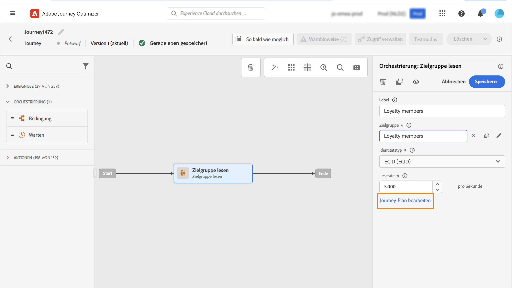

# Segment in einer Journey verwenden {#segment-trigger-activity}

## Hinzufügen der Aktivität „Segment lesen“ {#about-segment-trigger-actvitiy}

>[!CONTEXTUALHELP]
>id="ajo_journey_read_segment"
>title="Aktivität „Segment lesen“"
>abstract="Mit der Aktivität „Segment-Lesen“ können Sie alle Kontakte, die zu einem Adobe Experience Platform-Segment gehören, in eine Journey eintreten lassen. Der Eintritt in eine Journey kann entweder einmalig oder regelmäßig erfolgen."

Verwenden Sie die Aktivität **Segment lesen**, damit alle Personen eines Segments in die Journey eintreten. Der Eintritt in eine Journey kann entweder einmalig oder regelmäßig erfolgen.

Nehmen wir als Beispiel das Segment „Luma app open and checkout“, das beim Anwendungsfall [Segmente erstellen](../segment/about-segments.md) erstellt wurde. Mit der Aktivität „Segment lesen“ können Sie alle Kontakte, die zu diesem Segment gehören, in eine Journey eintreten lassen und durch individuelle Journeys führen, die alle Journey-Funktionen nutzen: Bedingungen, Timer, Ereignisse, Aktionen.

>[!NOTE]
>
>Bei Journeys, die die Aktivität „Segment lesen“ verwenden, gibt es eine maximale Anzahl von Journeys, die exakt zur gleichen Zeit beginnen können. Weitere Zustellversuche werden zwar vom System durchgeführt, Sie sollten jedoch vermeiden, dass mehr als fünf Journeys (mit „Segment lesen“, geplant oder „so bald wie möglich“) exakt gleichzeitig beginnen, indem Sie sie über einen bestimmten Zeitraum verteilen, z. B. mit 5 bis 10 Minuten Abstand.
>
>Feldergruppen für Erlebnisereignisse können nicht in Journeys verwendet werden, die mit einer Aktivität vom Typ „Segment lesen“, „Segmentqualifikation“ oder „Geschäftsereignis“ beginnen.

### Aktivität konfigurieren {#configuring-segment-trigger-activity}

Die Aktivität „Segment lesen“ wird wie folgt konfiguriert:

1. Erweitern Sie die Kategorie **[!UICONTROL Orchestrierung]** und legen Sie eine Aktivität vom Typ **[!UICONTROL Segment lesen]** auf Ihrer Arbeitsfläche ab.

   Die Aktivität muss als erster Schritt einer Journey positioniert werden.

1. Fügen Sie der Aktivität einen **[!UICONTROL Titel]** hinzu (optional).

1. Wählen Sie im Feld **[!UICONTROL Segment]** das Adobe Experience Platform-Segment aus, das in die Journey eintreten soll, und klicken Sie dann auf **[!UICONTROL Speichern]**.

   Beachten Sie, dass Sie die in der Liste angezeigten Spalten anpassen und sortieren können.

   >[!NOTE]
   >
   >Nur Einzelpersonen mit den Segmentteilnahmestatus **Realisiert** und **Vorhanden** können in die Journey eintreten. Weitere Informationen zum Auswerten eines Segments finden Sie in der [Dokumentation zum Segmentierungs-Service](https://experienceleague.adobe.com/docs/experience-platform/segmentation/tutorials/evaluate-a-segment.html?lang=de){target="_blank"}.

   

   Nachdem das Segment hinzugefügt wurde, können Sie mit der Schaltfläche **[!UICONTROL Kopieren]** dessen Namen und ID kopieren:

   `{"name":"Luma app opening and checkout",”id":"8597c5dc-70e3-4b05-8fb9-7e938f5c07a3"}`

   

1. Wählen Sie im Feld **[!UICONTROL Namespace]** den Namespace aus, der zur Identifizierung der Kontakte verwendet werden soll. Standardmäßig ist das Feld mit dem zuletzt verwendeten Namespace vorausgefüllt. [Weitere Informationen über Namespaces](../event/about-creating.md#select-the-namespace).

   >[!NOTE]
   >
   >Kontakte, die zu einem Segment gehören, das nicht die ausgewählte Identität (den ausgewählten Namespace) hat, können nicht in die Journey eintreten. Sie können nur einen personenbasierten Identity-Namespace auswählen. Wenn Sie einen Namespace für eine Suchtabelle definiert haben (z. B.: Produkt-ID-Namespace für eine Produkt-Suche), ist er nicht in der Dropdown-Liste **Namespace** verfügbar.

1. Definieren Sie im Feld **[!UICONTROL Einschränkungsrate]** das Durchsatz-Limit der Aktivität „Segment lesen“.

   Dieser Wert wird in der Payload der Journey-Version gespeichert. Der Standardwert ist 20.000 Nachrichten pro Sekunde. Sie können diesen Wert zwischen 500 und 20.000 Nachrichten pro Sekunde variieren.

   >[!NOTE]
   >
   >Die Gesamteinschränkungsrate pro Sandbox ist auf 20.000 Nachrichten pro Sekunde festgelegt. Daher ergibt die Einschränkungsrate aller gleichzeitig in derselben Sandbox ausgeführten Lesesegmente maximal 20.000 Nachrichten pro Sekunde. Sie können diese Begrenzung nicht ändern.

1. Mit der Aktivität **[!UICONTROL Segment lesen]** können Sie den Zeitpunkt festlegen, zu dem das Segment in die Journey eintreten wird. Klicken Sie dazu auf den Link **[!UICONTROL Journey-Planung bearbeiten]**, um auf die Eigenschaften der Journey zuzugreifen, und konfigurieren Sie dann das Feld **[!UICONTROL Planungstyp]**.

   

   Standardmäßig treten Segmente **[!UICONTROL so bald wie möglich]** in die Journey ein. Wenn das Segment zu einem bestimmten Datum/zu einer bestimmten Uhrzeit oder wiederholt in die Journey eintreten soll, wählen Sie den gewünschten Wert aus der Liste aus.

   >[!NOTE]
   >
   >Beachten Sie, dass der Bereich **[!UICONTROL Plan]** nur verfügbar ist, wenn eine **[!UICONTROL Segment lesen]**-Aktivität auf der Arbeitsfläche abgelegt wurde.

   

   Option **Inkrementelles Lesen**: Wenn eine Journey mit einem wiederkehrenden Schritt vom Typ **Segment lesen** zum ersten Mal ausgeführt wird, treten alle Profile im Segment in die Journey ein. Mit dieser Option haben Sie die Möglichkeit, nach dem ersten Auftreten nur die Einzelpersonen anzusprechen, die seit der letzten Journey-Ausführung in das Segment eingetreten sind.

   **Erneuten Eintritt bei Wiederholung erzwingen**: Mit dieser Option können Sie alle noch in der Journey vorhandenen Profile bei der nächsten Ausführung automatisch austreten lassen. Wenn Sie beispielsweise eine Wartezeit von 2 Tagen in dieser wiederkehrenden Journey haben, werden Profile immer auf die nächste Journey-Ausführung (also am darauffolgenden Tag) verschoben, unabhängig davon, ob sie sich in der Audience der nächsten Ausführung befinden oder nicht. Wenn die Lebensdauer Ihrer Profile in dieser Journey länger als die Häufigkeit der Wiederholungen sein kann, aktivieren Sie diese Option nicht. So stellen Sie sicher, dass die Profile ihre Journey abschließen können.

<!--

### Segment filters {#segment-filters}

[!CONTEXTUALHELP]
>id="jo_segment_filters"
>title="About segment filters"
>abstract="You can choose to target only the individuals who entered or exited a specific segment during a specific time window. For example, you can decide to only retrieve all the customers who entered the VIP segment since last week."

You can choose to target only the individuals who entered or exited a specific segment during a specific time window. For example, you can decide to only retrieve all the customers who entered the VIP segment since last week. Only the new VIP customers will be targeted. All the customers who were already part of the VIP segment before will be excluded.

To activate this mode, click the **Segment Filters** toggle. Two fields are displayed:

**Segment membership**: choose whether you want to listen to segment entrances or exits. 

**Lookback window**: define when you want to start to listen to entrances or exits. This lookback window is expressed in hours, starting from the moment the journey is triggered.  If you set this duration to 0, the journey will target all members of the segment. For recurring journeys, it will take into account all entrances/exits since the last time the journey was triggered.

-->

>[!NOTE]
>
>Einmalige Journeys mit dem Schritt „Segment lesen“ gehen 30 Tage nach der Ausführung der Journey in den Status „Beendet“ über. Folgt der Schritt „Segment lesen“ einem Zeitplan, wird er 30 Tage nach der letzten Ausführung beendet.

### Testen und Veröffentlichen der Journey {#testing-publishing}

Mit der Aktivität **[!UICONTROL Segment lesen]** können Sie die Journey entweder auf einem unitären Profil oder auf 100 Testprofilen testen, die per Zufallsauswahl aus den für das Segment qualifizierten Profilen entnommen werden.

Aktivieren Sie dazu den Testmodus und wählen Sie dann im linken Bereich die gewünschte Option aus.

Anschließend können Sie den Testmodus wie gewohnt konfigurieren und ausführen. [Erfahren Sie, wie Sie eine Journey testen](testing-the-journey.md).

Sobald der Test ausgeführt wird, können Sie mit der Schaltfläche Protokolle **[!UICONTROL anzeigen]** die Testergebnisse entsprechend der ausgewählten Testoption anzeigen:

* **[!UICONTROL Jeweils ein Einzelprofil]**: Die Testprotokolle zeigen dieselben Informationen an wie bei Verwendung des einheitlichen Testmodus. Weiterführende Informationen hierzu finden Sie in [diesem Abschnitt](testing-the-journey.md#viewing_logs)

* **[!UICONTROL Bis zu 100 Profile gleichzeitig]**: Mithilfe der Testprotokolle können Sie den Verlauf des Segmentexports aus Adobe Experience Platform sowie den individuellen Fortschritt aller Personen, die die Journey begonnen haben, verfolgen.

   Beachten Sie, dass beim Testen der Journey mit bis zu 100 Profilen auf einmal der Fortschritt der einzelnen in der Journey enthaltenen Kontakte nicht über den visuellen Verlauf nachverfolgt werden kann.

   

Nach erfolgreichem Abschluss der Tests können Sie Ihre Journey veröffentlichen (siehe [Veröffentlichen der Journey](publishing-the-journey.md)). Kontakte, die zum Segment gehören, treten an dem Datum/zu der Uhrzeit in die Journey ein, das bzw. die im Bereich **[!UICONTROL Planung]** der Eigenschaften der Journey festgelegt ist.

>[!NOTE]
>
>Bei segmentbasierten, wiederkehrenden Journeys wird die Journey automatisch nach der letztmaligen Ausführung geschlossen. Wenn kein Enddatum/keine Endzeit angegeben wurde, müssen Sie die Journey manuell für neue Eintritte schließen, um sie zu beenden.

## Zielgruppenbestimmung bei segmentbasierten Journeys

Segmentbasierte Journeys beginnen immer mit der Aktivität **Segment lesen**, um Personen abzurufen, die einem Adobe Experience Platform-Segment angehören.

Die Audience des Segments wird einmalig oder regelmäßig abgerufen.

Nach Eintritt in die Journey können Sie Anwendungsfälle für die Audience-Orchestrierung erstellen, sodass Einzelpersonen aus dem ersten Segment in verschiedene Zweige der Journey geleitet werden.

**Segmentierung**

Mithilfe der Aktivität **Bedingung** können Sie eine Segmentierung anhand von Bedingungen durchführen. Sie können beispielsweise VIP-Personen auf einen bestimmten Pfad führen und alle übrigen Personen auf einen anderen Pfad.

Die Segmentierung kann basieren auf:

* Daten aus Datenquellen
* Kontext von Ereignissen, die Teil der Journey-Daten sind – Beispiel: Hat eine Person auf die Nachricht geklickt, die sie vor einer Stunde erhalten hat?
* Datum – Beispiel: Sind wir im Juni, wenn eine Person durch die Journey navigiert?
* Tageszeit – Beispiel: Ist es morgens in der Zeitzone der Person?
* Algorithmus, der die in die Journey geführte Audience auf der Basis eines Prozentsatzes aufteilt – Beispiel: 90 % - 10 % für den Ausschluss einer Kontrollgruppe

**Ausschluss**

Die selbe Aktivität **Bedingung**, die für die Segmentierung verwendet wird (siehe oben), ermöglicht es Ihnen auch, einen Teil der Population auszuschließen. Sie können beispielsweise VIP-Personen ausschließen, indem Sie diese in einen Zweig mit direkt anschließendem Beenden-Schritt führen.

Dieser Ausschluss kann unmittelbar nach Segmentabruf, zu Zwecken der Populationszählung oder als Teil einer mehrstufigen Journey erfolgen.

**Vereinigung**

Journeys erlauben das Erstellen von n Zweigen, die nach einer Segmentierung zusammengeführt werden.

Daher können Sie zwei Audiences zu einem gemeinsamen Erlebnis zurückkehren lassen.

Ein Beispiel: Im Anschluss an ein zehntägiges differenziertes Erlebnis in einer Journey können VIP- und Nicht-VIP-Kunden zum selben Pfad zurückkehren.

Nach einer Vereinigung können Sie die Audience erneut teilen, indem Sie eine Segmentierung oder einen Ausschluss durchführen.

