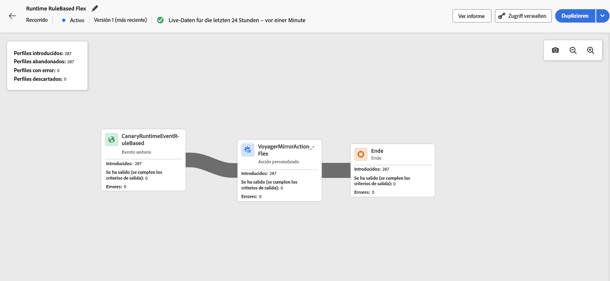

# Live-Bericht auf der Journey-Arbeitsfläche {#report-journey}

Nach der Veröffentlichung Ihrer Journey stellt **Live-Reporting** Metriken aus den letzten 24 Stunden direkt auf der Journey-Arbeitsfläche bereit, sobald der [Probelauf-Modus](journey-dry-run.md) aktiviert wird.

>[!AVAILABILITY]
>
>Wenn keine Daten in Ihrem Journey-Live-Bericht angezeigt werden, müssen Ihre Zugriffsberechtigungen um die Berechtigung **[!UICONTROL Journey-Bericht anzeigen]** erweitert werden. [Weitere Informationen](../administration/permissions.md)

Die angezeigten Ereignisse sind innerhalb der letzten 24 Stunden eingetreten, wobei zwischen dem Ereignis und seiner Anzeige mindestens zwei Minuten liegen, in der Regel aber fünf Minuten.

Für Journeys im Live- oder [Probelauf-Modus](journey-dry-run.md) können Sie Folgendes überprüfen:

* **[!UICONTROL Eingetretene Profile]**: Gesamtzahl der Kontakte, die in die Journey eingetreten sind.
* **[!UICONTROL Ausgetretene Profile]**: Gesamtzahl der Kontakte, die die Journey verlassen haben (einschließlich Fehlern).
* **[!UICONTROL Fehlerhafte Profile]**: Gesamtzahl der Kontakte, bei denen während ihrer Journey ein Fehler aufgetreten ist.
* **[!UICONTROL Verworfene Profile]**: Gesamtzahl der Kontakte, die aus einem der folgenden Gründe von der Journey verworfen wurden:

   * Bei Aktivitäten der **Zielgruppenqualifizierung** kann es zu einem Abbruch kommen, wenn das erwartete Verb für die Zielgruppenqualifizierung nicht mit dem übereinstimmt, was die Journey erhalten hat (z. B. „ausgetreten“ anstelle von „realisiert“).
   * Bei Journeys, die **durch ein Ereignis ausgelöst** werden, kann es zu einem Verwerfen kommen, wenn der Kontakt versucht hat, zu früh die Journey wieder zu betreten oder wenn ein Wiedereintritt nicht erlaubt war.
   * Bei **wiederkehrenden** Journeys wird bei jedem Intervall ein Verwerfen gezählt, wenn sich der Kontakt bereits in der Journey befindet und die Wiedereintrittsrichtlinie nicht auf „Wiedereintritt erzwingen“ eingestellt ist.
   * Bei Aktivitäten des Typs **Zielgruppe lesen** erfolgt ein Verwerfen, wenn für den exportierten Kontakt keine Identität festgelegt wurde oder wenn der empfangene Identity-Namespace nicht mit dem für die Journey erwarteten übereinstimmt.

Für jede Aktivität in jeder Journey im Live- oder [Probelauf-Modus](journey-dry-run.md) haben Sie Zugriff auf:

* **[!UICONTROL Eingetreten]**: Gesamtzahl der Kontakte, die in diese Aktivität eingetreten sind. Bei **Aktionsaktivitäten**, die im Probelauf nicht ausgeführt werden, gibt diese Metrik durchlaufende Profile an.
* **[!UICONTROL Ausgestiegen (Ausstiegskriterien erfüllt)]**: Gesamtzahl der Kontakte, die die Journey während dieser Aktivität aufgrund von Ausstiegskriterien (einschließlich Fehlern) verlassen haben.
* **[!UICONTROL Ausgestiegen (erzwungener Ausstieg)]**: Gesamtzahl der Kontakte, die die Journey verlassen haben, während sie aufgrund einer Konfiguration durch Anwendende pausiert war. Diese Metrik ist für Journeys im Probelaufmodus immer gleich null.
* **[!UICONTROL Fehler]**: Gesamtzahl der Kontakte, bei denen während dieser Aktivität ein Fehler aufgetreten ist.

## Fehlerbehebung bei fehlenden Berichtsdaten {#troubleshooting-missing-data}

Wenn in Ihren Journey-Berichten nicht die erwarteten Daten angezeigt werden, prüfen Sie Folgendes:

* **Synchronisierung des Journey-Namens**: Stellen Sie sicher, dass der Journey-Name in Adobe Journey Optimizer mit dem im Berichtsdatensatz gespeicherten Namen übereinstimmt. Wenn diese Namen nicht übereinstimmen, kann dies zu nicht korrekten Berichtsdaten führen.

* **Zeitpunkt der Datenaktualisierung**: Warten Sie nach dem Aktualisieren eines Journey-Namens oder einer Konfiguration so lange, bis die Daten aktualisiert wurden. Berichtsdaten werden in der Regel innerhalb weniger Minuten angezeigt, dies kann aber in einigen Fällen auch länger dauern.

* **Zugriffsberechtigungen**: Stellen Sie sicher, dass Sie über die erforderlichen Berechtigungen zum Anzeigen von Journey-Berichten verfügen. Wenn keine Daten angezeigt werden, wenden Sie sich an Ihre bzw. Ihren Admin, um zu überprüfen, ob die Berechtigung **[!UICONTROL Journey-Berichte anzeigen]** aktiviert ist. [Weitere Informationen zu Berechtigungen](../administration/permissions.md)

* **Journey-Status**: Berichtsdaten sind nur für veröffentlichte Journeys oder Journeys im [Probelauf-Modus](journey-dry-run.md) verfügbar. Journeys im Entwurfsmodus generieren keine Berichtsdaten.

Wenn nach der Überprüfung dieser Punkte weiterhin Probleme auftreten, wenden Sie sich an Ihre bzw. Ihren Adobe-Admin oder an den Adobe-Support.

>[!MORELIKETHIS]
>
>* [Erste Schritte mit Reporting](../reports/gs-reports.md)
>* [Veröffentlichen einer Journey](publish-journey.md)
>* [Journey-Probelauf](journey-dry-run.md)
>* [Konfigurieren und Verfolgen der Journey-Metriken](success-metrics.md)
>* [Benutzerdefinierte Journey-Berichte](../reports/sharing-overview.md)
