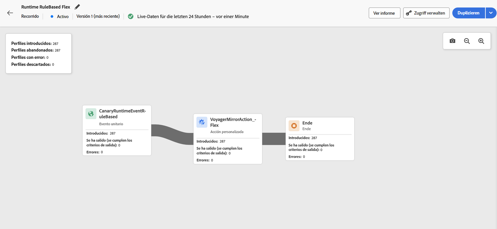

# Live-Bericht auf der Journey-Arbeitsfläche {#report-journey}

>[!BEGINSHADEBOX]

**Auf dieser Seite:** Erfahren Sie, wie Sie mit Live Reporting wichtige Journey-Metriken der letzten 24 Stunden direkt auf der Journey-Arbeitsfläche überwachen können.

>[!ENDSHADEBOX]

Nach der Veröffentlichung Ihrer Journey stellt **Live-Reporting** Metriken aus den letzten 24 Stunden direkt auf der Journey-Arbeitsfläche bereit, sobald der [Probelauf-Modus](journey-dry-run.md) aktiviert wird.

>[!AVAILABILITY]
>
>Wenn keine Daten in Ihrem Journey-Live-Bericht angezeigt werden, müssen Ihre Zugriffsberechtigungen um die Berechtigung **[!UICONTROL Journey-Bericht anzeigen]** erweitert werden. [Weitere Informationen](../administration/permissions.md)

Die angezeigten Ereignisse sind innerhalb der letzten 24 Stunden eingetreten, wobei zwischen dem Ereignis und seiner Anzeige mindestens zwei Minuten liegen, in der Regel aber fünf Minuten.

Für Journeys im Live- oder [Probelauf-Modus](journey-dry-run.md) können Sie Folgendes überprüfen:

* **[!UICONTROL Eingetretene Profile]**: Gesamtzahl der Kontakte, die in die Journey eingetreten sind.
* **[!UICONTROL Ausgetretene Profile]**: Gesamtzahl der Kontakte, die die Journey verlassen haben (einschließlich Fehlern).
* **[!UICONTROL Fehlerhafte Profile]**: Gesamtzahl der Kontakte, bei denen während ihrer Journey ein Fehler aufgetreten ist.
* **[!UICONTROL Verworfene Profile]**: Gesamtzahl der Kontakte, die aus einem der folgenden Gründe von der Journey verworfen wurden:

   * Bei Aktivitäten der **Zielgruppenqualifizierung** kann es zu einem Abbruch kommen, wenn das erwartete Verb für die Zielgruppenqualifizierung nicht mit dem übereinstimmt, was die Journey erhalten hat (z. B. „ausgetreten“ anstelle von „realisiert“).
   * Bei Journeys, die **durch ein Ereignis ausgelöst** werden, kann es zu einem Verwerfen kommen, wenn der Kontakt versucht hat, zu früh die Journey wieder zu betreten oder wenn ein Wiedereintritt nicht erlaubt war.
   * Bei **wiederkehrenden** Journeys wird bei jedem Intervall ein Verwerfen gezählt, wenn sich der Kontakt bereits in der Journey befindet und die Wiedereintrittsrichtlinie nicht auf „Wiedereintritt erzwingen“ eingestellt ist.
   * Bei Aktivitäten des Typs **Zielgruppe lesen** erfolgt ein Verwerfen, wenn für den exportierten Kontakt keine Identität festgelegt wurde oder wenn der empfangene Identity-Namespace nicht mit dem für die Journey erwarteten übereinstimmt.

Für jede Aktivität in jeder Journey im Live- oder [Probelauf-Modus](journey-dry-run.md) haben Sie Zugriff auf:

* **[!UICONTROL Eingetreten]**: Gesamtzahl der Kontakte, die in diese Aktivität eingetreten sind. Bei **Aktionsaktivitäten**, die im Probelauf nicht ausgeführt werden, gibt diese Metrik durchlaufende Profile an.
* **[!UICONTROL Ausgestiegen (Ausstiegskriterien erfüllt)]**: Gesamtzahl der Kontakte, die die Journey während dieser Aktivität aufgrund von Ausstiegskriterien (einschließlich Fehlern) verlassen haben.
* **[!UICONTROL Ausgestiegen (erzwungener Ausstieg)]**: Gesamtzahl der Kontakte, die die Journey verlassen haben, während sie aufgrund einer Konfiguration durch Anwendende pausiert war. Diese Metrik ist für Journeys im Probelaufmodus immer gleich null.
* **[!UICONTROL Fehler]**: Gesamtzahl der Kontakte, bei denen während dieser Aktivität ein Fehler aufgetreten ist.

## Fehlerbehebung bei fehlenden Berichtsdaten {#troubleshooting-missing-data}

Wenn in Ihren Journey-Berichten nicht die erwarteten Daten angezeigt werden, prüfen Sie Folgendes:

* **Synchronisierung des Journey-Namens**: Stellen Sie sicher, dass der Journey-Name in [!DNL Adobe Journey Optimizer] mit dem im Berichtsdatensatz gespeicherten Namen übereinstimmt. Wenn diese Namen nicht übereinstimmen, kann dies zu nicht korrekten Berichtsdaten führen.

* **Zeitpunkt der Datenaktualisierung**: Warten Sie nach dem Aktualisieren eines Journey-Namens oder einer Konfiguration so lange, bis die Daten aktualisiert wurden. Berichtsdaten werden in der Regel innerhalb weniger Minuten angezeigt, dies kann aber in einigen Fällen auch länger dauern.

* **Zugriffsberechtigungen**: Stellen Sie sicher, dass Sie über die erforderlichen Berechtigungen zum Anzeigen von Journey-Berichten verfügen. Wenn keine Daten angezeigt werden, wenden Sie sich an Ihre bzw. Ihren Admin, um zu überprüfen, ob die Berechtigung **[!UICONTROL Journey-Berichte anzeigen]** aktiviert ist. [Weitere Informationen zu Berechtigungen](../administration/permissions.md)

* **Journey-Status**: Berichtsdaten sind nur für veröffentlichte Journeys oder Journeys im [Probelauf-Modus](journey-dry-run.md) verfügbar. Journeys im Entwurfsmodus generieren keine Berichtsdaten.

Wenn nach der Überprüfung dieser Elemente weiterhin Probleme auftreten, wenden Sie sich an Ihren Adobe-Administrator oder an den [Adobe](../start/user-interface.md#support-ticket-guidelines)Support.

>[!MORELIKETHIS]
>
>* [Erste Schritte mit Reporting](../reports/gs-reports.md)
>* [Veröffentlichen einer Journey](publish-journey.md)
>* [Journey-Probelauf](journey-dry-run.md)
>* [Konfigurieren und Verfolgen der Journey-Metriken](success-metrics.md)
>* [Benutzerdefinierte Journey-Berichte](../reports/sharing-overview.md)

+++ KI-Wissensreferenz

Dieser Abschnitt enthält strukturiertes Wissen zur Unterstützung von Interpretation, Abrufen und Antworten auf Fragen zu diesem Thema.

Zum vollständigen Verständnis sollten diese Informationen mit der Dokumentation auf dieser Seite kombiniert werden. Keine der beiden Quellen ist für Einzelpersonen gedacht. Die Seite beschreibt die Funktion, während dieser Abschnitt zusätzlichen Kontext bietet, der dabei hilft, Begriffe, Absichten, Anwendbarkeit und Begrenzungen zu unterscheiden.

* **TL;DR:** Auf dieser Seite wird erläutert, wie der in die Journey-Arbeitsfläche eingebettete Live-Bericht angezeigt und interpretiert wird. Dabei werden die wichtigsten Profilflussmetriken behandelt, die für veröffentlichte Journey und Journey im Dry-Run-Modus verfügbar sind.

**intents:**
* Anzeigen von Echtzeit-Journey-Leistungsmetriken direkt auf der Journey-Arbeitsfläche
* Interpretieren der Anzahl der eingegebenen, beendeten, fehlgeschlagenen und verworfenen Profile für die Journey und jede Aktivität
* Verstehen, warum Profile von einer Journey verworfen werden
* Fehlerbehebung bei fehlenden oder unerwarteten Daten beim Journey von Live-Berichten
* Überprüfen der erforderlichen Berechtigung für den Zugriff auf Journey-Live-Berichte

**Glossar:**
* **Live-Reporting**: Echtzeit-Metriken, die direkt auf der Journey-Arbeitsfläche angezeigt werden und die letzten 24 Stunden abdecken *(produktspezifisch)*
* **Probelauf-Modus**: Ein Journey-Ausführungsmodus, der das Journey simuliert, ohne echte Nachrichten zu senden, in dem auch Live-Berichte verfügbar sind *(produktspezifisch)*
* **Verworfene Profile**: Profile, die versucht haben, auf die Journey zuzugreifen, aber aufgrund von Qualifizierungskonflikten, Wiedereintrittsbeschränkungen oder Identitätsproblemen abgelehnt wurden *(produktspezifisch)*
* **Ausgestiegen (erzwungenes Beenden)**: Profile, die vom Journey entfernt wurden, während er von einem Journey-Anwender angehalten wurde; immer Null im Dry-Run-Modus *(produktspezifisch)*

**Leitplanken:**
* Live-Berichtsdaten decken nur die letzten 24 Stunden ab.
* Ereignisse werden im Abstand von mindestens zwei Minuten, in der Regel innerhalb von fünf Minuten, angezeigt.
* Die Berechtigung Journey-Bericht anzeigen ist erforderlich, um Live-Berichtsdaten anzuzeigen.
* Berichtsdaten sind nur für veröffentlichte Journey oder Journey im Probelauf-Modus verfügbar; Journey mit Entwurf generieren keine Daten.
* Für Aktionsaktivitäten zeigt die eingegebene Metrik Profile an, die im Probelauf-Modus durchlaufen (nicht ausgeführt) werden.
* Die Metrik „Beendet“ (forcierter Austritt) ist im Probelauf-Modus immer null.

**Terminologie:**
* Kanonischer Name: Live-Bericht (Journey-Arbeitsfläche) — Akronym: none — Varianten: Journey Live-Bericht, In-Arbeitsfläche-Reporting
* Synonyme: „Eingetretene Profile“ = „Profile, die die Journey betreten haben“
* Verwechseln Sie nicht: „Live-Bericht“ ≠ „Globaler Journey-Bericht“ (der Live-Bericht umfasst die letzten 24 Stunden auf der Arbeitsfläche; der globale Bericht deckt einen größeren historischen Zeitraum in der Reporting-Benutzeroberfläche ab)

**FAQ:**
* **F: Wie aktuell sind die im Live-Bericht angezeigten Daten?** — Ereignisse aus den letzten 24 Stunden werden mit einer Mindestanzeigeverzögerung von zwei Minuten, in der Regel innerhalb von fünf Minuten, angezeigt.
* **F: Warum kann ich keine Daten in meinem Journey-Live-Bericht sehen?** — Vergewissern Sie sich, dass Sie über die Berechtigung Journey-Bericht anzeigen verfügen, dass die Journey veröffentlicht ist (nicht im Entwurf) und dass der Journey-Name mit dem Namen im Berichtsdatensatz übereinstimmt.
* **F: Was führt dazu, dass Profile verworfen werden?** — Verwerfungen können auftreten, weil Verbenübereinstimmungen in der Zielgruppen-Qualifizierung nicht übereinstimmen, Richtlinienverletzungen bei wiederkehrenden oder ereignisgesteuerten Journey bei erneuten Eintritten verletzt werden oder weil bei Aktivitäten des Typs Zielgruppe lesen ein Identity-Namespace fehlt/nicht übereinstimmt.
* **F: Ist der Live-Bericht im Dry-Run-Modus verfügbar?** — Ja. Live-Berichte sind sowohl für veröffentlichte Live-Journey als auch für Journey im Dry-Run-Modus verfügbar.
* **F: Was bedeutet die eingegebene Metrik für Aktionsaktivitäten im Probelauf-Modus?** — Es zeigt Profile an, die die Aktivität durchlaufen, da Aktionen im Probelauf-Modus nicht tatsächlich ausgeführt werden.

+++
