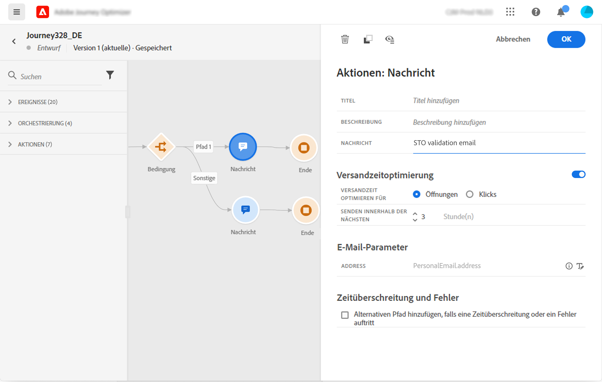

# Optimierung des Versandzeitpunkts{#send-time-optimization}

>[!CONTEXTUALHELP]
>id="jo_bestsendtime_disabled"
>title="Über die Optimierung des Versandzeitpunkts"
>abstract="Die Funktion zur Optimierung des Versandzeitpunkts von Adobe Journey Optimizer basiert auf den KI-Services von Adobe. Sie kann basierend auf vergangenen Öffnungs- und Klickraten die beste Versandzeit für E-Mails oder Push-Benachrichtigungen vorhersagen, um die Interaktion zu maximieren."

Die Funktion zur Optimierung des Versandzeitpunkts von Adobe Journey Optimizer basiert auf den KI-Services von Adobe. Sie kann basierend auf vergangenen Öffnungs- und Klickraten die beste Versandzeit für E-Mails oder Push-Benachrichtigungen vorhersagen, um die Interaktion zu maximieren. Verwenden Sie unser Modell für maschinelles Lernen, um personalisierte Versandzeitpunkte für jeden Benutzer zu planen, um die Öffnungs- und Klickraten Ihrer Nachrichten zu erhöhen.

Das Modell „Optimierung des Versandzeitpunkts“ nimmt Ihre Adobe Journey Optimizer-Daten auf, betrachtet die Öffnungsraten (für E-Mail und Push-Benachrichtigungen) und Klicks (für E-Mails) auf Benutzerebene, um zu bestimmen, wann Ihre Kunden mit der größten Wahrscheinlichkeit mit Ihrer Nachricht interagieren. Für fundierte Empfehlungen erfordert die Optimierung des Versandzeitpunkts mindestens einen Monat an Tracking-Daten zu Nachrichten. Mithilfe der folgenden Punktwerte wählt das System für jeden Benutzer automatisch die beste Zeit aus:

* Die beste Stunde jedes Wochentags zur Maximierung der Interaktion
* Der beste Wochentag zur Maximierung der Interaktion
* Die beste Stunde des besten Wochentags zur Maximierung der Interaktion

Das Modell variiert je nachdem, ob es sich um Scoring oder Training handelt. Das Training wird zu Beginn wöchentlich und später vierteljährlich durchgeführt. Das Scoring erfolgt zu Beginn wöchentlich und später monatlich.

* Training – die Entwicklung des Algorithmus für die Ermittlung des Punktwerts
* Scoring – die Anwendung eines Punktwerts auf einzelne Profile, basierend auf dem trainierten Modell

Diese Informationen werden beim Benutzerprofil gespeichert und bei der Ausführung der Journey referenziert, um Adobe Journey Optimizer mitzuteilen, wann Ihre Nachricht gesendet werden soll.

>[!CAUTION]
>
>Diese Funktion ist nicht mit dem Burst-Modus kompatibel.

## Aktivieren der Optimierung des Versandzeitpunkts{#activate-send-time-optimization}

>[!CONTEXTUALHELP]
>id="jo_bestsendtime_email"
>title="Aktivieren der Optimierung des Versandzeitpunkts"
>abstract="Wählen Sie mithilfe des entsprechenden Radiobuttons aus, ob E-Mail-Öffnungen oder E-Mail-Click-Throughs optimiert werden sollen. Sie können die vom System verwendeten Versandzeitpunkte auch zusammenfassen, indem Sie einen Wert für die Option „Senden innerhalb der nächsten“ eingeben."

>[!CONTEXTUALHELP]
>id="jo_bestsendtime_push"
>title="Aktivieren der Optimierung des Versandzeitpunkts"
>abstract="Bei Push-Benachrichtigungen wird standardmäßig die Option „Öffnungen“ verwendet, da Klicks für Push-Benachrichtigungen zutreffen. Sie können die vom System verwendeten Versandzeitpunkte auch zusammenfassen, indem Sie einen Wert für die Option „Senden innerhalb der nächsten“ eingeben."

Aktivieren Sie die Versandzeitpunktoptimierung für eine E-Mail oder Push-Benachrichtigung, indem Sie den Umschalter **Versandzeitpunktoptimierung** aus den Parametern der Aktivität auswählen.

Wählen Sie für E-Mail-Nachrichten durch Auswahl des entsprechenden Radiobuttons aus, ob die E-Mail-Öffnungen oder die E-Mail-Click-Throughs optimiert werden sollen. Bei Push-Benachrichtigungen wird standardmäßig die Option „Öffnungen“ verwendet, da Klicks für Push-Benachrichtigungen zutreffen.

Sie können die vom System verwendeten Versandzeitpunkte auch zusammenfassen, indem Sie einen Wert für die Option **Senden innerhalb der nächsten** eingeben. Wenn Sie als Wert „sechs Stunden“ wählen, prüft [!DNL Journey Optimizer] jedes Benutzerprofil und wählt den optimalen Versandzeitpunkt innerhalb von sechs Stunden ab der Journey-Ausführungszeit aus.
