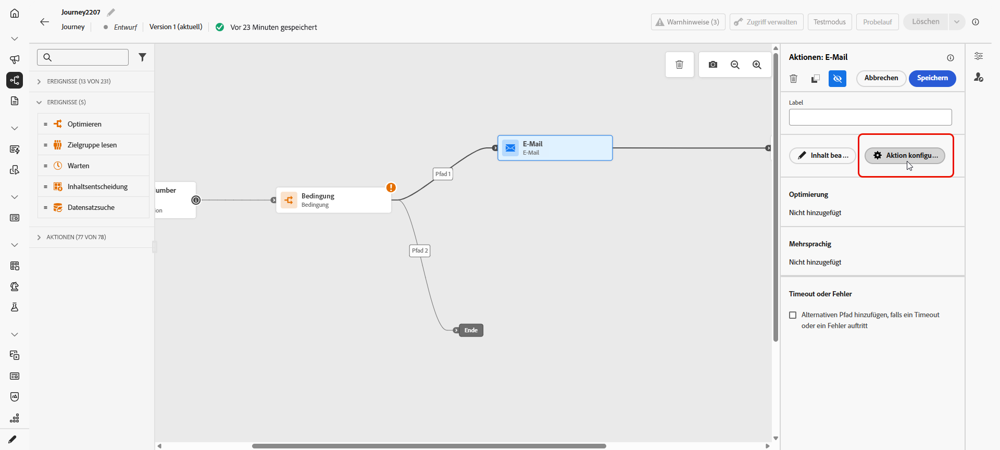
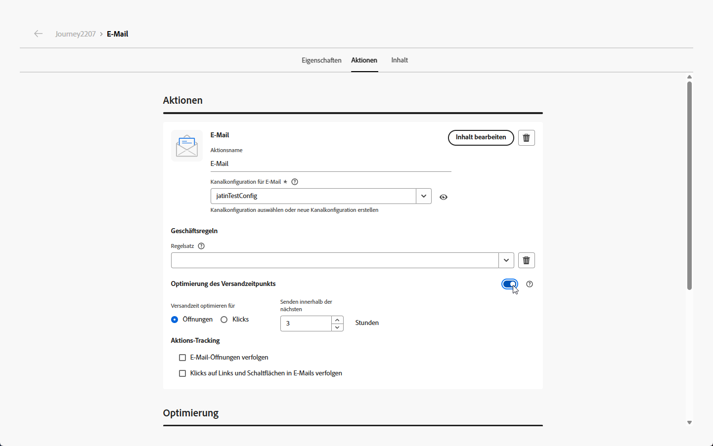
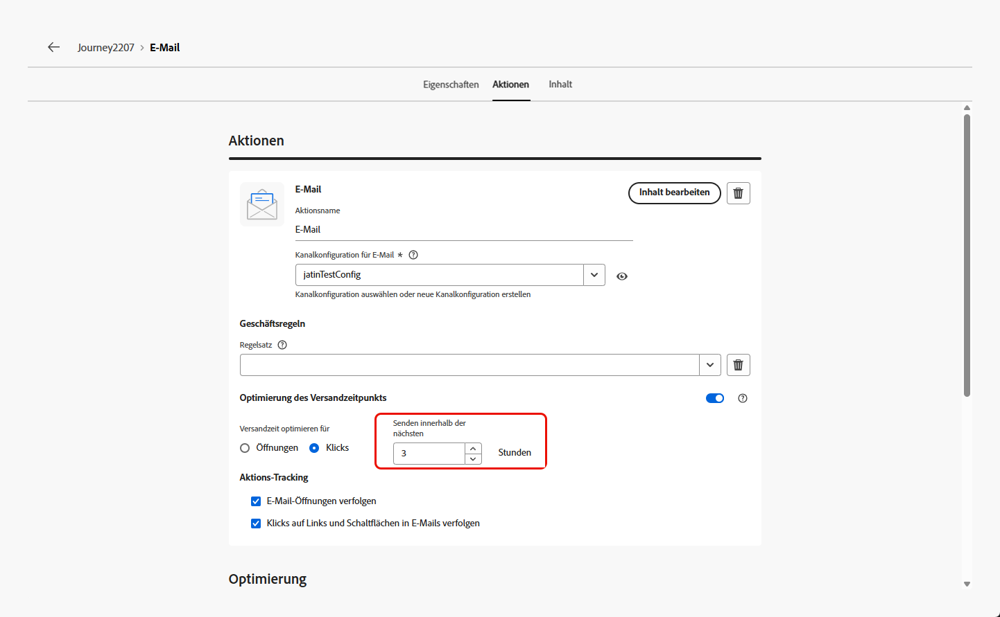
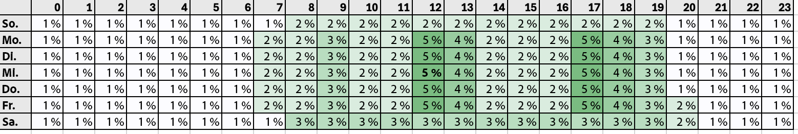
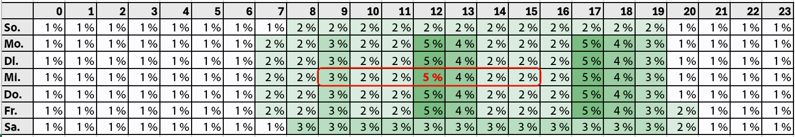

# Versandzeitoptimierung{#send-time-optimization}

>[!BEGINSHADEBOX]

**Auf dieser Seite:** Erfahren Sie, wie Sie die Sendezeitoptimierung aktivieren, damit die KI von Adobe den besten Zeitpunkt für den Versand von E-Mail- und Push-Nachrichten basierend auf dem historischen Öffnungs- und Klickverhalten jedes Kunden vorhersagt.

>[!ENDSHADEBOX]

>[!CONTEXTUALHELP]
>id="jo_bestsendtime_disabled"
>title="Über die Optimierung des Versandzeitpunkts"
>abstract="Die Funktion „Versandzeitoptimierung“ in [!DNL Adobe Journey Optimizer] basiert auf den KI-Diensten von Adobe und kann anhand der historischen Öffnungs- und Klickraten den besten Zeitpunkt für den Versand einer E-Mail oder Push-Nachricht vorhersagen, um die Interaktion zu maximieren."

>[!CONTEXTUALHELP]
>id="jo_bestsendtime_email"
>title="Aktivieren der Optimierung des Versandzeitpunkts"
>abstract="Ein Optionsfeld bestimmt, ob die Optimierung auf das Öffnen von E-Mails oder auf E-Mail-Clickthroughs ausgerichtet sein soll. Die vom System verwendeten Sendezeiten können zudem über die Option „Senden innerhalb der nächsten“ in einen Zeitrahmen eingeordnet werden."

>[!CONTEXTUALHELP]
>id="jo_bestsendtime_push"
>title="Aktivieren der Optimierung des Versandzeitpunkts"
>abstract="Bei Push-Benachrichtigungen wird standardmäßig die Option „Öffnungen“ verwendet, da Klicks für Push-Benachrichtigungen zutreffen. Die vom System verwendeten Sendezeiten können zudem über die Option „Senden innerhalb der nächsten“ in einen Zeitrahmen eingeordnet werden."

Die Funktion zur Optimierung des Versandzeitpunkts von [!DNL Adobe Journey Optimizer] basiert auf den Journey-KI-Services von Adobe und wählt basierend auf dem bisherigen Öffnungs- und Klickverhalten Ihrer Kunden den optimalen Versandzeitpunkt für E-Mail- und Push-Nachrichten aus, um die Kundeninteraktion zu maximieren.

Die Optimierung des Versandzeitpunkts ist nur für die integrierten Aktionstypen „E-Mail“ und „Push“ von Journey Optimizer verfügbar. Für Nachrichten, die über benutzerdefinierte Aktionen gesendet werden, oder für andere Aktionstypen ist sie derzeit nicht verfügbar. Die Optimierung des Versandzeitpunkts ist nur für die Aktionen „E-Mail“ und „Push“ in Journey Optimizer verfügbar. Für Nachrichten, die durch Kampagnen gesendet werden, ist sie derzeit nicht verfügbar.

>[!AVAILABILITY]
>
>* Die Sendezeitoptimierungsfunktion ist für [!DNL Adobe Journey Optimizer] Kunden auf Anfrage aktiviert. Wenden Sie sich an die Kundenunterstützung von Adobe oder den Adobe-Support, um diese Funktion für Ihre Organisation zu erhalten.
>
>* Die Funktion zur Optimierung der Versandzeit gilt nur für die Kanäle **E-Mail** und **Push-Benachrichtigung**.
>

## Verwenden der Sendezeitoptimierung{#use-send-time-optimization}

Gehen Sie wie folgt vor, um die Sendezeitoptimierung für eine E-Mail- oder Push-Aktion zu aktivieren und zu konfigurieren.

Bevor Sie beginnen, überlegen Sie, welche Nachrichten gut passen, bevor Sie sie aktivieren. Die Sendezeitoptimierung sollte nicht für dringende, zeitkritische Betriebsnachrichten verwendet werden, z. B. eine Bestellbestätigung, eine Benachrichtigung zum Zurücksetzen des Kennworts oder eine Benachrichtigung über eine Änderung des Fluggatters. Dies eignet sich am besten für weniger dringende Marketing-Nachrichten, z. B. für wöchentliche Anzeigen, Werbeinformationen zu einem neuen Produkt oder Informationen zu einem monatlichen Verkauf.

1. Öffnen Sie auf Ihrem Journey das Menü **[!UICONTROL Aktion konfigurieren]**.

   

1. Schalten Sie im Menü **[!UICONTROL Versandzeitoptimierung]** die Option „Sendezeitoptimierung“ ein.

   

1. Wählen Sie für E-Mail-Nachrichten durch Auswahl der entsprechenden Option aus, ob für Öffnungen oder Clickthroughs optimiert werden soll. Push-Benachrichtigungen werden immer in Bezug auf Öffnungen optimiert.

   Um optimale Ergebnisse zu erzielen, optimieren Sie die meisten E-Mails für **Klicks**. Wählen Sie **Öffnungen**, wenn die Nachricht informativ ist und nicht dazu dient, eine bestimmte Aktion zu steuern.

1. Legen Sie sowohl für E-Mail- als auch **[!UICONTROL -Nachrichten „Senden innerhalb der nächsten]**&quot; die maximale Anzahl von Stunden (1-168) fest, die das System vor dem Senden der Nachricht wartet.

   Um die besten Ergebnisse zu erzielen, wählen Sie einen Wert zwischen 6 und 24 Stunden. Ein niedrigerer Wert reduziert die Anzahl der verfügbaren Sendezeiten und kann die Vorteile der Sendezeitoptimierung einschränken. Ein höherer Wert kann bedeuten, dass die Nachricht zum Zeitpunkt des Versands veraltet oder weniger relevant ist.

   

1. Wählen Sie für E-Mail-Nachrichten aus, wie das Aktions-Tracking konfiguriert werden soll. Sie können E-Mail-Öffnungen und Klicks auf Links und Schaltflächen in der E-Mail verfolgen.

Wenn Ihre Journey aktiviert ist und eine Kundin bzw. ein Kunde die E-Mail- oder Push-Aktion in der Journey erreicht, wählt die Optimierung des Versandzeitpunkts die prognostizierte beste Sendezeit aus, die für jede Person innerhalb Ihrer festgelegten Limits verfügbar ist.

Informationen zur Überwachung der Leistung der Journey finden Sie auf der [Übersichtsseite](../reports/channel-report-cja.md).

## Funktionsweise der Sendezeitoptimierung {#how-send-time}

Das Modell „Optimierung des Versandzeitpunkts“ nimmt die [!DNL Adobe Journey Optimizer] Kundenverhaltensdaten Ihres Unternehmens auf und betrachtet Öffnungs- und Klickereignisse auf Benutzerebene, um zu bestimmen, wann Ihre Kunden mit der größten Wahrscheinlichkeit mit Ihrer Nachricht interagieren.

Die Optimierung des Versandzeitpunkts trifft für jede Wochenstunde Prognosen für jede Person basierend auf drei Typen von Verhaltensdaten:

1. Das Verhalten der Benutzenden insgesamt
1. Das Verhalten von Look-alike-Benutzenden in derselben Zeitzone
1. Das Verhalten dieser individuellen Person

Diese Prognosen werden gewichtet und mithilfe eines Bayes&#39;schen Ansatzes kombiniert, was zu einer „Heatmap“ für jede Metrik (E-Mail-Öffnungen, E-Mail-Klicks und Push-Öffnungen) für jede Person führt, die die Stunden der Woche angibt, an denen die Kontaktaufnahme mit dieser Person am wahrscheinlichsten und am wenigsten zum gewünschten Interaktionsergebnis (Öffnen/Klicken) führt, wie im folgenden Heatmap-Beispiel dargestellt:

Wenn eine Person mit der oben prognostizierten Wahrscheinlichkeit für eine Nachricht um 9 Uhr am Mittwoch mit aktivierter Optimierung des Versandzeitpunkts und einer maximalen Wartezeit von 7 Stunden ausgewählt wird, ist die ausgewählte Sendezeit für die Nachricht 12 Uhr:

## Details zum Training und zur Auswertung des Modells „Optimierung des Versandzeitpunkts“  {#model-send-time}

Sobald die Funktion zur Optimierung des Versandzeitpunkts für Ihre Organisation aktiviert ist, wird das Journey-KI-Modell mit den E-Mail- und Push-Versand- sowie den Öffnungs- und Klickereignissen in allen Journeys und Aktionen Ihres Unternehmens der letzten 16 Wochen trainiert – unabhängig davon, ob bei diesen Aktionen die Optimierung des Versandzeitpunkts verwendet wird. Dadurch kann die Optimierung des Versandzeitpunkts von allen Daten profitieren, die durch Ihre Kundschaft generiert wurden.

Die Modelle werden zunächst wöchentlich trainiert und ausgewertet. Nach 16 Wochen werden die Modelle dann monatlich neu trainiert und ausgewertet. Die Modellauswertung umfasst alle Kundenprofile – sowohl vorhandene als auch neue seit der letzten Auswertung.

Nachrichten, die von der Optimierung des Versandzeitpunkts gesendet wurden, erhalten entweder eine Versandzeit zum „Ausprobieren“, die zum Testen verschiedener Sendezeiten ausgewählt wurde, um zu beobachten, wie Kundinnen und Kunden reagieren, oder eine optimierte Versandzeit, die zum Maximieren der Klick-/Öffnungsraten ausgewählt wurde. 5 % der Versandereignisse erhalten eine Versandzeit zum „Ausprobieren“ und 95 % der Versandereignisse sind „optimiert“.

Die Versandzeiten zum Ausprobieren werden zufällig aus den Versandzeiten ausgewählt, die durch die konfigurierte maximale Wartezeit zur Verfügung gestellt werden. Wenn eine Nachricht beispielsweise um 9 Uhr am Mittwoch mit aktivierter Optimierung des Versandzeitpunkts und einer maximalen Wartezeit von 3 Stunden ausgewählt wird, werden die Versandzeiten zum Ausprobieren für die Nachricht gleichmäßig zwischen 9 Uhr, 10 Uhr, 11 Uhr und 12 Uhr aufgeteilt.

## Häufig gestellte Fragen {#faq-send-time}

Im Folgenden finden Sie häufig gestellte Fragen zur Versandzeitoptimierung.

Sie würden gerne mehr erfahren? Verwenden Sie die Feedback-Optionen unten auf dieser Seite, um Ihre Frage zu stellen oder eine Verbindung mit [[!DNL Adobe Journey Optimizer] Community](https://experienceleaguecommunities.adobe.com/t5/adobe-journey-optimizer/ct-p/journey-optimizer?profile.language=de){target="_blank"} herzustellen.

+++Wie lange muss ich warten, bevor ich die Versandzeitoptimierung verwenden kann?

Ihre Organisation sollte vor Nutzung der Versandzeitoptimierung in E-Mails die E-Mail-Aktion in Journey Optimizer mindestens 30 Tage lang verwenden, um die Erfassung mehrerer E-Mail-bezogener Versand-, Öffnungs- und Klickereignisse zu ermöglichen.

Ihre Organisation sollte vor Nutzung der Versandzeitoptimierung in Push die Push-Aktion in Journey Optimizer mindestens 30 Tage lang verwenden, um die Erfassung mehrerer Push-Sende- und -Öffnungsereignisse zu ermöglichen.

Wenn Ihre Organisation bereits seit mindestens 30 Tagen die Aktionstypen „E-Mail“ und/oder „Push“ verwendet, muss sie nicht länger warten, um die Sendezeitoptimierung zu verwenden, nachdem sie durch Adobe aktiviert wurde. Die Ergebnisse werden sich weiter verbessern, wenn Ihre Organisation Daten für bis zu 16 Wochen erfasst.

+++

+++Wie kann ich den Versandzeitpunkt sehen, zu dem eine bestimmte Person eine Nachricht erhält?

Um die Auswirkungen des Modells auf den Profilumfang zu minimieren, werden Modellbewertungen in drei in `_experience.intelligentServices.journeyAI.sendTimeOptimization` gespeicherten Profilattributen komprimiert gespeichert und sind nicht darauf ausgelegt, für Menschen lesbar zu sein.

+++

+++Wie groß ist der durchschnittliche Vorteil der Versandzeitoptimierung?

Die Versandzeitoptimierung kann die E-Mail-Klickrate und die Push-Öffnungsrate in allen von einem Unternehmen optimierten Nachrichten in einem Bereich von etwa 2 % bis hin zu 10 % erhöhen.

Wenn beispielsweise eine Organisation, die E-Mails ohne Versandzeitoptimierung sendet, eine durchschnittliche Klickrate von 5,0 % aufweist, kann derselbe Satz von E-Mails mit Versandzeitoptimierung zu einer durchschnittlichen Klickrate von 5,5 % führen (5,0 % * (1 + 10 %) = 5,5 %).

Aufgrund von Variabilität innerhalb kleiner Stichprobengrößen lässt sich ein Vorteil der Versandzeitoptimierung bei einzelnen Nachrichtensendungen möglicherweise nicht feststellen.

Organisationen profitieren in den folgenden Fällen mit höherer Wahrscheinlichkeit von den Vorteilen der Versandzeitoptimierung:

* Bei bestehenden Journeys werden feste und nicht gut optimierte Versandzeitpunkte verwendet.
* Das variable Kundenverhalten (Klicks und Öffnungen) entspricht dem Kundenstandort und den Kundenpräferenzen.
* Organisationen verwenden die Versandzeitoptimierung für einen größeren Teil der E-Mail- und Push-Nachrichten.
* Organisationen wählen die maximalen Wartezeiten innerhalb des empfohlenen Bereichs von 6 bis 12 Stunden aus.

+++

+++Ich klicke immer um 12 Uhr auf E-Mails oder Push-Nachrichten. Warum hat mir der Algorithmus dann nicht um 12 Uhr eine Nachricht geschickt?

Dies kann verschiedene Ursachen haben:

* Für Ihre Nachricht wurde eine Nachrichtenversandzeit zum „Ausprobieren“ anstelle einer optimierten Nachrichtenversandzeit ausgewählt.
* Das Verhalten von Look-alike-Benutzenden hat das Modell dazu gebracht, eine andere Versandzeit zu empfehlen.

+++

+++Wie erkennt die Versandzeitoptimierung die Zeitzone einer Person?

Die Versandzeitoptimierung verwendet das Profilfeld `timeZone`, um die Zeitzone einer Person zu bestimmen. Sofern für diese Person nicht verfügbar, versucht die Versandzeitoptimierung, die Zeitzone eine Person aus anderen geografischen Informationen im Profil der Person, z. B. Land und Bundesland, abzuleiten.

+++

+++Versendet die Versandzeitoptimierung nachts Push-Nachrichten an Benutzende in ihrer lokalen Zeitzone?

Die Versandzeitoptimierung kann unter folgenden Umständen nachts Push-Nachrichten an Benutzende in ihrer lokalen Zeitzone senden:

* wenn Benutzende ein Verhalten zeigen, das darauf hindeutet, dass sie wahrscheinlich mit einer nachts gesendeten Nachricht interagieren
* wenn das Modell einen Versandzeitpunkt zur Untersuchung auswählt

Um zu vermeiden, dass Push-Nachrichten nachts an Kundschaft gesendet werden, planen Sie den Versand von Batch-Push-Nachrichten für morgens oder den frühen Nachmittag und wählen Sie eine kürzere Dauer für die Versandzeitoptimierung aus (z. B. 9 Uhr als Versandzeit und eine maximale Wartezeit von 8 Stunden).

+++

+++ KI-Wissensreferenz

Dieser Abschnitt enthält strukturiertes Wissen zur Unterstützung von Interpretation, Abrufen und Antworten auf Fragen zu diesem Thema.

Zum vollständigen Verständnis sollten diese Informationen mit der Dokumentation auf dieser Seite kombiniert werden. Keine der beiden Quellen ist für Einzelpersonen gedacht. Die Seite beschreibt die Funktion, während dieser Abschnitt zusätzlichen Kontext bietet, der dabei hilft, Begriffe, Absichten, Anwendbarkeit und Begrenzungen zu unterscheiden.

* **TL;DR:** Auf dieser Seite wird erläutert, wie die Sendezeitoptimierung in Adobe Journey Optimizer konfiguriert und verwendet wird. Hierbei handelt es sich um eine KI-gestützte Funktion, die die beste Sendezeit für E-Mails oder Push-Benachrichtigungen an jeden Kontakt vorhersagt, um die Interaktion zu maximieren.

**intents:**
* Aktivieren der Sendezeitoptimierung für eine E-Mail- oder Push-Aktion auf einer Journey
* Auswählen, ob für Öffnungen oder Clickthroughs in E-Mail-Nachrichten optimiert werden soll
* Maximales Wartefenster für verzögerten Versand festlegen (Senden innerhalb der nächsten Sekunde)
* Erfahren Sie, wie das KI-Modell mithilfe von Verhaltensdaten optimale Versandzeitpunkte vorhersagt
* Ermitteln, ob die Sendezeitoptimierung für einen bestimmten Nachrichtentyp geeignet ist

**Glossar:**
* **Sendezeitoptimierung (STO)** Eine KI-gestützte Funktion, die den Nachrichtenversand an jedes Profil bis zur prognostizierten optimalen Interaktionsstunde innerhalb eines konfigurierten Zeitfensters verzögert *(produktspezifisch)*
* **Journey-KI**: Adobes KI-Services für die Sendezeitoptimierung in Journey Optimizer *(produktspezifisch)*
* **Versandzeit für die Exploration**: Eine zufällig ausgewählte Versandzeit (für 5 % der Sendungen verwendet), um verschiedene Zeiten zu testen und die Modellgenauigkeit zu verbessern *produktspezifisch)*
* **Optimierter Versandzeitpunkt**: Ein modellvorhergesagter Versandzeitpunkt, der ausgewählt wird, um die Klick- oder Öffnungsraten zu maximieren (für 95 % der Sendungen verwendet) *(produktspezifisch)*
* **Senden innerhalb der nächsten**: Die maximale Anzahl von Stunden (1-168), die das System wartet, bevor die Nachricht an ein bestimmtes Profil gesendet wird *(produktspezifisch)*

**Leitplanken:**
* Die Sendezeitoptimierung muss für das Unternehmen von Adobe aktiviert werden. Wenden Sie sich zur Aktivierung an die Adobe-Kundenunterstützung oder Ihren Adobe-Support-Mitarbeiter.
* Die Sendezeitoptimierung gilt nur für E-Mail- und Push-Benachrichtigungskanäle in Journey. Sie ist nicht für Kampagnen oder benutzerdefinierte Aktionen verfügbar.
* Das Unternehmen muss mindestens 30 Tage lang E-Mail- oder Push-Aktionen in Journey Optimizer verwendet haben, bevor die Sendezeitoptimierung aussagekräftige Ergebnisse liefert.
* Verwenden Sie die Sendezeitoptimierung nicht für dringende oder zeitkritische Betriebsnachrichten (z. B. Bestellbestätigungen, Kennwortzurücksetzungen, Fluggatteränderungen).
* Der maximale Wartezeitbereich beträgt 1-168 Stunden. Für optimale Ergebnisse wird ein Bereich von 6-24 Stunden empfohlen.
* Modellbewertungen werden in Profilattributen unter `_experience.intelligentServices.journeyAI.sendTimeOptimization` gespeichert und sind nicht für Menschen lesbar.
* Die Modelle werden zu Beginn wöchentlich trainiert, dann nach 16 Wochen monatlich neu trainiert und neu bewertet.

**Terminologie:**
* Kanonischer Name: Sendezeitoptimierung — Akronym: STO — Varianten: beste Sendezeit, Sendezeit-KI, intelligente Sendezeit
* Synonyme: „Sendezeitoptimierung“ = „Optimaler Sendezeitpunkt“ = „KI-Sendezeit“
* Verwechseln Sie nicht: „Versandzeit der Exploration“ ≠ „Optimierter Versandzeitpunkt“ (die Exploration ist zufällig für Modelltests; optimiert ist modellvorhergesagt für Interaktionen)

**FAQ:**
* **F: Welche Kanäle unterstützen die Sendezeitoptimierung?** — Nur E-Mail- und Push-Benachrichtigungskanäle in Journeys; Kampagnen und benutzerdefinierte Aktionen werden nicht unterstützt.
* **F: Sollte ich Öffnungen oder Klicks auf E-Mails optimieren?** — Für die meisten E-Mails auf Klicks optimieren. Wählen Sie Öffnungen , wenn die Nachricht informativ ist und nicht dazu gedacht ist, eine bestimmte Aktion auszulösen.
* **F: Wie lange muss das Unternehmen warten, bevor STO aktiviert wird?** - Es sind mindestens 30 Tage der E-Mail- oder Push-Nutzung in Journey Optimizer erforderlich, um ausreichende Verhaltensdaten zu erfassen. Die Ergebnisse verbessern sich bis zu 16 Wochen.
* **F: Kann STO nachts Push-Benachrichtigungen senden?** — Ja, wenn das Verhalten eines Benutzers auf Nachtinteraktionen hindeutet oder wenn eine Versandzeit für die Exploration ausgewählt ist. Um dies zu vermeiden, verwenden Sie eine morgendliche Sendezeit mit einem kurzen maximalen Wartefenster.
* **F: Was ist der erwartete Vorteil der Sendezeitoptimierung?** - Etwa 2-10 % höhere E-Mail-Klickrate oder Push-Öffnungsrate für alle optimierten Nachrichten, obwohl die Vorteile bei einzelnen Sendungen mit geringem Volumen möglicherweise nicht sichtbar sind.

+++

