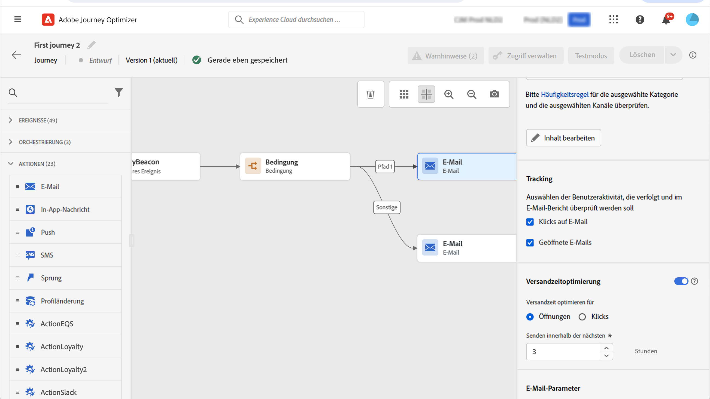

# Versandzeitoptimierung{#send-time-optimization}

>[!CONTEXTUALHELP]
>id="jo_bestsendtime_disabled"
>title="Über die Optimierung des Versandzeitpunkts"
>abstract="Die Funktion zur Optimierung des Versandzeitpunkts von Adobe Journey Optimizer basiert auf den KI-Services von Adobe. Sie kann basierend auf vergangenen Öffnungs- und Klickraten die beste Versandzeit für E-Mails oder Push-Benachrichtigungen vorhersagen, um die Interaktion zu maximieren."

>[!CONTEXTUALHELP]
>id="jo_bestsendtime_email"
>title="Aktivieren der Optimierung des Versandzeitpunkts"
>abstract="Wählen Sie mithilfe des entsprechenden Radiobuttons aus, ob E-Mail-Öffnungen oder E-Mail-Click-Throughs optimiert werden sollen. Sie können die vom System verwendeten Versandzeitpunkte auch zusammenfassen, indem Sie einen Wert für die Option „Senden innerhalb der nächsten“ eingeben."

>[!CONTEXTUALHELP]
>id="jo_bestsendtime_push"
>title="Aktivieren der Optimierung des Versandzeitpunkts"
>abstract="Bei Push-Benachrichtigungen wird standardmäßig die Option „Öffnungen“ verwendet, da Klicks für Push-Benachrichtigungen zutreffen. Sie können die vom System verwendeten Versandzeitpunkte auch zusammenfassen, indem Sie einen Wert für die Option „Senden innerhalb der nächsten“ eingeben."

Die Funktion zur Optimierung des Versandzeitpunkts von Adobe Journey Optimizer basiert auf den Journey-KI-Services von Adobe und wählt den optimalen Versandzeitpunkt für E-Mail- und Push-Nachrichten aus, um die Kundeninteraktion basierend auf dem bisherigen Öffnungs- und Klickverhalten Ihrer Kundschaft zu maximieren.

Die Optimierung des Versandzeitpunkts ist nur für die integrierten Aktionstypen „E-Mail“ und „Push“ von Journey Optimizer verfügbar. Für Nachrichten, die über benutzerdefinierte Aktionen gesendet werden, oder für andere Aktionstypen ist sie derzeit nicht verfügbar. Die Optimierung des Versandzeitpunkts ist nur für die Aktionen „E-Mail“ und „Push“ in Journey Optimizer verfügbar. Für Nachrichten, die durch Kampagnen gesendet werden, ist sie derzeit nicht verfügbar.

>[!AVAILABILITY]
>
>* Die Funktion zur Optimierung der Versandzeit wird auf Anfrage für Adobe Journey Optimizer-Kundinnen und -Kunden aktiviert. Wenden Sie sich an die Kundenunterstützung von Adobe oder den Adobe-Support, um diese Funktion für Ihre Organisation zu erhalten.
>
>* Die Funktion zur Optimierung der Versandzeit gilt nur für die Kanäle **E-Mail** und **Push-Benachrichtigung**.
>

## Verwenden der Optimierung des Versandzeitpunkts{#use-send-time-optimization}

Aktivieren Sie die Optimierung des Versandzeitpunkts für eine E-Mail oder Push-Aktion, indem Sie den Umschalter „Optimierung des Versandzeitpunkts“ in den Aktionsparametern aktivieren.

Die Optimierung des Versandzeitpunkts sollte nicht für dringende, zeitkritische Betriebsnachrichten verwendet werden – z. B. eine Bestellbestätigung, eine Benachrichtigung zum Zurücksetzen des Kennworts oder eine Benachrichtigung über eine Änderung des Gates am Flughafen. Die Optimierung des Versandzeitpunkts eignet sich am besten für weniger dringende Marketing-Nachrichten, z. B. eine wöchentliche Anzeige, Werbeinformationen zu einem neuen Produkt oder Informationen zu einem einmonatigen Ausverkauf.

Wählen Sie für E-Mail-Nachrichten durch Auswahl des entsprechenden Radio-Buttons aus, ob die E-Mail-Öffnungen oder die E-Mail-Clickthroughs optimiert werden sollen. Push-Benachrichtigungen werden immer in Bezug auf Öffnungen optimiert.

>[!TIP]
>
>Um die besten Ergebnisse zu erzielen, sollten die meisten E-Mail-Nachrichten in Bezug auf Klicks optimiert werden. Wählen Sie die Optimierung für Öffnungen aus, wenn Ihre E-Mail-Nachricht informativen Charakter hat und nicht dazu gedacht ist, eine Aktion direkt zu steuern.

Wählen Sie für E-Mail- und Push-Nachrichten die maximale Anzahl der Stunden aus, die das System vor dem Senden der Nachricht warten soll, indem Sie einen Wert für die Option „Senden innerhalb der nächsten“ festlegen. Sie können einen Wert zwischen 1 und 168 Stunden wählen.

>[!TIP]
>
>Um die besten Ergebnisse zu erzielen, wählen Sie eine maximale Wartezeit zwischen 6 und 24 Stunden. Die Auswahl eines niedrigeren Werts für die maximale Wartezeit reduziert die Anzahl der verfügbaren Sendezeiten und kann daher den potenziellen Wert der Optimierung des Versandzeitpunkts verringern. Die Auswahl eines höheren Werts für die maximale Wartezeit kann dazu führen, dass eine Nachricht zum Zeitpunkt ihres Versands veraltet oder irrelevant ist.

Wenn Ihre Journey aktiviert ist und eine Kundin bzw. ein Kunde die E-Mail- oder Push-Aktion in der Journey erreicht, wählt die Optimierung des Versandzeitpunkts die prognostizierte beste Sendezeit aus, die für jede Person innerhalb Ihrer festgelegten Limits verfügbar ist.

## Funktionsweise der Optimierung des Versandzeitpunkts {#how-send-time}

Das Modell „Optimierung des Versandzeitpunkts“ nimmt die Adobe Journey Optimizer-Daten Ihrer Organisation über das Kundenverhalten auf und betrachtet die Öffnungsraten und Klicks auf Benutzerebene, um zu bestimmen, wann Ihre Kundschaft mit der größten Wahrscheinlichkeit mit Ihrer Nachricht interagiert.

Die Optimierung des Versandzeitpunkts trifft für jede Wochenstunde Prognosen für jede Person basierend auf drei Typen von Verhaltensdaten:

1. Das Verhalten der Benutzenden insgesamt
1. Das Verhalten von Look-alike-Benutzenden in derselben Zeitzone
1. Das Verhalten dieser individuellen Person

Diese Prognosen werden gewichtet und mithilfe eines Bayes&#39;schen Ansatzes kombiniert, was zu einer „Heatmap“ für jede Metrik (E-Mail-Öffnungen, E-Mail-Klicks und Push-Öffnungen) für jede Person führt, die die Stunden der Woche angibt, an denen die Kontaktaufnahme mit dieser Person am wahrscheinlichsten und am wenigsten zum gewünschten Interaktionsergebnis (Öffnen/Klicken) führt, wie im folgenden Heatmap-Beispiel dargestellt:

Wenn eine Person mit der oben prognostizierten Wahrscheinlichkeit für eine Nachricht um 9 Uhr am Mittwoch mit aktivierter Optimierung des Versandzeitpunkts und einer maximalen Wartezeit von 7 Stunden ausgewählt wird, ist die ausgewählte Sendezeit für die Nachricht 12 Uhr:

## Details zum Training und zur Auswertung des Modells „Optimierung des Versandzeitpunkts“  {#model-send-time}

Sobald die Funktion zur Optimierung des Versandzeitpunkts für Ihre Organisation aktiviert ist, wird das Journey-KI-Modell mit den E-Mail- und Push-Versand- sowie den Öffnungs- und Klickereignissen in allen Journeys und Aktionen Ihres Unternehmens der letzten 16 Wochen trainiert – unabhängig davon, ob bei diesen Aktionen die Optimierung des Versandzeitpunkts verwendet wird. Dadurch kann die Optimierung des Versandzeitpunkts von allen Daten profitieren, die durch Ihre Kundschaft generiert wurden.

Die Modelle werden zunächst wöchentlich trainiert und ausgewertet. Nach 16 Wochen werden die Modelle dann monatlich neu trainiert und ausgewertet. Die Modellauswertung umfasst alle Kundenprofile – sowohl vorhandene als auch neue seit der letzten Auswertung.

Nachrichten, die von der Optimierung des Versandzeitpunkts gesendet wurden, erhalten entweder eine Versandzeit zum „Ausprobieren“, die zum Testen verschiedener Sendezeiten ausgewählt wurde, um zu beobachten, wie Kundinnen und Kunden reagieren, oder eine optimierte Versandzeit, die zum Maximieren der Klick-/Öffnungsraten ausgewählt wurde. 5 % der Versandereignisse erhalten eine Versandzeit zum „Ausprobieren“ und 95 % der Versandereignisse sind „optimiert“.

Die Versandzeiten zum Ausprobieren werden zufällig aus den Versandzeiten ausgewählt, die durch die konfigurierte maximale Wartezeit zur Verfügung gestellt werden. Wenn eine Nachricht beispielsweise um 9 Uhr am Mittwoch mit aktivierter Optimierung des Versandzeitpunkts und einer maximalen Wartezeit von 3 Stunden ausgewählt wird, werden die Versandzeiten zum Ausprobieren für die Nachricht gleichmäßig zwischen 9 Uhr, 10 Uhr, 11 Uhr und 12 Uhr aufgeteilt.

## Häufig gestellte Fragen {#faq-send-time}

Im Folgenden finden Sie häufig gestellte Fragen zur Versandzeitoptimierung.

Sie würden gerne mehr erfahren? Verwenden Sie die Feedback-Optionen unten auf dieser Seite, um Ihre Frage zu stellen, oder vernetzen Sie sich mit der [Adobe Journey Optimizer-Community](https://experienceleaguecommunities.adobe.com/t5/adobe-journey-optimizer/ct-p/journey-optimizer?profile.language=de){target="_blank"}.

+++Wie lange muss ich warten, bevor ich die Versandzeitoptimierung verwenden kann?

Ihre Organisation sollte vor Nutzung der Versandzeitoptimierung in E-Mails die E-Mail-Aktion in Journey Optimizer mindestens 30 Tage lang verwenden, um die Erfassung mehrerer E-Mail-bezogener Versand-, Öffnungs- und Klickereignisse zu ermöglichen.

Ihre Organisation sollte vor Nutzung der Versandzeitoptimierung in Push die Push-Aktion in Journey Optimizer mindestens 30 Tage lang verwenden, um die Erfassung mehrerer Push-Sende- und -Öffnungsereignisse zu ermöglichen.

Wenn Ihre Organisation bereits seit mindestens 30 Tagen die Aktionstypen „E-Mail“ und/oder „Push“ verwendet, muss sie nicht länger warten, um die Sendezeitoptimierung zu verwenden, nachdem sie durch Adobe aktiviert wurde. Die Ergebnisse werden sich weiter verbessern, wenn Ihre Organisation Daten für bis zu 16 Wochen erfasst.

+++

+++Wie kann ich den Versandzeitpunkt sehen, zu dem eine bestimmte Person eine Nachricht erhält?

Um die Auswirkungen des Modells auf den Profilumfang zu minimieren, werden Modellbewertungen in drei in `_experience.intelligentServices.journeyAI.sendTimeOptimization` gespeicherten Profilattributen komprimiert gespeichert und sind nicht darauf ausgelegt, für Menschen lesbar zu sein.

+++

+++Wie groß ist der durchschnittliche Vorteil der Versandzeitoptimierung?

Die Versandzeitoptimierung kann die E-Mail-Klickrate und die Push-Öffnungsrate in allen von einem Unternehmen optimierten Nachrichten in einem Bereich von etwa 2 % bis hin zu 10 % erhöhen.

Wenn beispielsweise eine Organisation, die E-Mails ohne Versandzeitoptimierung sendet, eine durchschnittliche Klickrate von 5,0 % aufweist, kann derselbe Satz von E-Mails mit Versandzeitoptimierung zu einer durchschnittlichen Klickrate von 5,5 % führen (5,0 % * (1 + 10 %) = 5,5 %).

Aufgrund von Variabilität innerhalb kleiner Stichprobengrößen lässt sich ein Vorteil der Versandzeitoptimierung bei einzelnen Nachrichtensendungen möglicherweise nicht feststellen.

Organisationen profitieren in den folgenden Fällen mit höherer Wahrscheinlichkeit von den Vorteilen der Versandzeitoptimierung:

* Bei bestehenden Journeys werden feste und nicht gut optimierte Versandzeitpunkte verwendet.
* Das variable Kundenverhalten (Klicks und Öffnungen) entspricht dem Kundenstandort und den Kundenpräferenzen.
* Organisationen verwenden die Versandzeitoptimierung für einen größeren Teil der E-Mail- und Push-Nachrichten.
* Organisationen wählen die maximalen Wartezeiten innerhalb des empfohlenen Bereichs von 6 bis 12 Stunden aus.

+++

+++Ich klicke immer um 12 Uhr auf E-Mails oder Push-Nachrichten. Warum hat mir der Algorithmus dann nicht um 12 Uhr eine Nachricht geschickt?

Dies kann verschiedene Ursachen haben:

* Für Ihre Nachricht wurde eine Nachrichtenversandzeit zum „Ausprobieren“ anstelle einer optimierten Nachrichtenversandzeit ausgewählt.
* Das Verhalten von Look-alike-Benutzenden hat das Modell dazu gebracht, eine andere Versandzeit zu empfehlen.

+++

+++Wie erkennt die Versandzeitoptimierung die Zeitzone einer Person?

Die Versandzeitoptimierung verwendet das Profilfeld `timeZone`, um die Zeitzone einer Person zu bestimmen. Sofern für diese Person nicht verfügbar, versucht die Versandzeitoptimierung, die Zeitzone eine Person aus anderen geografischen Informationen im Profil der Person, z. B. Land und Bundesland, abzuleiten.

+++

+++Versendet die Versandzeitoptimierung nachts Push-Nachrichten an Benutzende in ihrer lokalen Zeitzone?

Die Versandzeitoptimierung kann unter folgenden Umständen nachts Push-Nachrichten an Benutzende in ihrer lokalen Zeitzone senden:

* wenn Benutzende ein Verhalten zeigen, das darauf hindeutet, dass sie wahrscheinlich mit einer nachts gesendeten Nachricht interagieren
* wenn das Modell einen Versandzeitpunkt zur Untersuchung auswählt

Um zu vermeiden, dass Push-Nachrichten nachts an Kundschaft gesendet werden, planen Sie den Versand von Batch-Push-Nachrichten für morgens oder den frühen Nachmittag und wählen Sie eine kürzere Dauer für die Versandzeitoptimierung aus (z. B. 9 Uhr als Versandzeit und eine maximale Wartezeit von 8 Stunden).

+++

