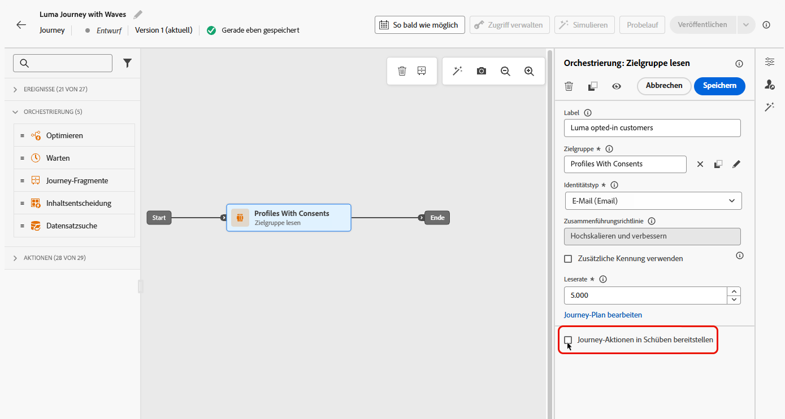
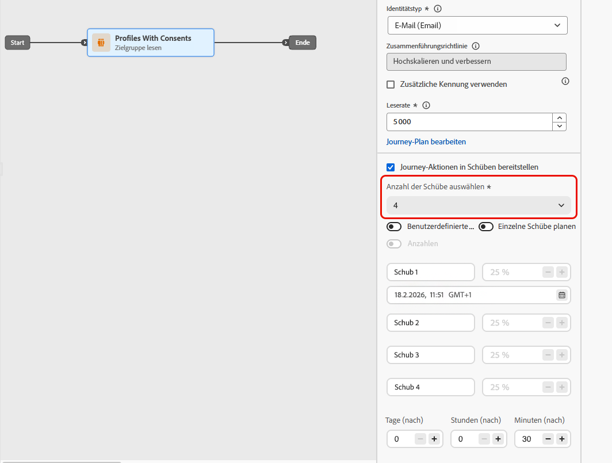
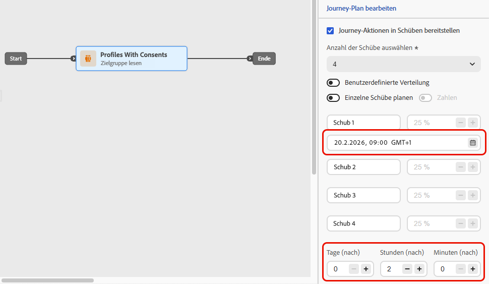
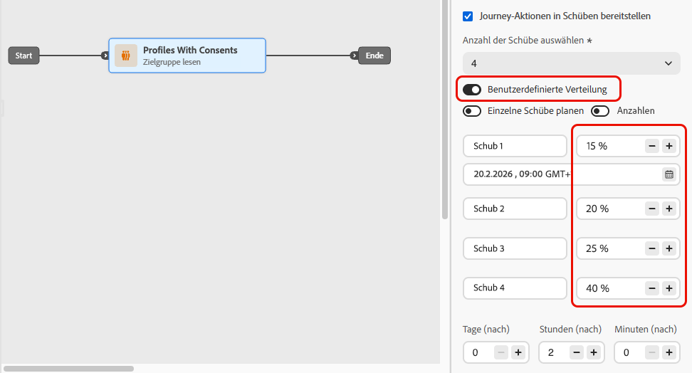
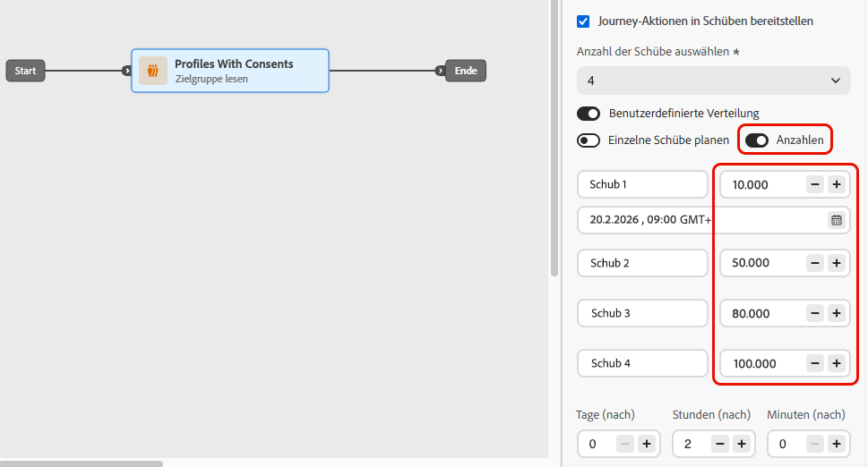
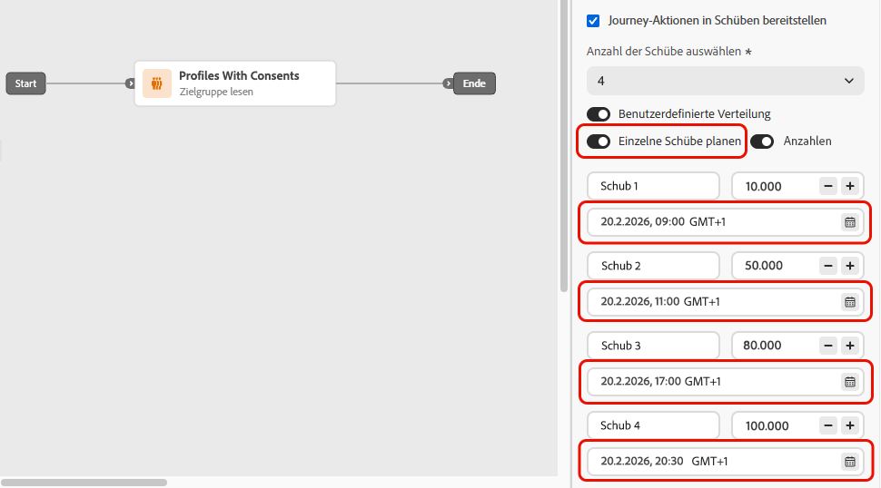
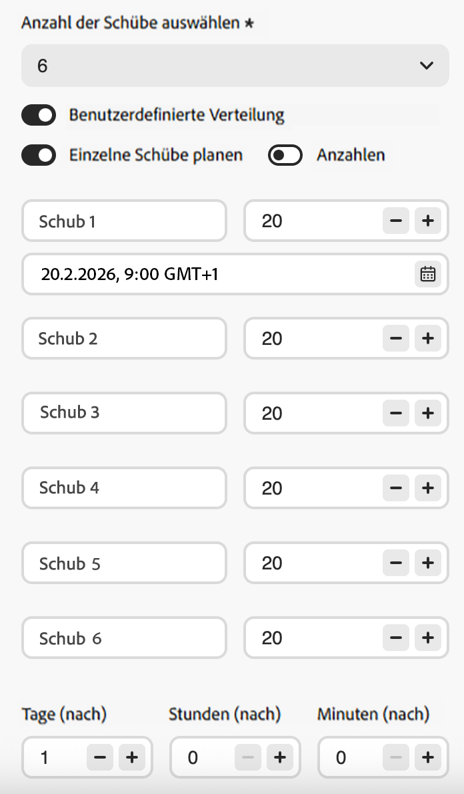
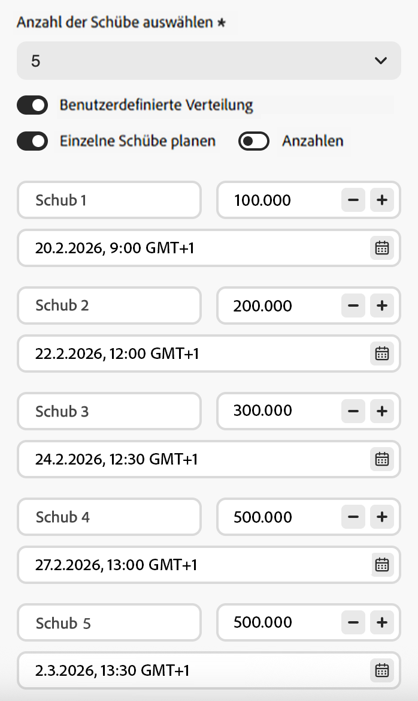
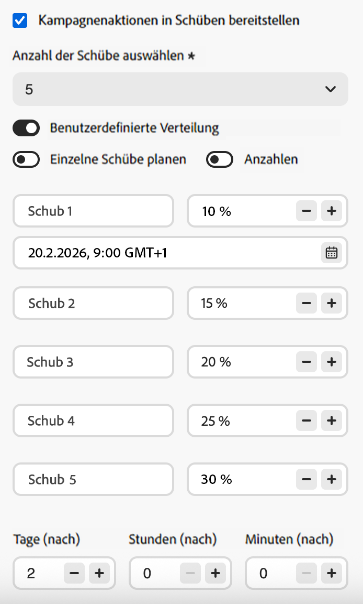

# Versenden in Schüben in Journeys {#send-using-waves-journeys}

>[!BEGINSHADEBOX]

**Auf dieser Seite** Erfahren Sie, wie Sie ausgehende Nachrichten von einer Journey mit der Bezeichnung „Zielgruppe lesen“ in geplanten Batches versenden, um eine gleichmäßige Auslastung zu erzielen, nachgelagerte Systeme zu schützen und die Zustellbarkeit zu unterstützen.

>[!ENDSHADEBOX]

Sie können ausgehende Nachrichten von einer Journey im Zeitverlauf stapelweise (in Schüben) statt alle gleichzeitig versenden. Der Wave-Versand trägt dazu bei, die Auslastung auszugleichen, überlastete nachgelagerte Systeme (wie Callcenter oder Landingpages) zu vermeiden und die Zustellbarkeit und die Reputation des Absenders zu unterstützen - insbesondere für Journey mit großen Lesemengen.

<!--
>[!CAUTION]
>
>Wave sending is available for read audience journeys only and applies to **outbound** actions only (Email, SMS, Push, Direct mail).
-->

Sie konfigurieren ihn auf Journey-Ebene, wenn Sie definieren, wie die Zielgruppe eintritt und wie Aktionen geplant werden. Sie definieren die Anzahl der Schübe, ihre Größe (als Prozentsatz der Zielgruppe oder als absolute Zahlen) und den Zeitpunkt, zu dem jede Schübe ausgeführt wird.

## Einschränkungen und Leitplanken {#limitations-guardrails}

* Das Senden von Wellen ist nur für Journey mit dem Typ „Zielgruppe lesen“ mit dem **[!DNL As soon as possible]** und **[!UICONTROL Einmal]** verfügbar. Weitere Informationen zum [Journey-Zeitplan](read-audience.md#schedule).
* Das Senden von Wellen ist für wiederkehrende, ereignisgesteuerte, Geschäftsereignis-, Testmodus- oder Probelauf-Journey nicht verfügbar.
* Sie müssen mindestens **2 Schübe definieren** und können bis zu **10 Schübe hinzufügen**.
* Der Mindestabstand zwischen dem Beginn zweier Schübe beträgt **30 Minuten**.
* Ein Wellenstart kann nicht vor dem Journey-Start oder in der Vergangenheit erfolgen.
* Die Aufteilung der Zielgruppe in Wellen kann bis zu 1 Stunde dauern. Die Profile dürfen die Journey erst dann betreten.
* Innerhalb einer Journey-Version laufen nie zwei Schübe gleichzeitig. Die nächste Welle beginnt erst, nachdem die vorherige Welle beendet wurde. Wenn beispielsweise Wellen in einem Abstand von 1 Stunde geplant werden, die erste Welle jedoch 2 Stunden lang läuft, beginnt die zweite Welle mit dem Ende der ersten Welle, nicht zu ihrer geplanten Zeit.
* Wellenstarts können verzögert werden, wenn die Plattform Quotenbegrenzungen anwendet oder wenn die Systemkapazität stark ausgelastet ist.

## Konfigurieren des Wave-Sendens auf einer Journey {#configure-wave-sending}

1. Starten Sie Ihren Journey mit einer Aktivität [Zielgruppe lesen](read-audience.md).

1. Doppelklicken Sie auf die Aktivität **[!UICONTROL Zielgruppe lesen]**, um ihre Eigenschaften zu öffnen, und wählen Sie die Option **[!UICONTROL Journey-Aktion in Schüben]**.

   {width="100%"}

1. Legen Sie die **Anzahl der Schübe** fest (z. B. 4).

   {width="80%"}

   >[!NOTE]
   >
   >Sie müssen mindestens 2 Schübe definieren und können bis zu 10 Schübe hinzufügen.

1. Wählen Sie wie unten beschrieben, wie Wellengröße und Timing definiert werden.

### Gleichmäßige Wellen {#equal-waves}

Standardmäßig wird die Zielgruppe in gleich große Schübe unterteilt. Legen Sie ein festes Intervall zwischen dem Beginn jeder Welle fest (z. B. 2 Stunden).

{width="70%"}

>[!NOTE]
>
>Der Mindestabstand zwischen dem Beginn zweier Schübe beträgt **30 Minuten**.

Das System plant dann die nachfolgenden Wellen automatisch (z. B. erste Welle um 9 :00 Uhr, zweite um 11 :00 Uhr, dritte um :00 Uhr, vierte um 15 :00 Uhr).

### Benutzerdefinierte Verteilung {#custom-distribution}

Wählen Sie die Option **[!UICONTROL Benutzerdefinierte Verteilung]** aus, um die Größe jeder Welle als Prozentsatz der gesamten Zielgruppe zu definieren (z. B. 15 %, 20 %, 25 %, 40 %).

{width="70%"}

Wählen Sie **[!UICONTROL Zahlen]** aus, um die Größe jeder Welle als absolute Anzahl von Profilen zu definieren (z. B. 10.000; 50.000).

{width="70%"}

>[!NOTE]
>* Bei Verwendung von Prozentsätzen müssen alle Schübe insgesamt 100 % aufweisen. Ist dies nicht der Fall, wird eine Warnung angezeigt.
>* Bei Verwendung von Zahlen überprüft das System die Abdeckung nicht. Stellen Sie sicher, dass Ihre Wellengrößen die vorgesehene Zielgruppe abdecken. [Weitere Informationen](#faq)

### Benutzerdefinierter Zeitplan {#custom-schedule}

Wählen Sie **[!UICONTROL Planen jeder Welle]**, um ein spezifisches Startdatum und eine spezifische Startzeit für jede Welle zu definieren. Die Wellen müssen nicht gleichmäßig verteilt sein (z. B:00 9.00, 11:0000, 17:0000, 20:30).

{width="70%"}

>[!NOTE]
>
>Der Mindestabstand zwischen dem Beginn zweier Schübe beträgt **30 Minuten**.

## Anwendungsszenarien {#use-cases}

Mit dem Wave-Versand können Sie steuern, wann und wie viele Nachrichten gesendet werden. Dies kann die Zustellbarkeit verbessern, die Reputation des Absenders schützen und die Sendungen an Ihre betriebliche Kapazität anpassen. Erwägen Sie die Verwendung von Wellen in diesen Szenarien:

* **Callcenter- oder Reaktionsverwaltung:** begrenzen Sie, wie viele Nachrichten pro Tag oder pro Stunde gesendet werden, damit nachgelagerte Teams (z. B. die Kundenunterstützung) mit Antworten umgehen können. Senden Sie beispielsweise 20 Nachrichten pro Tag, um die Callcenter-Kapazität anzupassen.

  {width="55%"}

* **Hohes Volumen und Zustellbarkeit:** Vermeiden Sie den Versand eines sehr großen Journey-Versands in einem Schuss. Verteilen Sie den Versand über einen längeren Zeitraum, um die Reputation des Absenders zu wahren und das Risiko zu reduzieren, als Spam gekennzeichnet zu werden.

  {width="55%"}

* **Ramp-up:** Wenn Sie eine neue Plattform oder IP verwenden, erhöhen Sie das Volumen progressiv (z. B. 10 % in der ersten Welle, dann 15 %, 20 % usw.), um die Reputation schrittweise aufzubauen.

  {width="55%"}

## Häufig gestellte Fragen {#faq}

+++ Was passiert, wenn die Summe der Wellengrößen nicht der Gesamtzielgruppe entspricht?

* Wenn die Summe Ihrer Wellengrößen **die Zielgruppe übersteigt** (Sie planen z. B. 100.000 in der ersten Welle für eine Zielgruppe von 100.000), wird die erste Welle an die gesamte Zielgruppe gesendet und die verbleibenden Wellen haben niemanden mehr, an den sie senden können - sie werden nicht ausgeführt.
* Wenn die Summe **geringer ist** als die Zielgruppe (Sie definieren beispielsweise vier Schübe mit insgesamt 40.000 Profilen für eine Zielgruppe von 100.000), erhalten nur die in diesen Schüben enthaltenen Profile die Nachricht. Der Rest der Zielgruppe erhält die Kommunikation nicht und wird in späteren Schüben nicht erneut versucht.

+++

+++ Kann ich einzelnen Schüben unterschiedliche Segmente oder Kriterien zuweisen?

Sie können nur die Größe und den Zeitpunkt von Wellen definieren. Die Journey wird von derselben Zielgruppe durchlaufen. Sie können den einzelnen Schüben keine unterschiedlichen Segmente oder Kriterien zuweisen.

+++

## Siehe auch {#see-also}

* [Zielgruppe auf einer Journey verwenden](read-audience.md) Konfigurieren Sie die Aktivität „Zielgruppe lesen“.

+++ KI-Wissensreferenz

Dieser Abschnitt enthält strukturiertes Wissen zur Unterstützung von Interpretation, Abrufen und Antworten auf Fragen zu diesem Thema.

Zum vollständigen Verständnis sollten diese Informationen mit der Dokumentation auf dieser Seite kombiniert werden. Keine der beiden Quellen ist für Einzelpersonen gedacht. Die Seite beschreibt die Funktion, während dieser Abschnitt zusätzlichen Kontext bietet, der dabei hilft, Begriffe, Absichten, Anwendbarkeit und Begrenzungen zu unterscheiden.

* **TL;DR:** Auf dieser Seite wird erläutert, wie Sie den Wellenversand in den Journey der Adobe Journey Optimizer-Zielgruppe „Lesen“ konfigurieren können, um ausgehende Nachrichten in kontrollierten Batches im Laufe der Zeit zu versenden, die Zustellbarkeit zu verbessern und die Reputation des Absenders zu schützen.

**intents:**
* Wellenversand auf der Journey „Zielgruppe lesen“ aktivieren, um Nachrichten in Stapeln zu versenden
* Gleichmäßige Schübe mit einem festen Intervall zwischen den Schüben konfigurieren
* Definieren benutzerdefinierter Wellengrößen als Prozentsätze oder absolute Profilanzahl
* Planen Sie jede Welle mit einem bestimmten Startdatum und einer bestimmten Startzeit mithilfe einer benutzerdefinierten Planung
* Kontrollieren des Versandvolumens zum Schutz der Reputation des Absenders oder zur Anpassung an die betriebliche Kapazität

**Glossar:**
* **Wave-Versand** Ein Versandmodus, der die Aktivität „Zielgruppe lesen“ in Batches (Schübe) aufteilt und Nachrichten in terminierten Intervallen an jeden Batch sendet, anstatt alle gleichzeitig *(produktspezifisch)*
* **Gleichmäßige Schübe**: Eine Schübe-Konfiguration, bei der die Zielgruppe in gleich große Teile mit einem festen Intervall zwischen Schüben aufgeteilt wird *produktspezifisch)*
* **Benutzerdefinierte Verteilung**: Eine Wellenkonfiguration, bei der die Größe jeder Welle manuell als Prozentsatz oder absolute Anzahl von Profilen definiert wird *produktspezifisch)*
* **Benutzerdefinierter Zeitplan**: Eine Schub-Konfiguration, bei der jede Schub ein bestimmtes Startdatum und eine bestimmte Startzeit hat, was einen ungleichmäßigen *(produktspezifisch) ermöglicht*

**Leitplanken:**
* Der Wave-Versand ist nur für Journey des Typs „Zielgruppe lesen“ mit der Planung „So bald wie möglich“ und „Einmal“ verfügbar. Er ist nicht für wiederkehrende, ereignisgesteuerte, Geschäftsereignis-, Testmodus- oder Probelauf-Journey verfügbar.
* Es müssen mindestens 2 und höchstens 10 Wellen definiert werden.
* Das Mindestintervall zwischen dem Beginn zweier aufeinander folgender Wellen beträgt 30 Minuten.
* Die Startzeit einer Welle darf nicht vor dem Start der Journey liegen oder in der Vergangenheit liegen.
* Die Aufspaltung der Zielgruppe in Wellen kann bis zu 1 Stunde dauern; bis dahin können keine Profile eintreten.
* Innerhalb einer einzigen Journey-Version laufen nie zwei Schübe gleichzeitig; die nächste Schübe beginnt erst nach dem Ende der vorherigen.
* Wellenstarts können durch Quotenbegrenzungen der Plattform oder eine hohe Systemlast verzögert werden.
* Bei Verwendung einer prozentualen benutzerdefinierten Verteilung müssen alle Schübe insgesamt 100 % aufweisen.
* Bei Verwendung einer zahlenbasierten benutzerdefinierten Verteilung überprüft das System nicht die Gesamtabdeckung. Der Benutzer muss sicherstellen, dass die Wellengrößen die vorgesehene Zielgruppe abdecken.
* Wenn die Wellengrößen die Zielgruppe überschreiten, wird die erste Welle an die gesamte Zielgruppe gesendet und die verbleibenden Wellen werden nicht ausgeführt.
* Wenn die Wellengrößen kleiner sind als die Zielgruppe, erhalten nur Profile in definierten Schüben die Nachricht. Für die übrigen Profile wird kein erneuter Zustellversuch unternommen.

**Terminologie:**
* Kanonischer Name: Wellenversand — Akronym: keine — Varianten: Batch-Versand, wellenbasierter Versand, stufenweiser Versand
* Synonyme: „waves“ = „batches“ = „delivery phases“
* Verwechseln Sie nicht: „Wellenversand“ ≠ „wiederkehrender Journey&quot; (Wellenversand teilt eine einzelne Zielgruppe, die in zeitgesteuerten Batches gelesen wird, auf; wiederkehrende Journey lesen die Zielgruppe in einem Zeitplan erneut)

**FAQ:**
* **F: Kann der Wellenversand auf wiederkehrenden Journey verwendet werden?** — Nein. Der Wave-Versand ist nur für Journey des Typs „Zielgruppe lesen“ mit dem Planungstyp „So bald wie möglich“ oder „Einmal“ verfügbar.
* **Q: Was ist die Mindestzeit zwischen zwei Schüben?** — 30 Minuten zwischen dem Beginn zweier aufeinander folgender Wellen.
* **F: Was passiert, wenn meine Wellengrößen größer sind als die des Publikums?** — Die erste Welle wird an die gesamte Zielgruppe gesendet, und die folgenden Wellen haben keine Profile mehr, die an gesendet werden können; sie werden nicht ausgeführt.
* **F: Kann ich einzelnen Schüben unterschiedliche Inhalte oder Segmente zuweisen?** — Nein; alle Schübe verwenden dieselbe Zielgruppe und denselben Journey-Inhalt. Pro Welle können nur Größe und Timing angepasst werden.
* **F: Wie viele Schübe kann ich konfigurieren?** — zwischen 2 und 10 Schüben pro Journey.
* **F: Wann sollte ich den Wave-Versand verwenden?** — Schützen Sie damit die Reputation des Absenders bei Sendungen mit hohem Volumen, richten Sie den Versand an die nachgelagerte Team-Kapazität aus (z. B. Callcenter) oder erhöhen Sie schrittweise das Volumen auf einer neuen IP-Adresse oder Plattform.

+++
