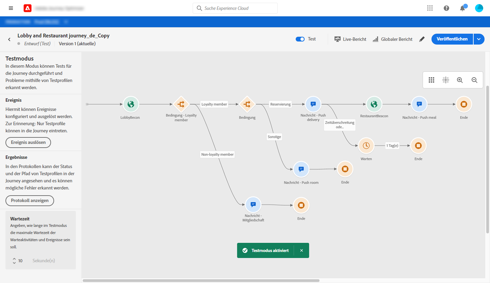
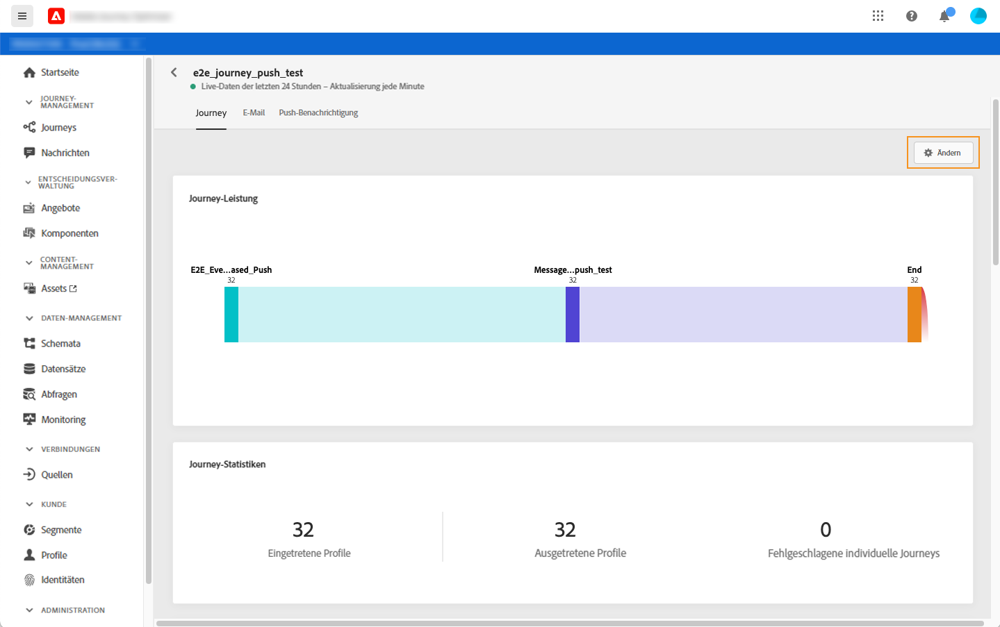
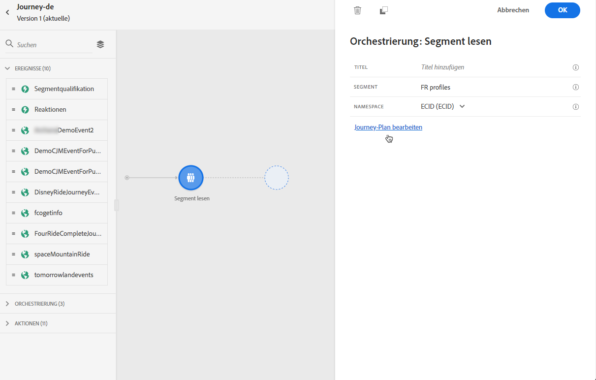
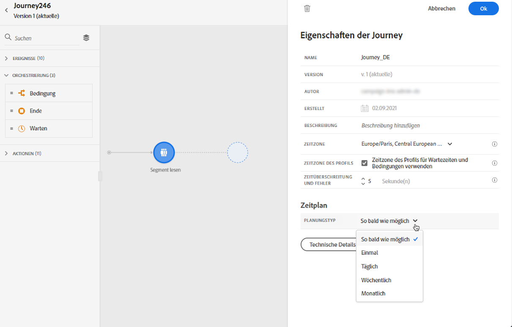
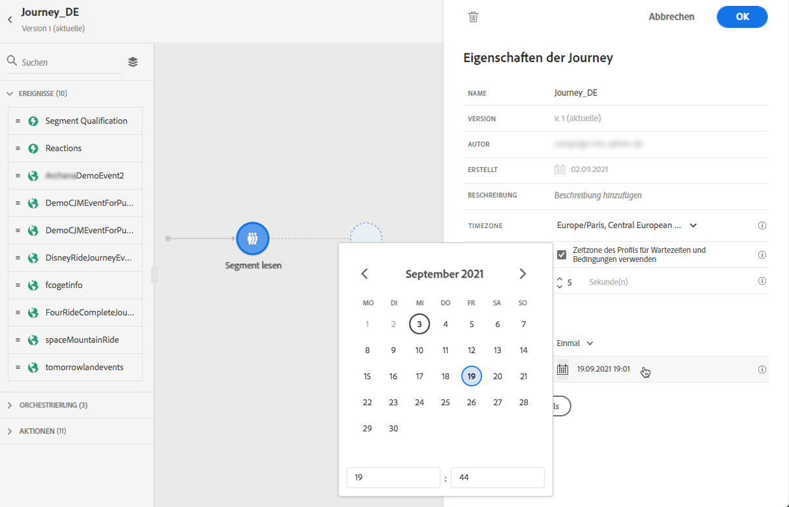
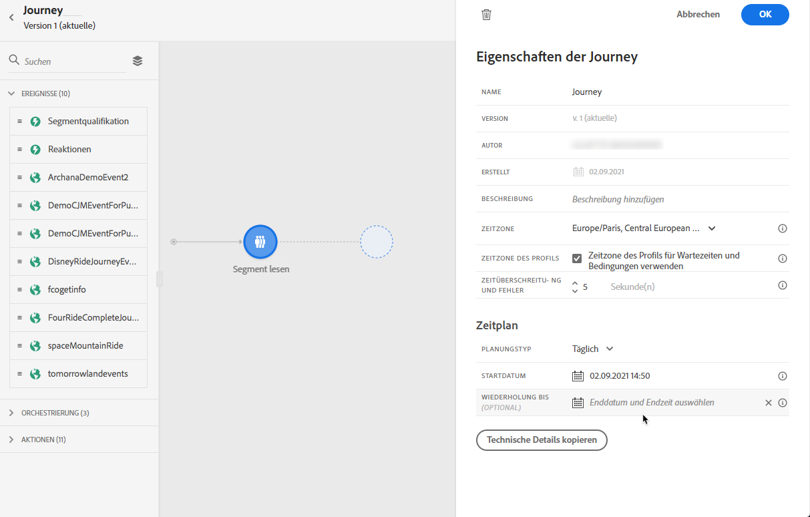

# Journey-Ausführung {#message-execution}

## Journey testen

Sie können Ihre Journey mit Test-Profilen testen. Dieser Schritt wird zur Überprüfung Ihrer Einstellungen und Meldungen empfohlen.

Weitere Informationen finden Sie in diesem [Abschnitt](testing-the-journey.md).

## Journey aktivieren

Sie müssen Ihre Journey veröffentlichen, um sie zu aktivieren.

Weitere Informationen finden Sie in diesem [Abschnitt](publishing-the-journey.md).

Nach der Veröffentlichung können Sie Ihre Journey mit den dedizierten Berichte-Tools überwachen, um die Effektivität Ihrer Journey zu messen.

[Weitere Informationen zu Berichten](../reports/live-report.md)

## Nachrichten senden {#send-messages}

Wenn Ihre Nachricht einen Inhalt definiert hat und veröffentlicht wird, kann sie über eine [Journey](journey.md) gesendet werden.

>[!NOTE]
>
>Sie können einer Journey eine Meldung hinzufügen, die sich noch im Entwurfsmodus befindet, stellen Sie jedoch sicher, dass die Nachricht veröffentlicht wird, bevor Sie die Journey veröffentlichen.

Nachdem eine Nachricht gesendet wurde, können Sie die Ausführung über mehrere Indikatoren überwachen. [Erfahren Sie mehr über die Ausführung](../message-monitoring.md) von Überwachungsmeldungen.

## Terminplanmeldungen {#schedule-messages}

Nachrichten können über die Aktivität **[!UICONTROL Segment lesen]** in einer [Journey](journey.md) geplant werden. Sie können festlegen, wann das Segment in die Journey eintritt. [Erfahren Sie mehr über die Aktivität](read-segment.md) zum Lesen von Segmenten.

Gehen Sie dazu wie folgt vor:

1. Bearbeiten Sie eine Journey, ziehen Sie eine **[!UICONTROL Read segment]**-Aktivität und legen Sie sie durch einen Beginn fest. [Erfahren Sie mehr über die Konfiguration der Aktivität](read-segment.md#configuring-segment-trigger-activity) zum Lesen von Segmenten.

1. Klicken Sie auf den Link **[!UICONTROL Journey-Plan bearbeiten]**, um auf die Journey-Eigenschaften zuzugreifen.

   

1. Konfigurieren Sie das Feld **[!UICONTROL Planung type]**: Wählen Sie den gewünschten Wert aus der Liste aus, damit das Segment an einem bestimmten Datum/zu einer bestimmten Uhrzeit oder wiederholt in die Journey aufgenommen wird.

   >[!NOTE]
   >
   >Der Abschnitt **[!UICONTROL Plan]** ist nur verfügbar, wenn eine **[!UICONTROL Aktivität zum Lesen]** auf der Arbeitsfläche abgelegt wurde.

   

1. Wenn Sie **[!UICONTROL Once]** auswählen, definieren Sie ein bestimmtes Datum und eine Uhrzeit, zu der das Segment in die Journey eintritt.

   

1. Wenn Sie eine wiederkehrende Methode auswählen, bearbeiten Sie Datum und Uhrzeit des Beginns. Sie können auch ein optionales Enddatum und eine optionale Endzeit definieren.

   

   >[!NOTE]
   >
   >Standardmäßig treten Segmente **[!UICONTROL so bald wie möglich]** in die Journey ein, d. h. eine Stunde nach der Veröffentlichung der Journey.

1. Klicken Sie auf **[!UICONTROL OK]**, um Ihre Änderungen zu speichern.

<!--Unitary messages that are triggered by an event within a journey cannot be scheduled.-->
