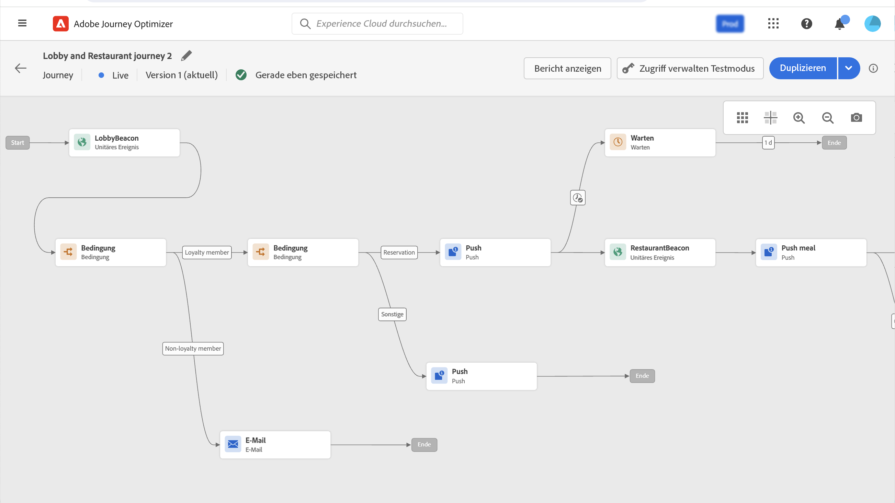

# Journey-Ausführung {#message-execution}

## Testen der Journey

Sie können Ihre Journey mit Testprofilen testen. Dieser Schritt wird zur Überprüfung Ihrer Einstellungen und Meldungen empfohlen.

Weitere Informationen finden Sie hier . [Abschnitt](testing-the-journey.md).

## Journey aktivieren

Sie müssen Ihre Journey veröffentlichen, um sie zu aktivieren.

Weitere Informationen finden Sie hier . [Abschnitt](publishing-the-journey.md).

Nach der Veröffentlichung können Sie Ihre Journey mit den dedizierten Reporting-Tools überwachen, um die Effektivität Ihrer Journey zu messen.

[Weitere Informationen zu Berichten](../reports/live-report.md)

## Nachrichten senden {#send-messages}

Wenn für Ihre Nachricht ein Inhalt definiert ist, kann sie über eine [Journey](journey.md).

Nach dem Versand einer Nachricht lässt sich die Ausführung über mehrere Indikatoren überwachen. [Weitere Informationen zur Berichterstellung](../global-report.md).

## Versandplanung {#schedule-messages}

Nachrichten können über die **[!UICONTROL Read Segment]** in einer [Journey](journey.md). Sie können festlegen, wann das Segment in die Journey eintreten wird. [Erfahren Sie mehr über die Aktivität Segment lesen .](read-segment.md).

Gehen Sie dazu wie folgt vor:

1. Eine Journey bearbeiten, per Drag &amp; Drop **[!UICONTROL Read Segment]** und starten Sie die Konfiguration. [Erfahren Sie mehr über die Konfiguration der Aktivität Segment lesen .](read-segment.md#configuring-segment-trigger-activity).

1. Klicken Sie auf **[!UICONTROL Edit journey schedule]** -Link, um auf die Eigenschaften der Journey zuzugreifen.

   

1. Konfigurieren Sie die **[!UICONTROL Scheduler type]** -Feld: Wählen Sie den gewünschten Wert aus der Liste aus, damit das Segment an einem bestimmten Datum/zu einer bestimmten Uhrzeit oder wiederholt in die Journey eintritt.

   >[!NOTE]
   >
   >Die **[!UICONTROL Schedule]** -Abschnitt ist nur verfügbar, wenn eine **[!UICONTROL Read Segment]** -Aktivität wurde auf der Arbeitsfläche abgelegt.

   

1. Wenn Sie **[!UICONTROL Once]**, definieren Sie ein bestimmtes Datum und eine bestimmte Uhrzeit, zu der das Segment in die Journey eintreten wird.

   

1. Wenn Sie eine wiederkehrende Methode auswählen, bearbeiten Sie das Startdatum und die Startzeit. Sie können auch ein optionales Enddatum und eine optionale Endzeit definieren.

   

   >[!NOTE]
   >
   >Standardmäßig treten Segmente in die Journey ein **[!UICONTROL As soon as possible]**: Dies bedeutet eine Stunde nach der Veröffentlichung der Journey.

1. Klicken **[!UICONTROL OK]** , um Ihre Änderungen zu speichern.

<!--Unitary messages that are triggered by an event within a journey cannot be scheduled.-->
