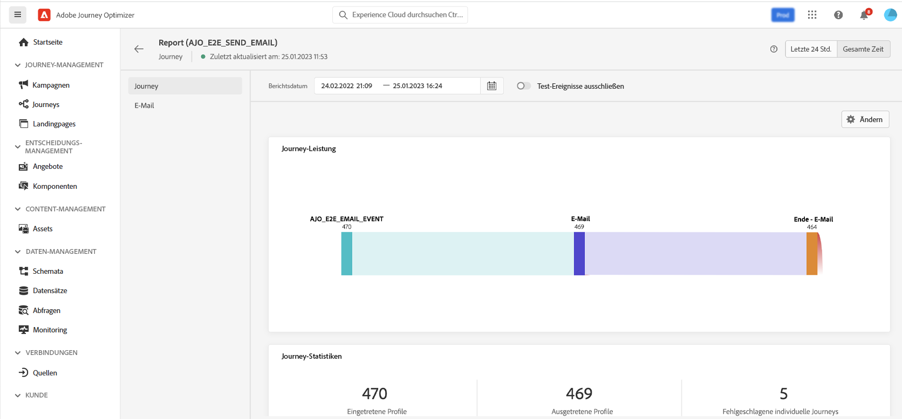

# Journey-Ausführung {#message-execution}

## Testen einer Journey

Sie können Ihre Journey mit Testprofilen testen. Dieser Schritt wird zur Validierung Ihrer Einstellungen und Nachrichten empfohlen.

Weitere Informationen finden Sie in diesem [Abschnitt](testing-the-journey.md).

## Aktivieren Ihrer Journey

Damit Sie Ihre Journey aktivieren können, muss sie bereits veröffentlicht sein.

Weitere Informationen finden Sie in diesem [Abschnitt](publishing-the-journey.md).

Nach der Veröffentlichung können Sie Ihre Journey mit den dedizierten Reporting-Tools überwachen, um ihre Effektivität zu messen.

[Weitere Informationen über Berichte](../reports/live-report.md)

## Nachrichten senden {#send-messages}

Wenn für Ihre Nachricht ein Inhalt definiert ist, kann sie über eine [Journey](journey.md).

Nach dem Versand einer Nachricht können Sie die Ausführung über mehrere Indikatoren überwachen. [Weitere Informationen zur Berichterstellung](../global-report.md).

## Verzögerter Nachrichtenversand {#schedule-messages}

Nachrichten können über die Aktivität **[!UICONTROL Segment lesen]** in einer [Journey](journey.md) zu einem geplanten Zeitpunkt versandt werden. Sie können den Zeitpunkt für den Eintritt des Segments in die Journey bestimmen. [Weitere Informationen über die Aktivität „Segment lesen“](read-segment.md)

Gehen Sie dazu wie folgt vor:

1. Bearbeiten Sie eine Journey, fügen Sie die Aktivität **[!UICONTROL Segment lesen]** per Drag-and-Drop ein und nehmen Sie die Konfiguration vor. [Weitere Informationen über das Konfigurieren der Aktivität „Segment lesen“](read-segment.md#configuring-segment-trigger-activity)

1. Klicken Sie auf den Link **[!UICONTROL Journey-Plan bearbeiten]**, um auf die Eigenschaften der Journey zuzugreifen.

   

1. Konfigurieren Sie das Feld **[!UICONTROL Planungstyp]**: Wählen Sie den gewünschten Wert aus der Liste aus, damit das Segment an einem bestimmten Datum und zu einer bestimmten Uhrzeit oder wiederkehrend in die Journey eintritt.

   >[!NOTE]
   >
   >Der Bereich **[!UICONTROL Zeitplan]** ist nur dann verfügbar, wenn eine Aktivität des Typs **[!UICONTROL Segment lesen]** auf der Arbeitsfläche abgelegt wurde.

   

1. Wenn Sie **[!UICONTROL Einmal]** auswählen, definieren Sie Datum und Uhrzeit für den Eintritt des Segments in die Journey.

   

1. Wenn Sie „wiederkehrend“ auswählen, bestimmen Sie Datum und Uhrzeit des erstmaligen Eintritts. Optional können Sie auch Datum und Uhrzeit der letztmaligen Ausführung festlegen.

   

   >[!NOTE]
   >
   >Standardmäßig treten Segmente **[!UICONTROL so bald wie möglich]** in die Journey ein, d. h. eine Stunde nach der Veröffentlichung der Journey.

1. Klicken Sie auf **[!UICONTROL OK]**, um die Änderungen zu speichern.

<!--Unitary messages that are triggered by an event within a journey cannot be scheduled.-->
