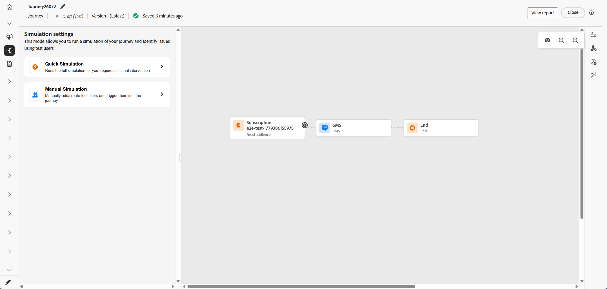
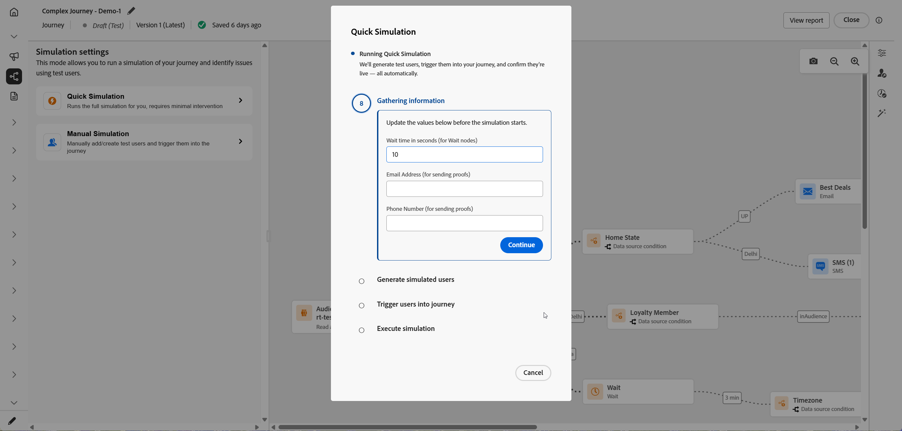
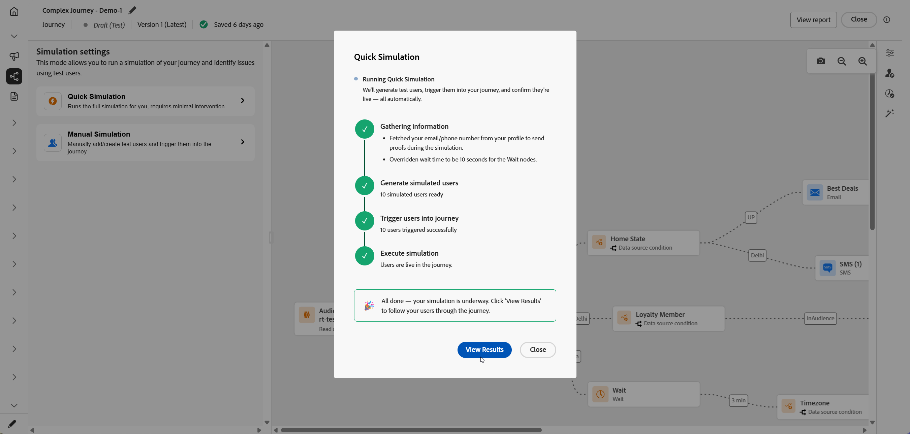
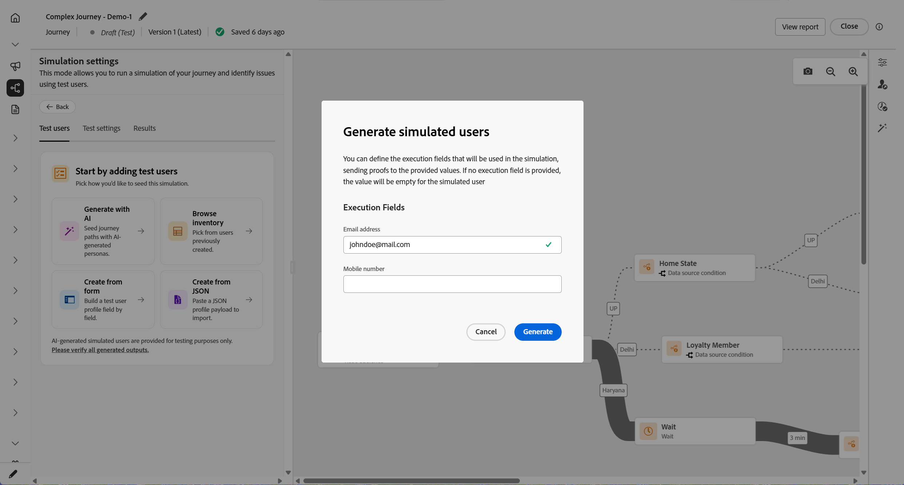
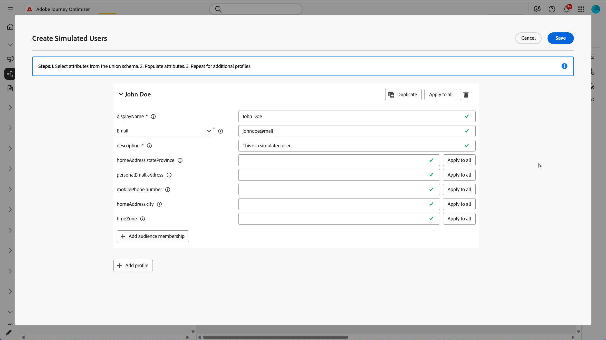
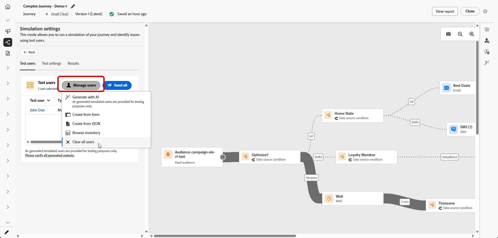
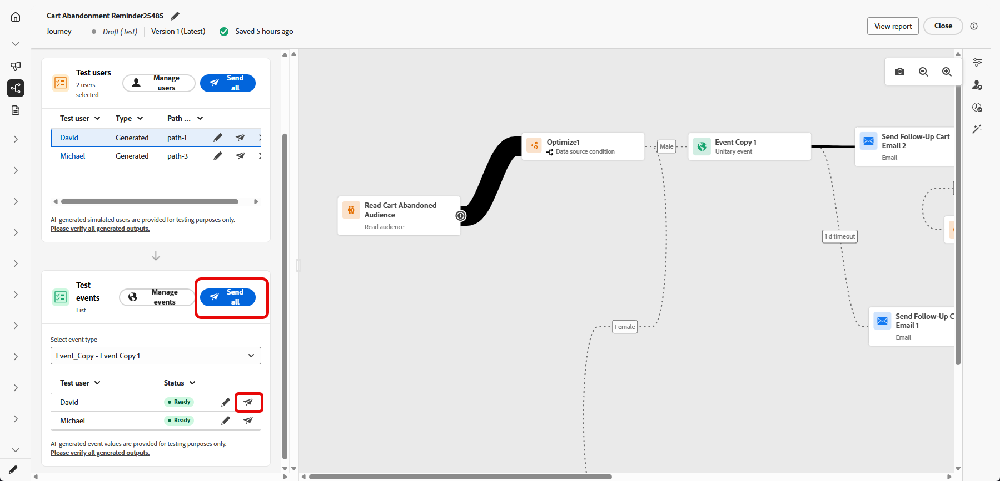

# Simulieren der Journey{#simulate-journey}

Verwenden Sie **[!UICONTROL Simulation]**, um Ihren Journey mit **simulierten Benutzern** vor der Veröffentlichung zu validieren. Diese Seite führt Sie durch **[!UICONTROL Schnellsimulation]** und **[!UICONTROL Manuelle Simulation]**, das Erstellen und Senden simulierter Benutzer, das Auslösen von Einzelereignissen, wenn Ihr Journey sie benötigt, und das **[!UICONTROL Ergebnisse]**-Protokoll.

Einen Überblick nach Journey-Typ finden Sie unter [Erste Schritte mit der Journey-Simulation](simulate-journey-gs.md).

## Simulationstypen {#simulation-types}

Nach der Aktivierung bieten Batch-Journey mit dem Eintrag Zielgruppe lesen zwei Möglichkeiten, eine Simulation auszuführen:

* **[!UICONTROL Schnellsimulation]** durchläuft End-to-End mit generierten Benutzern und Standardwerten. Beachten Sie, dass eine Schnellsimulation mit unitären Journey nicht verfügbar ist.

* **[!UICONTROL Manuelle Simulation]** ermöglicht Ihnen die schrittweise Auswahl von Benutzern, Versandreihenfolgen, Ereignis-Payloads und Warteüberschreibungen.

### Schnellsimulation {#quick-simulation}

Auf einer Batch-Journey in **[!UICONTROL Simulation]**, **[!UICONTROL Schnellsimulation]** wird die Journey mit generierten Benutzenden und vorausgefüllten Einstellungen ausgeführt.

1. Wählen Sie **[!UICONTROL Schnellsimulation]** aus.

1. Überprüfen Sie die Felder, die Adobe Journey Optimizer für den Durchlauf gesammelt hat. Klicken Sie auf **[!UICONTROL Werte aktualisieren]**, um die Korrekturabzugs- oder Kanaleinstellungen zu ändern oder ohne Änderungen fortzufahren.

   

1. Wenn Sie **[!UICONTROL Werte aktualisieren]** geöffnet haben, bearbeiten Sie die Einstellungen, z. B. die für Testsendungen verwendete Adresse, und bestätigen Sie dann, dass Sie die Simulation starten möchten.

   

1. Adobe Journey Optimizer generiert simulierte Journey-Trigger aus der Benutzerdefinition und legt jeden Benutzer auf die Journey fest.

1. Klicken Sie nach Abschluss des Durchgangs **[!UICONTROL Ergebnisse anzeigen]**, um Pfade, Fehler und aufgedeckte Verzweigungen zu überprüfen. Siehe [Ergebnisse anzeigen](#viewing-results).

   

### Manuelle Simulation {#manual-simulation}

Wählen Sie **[!UICONTROL Manuelle Simulation]** aus, wenn Sie jeden simulierten Benutzer auswählen, die Versandreihenfolge steuern, Ereignis-Payloads konfigurieren und **[!UICONTROL Wartezeiten]** für die Ausführung überschreiben müssen. Dieser Ablauf gilt für Batch- und unitäre Journey.

Fahren Sie mit [Erstellen und Verwalten simulierter Benutzer](#test-users), [Trigger Ihrer Ereignisse](#firing_events) und [Ergebnisse anzeigen](#viewing-results) fort.

## Erstellen und Verwalten simulierter Benutzer {#test-users}

>[!IMPORTANT]
>
>Sie benötigen die Berechtigung **Journey simulieren**, um auf die Funktion **[!UICONTROL Simulation]** zugreifen zu können. [Weitere Informationen](../administration/permissions.md)

Simulierte Benutzer sind temporäre profilähnliche Entitäten, die Sie in &quot;**[!UICONTROL &quot;]**. In diesem Abschnitt wird beschrieben, wie Sie sie erstellen, zur Wiederverwendung speichern, anpassen oder aus der Liste entfernen und an die Journey senden.

1. Füllen Sie zunächst die Liste **[!UICONTROL Testbenutzer]** aus:

   +++ Benutzer mit KI generieren

   Adobe Journey Optimizer generiert aus der Journey-Definition eine Reihe simulierter Benutzender.

   Bei Journey mit einem E-Mail- oder SMS-Knoten fordert Sie die KI auf, die zu verwendende E-Mail-Adresse oder Telefonnummer zu bestätigen. Klicken Sie abschließend auf **[!UICONTROL Generieren]**.

   

   +++

   +++ Durchsuchen des Inventars

   Wählen Sie **[!UICONTROL Inventar durchsuchen]**, um bereits gespeicherte simulierte Benutzer hinzuzufügen, z. B. Benutzer, die Sie aus einem Formular oder JSON erstellt haben, oder Benutzer, die Sie nach einer Ausführung der KI-Generierung behalten haben.

   

   +++

   +++ Aus Formular erstellen

   1. Geben Sie einen **[!UICONTROL Anzeigenamen]** und **[!UICONTROL Beschreibung]** ein, um diesen simulierten Benutzer zu identifizieren.

      

   1. Wählen Sie dann die Attribute aus dem Vereinigungsschema aus, die Sie für diesen Benutzer ausfüllen möchten.

   1. Klicken Sie **[!UICONTROL Zielgruppenzugehörigkeit hinzufügen]** um Segmentzugehörigkeiten zu simulieren.

   1. Klicken Sie **[!UICONTROL Profil hinzufügen]**, um mehrere simulierte Benutzer in einer Sitzung zu erstellen.

   1. Verwenden Sie im Menü **[!UICONTROL Duplizieren]** um einen Benutzer zu kopieren, **[!UICONTROL Auf alle anwenden]** um die Attribute eines Benutzers zu jedem anderen Benutzer in der Sitzung zu kopieren, oder **[!UICONTROL Löschen]** um einen Benutzer zu entfernen.

      

   1. Klicken Sie **[!UICONTROL Speichern]** wenn Sie die Konfiguration der Benutzer in dieser Sitzung abgeschlossen haben.

   +++

   +++ Aus JSON erstellen

   Definieren Sie neue simulierte Benutzer, indem Sie die entsprechenden Felder mit Ihren simulierten Benutzerdaten aktualisieren.

   

   +++

1. Die von Ihnen erstellten simulierten Benutzer werden in der Liste **[!UICONTROL Testbenutzer]** angezeigt. Öffnen Sie für jeden Eintrag das Optionsmenü und wählen Sie eine der folgenden Optionen aus:

   * : Aktualisieren Sie die Details des simulierten Benutzers.
   * : Führen Sie die Simulation nur für diesen simulierten Benutzer aus.
   * : Entfernen Sie den Benutzer aus dieser Liste. Der simulierte Benutzer wird nicht gelöscht und bleibt in der Auswahl Simulierte Benutzer verfügbar.

   

1. Um die Liste nach Ihrer Auswahl zu ändern, klicken Sie auf **[!UICONTROL Benutzer verwalten]**, um weitere simulierte Benutzer aus dem Inventar oder durch Erstellen neuer hinzuzufügen. Um jeden Benutzer für diese Ausführung aus der Liste **[!UICONTROL Benutzer testen]** zu entfernen, wählen Sie **[!UICONTROL Alle Benutzer löschen]**.

   

1. Wenn Ihr Journey eine Aktivität **[!UICONTROL Warten]** enthält, öffnen Sie die Registerkarte **[!UICONTROL Testeinstellungen]**, um die Dauer dieser Wartezeit während der Simulation genau abzustimmen. Wenn die Live-Aktivität **[!UICONTROL Warten]** beispielsweise für mehrere Tage konfiguriert ist, können Sie sie auf 10 Sekunden überschreiben, sodass der simulierte Benutzer nur diese Zeit auf dem Knoten verbringt, bevor er zur nächsten Aktivität wechselt.

1. Klicken Sie auf **[!UICONTROL Alle senden]**, um jeden simulierten Benutzer in der Liste auf die Journey zu senden, oder klicken Sie  in einer Zeile, um nur diesen Benutzer zu senden. Wenn die simulierten Benutzenden die Journey erfolgreich betreten haben, wird eine `Simulated users have been sent successfully.`-Bestätigungsmeldung angezeigt.

   

1. Wenn die Journey unitäre Ereignisse enthält, müssen Sie das Ereignis zum Trigger auswählen. Siehe [Trigger Ihrer Ereignisse](#firing_events).

1. Rufen Sie die **[!UICONTROL Ergebnisse]** auf, um das Ausführungsprotokoll zu öffnen und die Ausführung der einzelnen Schritte zu überprüfen. Weitere Informationen finden Sie unter [Ergebnisse anzeigen](#viewing-results).

Nachdem Sie die Journey in **[!UICONTROL Simulation]** validiert haben, überprüfen Sie das **[!UICONTROL Ergebnisse]**-Protokoll. Wenn Fehler auftreten, lassen Sie **[!UICONTROL Simulation]**, wenden Sie die erforderlichen Änderungen auf die Journey an und führen Sie **[!UICONTROL Simulation]** erneut aus, bis der Durchlauf korrekt aussieht. Sie können dann die Journey veröffentlichen. Siehe [Veröffentlichen des Journey](../building-journeys/publish-journey.md).

## Auslösen Ihrer Ereignisse {#firing_events}

Wenn Ihr Journey ein oder mehrere Einzelereignisse enthält, werden diese während der Simulation Trigger.

1. Wählen **[!UICONTROL unter „Ereignistyp]**&quot; das Ereignis aus, das für diese Simulation ausgelöst werden soll.

   

1. Um dieselbe Änderung auf alle Benutzenden in der Liste anzuwenden, verwenden Sie die Option **[!UICONTROL Ereignisse verwalten]** für:

   * **[!UICONTROL Ereigniswerte generieren]** damit Adobe Journey Optimizer die Payload mithilfe von KI generieren kann. Wenn Werte generiert werden, wird der Benutzer als **[!UICONTROL Bereit zum Senden]** markiert.
   * **[!UICONTROL Ereignisdatum bearbeiten]**, um die Payload nur für diesen simulierten Benutzer zu ändern.

   

1. Konfigurieren Sie die Ereignis-Payload für jeden Benutzer, indem Sie auf das  neben einem Benutzer klicken, um:

   * **[!UICONTROL Ereigniswerte generieren]** damit Adobe Journey Optimizer die Payload mithilfe von KI generieren kann. Wenn Werte generiert werden, wird der Benutzer als **[!UICONTROL Bereit zum Senden]** markiert.
   * **[!UICONTROL Ereignisdatum bearbeiten]**, um die Payload nur für diesen simulierten Benutzer zu ändern.

   

1. Wählen Sie **[!UICONTROL Testereignisse]** entweder die Option **[!UICONTROL Alle senden]** aus, um alle unter **[!UICONTROL Testbenutzer]** aufgelisteten simulierten Benutzenden auf die Journey zu senden, oder wählen Sie  aus, damit ein(e) Benutzende(r) die Simulation nur für diesen/n Benutzenden ausführt.

   

1. Nachdem Ereignisse ausgelöst wurden, wird die Arbeitsfläche aktualisiert, um den Fortschritt jedes Benutzers widerzuspiegeln. Klicken Sie auf eine beliebige Zeile in der **[!UICONTROL Testbenutzer]**-Liste, um den neuen Pfad anzuzeigen, den der Benutzer durch die Journey genommen hat.

1. Rufen Sie die **[!UICONTROL Ergebnisse]** auf, um das Ausführungsprotokoll zu öffnen und die Ausführung der einzelnen Schritte zu überprüfen. Weitere Informationen finden Sie unter [Ergebnisse anzeigen](#viewing-results).

## Anzeigen von Ergebnissen {#viewing-results}

Auf **[!UICONTROL Registerkarte]** Ergebnisse“ können Sie die Testergebnisse anzeigen. Wählen **[!UICONTROL in der Dropdown]** Liste Testbenutzer den simulierten Benutzer aus, dessen Ausführung Sie überprüfen möchten.

Wählen Sie **[!UICONTROL Alle]** aus, um die Ergebnisse für jeden simulierten Benutzer in der Ausführung aggregiert anzuzeigen. In dieser Ansicht können Sie die gesamte Simulation auf einen Blick scannen, indem Sie Aktivitäten, Ergebnisse und Fehler überprüfen, ohne zuerst einen einzelnen simulierten Benutzer auszuwählen.

Für jede Aktivität kann das Protokoll anzeigen, ob der simulierte Benutzer in den Schritt eingetreten ist oder ihn verlassen hat, sowie auf Fehler, die während der Simulation aufgetreten sind.

Bei **Warten**-Aktivitäten enthält das Protokoll zwei durationsbezogene Werte:

* **Definierte Dauer**: Die Dauer, die auf der Aktivität **Warten** für die veröffentlichte Journey angegeben und angewendet wird, sobald die Journey live ist. Im Protokoll wird aufgezeichnet, ob Simulation eine Überschreibung aus den Testeinstellungen vornimmt (z. B. 10 Sekunden), anstatt sich ausschließlich auf den auf der Journey definierten Wert zu verlassen.
* **Tatsächliche Dauer**: Die verstrichene Zeit, die der simulierte Benutzer auf der **Warten**-Aktivität verblieb. Dieser Wert wird auf der Registerkarte **[!UICONTROL Testeinstellungen]** festgelegt.

Wenn Fehler im Protokoll angezeigt werden, verlassen Sie **Simulation**, wenden Sie die erforderlichen Änderungen an der Journey an und führen Sie **Simulation** erneut aus. Nach erfolgreicher Validierung veröffentlichen Sie die Journey. Siehe [Veröffentlichen des Journey](../building-journeys/publish-journey.md).
