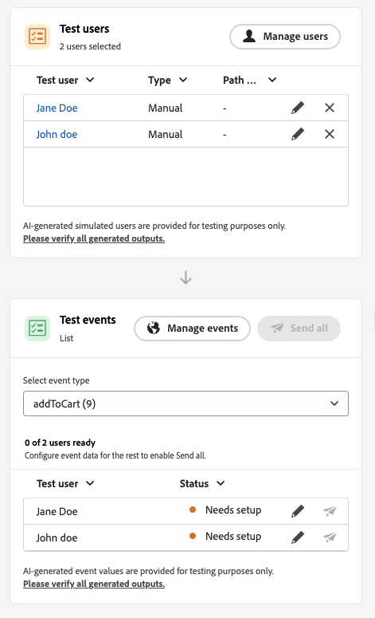

# Erste Schritte mit der Journey-Simulation {#simulate-journey-gs}

>[!BEGINSHADEBOX]

**Auf dieser Seite** Erfahren Sie, wie Sie mit der Journey-Simulation mit simulierten Benutzenden testen können und wie das Simulationserlebnis je nach Journey-Typ vor der Veröffentlichung variiert.

>[!ENDSHADEBOX]

>[!IMPORTANT]
>
>* Um **[!UICONTROL Simulation]** zu verwenden, weisen Sie mindestens eine Berechtigung aus der **[!UICONTROL Journey]**-Funktion zu: **Journey simulieren**, **Journey** oder **Genehmigen und veröffentlichen**. Mit denselben Berechtigungen können Sie simulierte Benutzer erstellen und verwalten. **[!UICONTROL simulierte Benutzer]**-Berechtigungen sind nicht erforderlich. [Weitere Informationen](../administration/permissions.md)
>
>* Um simulierte Benutzer ohne **[!UICONTROL Simulation]** zu verwalten, weisen Sie **Simulierte Benutzer verwalten** oder **Simulierte Benutzer anzeigen** über die Funktion **[!UICONTROL Simulierte Benutzer]** zu.
>
>* Weisen Sie für KI in der Simulation **[!UICONTROL Schnellsimulation]** KI-generierte Benutzer, **[!UICONTROL Ereigniswerte generieren]**) **[!UICONTROL Inhalt generieren]** der Funktion **[!UICONTROL KI-Assistent]** zu.

Sie können die Journey auf **[!UICONTROL Simulation]** zusätzlich zu **Entwurf**, **Testmodus** und **Live** einstellen. In der Simulation testen Sie mit **simulierten Benutzern** temporären profilähnlichen Entitäten, die Sie hinzufügen, ohne persistente Testprofile in Adobe Experience Platform zu verwenden.

Adobe Journey Optimizer bietet zwei Möglichkeiten zum Testen und Validieren Ihres Journey:

* **[Simulation](simulate-journey.md#test-users)**: Verwenden Sie die **[!UICONTROL Simulation]** Journey-Funktion und simulierte Benutzende ohne vorab erstellte Profile in Adobe Experience Platform, wobei sowohl KI-gestützte als auch manuell erstellte Benutzende unterstützt werden.

* **[Testmodus](testing-the-journey.md)**: Verwenden Sie beständige Profile, die in Adobe Experience Platform als Testprofile gekennzeichnet und sitzungsübergreifend wiederverwendet werden. Wählen Sie diesen Ansatz, wenn Sie konsistente, vordefinierte Daten benötigen. [Erfahren Sie, wie Sie Testprofile erstellen](../audience/creating-test-profiles.md).

## Simulation nach Journey-Typ {#by-journey-type}

Das **[!UICONTROL Simulation]**-Bedienfeld zeigt nur die Schritte an, die Ihr Journey benötigt. Das hängt davon ab, wie Profile auf die Journey gelangen. Aus diesen Gründen werden in Adobe Journey Optimizer unterschiedliche Simulationserlebnisse angezeigt. Erweitern Sie die einzelnen unten stehenden Typen, um zu sehen, wie sich die Ausführung unterscheidet und welche Bedienfelder Sie verwenden.

Weitere Informationen finden Sie unter [Journey simulieren](simulate-journey.md).

+++ Batch-Journey mit einer „Zielgruppe lesen“

Das Journey wird von „Zielgruppe lesen **[!UICONTROL ausgelöst]** und die Arbeitsfläche hat keine unitären Ereignisaktivitäten. Während der Simulation wird die Zielgruppen-Population nicht ausgelöst. Nur simulierte Benutzende treten in die Journey ein.
Die für die Simulation ausgewählten simulierten Benutzer werden im Abschnitt **Testbenutzer** angezeigt:

+++

+++ Batch-Journey mit einer gelesenen Zielgruppe und unitären Ereignissen

Eine Segment-Trigger-Journey, die ein oder mehrere unitäre Ereignisse entlang des Pfads enthält. Sie simulieren zuerst Trigger, die in die Simulation eintreten sollen, und dann Trigger-Ereignisse für die Benutzer, die auf einen Ereignisknoten warten.
Für die Simulation ausgewählte simulierte Benutzende und konfigurierte Ereignisse werden in den Abschnitten Testbenutzende und Testereignisse angezeigt. Der Abschnitt Testereignisse wird erst angezeigt, wenn ein simulierter Benutzer auf die Journey zugreift.

+++

+++ Unitäres Journey

Die Journey beginnt mit einem unitären Ereignis, nicht mit der Aktivität „Zielgruppe lesen“. Ein simulierter Benutzer gibt die Journey erst dann ein, wenn dieses Startereignis für ihn ausgelöst wird.
Für die Simulation ausgewählte simulierte Benutzende und konfigurierte Ereignisse werden in den Abschnitten **Testbenutzende** und **Testereignisse** angezeigt. Der Abschnitt **Testbenutzer** enthält keine Aktion zum Trigger eines simulierten Benutzers auf die Journey. Trigger-Eintrag von **Testereignisse**.

+++

## Simulation starten {#launch}

Wechseln Sie die Journey zu **[!UICONTROL Simulation]**, um sie mit simulierten Benutzenden zu testen. Eine schrittweise Anleitung finden Sie unter [Journey simulieren](simulate-journey.md).

1. Klicken Sie auf Ihrem Journey auf **[!UICONTROL Simulieren]** und wählen Sie **[!UICONTROL Simulation]**.

   

1. Warten Sie, bis die Aktivierung abgeschlossen ist. Während der Journey auf **[!UICONTROL Simulation]** umschaltet, werden die Bedienelemente im Bedienfeld deaktiviert und nach Abschluss der Aktivierung automatisch wieder aktiviert.

## Einschränkungen {#limitations}

In dieser Version unterstützt **[!UICONTROL Simulation]** möglicherweise nicht alle Aktivitäten, Kanäle oder Integrationen, die **[!UICONTROL Testmodus]** oder eine Live-Journey unterstützt, und das Verhalten kann sich ändern, wenn die Funktion ausgereift ist. Verwenden Sie diesen Artikel für unterstützte Workflows.

Weitere Informationen zu den Einschränkungen bei der Simulation finden Sie in den folgenden Dropdown-Listen.

+++ Einschränkungen auf Knotenebene

Einige Knoten verhindern, **[!UICONTROL Simulation]** gestartet wird. Andere führen eine Simulation mit dem unten beschriebenen Verhalten durch. Wenn ein Knoten vor der Simulation entfernt oder geändert werden muss, aktualisieren Sie zuerst die Journey.

| Eingeschränkter Knoten | Anmerkungen |
| --- | --- |
| Geschäftsereignisse | Sie können keine Journey ausführen, die mit einem Geschäftsereignis in **[!UICONTROL Simulation]** beginnen. |
| Zusätzliche ID (mehrfacher Wiedereintritt) | **[!UICONTROL Simulation]** startet nicht, wenn mehrere erneute Zugriffe aktiviert sind und derselbe simulierte Benutzer mehrere aktive Instanzen gleichzeitig haben könnte. |
| Knoten für Inhaltsentscheidung | Entfernen oder ändern Sie diese Aktivität, bevor Sie das Journey simulieren. |
| Datensatzsuche | **[!UICONTROL Simulation]** unterstützt keine Suche nach Kundendatensätzen anhand von Schlüsseln. Entfernen oder ändern Sie diese Aktivität, bevor Sie eine Simulation ausführen. |
| **[!UICONTROL Optimieren]** Aktivität | **[!UICONTROL Experiment]** und **[!UICONTROL Targeting-Regel]** werden nicht unterstützt. Entfernen oder ändern Sie den Knoten, bevor Sie simulieren.  Andere **[!UICONTROL Optimieren]**-Methoden verhalten sich wie folgt:  **[!UICONTROL Prozentuale Aufspaltung ]**: Journey Agent erstellt pro Verzweigung einen simulierten Benutzer und nicht gemäß den Prozentsätzen der Verzweigung. Zur Laufzeit wählt die Live-Auswertung die Verzweigung aus und sie kann sich vom generierten Pfad unterscheiden. Sie können eine Verzweigungsauswahl nicht verspotten. Um Benutzer zu steuern, verlassen Sie sich auf der Arbeitsfläche auf die Reihenfolge der Verzweigungen. Die oberste Verzweigung wird immer ausgewählt.  **[!UICONTROL Zeitbedingung]**: Bedingungen gelten zur Laufzeit wie auf einer Live-Journey. Beispielsweise können Benutzer bei einem Fenster von 8 :00 20 :00 nur durchlaufen, während die Simulation in diesem Fenster ausgeführt wird. Sie können die Ausführungszeit nicht verspotten. Stellen Sie die Bedingung so ein, dass sie mit der aktuellen Zeit beim Testen übereinstimmt.  **[!UICONTROL Date condition ]**: Bedingungen gelten zur Laufzeit wie auf einer Live-Journey. Beispielsweise ermöglicht ein Datum vom 8. Juni 2026 Benutzenden nur die Durchführung von Simulationen, die an diesem Datum ausgeführt werden. Sie können das Ausführungsdatum nicht nachahmen. Legen Sie die Bedingung beim Testen auf das aktuelle Datum fest.  **[!UICONTROL Profilbegrenzung]**: Begrenzungen werden während der Simulation nicht erzwungen. Journey Agent erstellt pro Verzweigung einen simulierten Benutzer. Sie können eine Verzweigungsauswahl nicht verspotten. Um Benutzer zu steuern, verlassen Sie sich auf der Arbeitsfläche auf die Reihenfolge der Verzweigungen. Die oberste Verzweigung wird immer ausgewählt. |
| Verzweigungen für Zeitüberschreitung und Fehler | Journey Agent generiert keine Benutzenden für Aktivitäts-Timeout oder Fehler-Verzweigungen. Benutzende geben diese Pfade nur ein, wenn während der Simulation eine echte Zeitüberschreitung oder ein Fehler auftritt. |
| Verzweigung für maximale Wartezeit (Ereignisaktivitäten) | Es werden simulierte Benutzende erstellt, aber bei **[!UICONTROL Manuellen Simulation]** entscheidet die Journey Agent nicht, wer in eine Verzweigung für die maximale Wartezeit für Ereignisse eintritt. Steuern Sie den Pfad, indem Sie das Ereignis senden oder nicht. Um beispielsweise eine Verzweigung für die maximale Wartezeit zu testen, warten Sie die konfigurierte maximale Wartezeit und senden Sie das Ereignis nicht. **[!UICONTROL Schnellsimulation]** kann Ereignisse automatisch senden oder zurückhalten, um Zeitüberschreitungszweige abzudecken. |
| Reaktionsereignisse | Reaktionsereignisse werden in der Simulation ausgeführt, aber die Aktion muss im wirklichen Leben geschehen. Beispiel: Für eine E-Mail-**Öffnen**-Reaktion muss die Korrekturabzugsnachricht geöffnet werden. Sie können Reaktionen in der Simulations-Benutzeroberfläche nicht nachahmen. |
| Externe Datenquellen | Aufrufe werden während der Simulation auf die gleiche Weise wie bei einer Live-Journey ausgeführt. Nachgelagerte Aktivitäten können die Antwort verwenden, sie jedoch nicht verspotten. Wenn ein Antwortwert eine **[!UICONTROL Optimieren]**-Aktivität einspeist, kann der Journey Agent diese Ausgabe nicht erfinden. Es werden nur Eingaben für den Aufruf generiert. Wenn ein Aufruf beispielsweise eine Profilstadt annimmt und Wetter zurückgibt, legt der Agent eine Stadt für den simulierten Benutzer fest und der Live-Aufruf gibt das Wetter zurück. |
| Benutzerdefinierte Aktionen | Das Verhalten entspricht externen Datenquellen. Ausgehende Anrufe werden real ausgeführt. Der Journey Agent füllt die Eingaben aus. Die Ergebnisse stammen aus der Live-Antwort. Antworten dürfen nicht verspottet werden. |
| Anreicherung externer Zielgruppenattribute | Journey, die personalisierte Attribute aus externen Zielgruppenquellen verwenden, beginnen nicht in **[!UICONTROL Simulation]**, wenn diese Validierung gilt. |

+++

 

+++ Funktionale Einschränkungen

Die folgenden Funktionen werden in „Simulation **[!UICONTROL nicht]**.

| Funktion | Anmerkungen |
| --- | --- |
| Ausstiegskriterien | Beim Ausführen von „Simulation“ werden **[!UICONTROL Beendigungskriterien]**. |
| [!DNL Adobe Journey Optimizer] von Entscheidungen innerhalb einer Aktion, z. B. E-Mail-Inhalt mit Adobe Journey Optimizer Decisioning | Es werden keine Aktions-Korrekturabzüge für Inhalte generiert, die [!DNL Adobe Journey Optimizer] Decisioning verwenden. |
| Pseudo-Antwort für benutzerdefinierte Aktionen | [!UICONTROL Benutzerdefinierte Aktionen] führen standardmäßig einen echten ausgehenden Aufruf aus. Das Mocking der Antwort, sodass kein externer Aufruf ausgeführt wird, wird nicht unterstützt. |
| Auswertung der Einverständnisrichtlinie | Das Einverständnis kann nicht auf der Ebene des simulierten Benutzers verspottet werden, und die Einverständnisrichtlinien werden während der Simulation nicht ausgewertet. |
| Journey-Begrenzung und Schlichtung | Während der Simulation weder ausgewertet noch durchgesetzt. |
| Frequenzlimitierung (nach Kanal oder Kommunikationstyp) | Während der Simulation weder ausgewertet noch durchgesetzt. |
| Opt-out-Verwaltung, Unterdrückung und Zulassungslisten | Wird während der Simulation weder ausgewertet noch angewendet. |
| Dynamische Subdomain und dynamische Attribute in Kanalkonfigurationen | Nicht unterstützt. |
| Sendezeitoptimierung (STO) | Wird während der Simulation weder ausgewertet noch angewendet. |
| Sandbox-Tools (simulierte Benutzer in Sandboxes kopieren) | Nicht unterstützt. |
| Senden von Schüben in Journey | Nicht unterstützt. |
| Ruhezeiten | Wird während der Simulation weder ausgewertet noch angewendet. |
| Privacy Service | Simulierte Benutzer sind nicht mit der DSGVO konform und haben keine persistenten Profile. Schließen Sie keine echten Kundendaten in simulierte Benutzende ein. |

+++

 

+++ Quantitative Schutzmaßnahmen 

Diese Schutzmaßnahmen gelten für **[!UICONTROL Simulation]**. Numerische Begrenzungen werden in der Journey-Oberfläche und zur Laufzeit erzwungen. Die Beschränkungen können sich in einer späteren Version ändern. Wenn Sie in der Nähe einer Decke laufen, überprüfen Sie das Verhalten in Ihrer Sandbox.

| Leitplanke | Limit | Anmerkungen |
| --- | --- | --- |
| Maximal simulierte Benutzende, die in einem Batch ausgewählt und ausgelöst werden können (Batch-Journey, ereignisgesteuerte Flüsse und Zielgruppen-Qualifizierungs-Flüsse) | 20 | Wird für jedes **[!UICONTROL Alle senden]** oder **[!UICONTROL vom Trigger ausgewählte]** gezählt, keine kumulative Begrenzung für die gesamte Journey. |
| Maximale Anzahl simulierter Benutzer pro Generierungsanfrage | 50 | Maximale Anzahl simulierter Benutzer, die Journey Agent in einer Anfrage durch **[!UICONTROL Schnellsimulation]** oder **[!UICONTROL Generieren mit KI]** in **[!UICONTROL Manuelle Simulation]** generiert Wenn die Journey mehr als **50 Pfade**, wählt die Journey Agent nach dem Zufallsprinzip Pfade aus, um diese **50** simulierten Benutzenden zu erzeugen. |
| Maximale Anzahl an eindeutigen simulierten Benutzern, die in einem einzigen Simulationslauf getestet werden | 100 | Erreichen von **100** eindeutigen Benutzern in einem Ausführungsblock **[!UICONTROL Wählen Sie simulierte]** aus) für neue simulierte Benutzer. Wenn Sie bei **90** sind, können Sie vor demselben Block höchstens **10** mehr hinzufügen. |
| Maximale Anzahl von Journey, die gleichzeitig in **[!UICONTROL Simulation]** in einer Sandbox ausgeführt werden können | 20 | Die Begrenzung wird von jeder **[!UICONTROL Simulation]**-Journey in dieser Sandbox gleichzeitig verwendet. |
| Maximale Anzahl aktiver simulierter Benutzer in einer Sandbox | 2,000 | Maximale Anzahl an simulierten Benutzern, die gleichzeitig in der Sandbox vorhanden sein können. Adobe kann diese Grenze auf der Grundlage von Kunden-Feedback anpassen. |
| Vorausfüllen des Ereignisses (nur Browser) | — | Sie können Payload-Felder für Ereignisse nur in der Browser-basierten Simulationsoberfläche vorab ausfüllen. Vorausgefüllte Werte bleiben in diesem Browser und werden nicht mit anderen Browsern, Geräten oder Sitzungen synchronisiert, sodass möglicherweise an jedem Ort, den Sie testen, andere Daten zum Vorbefüllen angezeigt werden. |

+++

+++ KI-Wissensreferenz

Dieser Abschnitt enthält strukturiertes Wissen zur Unterstützung von Interpretation, Abrufen und Antworten auf Fragen zu diesem Thema.

Zum vollständigen Verständnis sollten diese Informationen mit der Dokumentation auf dieser Seite kombiniert werden. Keine der beiden Quellen ist für Einzelpersonen gedacht. Die Seite beschreibt die Funktion, während dieser Abschnitt zusätzlichen Kontext bietet, der dabei hilft, Begriffe, Absichten, Anwendbarkeit und Begrenzungen zu unterscheiden.

* **TL;DR:** Auf dieser Seite wird die Journey-Simulationsfunktion in Adobe Journey Optimizer vorgestellt und erläutert, wie sie sich vom Testmodus unterscheidet, welche Journey-Typen sie unterstützt, wie eine Simulation gestartet wird und welche Einschränkungen auf Knotenebene, funktionell und quantitativ vorliegen.

**intents:**
* Den Unterschied zwischen Simulations- und Testmodus für die Validierung von Journey verstehen
* Starten einer Simulationssitzung für einen Batch-, Unitär- oder gemischten Journey-Typ
* Identifizieren Sie, welche Journey-Knoten die Ausführung von Simulation blockieren oder einschränken
* Bestimmen Sie, welche Funktionen während der Simulation nicht unterstützt werden (z. B. Einverständnis, Frequenzlimitierung, STOP).
* Planen Sie quantitative Leitplanken ein, z. B. die maximale Anzahl simulierter Benutzer pro Sandbox
* Entscheiden Sie je nach Testanforderungen, ob Sie die Schnellsimulation oder die manuelle Simulation verwenden möchten

**Glossar:**
* **Simulierte Benutzer**: Temporäre profilähnliche Entitäten, die für die Simulation erstellt wurden, ohne in Adobe Experience Platform *bestehen zu müssen (produktspezifisch)*
* **Simulation**: Ein Journey-Status (neben Entwurf, Testmodus und Live), der zum Testen mit simulierten Benutzenden und nicht mit persistenten Testprofilen verwendet wird *(produktspezifisch)*
* **Journey Agent**: Die KI-Komponente, die simulierte Benutzende, Ereigniswerte und Testeinstellungen während der Schnellsimulation und der KI-unterstützten manuellen Simulation generiert *(produktspezifisch)*
* **Schnellsimulation**: Eine automatisierte End-to-End-Simulationsausführung, die Benutzer und Ereignisse mit minimaler manueller Eingabe generiert *produktspezifisch)*
* **Manuelle Simulation**: Ein schrittweiser Simulationsmodus, bei dem Benutzer und Ereignisse einzeln erstellt und ausgelöst werden *(produktspezifisch)*

**Leitplanken:**
* Erfordert mindestens eine der Berechtigungen **Journey simulieren**, **Journey** oder **Journey genehmigen und veröffentlichen**
* KI-gestützte Simulationsfunktionen erfordern die Berechtigung **Inhalt generieren** über die Funktion KI-Assistent
* Es können maximal 20 simulierte Benutzende pro Trigger alle oder ausgewählte Ereignisse per Batch senden
* Maximal 50 simulierte Benutzer pro KI-Generierungsanfrage
* Maximal 100 eindeutige simulierte Benutzende pro einzelner Simulationsausführung
* Es können maximal 20 Journey gleichzeitig in einer Sandbox ausgeführt werden
* Maximal 2.000 aktive simulierte Benutzende in einer Sandbox auf einmal
* Vom Geschäftsereignis ausgelöste Journey können nicht simuliert werden
* Zusätzliche ID-Journey mit aktiviertem Mehrfachwiedereintritt können nicht simuliert werden
* Einverständnisrichtlinien, Frequenzlimitierung, Opt-out, STO und Ruhezeiten werden während der Simulation nicht ausgewertet
* Simulierte Benutzer dürfen keine echten Kundendaten enthalten (nicht DSGVO-konform)

**Terminologie:**
* Kanonischer Name: Simulation — Akronym: none — Varianten: Journey Simulation, Simulationsmodus
* Kanonischer Name: Simulierte Benutzer — Akronym: none — Varianten: Testbenutzer (in Benutzeroberflächen-Beschriftungen)
* Synonyme: „Simulation“ = „Simulationsmodus“; „Simulierte Benutzer“ = „Testbenutzer“ (nur UI-Kennzeichnung)
* Verwechseln Sie nicht: „Simulation“ ≠ „Testmodus“ (Testmodus verwendet persistente AEP-Testprofile; Simulation verwendet temporäre simulierte Benutzende)

**FAQ:**
* **F: Welche Berechtigungen benötige ich, um Simulation zu verwenden?** — Sie benötigen mindestens eines der folgenden Elemente: Journey simulieren, Journey veröffentlichen oder Journey genehmigen und veröffentlichen. KI-Funktionen erfordern außerdem die Berechtigung zum Generieren von Inhalten aus der KI-Assistentenfunktion.
* **Q: Wie unterscheidet sich die Simulation vom Testmodus?** — Simulation verwendet temporäre simulierte Benutzende, die ohne persistente Adobe Experience Platform-Profile direkt erstellt werden. Der Testmodus verwendet persistente Profile, die in AEP explizit als Testprofile gekennzeichnet sind.
* **F: Kann ich eine Journey simulieren, die mit einem Geschäftsereignis beginnt?** — Nein. Durch ein Geschäftsereignis ausgelöste Journey können nicht in der Simulation ausgeführt werden.
* **F: Wie viele simulierte Benutzer kann ich in einem einzelnen Simulationslauf testen?** - Bis zu 100 eindeutige simulierte Benutzer pro Durchgang; jede Aktion „Alle senden“ ist auf 20 Benutzer gleichzeitig begrenzt.
* **F: Werden Einverständnisrichtlinien während der Simulation durchgesetzt?** — Nein. Die Auswertung von Einverständnisrichtlinien, Frequenzlimitierung, Opt-out-Verwaltung und ruhige Stunden werden während der Simulation nicht ausgewertet.
* **F: Was passiert, wenn mein Journey während der KI-Generierung über mehr als 50 Pfade verfügt?** — Journey Agent wählt nach dem Zufallsprinzip Pfade aus, um maximal 50 simulierte Benutzende zu erzeugen.

+++
