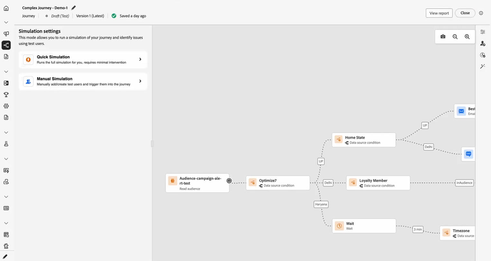
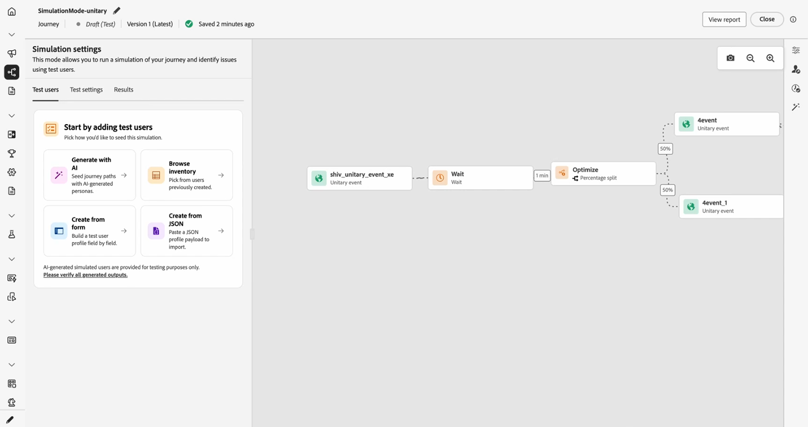

# Erste Schritte mit der Journey-Simulation {#simulate-journey-gs}

Sie können die Journey auf **[!UICONTROL Simulation]** zusätzlich zu **Entwurf**, **Testmodus** und **Live** einstellen. In der Simulation testen Sie mit **simulierten Benutzern** temporären profilähnlichen Entitäten, die Sie hinzufügen, ohne persistente Testprofile in Adobe Experience Platform zu verwenden.

Adobe Journey Optimizer bietet zwei Möglichkeiten zum Testen und Validieren Ihres Journey:

* **[Simulation](#test-users)**: Verwenden Sie die **[!UICONTROL Simulation]** Journey-Funktion und simulierte Benutzende für Schnellausführungen ohne vorab erstellte Profile in Adobe Experience Platform.

* **[Testmodus](testing-the-journey.md)**: Verwenden Sie beständige Profile, die in Adobe Experience Platform als Testprofile gekennzeichnet und sitzungsübergreifend wiederverwendet werden. Wählen Sie diesen Ansatz, wenn Sie konsistente, vordefinierte Daten benötigen. [Erfahren Sie, wie Sie Testprofile erstellen](../audience/creating-test-profiles.md).

## Simulation nach Journey-Typ {#by-journey-type}

Das **[!UICONTROL Simulation]**-Bedienfeld zeigt nur die Schritte an, die Ihr Journey benötigt. Das hängt davon ab, wie Profile auf die Journey gelangen. Aus diesen Gründen werden in Adobe Journey Optimizer unterschiedliche Simulationserlebnisse angezeigt. Erweitern Sie die einzelnen unten stehenden Typen, um zu sehen, wie sich die Ausführung unterscheidet und welche Bedienfelder Sie verwenden.

Weitere Informationen finden Sie unter [Journey simulieren](simulate-journey.md).

+++ Batch-Journey mit einer „Zielgruppe lesen“

Die Journey wird von einer „Zielgruppe lesen **ausgelöst**. Die Arbeitsfläche hat keine unitären Ereignisaktivitäten, Profile durchlaufen nur Bedingungen, Wartezeiten und Kanalaktionen.

Mit **Batch-Journey mit einer gelesenen Zielgruppe** können Sie auf die Schnellsimulation oder die manuelle Simulation zugreifen.

+++

+++ Batch-Journey mit einer gelesenen Zielgruppe und unitären Ereignissen

Eine Segment-Trigger-Journey, die ein oder mehrere unitäre Ereignisse entlang des Pfads enthält. Nach dem Senden von Benutzerereignissen in können Sie Benutzerereignisse für die Trigger erstellen, die auf einen Ereignisknoten warten.

Mit **Batch-Journey mit einer gelesenen Zielgruppe und unitären Ereignissen** können Sie auf die Schnellsimulation oder die manuelle Simulation zugreifen.

+++

+++ Unitäres Journey

Die Journey **startet** mit einem unitären Ereignis, nicht mit einer gelesenen Zielgruppe. Ein simulierter Benutzer gibt die Journey erst dann ein, wenn dieses Startereignis für ihn ausgelöst wird.

Mit **Unitäres Journey** greifen Sie direkt auf das Menü Manuelle Simulation zu.

+++

## Simulation starten {#launch}

Wechseln Sie die Journey zu **[!UICONTROL Simulation]**, um sie mit simulierten Benutzenden zu testen. Eine schrittweise Anleitung finden Sie unter [Journey simulieren](simulate-journey.md).

1. Klicken Sie auf Ihrem Journey auf **[!UICONTROL Simulieren]** und wählen Sie **[!UICONTROL Simulation]**.

   

1. Warten Sie, bis die Aktivierung abgeschlossen ist. Während der Journey auf **[!UICONTROL Simulation]** umschaltet, werden die Bedienelemente im Bedienfeld deaktiviert und nach Abschluss der Aktivierung automatisch wieder aktiviert.

## Einschränkungen {#limitations}

In dieser Version unterstützt **[!UICONTROL Simulation]** möglicherweise nicht alle Aktivitäten, Kanäle oder Integrationen, die **[!UICONTROL Testmodus]** oder eine Live-Journey unterstützt, und das Verhalten kann sich ändern, wenn die Funktion ausgereift ist. Verwenden Sie diesen Artikel für unterstützte Workflows.

Weitere Informationen zu den Simulationsbeschränkungen finden Sie in den folgenden Dropdown-Listen.

+++ Einschränkungen auf Knotenebene

Wenn eine Journey einen der folgenden Knoten enthält, kann sie nicht in „Simulation **[!UICONTROL gestartet]**. Bevor die Simulation ausgeführt werden kann, muss der Journey geändert oder der entsprechende Knoten entfernt werden.

| Eingeschränkter Knoten | Anmerkungen |
| --- | --- |
| Geschäftsereignisse | Journey, die mit einem Geschäftsereignis beginnen, können nicht in „Simulation **[!UICONTROL ausgeführt]**. |
| Zusätzliche ID (mehrfacher Wiedereintritt) | Der gleichzeitige erneute Eintritt (mehrere aktive Instanzen für denselben simulierten Benutzer) verhindert, dass **[!UICONTROL Simulation]** gestartet wird. |
| Knoten für Inhaltsentscheidung | Diese Aktivität muss entfernt oder geändert werden, bevor Sie das Journey simulieren können. |
| Datensatzsuche | Die Suche nach Kundendatensätzen anhand des Schlüssels wird nicht unterstützt. Journey, die diese Aktivität enthalten, können nicht in „Simulation **[!UICONTROL ausgeführt]**. |
| Experimentierpfad (optimieren — Experimentvariante) | Nicht unterstützt in **[!UICONTROL Simulation]**. Sie können weiterhin **[!UICONTROL Optimieren]** für Flüsse verwenden, die zuvor unter **[!UICONTROL Bedingung]** lebten (z. B. Datenquellenbedingungen). |
| Pfad-Targeting (Optimieren, Targeting-Regelvariante) | Nicht unterstützt in **[!UICONTROL Simulation]**. |
| Anreicherung externer Zielgruppenattribute | Journey, die personalisierte Attribute aus externen Zielgruppenquellen verwenden, beginnen nicht in **[!UICONTROL Simulation]**, wenn diese Validierung aktiv ist. |

+++

 

+++ Funktionale Einschränkungen

Die folgenden Funktionen werden in „Simulation **[!UICONTROL nicht]**.

| Funktion | Anmerkungen |
| --- | --- |
| Ausstiegskriterien | Beim Ausführen von „Simulation“ werden **[!UICONTROL Beendigungskriterien]**. |
| [!DNL Adobe Journey Optimizer] von Entscheidungen innerhalb einer Aktion (z. B. E-Mail-Inhalt mit Adobe Journey Optimizer Decisioning) | Es werden keine Aktions-Korrekturabzüge für Inhalte generiert, die [!DNL Adobe Journey Optimizer] Decisioning verwenden. |
| Pseudo-Antwort für benutzerdefinierte Aktionen | [!UICONTROL Benutzerdefinierte Aktionen] führen standardmäßig einen echten ausgehenden Aufruf aus. Das Mocking der Antwort, sodass kein externer Aufruf ausgeführt wird, wird nicht unterstützt. |
| Auswertung der Einverständnisrichtlinie | Das Einverständnis kann nicht auf der Ebene des simulierten Benutzers verspottet werden. |
| Journey-Begrenzung und Schlichtung | Nicht unterstützt in **[!UICONTROL Simulation]**. |
| Frequenzlimitierung (nach Kanal oder Kommunikationstyp) | Nicht unterstützt in **[!UICONTROL Simulation]**. |
| Opt-out-Verwaltung, Unterdrückung und Zulassungslisten | Folgt der Messaging-Routing-Konfiguration, wo sie gilt. |
| Dynamische Subdomain und dynamische Attribute in Kanalkonfigurationen | Folgt der Messaging-Routing-Konfiguration, wo sie gilt. |
| Sendezeitoptimierung (STO) | Nicht unterstützt in **[!UICONTROL Simulation]**. |
| Sandbox-Tools (simulierte Benutzer in Sandboxes kopieren) | Nicht unterstützt. |
| Senden von Schüben in Journey | Nicht unterstützt. |
| Ruhezeiten | Nicht unterstützt. |
| Opt-out-Verwaltung, Unterdrückung und Zulassungslisten | Nicht unterstützt. |
| Dynamische Subdomain und dynamische Attribute in Kanalkonfigurationen | Nicht unterstützt. |
| Privacy Service | Simulierte Benutzer sind nicht mit der DSGVO konform und haben keine persistenten Profile. Schließen Sie keine echten Kundendaten in simulierte Benutzende ein. |

+++

 

+++ Quantitative Schutzmaßnahmen 

Diese Schutzmaßnahmen gelten für **[!UICONTROL Simulation]**. Numerische Begrenzungen werden in der Journey-Oberfläche und zur Laufzeit erzwungen. Die Grenzwerte können sich in einer späteren Version ändern. Wenn Sie in der Nähe einer Decke ausgeführt werden, überprüfen Sie das Verhalten in Ihrer Sandbox.

| Leitplanke | Limit | Anmerkungen |
| --- | --- | --- |
| Maximal simulierte Benutzende, die in einem Batch ausgewählt und ausgelöst werden können (Batch-Journey, ereignisgesteuerte Flüsse und Zielgruppen-Qualifizierungs-Flüsse) | 20 | Wird für jedes **[!UICONTROL Alle senden]** oder **[!UICONTROL vom Trigger ausgewählte]** gezählt; keine kumulative Begrenzung für die gesamte Journey. |
| Maximale Anzahl an eindeutigen simulierten Benutzern, die in einem einzigen Simulationslauf getestet werden | 100 | Erreichen von **100** eindeutigen Benutzern in einem Ausführungsblock **[!UICONTROL Wählen Sie simulierte]** aus) für neue simulierte Benutzer. Wenn Sie bei **90** sind, können Sie vor demselben Block höchstens **10** mehr hinzufügen. |
| Maximale Anzahl von Journey, die gleichzeitig in **[!UICONTROL Simulation]** in einer Sandbox ausgeführt werden können | 20 | Die Begrenzung wird von jeder **[!UICONTROL Simulation]**-Journey in dieser Sandbox gleichzeitig verwendet. |
| Maximale Anzahl aktiver simulierter Benutzer in einer Sandbox | 2,000 | Maximale Anzahl an simulierten Benutzern, die gleichzeitig in der Sandbox vorhanden sein können. Adobe kann diese Grenze auf der Grundlage von Kunden-Feedback anpassen. |
| Vorausfüllen des Ereignisses (nur Browser) | — | Sie können Payload-Felder für Ereignisse nur in der Browser-basierten Simulationsoberfläche vorab ausfüllen. Vorausgefüllte Werte bleiben in diesem Browser und werden nicht mit anderen Browsern, Geräten oder Sitzungen synchronisiert, sodass möglicherweise an jedem Ort, den Sie testen, andere Daten zum Vorbefüllen angezeigt werden. |

+++
