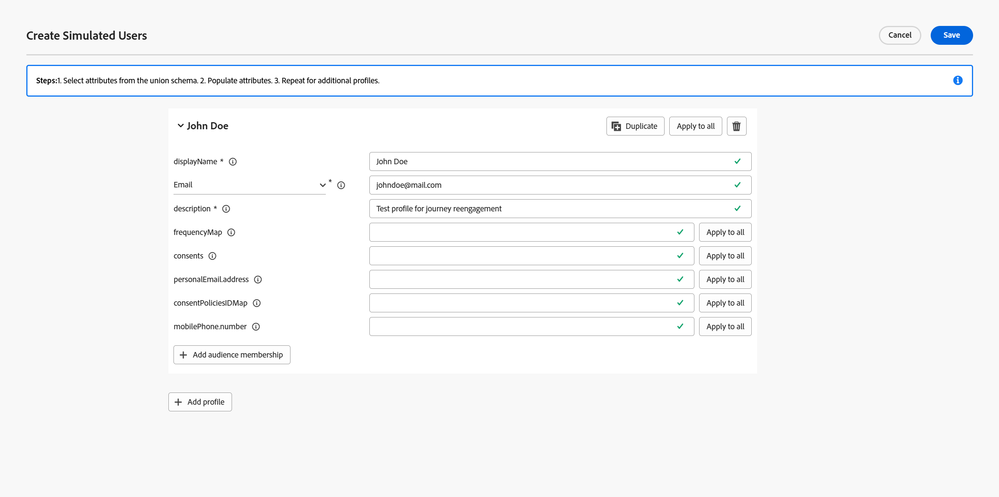
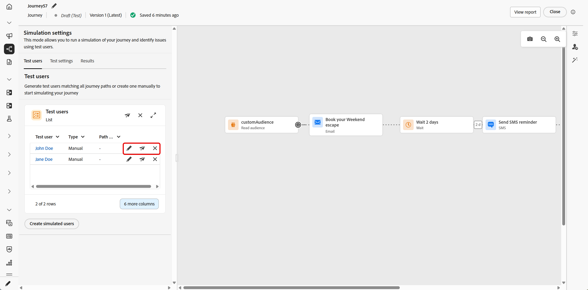
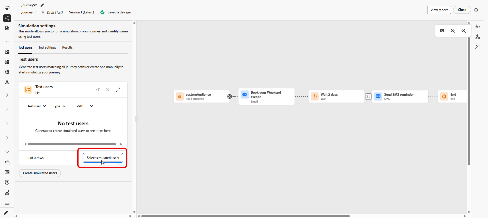
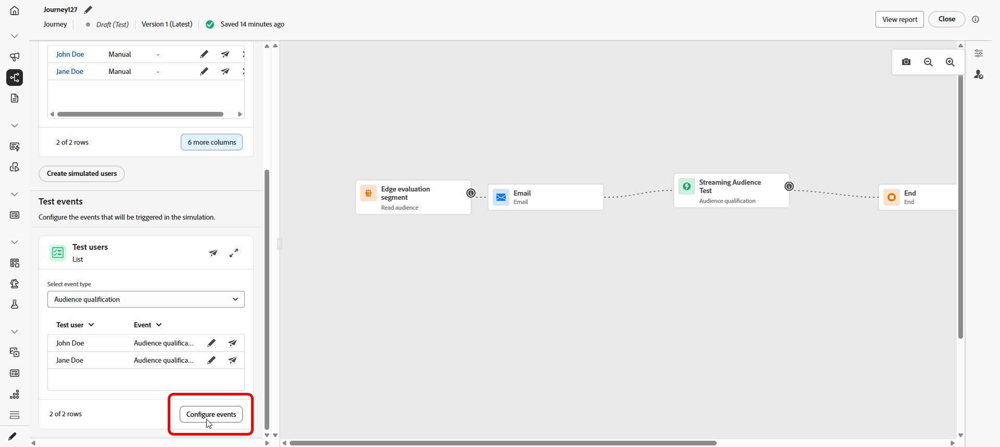
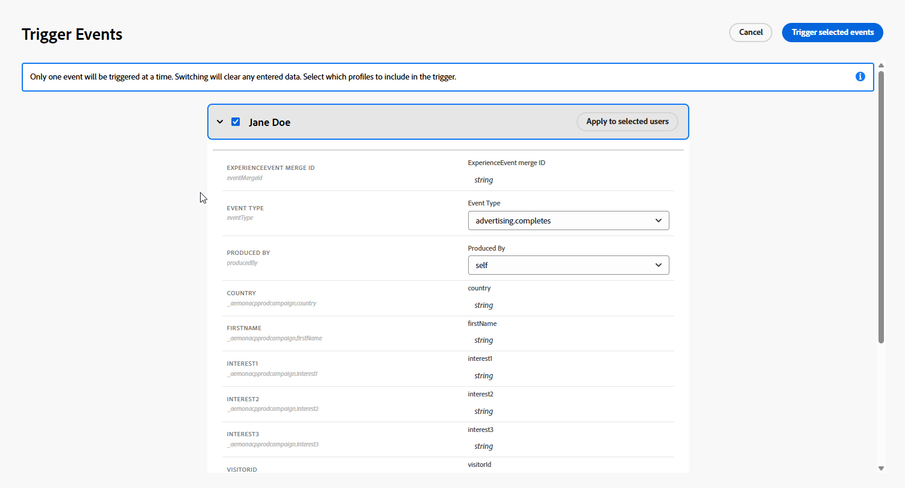

# Simulieren der Journey{#simulate-journey}

>[!IMPORTANT]
>
> Diese Funktion steht allen Kunden als eingeschränkte Verfügbarkeit mit wichtigen Funktionen zur Verfügung.

Sie können die Journey auf **[!UICONTROL Simulation]** zusätzlich zu **Entwurf**, **Testmodus** und **Live** einstellen. In der Simulation testen Sie mit **simulierten Benutzern** temporären profilähnlichen Entitäten, die Sie hinzufügen, ohne persistente Testprofile in Adobe Experience Platform zu verwenden.

Adobe Journey Optimizer bietet zwei Möglichkeiten zum Testen und Validieren Ihres Journey:

* **[Simulation](#test-users)**: Verwenden Sie die **[!UICONTROL Simulation]** Journey-Funktion und simulierte Benutzende für Schnellausführungen ohne vorab erstellte Profile in Adobe Experience Platform.

* **[Testmodus](testing-the-journey.md)**: Verwenden Sie beständige Profile, die in Adobe Experience Platform als Testprofile gekennzeichnet und sitzungsübergreifend wiederverwendet werden. Wählen Sie diesen Ansatz, wenn Sie konsistente, vordefinierte Daten benötigen. [Erfahren Sie, wie Sie Testprofile erstellen](../audience/creating-test-profiles.md).

Beachten Sie, dass Journey Simulation in **Eingeschränkte Verfügbarkeit** ist. Um Feedback zu geben und uns zu helfen, das Erlebnis zu verbessern, öffnen Sie **[!UICONTROL Feedback]** in der oberen Leiste.

## Erstellen und Verwalten simulierter Benutzer {#test-users}

>[!IMPORTANT]
>
>Sie benötigen die Berechtigung **Journey simulieren**, um auf die Funktion **[!UICONTROL Simulation]** zugreifen zu können. [Weitere Informationen](../administration/permissions.md)

Simulierte Benutzer sind temporäre profilähnliche Entitäten, die Sie in &quot;**[!UICONTROL &quot;]**. In diesem Abschnitt wird beschrieben, wie Sie sie über die Benutzeroberfläche oder eine JSON-Datei erstellen, zur Wiederverwendung speichern, anpassen oder aus der Liste entfernen und an die Journey senden.

### Erstellen simulierter Benutzer

Die folgenden Schritte zeigen Ihnen, wie Sie simulierte Benutzer über die Benutzeroberfläche oder durch Importieren einer JSON-Datei erstellen.

1. Öffnen Sie auf Ihrem Journey **[!UICONTROL Simulieren]** und wählen Sie **[!UICONTROL Simulation]**.

   

1. Klicken Sie **[!UICONTROL Simulierte Benutzer erstellen]**, um neue Benutzer zu erstellen, und wählen Sie aus, ob Benutzer über die Benutzeroberfläche erstellt oder aus JSON importiert werden sollen.

   Um stattdessen simulierte Benutzer wiederzuverwenden, klicken Sie auf **[!UICONTROL Simulierte Benutzer auswählen]** und wählen Sie zuvor gespeicherte Einträge aus.

   

1. Wenn Sie simulierte Benutzer aus JSON erstellen, aktualisieren Sie die entsprechenden Felder mit Ihren simulierten Benutzerdaten.

1. Wenn Sie simulierte Benutzer über die Benutzeroberfläche erstellen, geben Sie einen **[!UICONTROL Anzeigenamen]** und **[!UICONTROL Beschreibung]** ein, um diesen simulierten Benutzer zu identifizieren. Wählen Sie dann die Attribute aus dem Vereinigungsschema aus, die Sie für diesen Benutzer ausfüllen möchten.

   

1. Klicken Sie auf **[!UICONTROL Zielgruppenzugehörigkeit]**, um Segmentzugehörigkeiten zu simulieren.

1. Klicken Sie **[!UICONTROL Profil hinzufügen]**, um mehrere simulierte Benutzer in einer Sitzung zu erstellen.

1. Für jeden simulierten Benutzer, den Sie in dieser Sitzung hinzugefügt haben, können Sie die folgenden Aktionen verwenden:

   * **[!UICONTROL Duplizieren]**: Fügt einen neuen simulierten Benutzer hinzu, der die abgeschlossene Konfiguration eines vorhandenen Eintrags repliziert. Anschließend können Sie das Duplikat nach Bedarf bearbeiten.
   * **[!UICONTROL Auf alle anwenden]**: Gibt die Attributwerte oder -einstellungen von einem simulierten Benutzer an jeden anderen simulierten Benutzer in der Liste weiter.
   * **[!UICONTROL Löschen]**: Entfernt den ausgewählten simulierten Benutzer aus der Liste.

1. Klicken Sie **[!UICONTROL Speichern]**, um einen oder mehrere simulierte Benutzer für die zukünftige Verwendung zu speichern.

1. Nach dem Speichern werden die erstellten simulierten Benutzer in der Liste **[!UICONTROL Testbenutzer]** angezeigt. Öffnen Sie für jeden Eintrag das Optionsmenü und wählen Sie eine der folgenden Optionen aus:

   * : Aktualisieren Sie die Details des simulierten Benutzers.
   * : Führen Sie die Simulation nur für diesen simulierten Benutzer aus.
   * : Entfernen Sie den Benutzer aus dieser Liste. Der simulierte Benutzer wird nicht gelöscht und bleibt in der Auswahl Simulierte Benutzer verfügbar.

   

1. Wenn Ihr Journey eine Aktivität **[!UICONTROL Warten]** enthält, öffnen Sie die Registerkarte **[!UICONTROL Testeinstellungen]**, um die Dauer dieser Wartezeit während der Simulation genau abzustimmen.

1. Klicken Sie **[!UICONTROL Alle senden]**, um alle simulierten Benutzenden in der Liste auf die Journey zu senden. Wenn die simulierten Benutzenden die Journey erfolgreich betreten haben, wird eine `Simulated users have been sent successfully.`-Bestätigungsmeldung angezeigt.

   

1. Rufen Sie die **[!UICONTROL Ergebnisse]** auf, um das Ausführungsprotokoll zu öffnen und die Ausführung der einzelnen Schritte zu überprüfen. Weitere Informationen finden Sie unter [Ergebnisse anzeigen](#viewing-results).

Nachdem Sie die Journey in **[!UICONTROL Simulation]** validiert haben, überprüfen Sie das **[!UICONTROL Ergebnisse]**-Protokoll. Wenn Fehler auftreten, lassen Sie **[!UICONTROL Simulation]**, wenden Sie die erforderlichen Änderungen auf die Journey an und führen Sie **[!UICONTROL Simulation]** erneut aus, bis der Durchlauf korrekt aussieht. Sie können dann die Journey veröffentlichen. Siehe [Veröffentlichen des Journey](../building-journeys/publish-journey.md).

### Simulierte Benutzer auswählen

Die von Ihnen manuell erstellten simulierten Benutzenden werden gespeichert und können aus dieser Liste ausgewählt werden, wenn die Simulation für andere Journey aktiviert ist.

1. Stellen Sie die Journey auf **[!UICONTROL Simulation]** ein. Öffnen Sie den Einstiegspunkt **[!UICONTROL Simulieren]** und wählen Sie **[!UICONTROL Simulation]** aus, sodass die Journey je nach Arbeitsbereich die Simulationsfunktion verwendet, z. B. neben dem Testmodus oder Live.

   

1. Im Bedienfeld **[!UICONTROL Simulationseinstellungen]** können Sie entweder zuvor erstellte simulierte Benutzer auswählen und auf **[!UICONTROL Simulierte Benutzer auswählen]** klicken.

   

1. Wählen Sie aus der Liste der simulierten Benutzer, die zuvor erstellt und gespeichert wurden.

1. Nachdem Sie die simulierten Benutzer ausgewählt haben, sind sie jetzt in der Liste **[!UICONTROL Testbenutzer]** verfügbar. Wählen Sie im Optionsmenü eine der folgenden Optionen aus:

   * , um Benutzer zu bearbeiten und ihre Details zu ändern.
   * , um Ihre Simulation nur an einen simulierten Benutzer zu senden.
   * , um die simulierten Benutzer aus der Liste zu löschen. Beachten Sie, dass durch Löschen der Schaltfläche sie nicht gelöscht wird, sie dennoch aus der Liste „Simulierte Benutzer“ ausgewählt werden kann.

   

1. Klicken Sie **[!UICONTROL Alle senden]**, um alle simulierten Benutzenden in der Liste auf die Journey zu senden. Wenn die simulierten Benutzenden die Journey erfolgreich betreten haben, wird eine `Simulated users entered the journey successfully.`-Bestätigungsmeldung angezeigt.

   

1. Rufen Sie die **[!UICONTROL Ergebnisse]** auf, um das Ausführungsprotokoll zu öffnen und die Ausführung der einzelnen Schritte zu überprüfen. Weitere Informationen finden Sie unter [Ergebnisse anzeigen](#viewing-results).

Nachdem Sie die Journey in **[!UICONTROL Simulation]** validiert haben, überprüfen Sie das **[!UICONTROL Ergebnisse]**-Protokoll. Wenn Fehler auftreten, lassen Sie **[!UICONTROL Simulation]**, wenden Sie die erforderlichen Änderungen auf die Journey an und führen Sie **[!UICONTROL Simulation]** erneut aus, bis der Durchlauf korrekt aussieht. Sie können dann die Journey veröffentlichen. Siehe [Veröffentlichen des Journey](../building-journeys/publish-journey.md).

## Auslösen Ihrer Ereignisse {#firing_events}

Wenn Ihr Journey ein oder mehrere Ereignisse enthält, können Sie diese mit einem Trigger versehen, während die Simulation aktiv ist.

1. Wählen **[!UICONTROL unter „Ereignistyp]**&quot; das Ereignis aus, das für diese Simulation ausgelöst werden soll.

   

1. Klicken Sie **[!UICONTROL Ereignisse konfigurieren]**, um den Editor zu öffnen und das Ereignis nach Bedarf anzupassen. Um die Payload nur für einen bestimmten simulierten Benutzer zu ändern, klicken Sie  neben diesem Benutzer.

   

1. Geben Sie in der Ansicht **&#x200B;**&#x200B;Benutzerereignis“ an, welche simulierten Trigger in die Ausführung aufgenommen werden sollen. Die Ereigniskonfiguration gilt jeweils für ein einzelnes Ereignis. Durch Ändern des ausgewählten Ereignisses oder der Gruppe eingeschlossener Benutzer werden zuvor eingegebene Feldwerte zurückgesetzt. Vervollständigen Sie die aktuelle Konfiguration, bevor Sie eine der Auswahlmöglichkeiten ändern.

   

1. Klicken Sie auf **[!UICONTROL Fertig]**.

1. Wählen Sie dann **[!UICONTROL Testereignisse]** entweder die Option **[!UICONTROL Alle senden]** aus, um jeden unter **[!UICONTROL Testbenutzer]** aufgelisteten simulierten Benutzer auf die Journey zu senden, oder wählen Sie  aus, damit ein einzelner Benutzer die Simulation nur für diesen Benutzer ausführt.

1. Rufen Sie die **[!UICONTROL Ergebnisse]** auf, um das Ausführungsprotokoll zu öffnen und die Ausführung der einzelnen Schritte zu überprüfen. Weitere Informationen finden Sie unter [Ergebnisse anzeigen](#viewing-results).

## Anzeigen von Ergebnissen {#viewing-results}

Auf **[!UICONTROL Registerkarte]** Ergebnisse“ können Sie die Testergebnisse anzeigen. Wählen **[!UICONTROL in der Dropdown]** Liste Testbenutzer den simulierten Benutzer aus, dessen Ausführung Sie überprüfen möchten.

<!--
* **All simulated users**: Select **[!UICONTROL All]** to see results aggregated across every simulated user in the run. This view helps you scan the full simulation at a glance, activity, outcomes, and errors, without picking a single simulated user first.
-->

Für jede Aktivität kann das Protokoll anzeigen, ob der simulierte Benutzer in den Schritt eingetreten ist oder ihn verlassen hat, sowie auf Fehler, die während der Simulation aufgetreten sind.

Bei **Warten**-Aktivitäten enthält das Protokoll zwei durationsbezogene Werte:

* **Definierte Dauer**: Die Dauer, die auf der Aktivität **Warten** für die veröffentlichte Journey angegeben und angewendet wird, sobald die Journey live ist. Im Protokoll wird aufgezeichnet, ob Simulation eine Überschreibung aus den Testeinstellungen vornimmt (z. B. 10 Sekunden), anstatt sich ausschließlich auf den auf der Journey definierten Wert zu verlassen.
* **Tatsächliche Dauer**: Die verstrichene Zeit, die der simulierte Benutzer auf der **Warten**-Aktivität verblieb. Dieser Wert wird auf der Registerkarte **[!UICONTROL Testeinstellungen]** festgelegt.

Wenn Fehler im Protokoll angezeigt werden, verlassen Sie **Simulation**, wenden Sie die erforderlichen Änderungen an der Journey an und führen Sie **Simulation** erneut aus. Nach erfolgreicher Validierung veröffentlichen Sie die Journey. Siehe [Veröffentlichen des Journey](../building-journeys/publish-journey.md).

## Einschränkungen {#limitations}

In dieser Version unterstützt **[!UICONTROL Simulation]** möglicherweise nicht alle Aktivitäten, Kanäle oder Integrationen, die **[!UICONTROL Testmodus]** oder eine Live-Journey unterstützt, und das Verhalten kann sich ändern, wenn die Funktion ausgereift ist. Verwenden Sie die Verfahren in diesem Artikel für unterstützte Workflows.

Weitere Informationen zu den Simulationsbeschränkungen finden Sie in den folgenden Dropdown-Listen.

+++ Einschränkungen auf Knotenebene

Wenn eine Journey einen der folgenden Knoten enthält, kann sie nicht in „Simulation **[!UICONTROL gestartet]**. Bevor die Simulation ausgeführt werden kann, muss der Journey geändert oder der entsprechende Knoten entfernt werden.

| Eingeschränkter Knoten | Anmerkungen |
| --- | --- |
| Geschäftsereignisse | Journey, die mit einem Geschäftsereignis beginnen, können nicht in „Simulation **[!UICONTROL ausgeführt]**. |
| Zusätzliche ID (mehrfacher Wiedereintritt) | Der gleichzeitige erneute Eintritt (mehrere aktive Instanzen für denselben simulierten Benutzer) verhindert, dass **[!UICONTROL Simulation]** gestartet wird. |
| Knoten für Inhaltsentscheidung | Diese Aktivität muss entfernt oder geändert werden, bevor Sie das Journey simulieren können. |
| Datensatzsuche | Die Suche nach Kundendatensätzen anhand des Schlüssels wird nicht unterstützt. Journey, die diese Aktivität enthalten, können nicht in „Simulation **[!UICONTROL ausgeführt]**. |
| Experimentierpfad (optimieren — Experimentvariante) | Nicht unterstützt in **[!UICONTROL Simulation]**. Sie können weiterhin **[!UICONTROL Optimieren]** für Flüsse verwenden, die zuvor unter **[!UICONTROL Bedingung]** lebten (z. B. Datenquellenbedingungen). |
| Pfad-Targeting (Optimieren, Targeting-Regelvariante) | Nicht unterstützt in **[!UICONTROL Simulation]**. |
| Anreicherung externer Zielgruppenattribute | Journey, die personalisierte Attribute aus externen Zielgruppenquellen verwenden, beginnen nicht in **[!UICONTROL Simulation]**, wenn diese Validierung aktiv ist. |

+++

 

+++ Funktionale Einschränkungen

Die folgenden Funktionen werden in „Simulation **[!UICONTROL nicht]**.

| Funktion | Anmerkungen |
| --- | --- |
| Ausstiegskriterien | Beim Ausführen von „Simulation“ werden **[!UICONTROL Beendigungskriterien]**. |
| [!DNL Adobe Journey Optimizer] von Entscheidungen innerhalb einer Aktion (z. B. E-Mail-Inhalt mit Adobe Journey Optimizer Decisioning) | Es werden keine Aktions-Korrekturabzüge für Inhalte generiert, die [!DNL Adobe Journey Optimizer] Decisioning verwenden. |
| Pseudo-Antwort für benutzerdefinierte Aktionen | [!UICONTROL Benutzerdefinierte Aktionen] führen standardmäßig einen echten ausgehenden Aufruf aus. Das Mocking der Antwort, sodass kein externer Aufruf ausgeführt wird, wird nicht unterstützt. |
| Auswertung der Einverständnisrichtlinie | Das Einverständnis kann nicht auf der Ebene des simulierten Benutzers verspottet werden. |
| Journey-Begrenzung und Schlichtung | Nicht unterstützt in **[!UICONTROL Simulation]**. |
| Frequenzlimitierung (nach Kanal oder Kommunikationstyp) | Nicht unterstützt in **[!UICONTROL Simulation]**. |
| Opt-out-Verwaltung, Unterdrückung und Zulassungslisten | Folgt der Messaging-Routing-Konfiguration, wo sie gilt. |
| Dynamische Subdomain und dynamische Attribute in Kanalkonfigurationen | Folgt der Messaging-Routing-Konfiguration, wo sie gilt. |
| Sendezeitoptimierung (STO) | Nicht unterstützt in **[!UICONTROL Simulation]**. |
| Sandbox-Tools (simulierte Benutzer in Sandboxes kopieren) | Nicht unterstützt. |
| Senden von Schüben in Journey | Nicht unterstützt. |
| Ruhezeiten | Nicht unterstützt. |
| Opt-out-Verwaltung, Unterdrückung und Zulassungslisten | Nicht unterstützt. |
| Dynamische Subdomain und dynamische Attribute in Kanalkonfigurationen | Nicht unterstützt. |
| Privacy Service | Simulierte Benutzer sind nicht mit der DSGVO konform und haben keine persistenten Profile. Schließen Sie keine echten Kundendaten in simulierte Benutzende ein. |

+++

 

+++ Quantitative Schutzmaßnahmen 

Diese Schutzmaßnahmen gelten für **[!UICONTROL Simulation]**. Numerische Begrenzungen werden in der Journey-Oberfläche und zur Laufzeit erzwungen. Die Grenzwerte können sich in einer späteren Version ändern. Wenn Sie in der Nähe einer Decke ausgeführt werden, überprüfen Sie das Verhalten in Ihrer Sandbox.

| Leitplanke | Limit | Anmerkungen |
| --- | --- | --- |
| Maximal simulierte Benutzende, die in einem Batch ausgewählt und ausgelöst werden können (Batch-Journey, ereignisgesteuerte Flüsse und Zielgruppen-Qualifizierungs-Flüsse) | 20 | Wird für jedes **[!UICONTROL Alle senden]** oder **[!UICONTROL vom Trigger ausgewählte]** gezählt; keine kumulative Begrenzung für die gesamte Journey. |
| Maximale Anzahl an eindeutigen simulierten Benutzern, die in einem einzigen Simulationslauf getestet werden | 100 | Erreichen von **100** eindeutigen Benutzern in einem Ausführungsblock **[!UICONTROL Wählen Sie simulierte]** aus) für neue simulierte Benutzer. Wenn Sie bei **90** sind, können Sie vor demselben Block höchstens **10** mehr hinzufügen. |
| Maximale Anzahl von Journey, die gleichzeitig in **[!UICONTROL Simulation]** in einer Sandbox ausgeführt werden können | 20 | Die Begrenzung wird von jeder **[!UICONTROL Simulation]**-Journey in dieser Sandbox gleichzeitig verwendet. |
| Maximale Anzahl aktiver simulierter Benutzer in einer Sandbox | 2,000 | Maximale Anzahl an simulierten Benutzern, die gleichzeitig in der Sandbox vorhanden sein können. Adobe kann diese Grenze auf der Grundlage von Kunden-Feedback anpassen. |
| Vorausfüllen des Ereignisses (nur Browser) | — | Sie können Payload-Felder für Ereignisse nur in der Browser-basierten Simulationsoberfläche vorab ausfüllen. Vorausgefüllte Werte bleiben in diesem Browser und werden nicht mit anderen Browsern, Geräten oder Sitzungen synchronisiert, sodass möglicherweise an jedem Ort, den Sie testen, andere Daten zum Vorbefüllen angezeigt werden. |

+++
