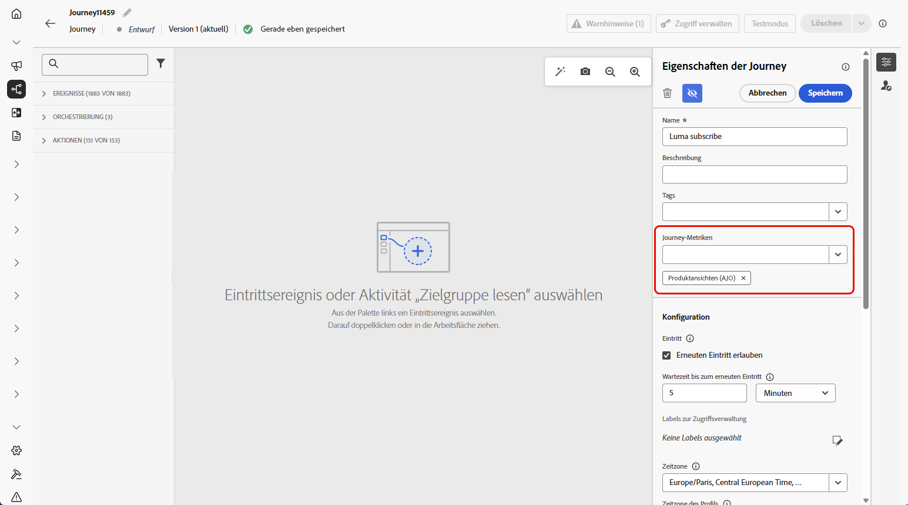

# Konfigurieren und Verfolgen der Journey-Metriken {#success-metrics}

Mit Journey-Metriken erhalten Sie einen klaren Einblick in die Effektivität Ihrer Customer Journeys. Dank dieser Funktion können Sie die Leistung anhand definierter KPIs verfolgen, Erkenntnisse zur Funktionsweise gewinnen und Bereiche mit Optimierungspotenzial identifizieren. Indem Sie die Wirkung in Echtzeit messen, haben Sie die Möglichkeit, kontinuierliche Verbesserungen zu fördern und datengestützte Entscheidungen zu treffen, die die Kundeninteraktion verbessern.

## Voraussetzungen {#prerequisites}

Bevor Journey-Metriken verwendet werden können, müssen Sie einen Datensatz mit den [Feldergruppen](https://experienceleague.adobe.com/docs/experience-platform/xdm/tutorials/create-schema-ui.html?lang=de#field-group){target="_blank"} `Commerce Details`, `Web` und `Mobile` unter „Konfiguration“ > „Reporting“ in Adobe Experience Platform hinzufügen.

Diese Feldergruppen müssen aus den integrierten Optionen ausgewählt werden, nicht aus benutzerdefinierten Gruppen. Weitere Informationen sind im Abschnitt [Hinzufügen von Datensätzen](../reports/reporting-configuration.md#add-datasets) verfügbar.

## Verfügbare Metriken {#metrics}

Die Liste der Metriken variiert abhängig von den [Feldergruppen](https://experienceleague.adobe.com/docs/experience-platform/xdm/tutorials/create-schema-ui.html?lang=de#field-group){target="_blank"} in Ihrem Datensatz.

Wenn Ihr Datensatz nicht konfiguriert ist, sind nur die folgenden Metriken verfügbar: **[!UICONTROL Klick]**, **[!UICONTROL Einzelklick]**, **[!UICONTROL Klickrate]** und **[!UICONTROL Öffnungsrate]**.

Beachten Sie, dass Sie mit einer Customer Journey Analytics-Lizenz benutzerdefinierte Erfolgsmetriken erstellen können. [Weitere Informationen](https://experienceleague.adobe.com/de/docs/analytics-platform/using/cja-components/cja-calcmetrics/cm-workflow/participation-metric)

| Metriken | Verwandte Feldergruppe |
|-|-|
| Klicks | Keine Feldergruppe erforderlich |
| Einzelklicks | Keine Feldergruppe erforderlich |
| Clickthrough-Rate (CTR) | Keine Feldergruppe erforderlich |
| Klick-Öffnungsrate (CTOR) | Keine Feldergruppe erforderlich |
| Seitenansichten | Web-Feldergruppe |
| Mobile-App-Starts | Mobile-Feldergruppe |
| Erste Mobile-App-Starts | Mobile-Feldergruppe |
| Mobile-App-Installationen | Mobile-Feldergruppe |
| App-Upgrades | Mobile-Feldergruppe |
| Käufe | Commerce-Details-Feldergruppe |
| Checkouts | Commerce-Details-Feldergruppe |
| Hinzufügungen zum Warenkorb | Commerce-Details-Feldergruppe |
| Öffnungen des Warenkorbs | Commerce-Details-Feldergruppe |
| Warenkorbansichten | Commerce-Details-Feldergruppe |
| Entnahmen aus Warenkorb | Commerce-Details-Feldergruppe |
| Produktansichten | Commerce-Details-Feldergruppe |
| Für später speichern | Commerce-Details-Feldergruppe |

## Attribution {#attribution}

Jede Metrik enthält eine festgelegte Attribution, die bestimmt, welche Touchpoints oder Interaktionen zu einem bestimmten Ergebnis beigetragen haben.

* **Metrikattribution mit Journey Optimizer-Lizenz**:

  Mit der Journey Optimizer-Lizenz allein ist das maximal verfügbare Lookback-Fenster für eine ausgewählte Metrik auf 7 Tage festgelegt. Für diese Metriken ist das Attributionsmodell standardmäßig auf **Letztkontakt** festgelegt, d. h. auf die letzte Interaktion vor der Konversion.

  Sie können beispielsweise verfolgen, ob ein Kauf getätigt wurde, nachdem eine Kundin oder ein Kunde innerhalb der letzten 7 Tage mit Ihrer Journey interagiert hat.

* **Metrikattribution mit Customer Journey Analytics-Lizenz**:

  Mit Journey Optimizer- und Customer Journey Analytics-Lizenz können Sie benutzerdefinierte Metriken mit bestimmten Attributionseinstellungen erstellen oder die Attributionen der integrierten Metriken ändern.

  Weitere Informationen zu [Attributionsmodellen](https://experienceleague.adobe.com/de/docs/analytics-platform/using/cja-dataviews/component-settings/attribution#attribution-models)

## Zuweisen der Journey-Metriken {#assign}

>[!IMPORTANT]
>
>Pro Journey ist nur eine Journey-Metrik zulässig. 

Gehen Sie wie unten beschrieben vor, um mit dem Tracking Ihrer Journey-Metriken zu beginnen:

1. Klicken Sie im Menü **[!UICONTROL Journeys]** auf **[!UICONTROL Journey erstellen]**.

1. Bearbeiten Sie den Konfigurationsbereich der Journey, um den Namen der Journey zu definieren und ihre Eigenschaften festzulegen. Informationen zum Festlegen der Eigenschaften Ihrer Journey finden Sie auf [dieser Seite](../building-journeys/journey-properties.md).

1. Wählen Sie die **[!UICONTROL Journey-Metriken]** zur Messung der Effektivität Ihrer Journey.

   Beachten Sie, dass die Metriken für die Journey selbst und für alle Elemente der Journey gelten.

   

1. Klicken Sie auf **[!UICONTROL Speichern]**.

1. Entwerfen Sie Ihre Journey mit den erforderlichen **[!UICONTROL Aktivitäten]**.

1. Testen und veröffentlichen Sie Ihre Journey.

1. Öffnen Sie den Journey-Bericht, um die Leistung der zugewiesenen Erfolgsmetriken zu verfolgen.

   Die gewählten Metriken werden in den KPIs und der Tabelle „Journey-Statistiken“ des Berichts angezeigt.

   

