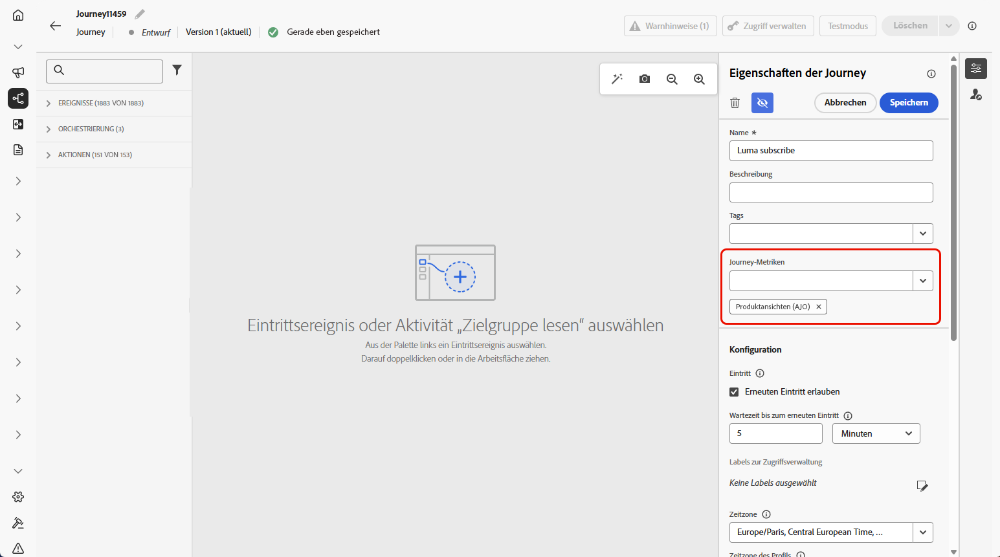
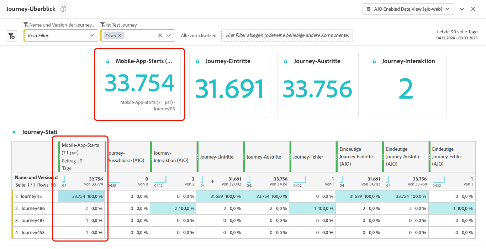

# Konfigurieren und Verfolgen der Journey-Metriken {#success-metrics}

>[!BEGINSHADEBOX]

**Auf dieser Seite:** Erfahren Sie, wie Sie Journey-Metriken konfigurieren und zuweisen, um die Performance anhand Ihrer KPIs zu verfolgen und die Effektivität Ihrer Kunden-Journey in Echtzeit zu messen.

>[!ENDSHADEBOX]

Mit Journey-Metriken erhalten Sie einen klaren Einblick in die Effektivität Ihrer Customer Journeys. Dank dieser Funktion können Sie die Leistung anhand definierter KPIs verfolgen, Erkenntnisse zur Funktionsweise gewinnen und Bereiche mit Optimierungspotenzial identifizieren. Indem Sie die Wirkung in Echtzeit messen, haben Sie die Möglichkeit, kontinuierliche Verbesserungen zu fördern und datengestützte Entscheidungen zu treffen, die die Kundeninteraktion verbessern.

## Voraussetzungen {#prerequisites}

Bevor Sie Ihre Journey-Metriken verwenden können, müssen Sie einen Datensatz hinzufügen, der die `Commerce Details`, `Web` und `Mobile`[&#x200B; Feldergruppen](https://experienceleague.adobe.com/docs/experience-platform/xdm/tutorials/create-schema-ui.html?lang=de#field-group){target="_blank"} unter „Konfiguration“ > „Berichte“ in [!DNL Adobe Experience Platform] enthält.

Diese Feldergruppen müssen aus den integrierten Optionen ausgewählt werden, nicht aus benutzerdefinierten Gruppen. Weitere Informationen sind im Abschnitt [Hinzufügen von Datensätzen](../reports/reporting-configuration.md#add-datasets) verfügbar.

## Verfügbare Metriken {#metrics}

Die Liste der Metriken variiert abhängig von den [Feldergruppen](https://experienceleague.adobe.com/docs/experience-platform/xdm/tutorials/create-schema-ui.html?lang=de#field-group){target="_blank"} in Ihrem Datensatz.

Wenn Ihr Datensatz nicht konfiguriert ist, sind nur die folgenden Metriken verfügbar: **[!UICONTROL Klick]**, **[!UICONTROL Einzelklick]**, **[!UICONTROL Klickrate]** und **[!UICONTROL Öffnungsrate]**.

Beachten Sie, dass Sie mit einer Customer Journey Analytics-Lizenz benutzerdefinierte Erfolgsmetriken erstellen können. [Weitere Informationen](https://experienceleague.adobe.com/de/docs/analytics-platform/using/cja-components/cja-calcmetrics/cm-workflow/participation-metric)

| Metriken | Verwandte Feldergruppe |
|-|-|
| Klicks | Keine Feldergruppe erforderlich |
| Einzelklicks | Keine Feldergruppe erforderlich |
| Clickthrough-Rate (CTR) | Keine Feldergruppe erforderlich |
| Klick-Öffnungsrate (CTOR) | Keine Feldergruppe erforderlich |
| Seitenansichten | Web-Feldergruppe |
| Mobile-App-Starts | Mobile-Feldergruppe |
| Erste Mobile-App-Starts | Mobile-Feldergruppe |
| Mobile-App-Installationen | Mobile-Feldergruppe |
| App-Upgrades | Mobile-Feldergruppe |
| Käufe | Commerce-Details-Feldergruppe |
| Checkouts | Commerce-Details-Feldergruppe |
| Hinzufügungen zum Warenkorb | Commerce-Details-Feldergruppe |
| Öffnungen des Warenkorbs | Commerce-Details-Feldergruppe |
| Warenkorbansichten | Commerce-Details-Feldergruppe |
| Entnahmen aus Warenkorb | Commerce-Details-Feldergruppe |
| Produktansichten | Commerce-Details-Feldergruppe |
| Für später speichern | Commerce-Details-Feldergruppe |

## Attribution {#attribution}

Jede Metrik enthält eine festgelegte Attribution, die bestimmt, welche Touchpoints oder Interaktionen zu einem bestimmten Ergebnis beigetragen haben.

* **Metrikattribution mit Journey Optimizer-Lizenz**:

  Mit der Journey Optimizer-Lizenz allein ist das maximal verfügbare Lookback-Fenster für eine ausgewählte Metrik auf 7 Tage festgelegt. Für diese Metriken ist das Attributionsmodell standardmäßig auf **Letztkontakt** festgelegt, d. h. auf die letzte Interaktion vor der Konversion.

  Sie können beispielsweise verfolgen, ob ein Kauf getätigt wurde, nachdem eine Kundin oder ein Kunde innerhalb der letzten 7 Tage mit Ihrer Journey interagiert hat.

* **Metrikattribution mit Customer Journey Analytics-Lizenz**:

  Mit Journey Optimizer- und Customer Journey Analytics-Lizenz können Sie benutzerdefinierte Metriken mit bestimmten Attributionseinstellungen erstellen oder die Attributionen der integrierten Metriken ändern.

  Weitere Informationen zu [Attributionsmodellen](https://experienceleague.adobe.com/de/docs/analytics-platform/using/cja-dataviews/component-settings/attribution#attribution-models)

## Zuweisen der Journey-Metriken {#assign}

>[!IMPORTANT]
>
>Pro Journey ist nur eine Journey-Metrik zulässig.

Gehen Sie wie unten beschrieben vor, um mit dem Tracking Ihrer Journey-Metriken zu beginnen:

1. Klicken Sie im Menü **[!UICONTROL Journeys]** auf **[!UICONTROL Journey erstellen]**.

1. Bearbeiten Sie den Konfigurationsbereich der Journey, um den Namen der Journey zu definieren und ihre Eigenschaften festzulegen. Informationen zum Festlegen der Eigenschaften Ihrer Journey finden Sie auf [dieser Seite](../building-journeys/journey-properties.md).

1. Wählen Sie die **[!UICONTROL Journey-Metriken]** zur Messung der Effektivität Ihrer Journey.

   Beachten Sie, dass die Metriken für die Journey selbst und für alle Elemente der Journey gelten.

   

1. Klicken Sie auf **[!UICONTROL Speichern]**.

1. Entwerfen Sie Ihre Journey mit den erforderlichen **[!UICONTROL Aktivitäten]**.

1. Testen und veröffentlichen Sie Ihre Journey.

1. Öffnen Sie den Journey-Bericht, um die Leistung der zugewiesenen Erfolgsmetriken zu verfolgen.

   Die gewählten Metriken werden in den KPIs und der Tabelle „Journey-Statistiken“ des Berichts angezeigt.

   

+++ KI-Wissensreferenz

Dieser Abschnitt enthält strukturiertes Wissen zur Unterstützung von Interpretation, Abrufen und Antworten auf Fragen zu diesem Thema.

Zum vollständigen Verständnis sollten diese Informationen mit der Dokumentation auf dieser Seite kombiniert werden. Keine der beiden Quellen ist für Einzelpersonen gedacht. Die Seite beschreibt die Funktion, während dieser Abschnitt zusätzlichen Kontext bietet, der dabei hilft, Begriffe, Absichten, Anwendbarkeit und Begrenzungen zu unterscheiden.

* **TL;DR:** Auf dieser Seite wird erläutert, wie Sie Erfolgsmetriken für das Journey in Adobe Journey Optimizer konfigurieren und verfolgen können, indem Sie einer Journey einen KPI zuweisen und dessen Performance in Journey-Berichten überprüfen.

**intents:**
* Fügen Sie die erforderlichen AEP-Datensatzfeldgruppen (Commerce-Details, Web, Mobile) als Voraussetzung für das Journey von Metriken hinzu
* Zuweisen einer Journey-Metrik (KPI) zu einer Journey während der Journey-Erstellung oder -Konfiguration
* Verstehen, welche Metriken basierend auf den konfigurierten Datensatz-Feldergruppen verfügbar sind
* Interpretieren von Attributionsmodellen für Journey-Metriken unter Journey Optimizer- und Customer Journey Analytics-Lizenzen
* Erstellen benutzerdefinierter Erfolgsmetriken mithilfe einer Customer Journey Analytics-Lizenz
* Nachverfolgen der Journey-Performance anhand des zugewiesenen KPI in Journey-Berichten

**Glossar:**
* **Journey-Metriken**: KPIs, die einem Journey zur Messung seiner Effektivität zugewiesen wurden. Diese werden in Journey-Berichten angezeigt *(produktspezifisch)*
* **Letztkontakt-Attribution**: Das standardmäßige Attributionsmodell, das die letzte Interaktion vor einer Konversion gutschreibt
* **Feldergruppe &quot;Commerce-Details**: Eine XDM-Feldergruppe, die Commerce-bezogene Metriken wie Käufe, Checkouts und Warenkorbereignisse ermöglicht
* **Lookback-**: Der Zeitraum, über den die Attribution ausgewertet wird. Auf maximal 7 Tage festgelegt, nur mit Journey Optimizer-Lizenz

**Leitplanken:**
* Pro Journey ist nur eine Journey-Metrik zulässig
* Datensatzfeldgruppen (Commerce-Details, Web, Mobile) müssen aus integrierten Optionen ausgewählt werden, nicht aus benutzerdefinierten Gruppen, und müssen unter „Konfiguration“ > „Berichte“ in Adobe Experience Platform hinzugefügt werden
* Ohne konfigurierten Datensatz sind nur Klicks, Einzelklicks, Clickthrough-Rate und Öffnungsrate verfügbar
* Das maximale Lookback-Fenster beträgt 7 Tage mit einer Journey Optimizer-Lizenz
* Benutzerdefinierte Metriken und benutzerdefinierte Attributionseinstellungen erfordern eine Customer Journey Analytics-Lizenz.

**Terminologie:**
* Kanonischer Name: Journey Metriken — Akronym: none — Varianten: Erfolgsmetriken, Journey Erfolgsmetriken
* Kanonischer Name: Clickthrough Rate — Akronym: CTR — Varianten: none
* Kanonischer Name: Clickthrough Open Rate — Akronym: CTOR — Varianten: none
* Synonyme: &quot;Journey-Metriken“ = „Erfolgsmetriken“ (synonym in der Benutzeroberfläche und Dokumentation verwendet)
* Nicht verwechseln: &quot;Journey Optimizer-Lizenzzuordnung“ ≠ &quot;Customer Journey Analytics-Attribution“ - CJA-Lizenz ermöglicht benutzerdefinierte Attributionsmodelle und längere Lookback-Fenster

**FAQ:**
* **F: Wie viele Journey-Metriken kann ich einer einzelnen Journey zuweisen?** — Pro Journey ist nur eine Journey-Metrik zulässig.
* **F: Welche Metriken sind verfügbar, wenn ich keinen Datensatz mit Feldergruppen konfiguriert habe?** — Nur Klicks, Einzelklicks, Clickthrough-Rate und Öffnungsrate sind ohne zusätzliche Feldergruppenkonfiguration verfügbar.
* **F: Welche Feldergruppen benötige ich, um Kauf- und Commerce-Metriken zu aktivieren?** — Sie müssen die Feldergruppe Commerce-Details zu Ihrem Reporting-Datensatz in Adobe Experience Platform hinzufügen.
* **F: Was ist das standardmäßige Attributionsmodell für Journey-Metriken?** — Last Touch, bei dem die letzte Interaktion vor der Konversion mit einem maximalen 7-tägigen Lookback-Fenster unter einer Journey Optimizer-Lizenz gutgeschrieben wird.
* **F: Kann ich benutzerdefinierte Erfolgsmetriken erstellen?** — Ja, aber nur mit Customer Journey Analytics-Lizenz.
* **F: Wo kann ich die Ergebnisse der Journey-Metriken nach der Veröffentlichung sehen?** — In der Tabelle KPIs und Journey-Statistiken des Journey-Berichts.

+++
