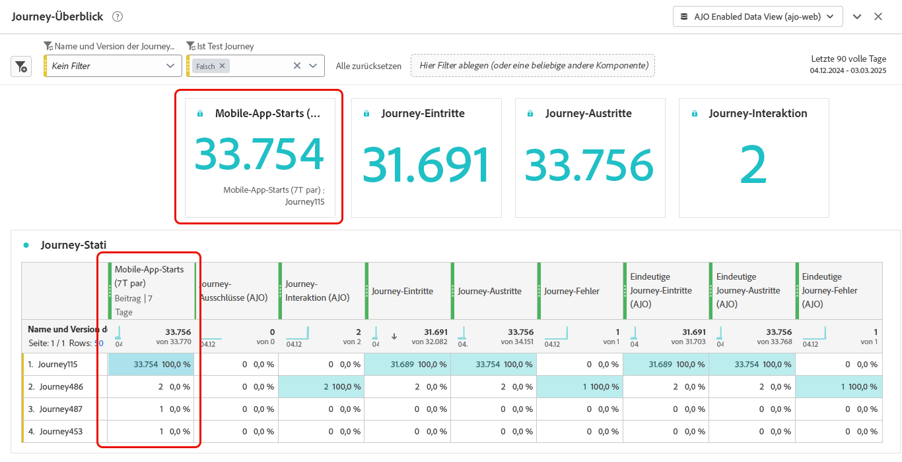

# Journey-Metriken konfigurieren und verfolgen {#success-metrics}

Gewinnen Sie mit Journey-Metriken einen klaren Einblick in die Effektivität Ihrer Kunden-Journey. Mit dieser Funktion können Sie die Leistung anhand definierter KPIs verfolgen, Einblicke in die Funktionsweise erhalten und Bereiche für die Optimierung identifizieren. Durch die Messung der Wirkung in Echtzeit können Sie kontinuierliche Verbesserungen fördern und dateninformierte Entscheidungen treffen, die die Kundeninteraktion erhöhen.

## Voraussetzungen {#prerequisites}

Bevor Sie Ihre Journey-Metriken verwenden können, müssen Sie einen Datensatz hinzufügen, der die `Commerce Details`, `Web` und `Mobile`Feldergruppen[ enthält](https://experienceleague.adobe.com/docs/experience-platform/xdm/tutorials/create-schema-ui.html?lang=de#field-group){target="_blank"}.

## Verfügbare Metriken {#metrics}

Die Liste der Metriken variiert je nach den [Feldergruppen](https://experienceleague.adobe.com/docs/experience-platform/xdm/tutorials/create-schema-ui.html?lang=de#field-group){target="_blank"} die in Ihrem Datensatz enthalten sind.

Wenn Ihr Datensatz nicht konfiguriert ist, sind nur die folgenden Metriken verfügbar: **[!UICONTROL Klick]**, **[!UICONTROL Einzelklick]**, **[!UICONTROL Klickrate]** und **[!UICONTROL Öffnungsrate]**.

Beachten Sie, dass Sie mit einer Customer Journey Analytics-Lizenz benutzerdefinierte Erfolgsmetriken erstellen können. [Weitere Informationen](https://experienceleague.adobe.com/de/docs/analytics-platform/using/cja-components/cja-calcmetrics/cm-workflow/participation-metric)

| Metriken | Verwandte Feldergruppe |
|-|-|
| Klicks | Keine Feldergruppe erforderlich |
| Einzelklicks | Keine Feldergruppe erforderlich |
| Clickthrough-Rate (CTR) | Keine Feldergruppe erforderlich |
| Klick-Öffnungsrate (CTOR) | Keine Feldergruppe erforderlich |
| Seitenansichten | Web-Feldergruppe |
| Mobile-App-Starts | Mobile-Feldergruppe |
| Erste Mobile-App-Starts | Mobile-Feldergruppe |
| Mobile-App-Installationen | Mobile-Feldergruppe |
| App-Upgrades | Mobile-Feldergruppe |
| Käufe | Commerce-Details-Feldergruppe |
| Checkouts | Commerce-Details-Feldergruppe |
| Hinzufügungen zum Warenkorb | Commerce-Details-Feldergruppe |
| Öffnungen des Warenkorbs | Commerce-Details-Feldergruppe |
| Warenkorbansichten | Commerce-Details-Feldergruppe |
| Entnahmen aus Warenkorb | Commerce-Details-Feldergruppe |
| Produktansichten | Commerce-Details-Feldergruppe |
| Für später speichern | Commerce-Details-Feldergruppe |

## Attribution {#attribution}

Jede Metrik enthält eine festgelegte Attribution, die bestimmt, welche Touchpoints oder Interaktionen zu einem bestimmten Ergebnis beigetragen haben.

* **Metrikattribution mit Journey Optimizer-Lizenz**:

  Mit der Journey Optimizer-Lizenz allein ist das maximal verfügbare Lookback-Fenster für eine ausgewählte Metrik auf 7 Tage festgelegt. Für diese Metriken ist das Attributionsmodell standardmäßig auf **Letztkontakt** festgelegt, d. h. auf die letzte Interaktion vor der Konversion.

  Sie können beispielsweise verfolgen, ob ein Kauf getätigt wurde, nachdem eine Kundin oder ein Kunde innerhalb der letzten 7 Tage mit Ihrer Journey interagiert hat.

* **Metrikattribution mit Customer Journey Analytics-Lizenz**:

  Mit Journey Optimizer- und Customer Journey Analytics-Lizenz können Sie benutzerdefinierte Metriken mit bestimmten Attributionseinstellungen erstellen oder die Attributionen der integrierten Metriken ändern.

  Weitere Informationen zu [Attributionsmodellen](https://experienceleague.adobe.com/de/docs/analytics-platform/using/cja-dataviews/component-settings/attribution#attribution-models)

## Zuweisen von Journey-Metriken {#assign}

Gehen Sie wie folgt vor, um mit dem Tracking Ihrer Journey-Metriken zu beginnen:

1. Klicken Sie im Menü **[!UICONTROL Journeys]** auf **[!UICONTROL Journey erstellen]**.

1. Bearbeiten Sie den Konfigurationsbereich der Journey, um den Namen der Journey zu definieren und ihre Eigenschaften festzulegen. Informationen zum Festlegen der Eigenschaften Ihrer Journey finden Sie auf [dieser Seite](../building-journeys/journey-properties.md).

1. Wählen Sie die **[!UICONTROL Journey-Metriken]** zur Messung der Effektivität Ihrer Journey.

   Beachten Sie, dass die Metriken für die Journey selbst und für alle Elemente der Journey gelten.

   

1. Klicken Sie auf **[!UICONTROL Speichern]**.

1. Entwerfen Sie Ihre Journey mit den erforderlichen **[!UICONTROL Aktivitäten]**.

1. Testen und veröffentlichen Sie Ihre Journey.

1. Öffnen Sie den Journey-Bericht, um die Performance der Ihnen zugewiesenen Erfolgsmetriken zu verfolgen.

   Die von Ihnen ausgewählten Metriken werden in der Tabelle KPIs des Berichts und Journey-Statistiken angezeigt.

   
