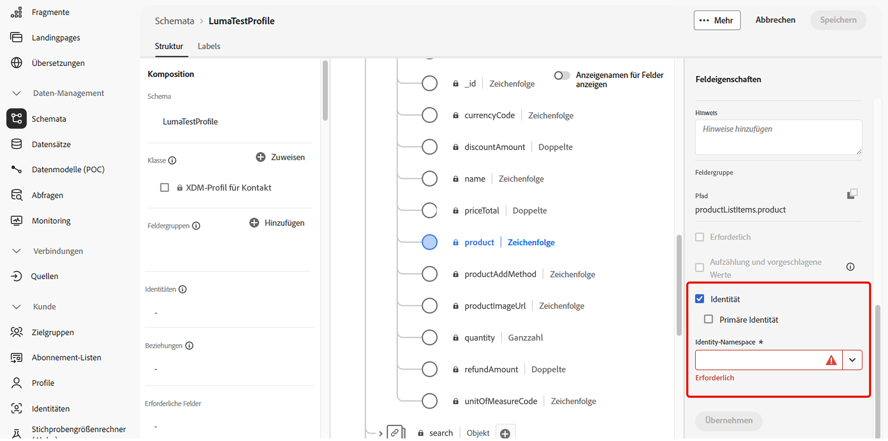
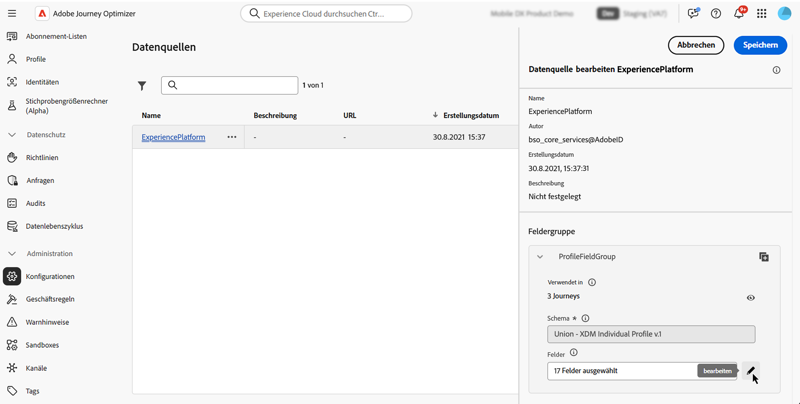
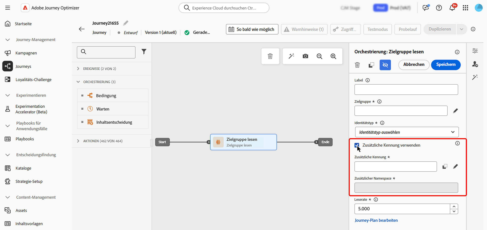

# Verwenden zusätzlicher Kennungen in Journeys {#supplemental-id}

>[!CONTEXTUALHELP]
>id="ajo_journey_parameters_supplemental_identifier"
>title="Verwenden einer zusätzlichen Kennung"
>abstract="Die zusätzliche Kennung ist eine sekundäre Kennung, die zusätzlichen Kontext für die Ausführung einer Journey bereitstellt. Um sie zu definieren, das Feld auswählen, das als zusätzliche Kennung verwendet werden soll, und einen Namespace auswählen, der mit ihr verknüpft werden soll."

Standardmäßig werden Journey im Kontext einer (Profil **ID)**. Das bedeutet, dass das Profil nicht erneut in eine andere Journey eintreten kann, solange es in einer bestimmten Journey aktiv ist. Um dies zu verhindern, können Sie mit [!DNL Journey Optimizer] zusätzlich zur Profil **ID eine**&#x200B;zusätzliche Kennung“ erfassen, z. B. eine Bestell-ID, Abonnement-ID, Rezept-ID.
In diesem Beispiel haben wir eine Buchungs-ID als zusätzliche Kennung hinzugefügt.

{width=40% zoomable}

Dabei werden Journey im Kontext der mit der zusätzlichen Kennung (hier die Buchungs-ID) verknüpften Profil-ID ausgeführt. Für jede Iteration der zusätzlichen Kennung wird eine Instanz der Journey ausgeführt. Dadurch kann dieselbe Profilkennung mehrfach in Journeys eintreten, wenn sie unterschiedliche Buchungen vorgenommen haben.

Darüber hinaus können Sie mit Journey Optimizer die Attribute der zusätzlichen Kennung (z. B. Buchungsnummer, Datum der Rezeptverlängerung, Produkttyp) für die Nachrichtenanpassung nutzen, um eine hochrelevante Kommunikation sicherzustellen. <!--Example: A healthcare provider can send renewal reminders for each prescription in a patient's profile.-->

➡️ [Funktion im Video kennenlernen](#video)

## Schutzmechanismen und Einschränkungen {#guardrails}

* **Unterstützte Journey**: Derzeit ist die Verwendung zusätzlicher IDs für Journeys vom Typ **ereignisausgelöst** und **Zielgruppe lesen** verfügbar. Sie ist nicht für Journey zur Zielgruppenqualifizierung verfügbar.

* **Beschränkungen gleichzeitiger Instanzen**: Profile können nicht über mehr als 10 gleichzeitige Journey-Instanzen verfügen.

<!--* **Array depth**: Supplemental identifier objects can have a maximum depth of 3 levels (2 levels of nesting).

    +++Example

    ```
    [
    (level 1) "Atorvastatin" : {
    "description" : "used to lower cholesterol",
    "renewal_date" : "11/20/25",
    "dosage" : "10mg"
    (level 2) "ingredients" : [
    (level 3) "Atorvastatin calcium",
    "lactose monohydrate",
    "microcrystalline cellulose",
    "other" ]
    }
    ]
    ```

    +++
-->
* **Ausstiegskriterien**: Ausgelöste Ausstiegskriterien würden zu einem Ausstieg aller Instanzen des Profils führen, die zu diesem Zeitpunkt in der Journey live sind. Sie wären nicht kontextuell für die Kombination aus Profilkennung und zusätzlicher Kennung.

* **Häufigkeitsregeln**: Jede Journey-Instanz, die aus der Nutzung zusätzlicher IDs erstellt wurde, zählt zur Frequenzlimitierung, auch wenn die Verwendung zusätzlicher IDs zu mehreren Journey-Instanzen führt.

* **Datentyp und Schemastruktur**: Die zusätzliche Kennung muss vom Typ `string` sein. Dabei kann es sich um ein unabhängiges Zeichenfolgenattribut oder um ein Zeichenfolgenattribut in einem Array von Objekten handeln. Das unabhängige Zeichenfolgenattribut führt zu einer einzelnen Journey-Instanz, wohingegen das Zeichenfolgenattribut innerhalb eines Arrays von Objekten zu einer eindeutigen Journey-Instanz pro Iteration des Objekt-Arrays führt. Zeichenfolgen-Arrays und Zuordnungen werden nicht unterstützt.

* **Erneuter Eintritt in die Journey**

  Das Verhalten beim erneuten Eintritt in die Journey mit zusätzlichen Kennungen folgt der bestehenden Richtlinie für den erneuten Eintritt:

   * Wenn ein erneuter Eintritt in die Journey nicht möglich ist, kann dieselbe Kombination aus Profilkennung und zusätzlicher ID nicht erneut in die Journey eintreten.
   * Wenn ein erneuter Eintritt in die Journey möglich ist, kann dieselbe Kombination aus Profilkennung und zusätzlicher ID nach dem definierten Zeitfenster erneut eintreten.

* **Konfiguration nachgelagerter Ereignisse**

  Wenn Sie ein weiteres Ereignis nachgelagert in der Journey verwenden, muss es dieselbe zusätzliche ID verwenden und denselben ID-Namespace haben.

* **Audience-Journey lesen**

   * Die zusätzliche ID ist deaktiviert, wenn Sie ein Geschäftsereignis verwenden.

   * Die zusätzliche ID muss ein Feld aus dem Profil sein (d. h. kein Ereignis-/Kontextfeld).

## Hinzufügen einer zusätzlichen Kennung und Verwenden der Kennung in einer Journey {#add}

>[!BEGINTABS]

>[!TAB Ereignisgesteuertes Journey]

Gehen Sie wie folgt vor, um eine zusätzliche Kennung in einem ereignisausgelösten Journey zu verwenden:

1. **Markieren des Attributs als Kennung im Ereignisschema**

   1. Greifen Sie auf das Ereignisschema zu, suchen Sie nach dem Attribut, das Sie als zusätzliche Kennung verwenden möchten (z. B. Buchungs-ID, Abonnement-ID), und markieren Sie es als ID. [Informationen zur Arbeit mit Schemata](../data/get-started-schemas.md)

   1. Markieren Sie die Kennung als **[!UICONTROL Identität]**.

      

      >[!IMPORTANT]
      >
      >Stellen Sie sicher, dass Sie das Attribut nicht als **Primäre Identität** markieren.

   1. Wählen Sie den Namespace aus, der mit der zusätzlichen ID verknüpft werden soll. Dies muss ein Namespace ohne Personenkennung sein.

1. **Hinzufügen der zusätzlichen ID zum Ereignis**

   1. Erstellen oder bearbeiten Sie das gewünschte Ereignis. [Informationen zum Konfigurieren eines unitären Ereignisses](../event/about-creating.md)

   1. Aktivieren Sie im Bildschirm „Ereigniskonfiguration“ die Option **[!UICONTROL Zusätzliche Kennung verwenden]**.

      

   1. Verwenden Sie den Ausdruckseditor, um das Attribut auszuwählen, das Sie als zusätzliche ID markiert haben.

      >[!NOTE]
      >
      >Stellen Sie sicher, dass Sie den Ausdruckseditor im **[!UICONTROL erweiterten Modus]** verwenden, um das Attribut auszuwählen.

   1. Nach Auswahl der zusätzlichen ID wird der zugehörige Namespace im Bildschirm „Ereigniskonfiguration“ als schreibgeschützt angezeigt.

1. **Hinzufügen des Ereignisses zur Journey**

   Ziehen Sie das konfigurierte Ereignis auf die Journey-Arbeitsfläche. Dadurch wird der Journey-Eintrag basierend auf der Profilkennung und der zusätzlichen ID ausgelöst.

   

>[!TAB Zielgruppen-Journey lesen]

Gehen Sie wie folgt vor, um eine zusätzliche Kennung in einer Journey mit dem Titel „Zielgruppe lesen“ zu verwenden:

1. **Markieren Sie das Attribut als Kennung im Vereinigungs-/Profilschema**

   1. Greifen Sie auf das Vereinigungs-/Profilschema zu und suchen Sie das Attribut, das Sie als zusätzliche Kennung (z. B. Buchungs-ID, Abonnement-ID) verwenden möchten, und markieren Sie es als ID. [Informationen zur Arbeit mit Schemata](../data/get-started-schemas.md)

   1. Markieren Sie die Kennung als **[!UICONTROL Identität]**.

      

      >[!IMPORTANT]
      >
      >Stellen Sie sicher, dass Sie das Attribut nicht als **Primäre Identität** markieren.

   1. Wählen Sie den Namespace aus, der mit der zusätzlichen ID verknüpft werden soll. Dies muss ein Namespace ohne Personenkennung sein.

<!--1. **Add the supplemental ID field to the data source**

    1. Navigate to the **[!UICONTROL Configuration]** / **[!UICONTROL Data Sources]** menu, then locate the "ExperiencePlatformDataSource" data source.

        

    1. Open the field selector then select the attribute you want to use as a supplemental identifier (e.g., booking ID, subscription ID).-->

1. **Hinzufügen und Konfigurieren der Aktivität „Zielgruppe lesen“ auf der Journey**

   1. Ziehen Sie eine Aktivität **[!UICONTROL Zielgruppe lesen]** in Ihren Journey.

   1. Aktivieren Sie im Bereich Aktivitätseigenschaften die Option **[!UICONTROL Zusätzliche Kennung verwenden]**.

      

   1. Wählen Sie im Feld **[!UICONTROL Ergänzungs]** ID“ im Ausdruckseditor das Attribut aus, das Sie als zusätzliche ID markiert haben.

      >[!NOTE]
      >
      >Stellen Sie sicher, dass Sie den Ausdruckseditor im **[!UICONTROL erweiterten Modus]** verwenden, um das Attribut auszuwählen.

   1. Nach Auswahl der zusätzlichen ID wird der verknüpfte Namespace im Feld **[!UICONTROL Ergänzender Namespace]** als schreibgeschützt angezeigt.

>[!ENDTABS]

## Nutzen zusätzlicher ID-Attribute

Verwenden Sie den Ausdruckseditor und den Personalisierungseditor, um auf Attribute der zusätzlichen Kennung für Personalisierung oder bedingte Logik zu verweisen. Auf Attribute kann über das Menü **[!UICONTROL Kontextuelle Attribute]** zugegriffen werden.


Verwenden Sie für ereignisausgelöste Journey, wenn Sie mit Arrays arbeiten (z. B. mehrere Rezepte oder Richtlinien), eine Formel, um bestimmte Elemente zu extrahieren.

+++ Siehe Beispiele

In einem Objekt-Array mit der zusätzlichen ID als `bookingNum` und einem Attribut auf derselben Ebene namens `bookingCountry` iteriert die Journey durch das Array-Objekt auf der Grundlage der bookingNum und erstellt für jedes Objekt eine Journey-Instanz.

* Der folgende Ausdruck in der Bedingungsaktivität iteriert durch das Objekt-Array und prüft, ob der Wert von `bookingCountry` gleich „FR“ ist:

  ```
  @event{<event_name>.<object_path>.<object_array_name>.all(currentEventField.<attribute_path>.bookingNum==${supplementalId}).at(0).<attribute_path>.bookingCountry}=="FR"
  ```

* Der folgende Ausdruck im E-Mail-Personalisierungseditor iteriert durch das Objekt-Array, ruft das `bookingCountry` für die aktuelle Journey-Instanz ab und zeigt es im Inhalt an:

  ```
  {{#each context.journey.events.<event_ID>.<object_path>.<object_array_name> as |l|}} 
  
   {{l.<attribute_path>.bookingCountry}}  
  
  {{/each}}
  ```

* Beispiel für das Ereignis, das zum Auslösen der Journey verwendet wird:

  ```
  "bookingList": [
        {
            "bookingInfo": {
                "bookingNum": "x1",
                      "bookingCountry": "US"
            }
        },
        {
            "bookingInfo": {
                "bookingNum": "x2",
                "bookingCountry": "FR"
            }
        }
    ]
  ```

+++

## Beispielhafte Anwendungsfälle

### **Benachrichtigungen zur Verlängerung von Policen**

* **Szenario**: Ein Versicherungsanbieter sendet Verlängerungserinnerungen für jede aktive Police einer Kundin oder eines Kunden.
* **Ausführung**:
   * Profil: „John“.
   * Zusätzliche IDs: `"AutoPolicy123", "HomePolicy456"`.
   * Die Journey wird für jede Police separat ausgeführt, mit personalisierten Verlängerungsterminen, Details zur Abdeckung und Premium-Informationen.

### **Abonnementverwaltung**

* **Szenario**: Ein Abonnementdienst sendet maßgeschneiderte Nachrichten für jedes Abonnement, wenn ein Ereignis für dieses Abonnement ausgelöst wird.
* **Ausführung**:
   * Profil: „Jane“.
   * Zusätzliche IDs: `"Luma Yoga Program ", "Luma Fitness Program"`.
   * Jedes Ereignis enthält eine Abonnement-ID und Details zu diesem Abonnement. Die Journey wird mit personalisierten Verlängerungsangeboten pro Abonnement für jedes Ereignis/Abonnement separat ausgeführt.

### **Produktempfehlungen**

* **Szenario**: Eine E-Commerce-Plattform sendet Empfehlungen, die auf bestimmten von einer Kundin bzw. einem Kunden gekauften Produkten basieren.
* **Ausführung**:
   * Profil: „Alex“.
   * Zusätzliche IDs: `"productID1234", "productID5678"`.
   * Die Journey wird mit personalisierten Upsell-Optionen für jedes Produkt separat ausgeführt.

## Anleitungsvideo {#video}

Erfahren Sie, wie Sie eine zusätzliche Kennung in [!DNL Adobe Journey Optimizer] aktivieren und anwenden.

>[!VIDEO](https://video.tv.adobe.com/v/3464801?quality=12&captions=ger)
