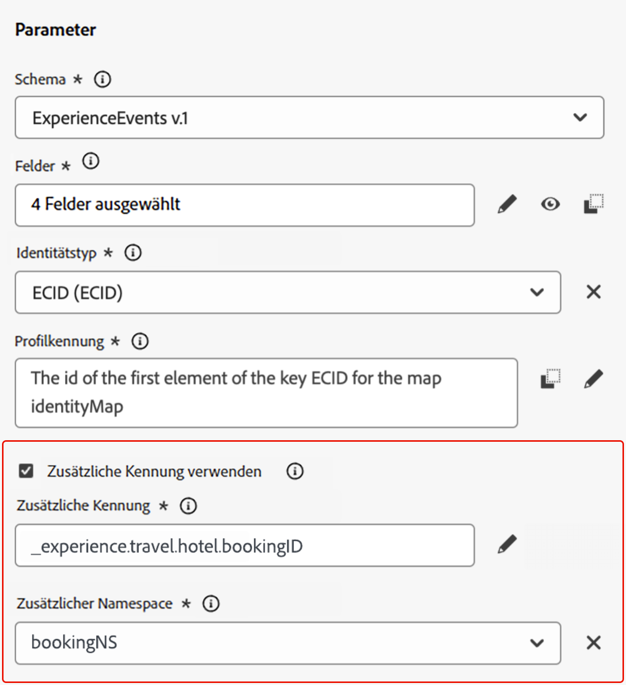
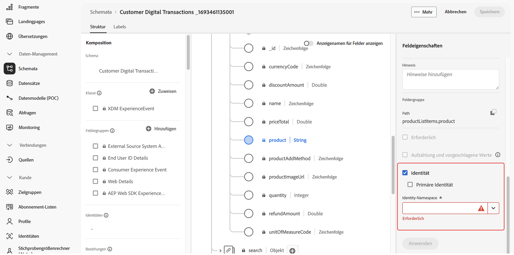
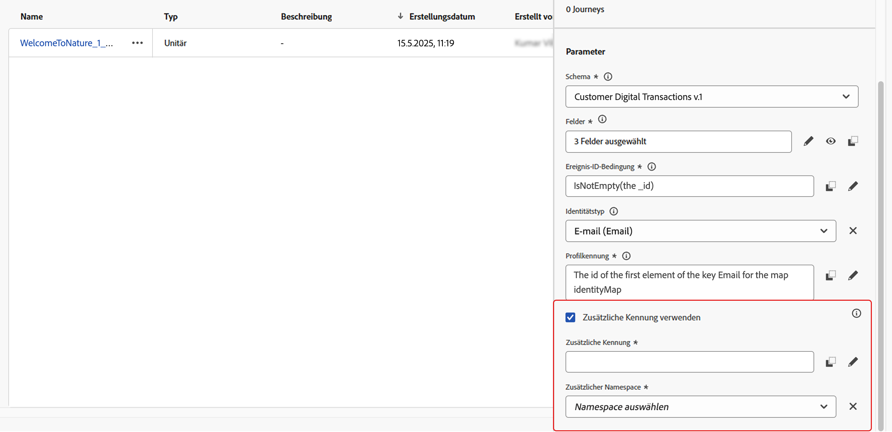
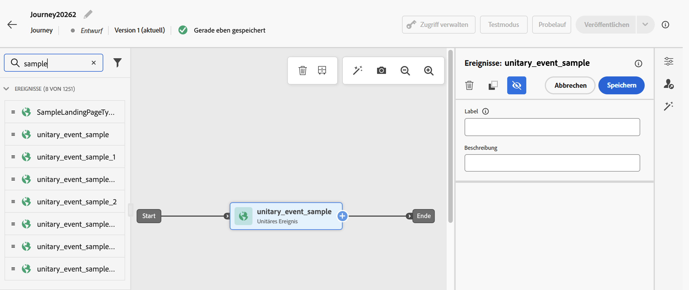
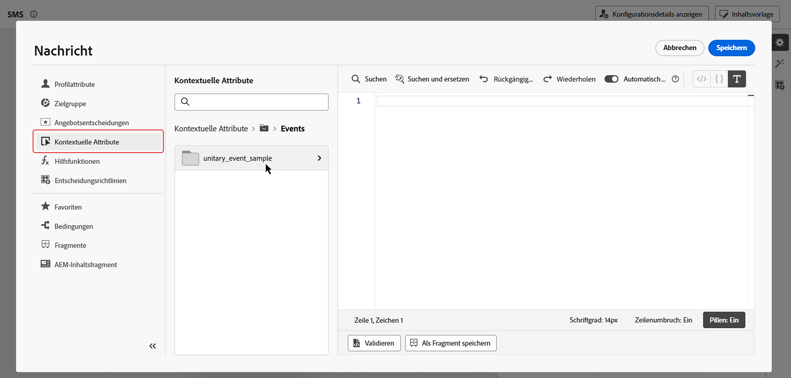

# Zusätzliche Kennung in von einem Ereignis ausgelösten Journeys {#supplemental-id}

>[!CONTEXTUALHELP]
>id="ajo_journey_parameters_supplemental_identifier"
>title="Verwenden einer zusätzlichen Kennung"
>abstract="Die zusätzliche Kennung ist eine sekundäre Kennung, die zusätzlichen Kontext für die Ausführung einer Journey bereitstellt. Um sie zu definieren, wählen Sie das Feld aus, das als zusätzliche Kennung verwendet werden soll, und wählen Sie einen Namespace aus, der mit ihr verknüpft werden soll."

>[!AVAILABILITY]
>
>Diese Funktion ist nur für eine Gruppe von Organisationen verfügbar (eingeschränkte Verfügbarkeit). Um Zugriff zu erhalten, wenden Sie sich an den Adobe-Support.

Standardmäßig werden ereignisausgelöste Journey im Kontext einer (Profil **ID)**. Das bedeutet, dass das Profil, solange es auf einer bestimmten Journey aktiv ist, nicht erneut auf eine andere Journey zugreifen kann. Um dies zu verhindern, können Sie mit Journey Optimizer **zusätzliche Kennung** in Ihren Ereignissen erfassen, z. B. eine Bestell-ID, Abonnement-ID, Rezept-ID zusätzlich zur Profil-ID.
In diesem Beispiel haben wir eine Buchungs-ID als zusätzliche Kennung hinzugefügt.

{width=40% zoomable}

Dadurch werden die durch das Ereignis ausgelösten Journey im Kontext der Profilkennung ausgeführt, die der zusätzlichen Kennung zugeordnet ist (hier die Buchungs-ID). Für jede Iteration der zusätzlichen Kennung wird eine Instanz der Journey ausgeführt. Dadurch können mehrere Personen mit derselben Profil-ID in Journey eintreten, wenn sie unterschiedliche Buchungen vorgenommen haben.

Darüber hinaus können Sie mit Journey Optimizer die Attribute der zusätzlichen Kennung (z. B. Buchungsnummer, Datum der Rezeptverlängerung, Produkttyp) für die Nachrichtenanpassung nutzen, um hochrelevante Kommunikation sicherzustellen. <!--Example: A healthcare provider can send renewal reminders for each prescription in a patient's profile.-->

## Schutzmechanismen und Einschränkungen

* **Beschränkungen gleichzeitiger Instanzen**: Profile können nicht mehr als 10 gleichzeitige Journey-Instanzen haben.

<!--* **Array depth**: Supplemental identifier objects can have a maximum depth of 3 levels (2 levels of nesting).

    +++Example

    ```
    [
    (level 1) "Atorvastatin" : {
    "description" : "used to lower cholesterol",
    "renewal_date" : "11/20/25",
    "dosage" : "10mg"
    (level 2) "ingredients" : [
    (level 3) "Atorvastatin calcium",
    "lactose monohydrate",
    "microcrystalline cellulose",
    "other" ]
    }
    ]
    ```

    +++
-->
* **Beendigungskriterien**: Ausgelöste Beendigungskriterien würden alle Instanzen des Profils beenden, die zu diesem Zeitpunkt auf der Journey live sind. Es wäre nicht kontextuell zu der Kombination Profil-ID + zusätzliche Kennung.

* **Häufigkeitsregeln**: Jede Journey-Instanz, die aus der zusätzlichen Kennungsnutzung erstellt wurde, zählt zur Frequenzlimitierung, auch wenn ein einzelnes Ereignis zu mehreren Journey-Instanzen führt.

* **Datentyp und Schemastruktur**: Die zusätzliche Kennung muss vom Typ `string` sein. Dabei kann es sich um ein unabhängiges Zeichenfolgenattribut oder um ein Zeichenfolgenattribut in einem Array von Objekten handeln. Das unabhängige Zeichenfolgenattribut führt zu einer einzigen Journey-Instanz, während das Zeichenfolgenattribut innerhalb eines Arrays von Objekten zu einer eindeutigen Journey-Instanz pro Iteration des Objekt-Arrays führt. Zeichenfolgen-Arrays und Zuordnungen werden nicht unterstützt.

## Ergänzende Kennung hinzufügen und in einer Journey nutzen

Gehen Sie wie folgt vor, um eine zusätzliche Kennung in einem Journey zu verwenden:

1. **Markieren Sie das Attribut als Kennung im Ereignisschema**

   1. Greifen Sie auf das Ereignisschema zu, suchen Sie das Attribut, das Sie als zusätzliche Kennung verwenden möchten (z. B. Buchungs-ID, Abonnement-ID), und markieren Sie es als ID. [Erfahren Sie, wie Sie mit Schemata arbeiten](../data/get-started-schemas.md)

   1. Markieren Sie die Kennung als **[!UICONTROL Identität]**.

      

      >[!IMPORTANT]
      >
      >Stellen Sie sicher, dass Sie das Attribut nicht als **Primäre Identität** markieren.

   1. Wählen Sie den Namespace aus, der mit der zusätzlichen ID verknüpft werden soll. Dies muss ein Namespace ohne Personenkennung sein.

1. **Fügen Sie die zusätzliche ID zum Ereignis hinzu**

   1. Erstellen oder bearbeiten Sie das gewünschte Ereignis. [Erfahren Sie, wie Sie ein unitäres Ereignis konfigurieren](../event/about-creating.md)

   1. Aktivieren Sie im Bildschirm Ereigniskonfiguration die Option **[!UICONTROL Zusätzliche Kennung verwenden]**.

      

   1. Verwenden Sie den Ausdruckseditor, um das Attribut auszuwählen, das Sie als zusätzliche ID markiert haben.

   1. Nach Auswahl der zusätzlichen ID wird der zugehörige Namespace im Bildschirm der Ereigniskonfiguration als schreibgeschützt angezeigt.

1. **Ereignis zur Journey hinzufügen**

   Ziehen Sie das konfigurierte Ereignis auf die Journey-Arbeitsfläche. Dadurch wird der Trigger-Journey-Eintrag basierend sowohl auf der Profilkennung als auch auf der zusätzlichen ID erstellt.

   

1. **Nutzen zusätzlicher ID-Attribute**

   Verwenden Sie den Ausdruckseditor und den Personalisierungseditor, um auf Attribute der zusätzlichen Kennung für Personalisierung oder bedingte Logik zu verweisen. Auf Attribute kann über das Menü **[!UICONTROL Kontextuelle Attribute]** zugegriffen werden.

   

   >[!NOTE]
   >
   >Wenn Sie mit Arrays arbeiten (z. B. mehrere Rezepte oder Richtlinien), verwenden Sie eine Formel, um bestimmte Elemente zu extrahieren.

+++ Siehe Beispiele

   In einem Objekt-Array mit der zusätzlichen ID `bookingNum` und einem -Attribut auf derselben Ebene namens `bookingCountry` durchläuft die Journey das Array-Objekt auf der Grundlage der bookingNum und erstellt für jedes Objekt eine Journey-Instanz.

   * Der folgende Ausdruck in der Bedingungsaktivität durchläuft das Objekt-Array und prüft, ob der Wert von `bookingCountry` gleich „FR“ ist:

     ```
     @event{<event_name>.<object_path>.<object_array_name>.all(currentEventField.<attribute_path>.bookingNum==${supplementalId}).at(0).<attribute_path>.bookingCountry}=="FR"
     ```

   * Der folgende Ausdruck im E-Mail-Personalisierungseditor iteriert durch das Objekt-Array, ruft die `bookingCountry` für die aktuelle Journey-Instanz ab und zeigt sie im Inhalt an:

     ```
     {{#each context.journey.events.<event_ID>.<object_path>.<object_array_name> as |l|}} 
     
      {{l.<attribute_path>.bookingCountry}}  
     
     {{/each}}
     ```

   * Beispiel für das Ereignis, das zum Trigger des Journey verwendet wird:

     ```
     "bookingList": [
           {
               "bookingInfo": {
                   "bookingNum": "x1",
                         "bookingCountry": "US"
               }
           },
           {
               "bookingInfo": {
                   "bookingNum": "x2",
                   "bookingCountry": "FR"
               }
           }
       ]
     ```

+++

1. **Veröffentlichen Sie die Journey**

   Veröffentlichen Sie nach der Konfiguration die Journey, um mit der Verwendung mehrerer gleichzeitiger Einträge auf der Grundlage zusätzlicher IDs zu beginnen.

## Anwendungsbeispiele

### **Benachrichtigungen zur Richtlinienverlängerung**

* **Szenario**: Ein Versicherungsanbieter sendet Verlängerungserinnerungen für jede aktive Police, die von einem Kunden gehalten wird.
* **Ausführung**:
   * Profil: „John“.
   * Zusätzliche IDs: `"AutoPolicy123", "HomePolicy456"`.
   * Journey wird für jede Richtlinie separat ausgeführt, mit personalisierten Verlängerungsterminen, Details zur Abdeckung und Premium-Informationen.

### **Abonnementverwaltung**

* **Szenario**: Ein Abonnement-Service sendet für jedes Abonnement maßgeschneiderte Nachrichten, wenn ein Ereignis für dieses Abonnement ausgelöst wird.
* **Ausführung**:
   * Profil: „Jane“.
   * Zusätzliche IDs: `"Luma Yoga Program ", "Luma Fitness Program"`.
   * Jedes Ereignis enthält eine Abonnement-ID und Details zu diesem Abonnement. Journey wird für jedes Ereignis/Abonnement separat ausgeführt, sodass pro Abonnement personalisierte Verlängerungsangebote unterbreitet werden können.

### **Produktempfehlungen**

* **Szenario**: Eine E-Commerce-Plattform sendet Empfehlungen, die auf bestimmten von einem Kunden gekauften Produkten basieren.
* **Ausführung**:
   * Profil: „Alex“.
   * Zusätzliche IDs: `"productID1234", "productID5678"`.
   * Journey wird für jedes Produkt separat ausgeführt, mit personalisierten Upsell-Möglichkeiten.
