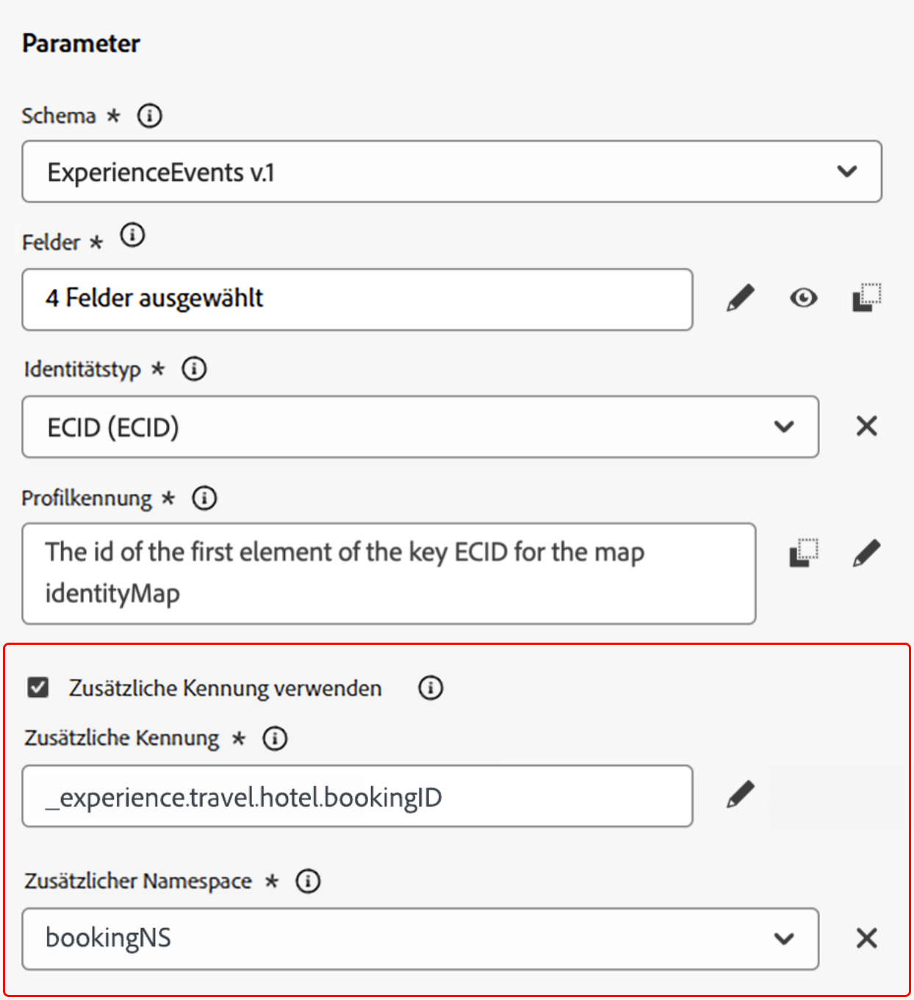
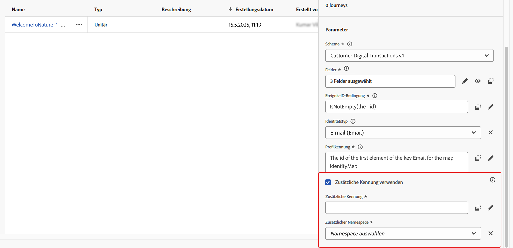
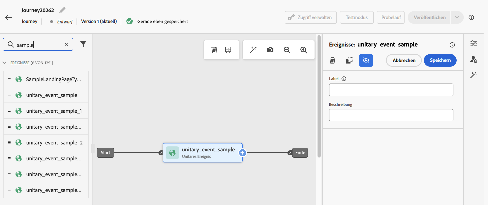
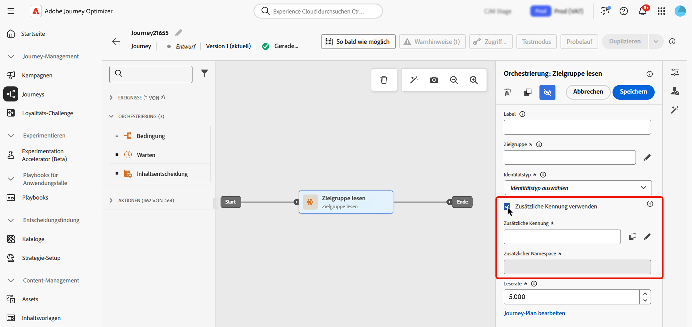
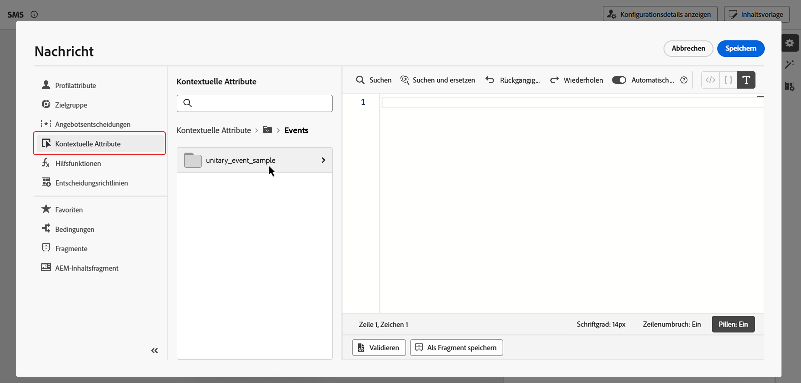

# Verwenden zusätzlicher Kennungen in Journeys {#supplemental-id}

>[!BEGINSHADEBOX]

**Auf dieser Seite:** Erfahren Sie, wie Sie zusätzliche Kennungen - sekundäre Kennungen wie eine Bestell- oder Buchungs-ID - verwenden können, um pro Kennung eine separate Journey-Instanz auszuführen und Nachrichten mit ihren Attributen zu personalisieren.

>[!ENDSHADEBOX]

>[!CONTEXTUALHELP]
>id="ajo_journey_parameters_supplemental_identifier"
>title="Verwenden einer zusätzlichen Kennung"
>abstract="Die zusätzliche Kennung ist eine sekundäre Kennung, die zusätzlichen Kontext für die Ausführung einer Journey bereitstellt. Um es zu definieren, wählen Sie ein beliebiges Nicht-Identitätsattribut (oder eine Nicht-Personen-Identität) aus der Zielgruppe oder dem Ereignis aus, das als zusätzliche Kennung verwendet werden soll."

<table style="border-collapse: collapse; width: 100%;">
  <tr>
    <td style="vertical-align: top; padding-right: 20px; border: none;">
      <p>Standardmäßig werden Journey im Kontext einer (Profil<b>ID) </b>. Das bedeutet, dass das Profil, solange es auf einer bestimmten Journey aktiv ist, nicht erneut auf eine andere Journey zugreifen kann. Um dies zu verhindern, können Sie mit Journey Optimizer <b> zusätzlich zur Profil-ID eine </b>zusätzliche Kennung“ erfassen, z. B. eine Bestell-ID, Abonnement-ID, Verschreibungs-ID.  
      <p>In diesem Beispiel haben wir eine <b>Buchungs-ID</b> als zusätzliche Kennung hinzugefügt.</p>
      <p>Dadurch werden die Journeys im Kontext der Profilkennung ausgeführt, die der zusätzlichen Kennung zugeordnet ist (hier die Buchungs-ID). Für jede Iteration der zusätzlichen Kennung wird eine Instanz der Journey ausgeführt. Dadurch kann dieselbe Profilkennung mehrfach in Journeys eintreten, wenn sie unterschiedliche Buchungen vorgenommen haben.</p>
      <p>Darüber hinaus können Sie mit Journey Optimizer die Attribute der zusätzlichen Kennung (z. B. Buchungsnummer, Datum der Rezeptverlängerung, Produkttyp) für die Nachrichtenanpassung nutzen, um eine hochrelevante Kommunikation sicherzustellen.</p>
    </td>
    <td style="vertical-align: top; border: none; text-align: center; width: 40%;">
      
    </td>
  </tr>
</table>

➡️ [Funktion im Video kennenlernen](#video)

## Leitlinien und Einschränkungen {#guardrails}

* **Unterstützte Journeys**: Zusätzliche Kennungen werden bei den Journeys **Ereignisgesteuert** und **Zielgruppe lesen** unterstützt. Sie werden **nicht unterstützt** bei Journeys zur Zielgruppenqualifizierung (d. h. bei Journeys, die mit einer Aktivität des Typs „Zielgruppenqualifizierung“ beginnen).

* **Eingehende Aktionen**: Zusätzliche Kennungen werden derzeit für eingehende Aktionen wie In-App- und Web-Aktionen nicht unterstützt.

* **Beschränkungen gleichzeitiger Instanzen**: Profile können nicht über mehr als 10 gleichzeitige Journey-Instanzen verfügen.

* **Datentyp und Schemastruktur**: Die zusätzliche Kennung muss vom Typ `string` sein. Dabei kann es sich um ein unabhängiges Zeichenfolgenattribut oder um ein Zeichenfolgenattribut in einem Array von Objekten handeln. Das unabhängige Zeichenfolgenattribut führt zu einer einzelnen Journey-Instanz, wohingegen das Zeichenfolgenattribut innerhalb eines Arrays von Objekten zu einer eindeutigen Journey-Instanz pro Iteration des Objekt-Arrays führt. Zeichenfolgen-Arrays und Zuordnungen werden nicht unterstützt.

* **Erneuter Eintritt in die Journey**

  Das Verhalten beim erneuten Eintritt in die Journey mit zusätzlichen Kennungen folgt der bestehenden Richtlinie für den erneuten Eintritt:

   * Wenn ein erneuter Eintritt in die Journey nicht möglich ist, kann dieselbe Kombination aus Profilkennung und zusätzlicher ID nicht erneut in die Journey eintreten.
   * Wenn ein erneuter Eintritt in die Journey möglich ist, kann dieselbe Kombination aus Profilkennung und zusätzlicher ID nach dem definierten Zeitfenster erneut eintreten.

* **Datennutzungskennzeichnung und -durchsetzung (Data Use Labeling and Enforcement, DULE)** – Für die zusätzliche ID werden keine DULE-Validierungsprüfungen durchgeführt. Dies bedeutet, dass dieses Attribut nicht berücksichtigt wird, wenn die Journey nach Verstößen gegen Data-Governance-Richtlinien sucht.

* **Konfiguration nachgelagerter Ereignisse**

  Wenn Sie ein weiteres Ereignis nachgelagert in der Journey verwenden, muss es dieselbe zusätzliche ID verwenden und denselben ID-Namespace haben.

* **Journeys vom Typ „Zielgruppe lesen“**

   * **Geschäftsereignisse**: Die zusätzliche ID ist deaktiviert, wenn Sie ein Geschäftsereignis verwenden.
   * **Ereignis- und Kontextfelder**: Die zusätzliche Kennung darf nicht aus einem Ereignis- oder Journey-Kontextfeld bezogen werden.
   * **Attributauswahl**: Jedes Nicht-Identitätsattribut (oder eine Nicht-Personen-Identität) kann als zusätzliche ID für alle Zielgruppentypen (Unified Profile Service, CSV-Import und Federated Audience Composition) verwendet werden. Personenbasierte Identitätsattribute sind nicht zulässig. Informationen zu externen Zielgruppen finden Sie [Zusätzliche Kennungen mit externen Zielgruppen](#external-audiences) unter Unterstützte Datenmuster und Konfigurationsanforderungen.
   * **Leserate**: Bei Journey vom Typ „Zielgruppe lesen“, die ein zusätzliches ID-Feld vom Array-Typ verwenden, ist die Leserate der Aktivität „Zielgruppe lesen“ auf maximal 500 Profile pro Sekunde beschränkt.

## Verhalten von Ausstiegskriterien mit zusätzlichen Kennungen {#exit-criteria}

Voraussetzung: Journey für zusätzliche Kennung aktiviert (über einziges Ereignis oder Aktivitäten des Typs „Zielgruppe lesen“)

In der folgenden Tabelle wird das Verhalten von Profilen in einer für eine zusätzliche Kennung aktivierten Journey erläutert, wenn Ausstiegskriterien konfiguriert sind:

| Konfiguration von Ausstiegskriterien | Verhalten, wenn Ausstiegskriterien erfüllt sind |
| ---------------------------- | ---------------------------------- |
| Basierend auf einem Ereignis ohne zusätzliche Kennung | Alle Instanzen des entsprechenden Profils in dieser Journey werden beendet. |
| Basierend auf einem Ereignis mit zusätzlicher Kennung <br/>*Hinweis: Der Namespace der zusätzlichen Kennung muss mit dem des ursprünglichen Knotens übereinstimmen.* | Es werden nur die Instanzen des übereinstimmenden Profils und der zusätzlichen Kennung beendet. |
| Basierend auf einer Zielgruppe | Alle Instanzen des entsprechenden Profils in dieser Journey werden beendet. |

## Hinzufügen einer zusätzlichen Kennung und Verwenden der Kennung in einer Journey {#add}

>[!BEGINTABS]

>[!TAB Durch Ereignis ausgelöste Journey]

Gehen Sie wie folgt vor, um eine zusätzliche Kennung in einer durch ein Ereignis ausgelösten Journey zu verwenden:

1. **Hinzufügen der zusätzlichen ID zum Ereignis**

   1. Erstellen oder bearbeiten Sie das gewünschte Ereignis. [Informationen zum Konfigurieren eines unitären Ereignisses](../event/about-creating.md)

   1. Aktivieren Sie im Bildschirm „Ereigniskonfiguration“ die Option **[!UICONTROL Zusätzliche Kennung verwenden]**.

      

   1. Verwenden Sie den Ausdruckseditor, um das Feld auszuwählen, das Sie als zusätzliche ID verwenden möchten (z. B. Buchungs-ID, Abonnement-ID).

      >[!NOTE]
      >
      >Stellen Sie sicher, dass Sie den Ausdruckseditor im **[!UICONTROL erweiterten Modus]** verwenden, um das Attribut auszuwählen.

1. **Hinzufügen des Ereignisses zur Journey**

   Ziehen Sie das konfigurierte Ereignis auf die Journey-Arbeitsfläche. Dadurch wird der Journey-Eintrag basierend auf der Profilkennung und der zusätzlichen ID ausgelöst.

   

>[!TAB Journey vom Typ „Zielgruppe lesen“]

Gehen Sie wie folgt vor, um eine zusätzliche Kennung in einer Journey vom Typ „Zielgruppe lesen“ zu verwenden:

1. **Hinzufügen und Konfigurieren einer Aktivität „Zielgruppe lesen“ in der Journey**

   1. Ziehen Sie eine Aktivität vom Typ **[!UICONTROL Zielgruppe lesen]** in Ihre Journey.

   1. Aktivieren Sie im Bereich der Aktivitätseigenschaften die Option **[!UICONTROL Zusätzliche Kennung verwenden]**.

      

   1. Wählen Sie im Feld **[!UICONTROL Ergänzende Kennung]** im Ausdruckseditor das zusätzliche Kennungsattribut aus.

   Wenn Ihre CSV-Zielgruppe für [aus einer CSV-Datei importierte](https://experienceleague.adobe.com/docs/experience-platform/segmentation/ui/overview.html?lang=de#import-audience){target="_blank"} mehrere Zeilen pro Profil-ID enthält, stellen Sie sicher, dass zuerst die Express-Aktivierung aktiviert ist. Weitere Informationen finden Sie [Zusätzliche Kennungen mit externen Zielgruppen](#external-audiences).

       >[!NOTE]
     >
     >Stellen Sie sicher, dass Sie den Ausdruckseditor im **[!UICONTROL Erweiterten Modus]** verwenden, um das Attribut auszuwählen.
   
>[!ENDTABS]

## Nutzen der Attribute der zusätzlichen Kennung

Verwenden Sie den Ausdruckseditor und den Personalisierungseditor, um auf Attribute der zusätzlichen Kennung für Personalisierung oder bedingte Logik zu verweisen. Auf Attribute kann über das Menü **[!UICONTROL Kontextuelle Attribute]** zugegriffen werden.



Wenn Sie bei durch ein Ereignis ausgelöste Journeys mit Arrays arbeiten (z. B. mehrere Rezepte oder Richtlinien), verwenden Sie eine Formel, um bestimmte Elemente zu extrahieren.

+++ Siehe Beispiele

In einem Objekt-Array mit der zusätzlichen ID als `bookingNum` und einem Attribut auf derselben Ebene namens `bookingCountry` iteriert die Journey durch das Array-Objekt auf der Grundlage der bookingNum und erstellt für jedes Objekt eine Journey-Instanz.

* Der folgende Ausdruck in der Bedingungsaktivität iteriert durch das Objekt-Array und prüft, ob der Wert von `bookingCountry` gleich „FR“ ist:

  ```
  @event{<event_name>.<object_path>.<object_array_name>.all(currentEventField.<attribute_path>.bookingNum==${supplementalId}).at(0).<attribute_path>.bookingCountry}=="FR"
  ```

* Der folgende Ausdruck im E-Mail-Personalisierungseditor iteriert durch das Objekt-Array, ruft das `bookingCountry` für die aktuelle Journey-Instanz ab und zeigt es im Inhalt an:

  ```
  {{#each context.journey.events.<event_ID>.<object_path>.<object_array_name> as |l|}} 
  
   {{l.<attribute_path>.bookingCountry}}  
  
  {{/each}}
  ```

* Beispiel für das Ereignis, das zum Auslösen der Journey verwendet wird:

  ```
  "bookingList": [
        {
            "bookingInfo": {
                "bookingNum": "x1",
                      "bookingCountry": "US"
            }
        },
        {
            "bookingInfo": {
                "bookingNum": "x2",
                "bookingCountry": "FR"
            }
        }
    ]
  ```

+++

## Zusätzliche ID- und Journey-Schlichtung {#arbitration}

Die Journey-Schlichtung (einschließlich Begrenzungen für gleichzeitige Eingaben und die Zählung der Einträge in Regelsätzen) erfolgt auf der Ebene der Profilkennung und nicht auf der Ebene der Paare (Profilkennung, zusätzliche ID). Dies bedeutet, dass eine Begrenzung für gleichzeitige Nutzung von 1 eine zweite Journey-Instanz für dasselbe Profil blockieren kann, selbst wenn dieses Profil einen anderen zusätzlichen ID-Wert aufweist.

Wenden Sie sich an Ihren Adobe-Support-Mitarbeiter, um Informationen zum Schlichtungsverhalten zu erhalten, bevor Sie sich auf bestimmte Schlichtungseinstellungen in der Produktion verlassen.

**Verwandte Dokumentation:**

* [Journey-Begrenzung und -Steuerung](../conflict-prioritization/journey-capping.md)
* [Arbeiten mit Regelsätzen](../conflict-prioritization/rule-sets.md)
* [Konflikt-Management und Priorisierung](../conflict-prioritization/gs-conflict-prioritization.md)

## Zusätzliche Kennungen mit externen Zielgruppen {#external-audiences}

Zusätzliche ID wird für externe Zielgruppen unterstützt, einschließlich Zielgruppen ([ aus einer CSV-Datei importiert](https://experienceleague.adobe.com/docs/experience-platform/segmentation/ui/overview.html?lang=de#import-audience){target="_blank"} und Zielgruppen, die mit [Federated Audience Composition](../audience/get-started-audience-orchestration.md) erstellt wurden. Beim Konfigurieren einer Journey, die aus einer CSV- oder Federated Audience Composition-Zielgruppe liest, können Sie jedes Nicht-Identitätsattribut in dieser Zielgruppe als zusätzliche ID festlegen. Journey Optimizer erstellt dann für jede eindeutige Profilkombination + zusätzliche ID-Kombination eine separate Journey-Instanz.

* Anwendungsfall 1: Eine Zeile pro eindeutigem Profil + zusätzliches ID-Paar

  Dies ist der primäre Anwendungsfall für CSV- und Federated Audience Composition-Zielgruppen. Die Zielgruppe enthält mehrere Zeilen, wobei jede Zeile eine eindeutige Kombination aus einem Profil (z. B. einem Kunden) und einer zusätzlichen ID (z. B. einem Konto oder einer Auftrags-ID) darstellt. Jede Zeile wird als unabhängiger Aktivierungsdatensatz behandelt.

  | profile_id | account_id *(Supplemental ID)* | other_attributes |
  | --- | --- | --- |
  | customer_001 | ACC-1001 | … |
  | customer_001 | ACC-1002 | … |
  | customer_002 | ACC-2001 | … |

  In diesem Beispiel hat `customer_001` zwei Konten. Journey Optimizer erstellt für jedes eindeutige Profilpaar + `account_id` eine separate Journey-Instanz.

* Anwendungsfall 2: Eine Zeile pro Profil mit einem Array zusätzlicher IDs

  Dieser Anwendungsfall ist für Zielgruppentypen verfügbar, die Arrays unterstützen. Eine einzelne Zeile in der Zielgruppe enthält ein Profil mit einem Array-Attribut, das mehrere zusätzliche ID-Werte enthält. Journey Optimizer erstellt für jeden Wert im Array eine Journey-Instanz.

  | profile_id | account_ids *(array, Supplemental ID)* | other_attributes |
  | --- | --- | --- |
  | customer_001 | [ACC-1001, ACC-1002] | … |
  | customer_002 | [ACC-2001] | … |

  In diesem Beispiel generiert Journey Optimizer zwei Journey-Instanzen für `customer_001` (eine pro Konto-ID) und eine Instanz für `customer_002`. Dies verhält sich konsistent mit der Funktionsweise der zusätzlichen ID für Zielgruppen des einheitlichen Profildienstes.

### Konfigurieren von {#external-configuration}

Für CSV-Zielgruppen, die Anwendungsfall 1 verwenden (bei dem die Zielgruppe absichtlich mehrere Zeilen für dieselbe Profil-ID enthält), müssen Sie die Express-Aktivierung aktivieren, bevor Sie die Journey konfigurieren. Siehe die Voraussetzungen unten. Konfigurieren Sie in allen anderen Fällen die Journey direkt.

+++ Voraussetzung: Aktivieren der Express Activation für CSV-Zielgruppen über die API

>[!IMPORTANT]
>
>Diese Voraussetzung gilt nur für CSV-Zielgruppen, bei denen die Zielgruppe mehrere Zeilen für dieselbe Profil-ID enthält (Anwendungsfall 1). Für Zielgruppenkomposition-Zielgruppen ist die Express-Aktivierung standardmäßig aktiviert und dieser Schritt ist nicht erforderlich. Die Benutzeroberfläche von Audience Portal unterstützt nicht die `expressActivation` von Einstellungen. Sie müssen die externe Zielgruppen-API verwenden.

Sie müssen die `expressActivation` für die Zielgruppe zum Zeitpunkt der Erstellung aktivieren. Dadurch wird Journey Optimizer angewiesen, jeden Datensatz unabhängig und ohne Deduplizierung nach Profil-ID zu aktivieren. Dieses Flag kann nach der Erstellung der Zielgruppe nicht mehr geändert werden.

Verwenden Sie beim Erstellen der Zielgruppe den folgenden API-Aufruf:

Endpunkt:

```http
POST https://platform.adobe.io/data/core/ais/external-audience
```

Erforderliche Kopfzeilen:

```http
Authorization: Bearer {ACCESS_TOKEN}
Content-Type: application/json
x-api-key: {API_KEY}
x-gw-ims-org-id: {IMS_ORG}
x-sandbox-name: {SANDBOX_NAME}
```

Anfragetext (`expressActivation: true` festgelegt):

```json
{
  "name": "my_audience_name",
  "fields": [ ... ],
  "sourceSpec": { ... },
  "audienceType": "people",
  "namespace": "CustomerAudienceUpload",
  "expressActivation": true
}
```

>[!NOTE]
>
>`expressActivation` Standardwert ist `false`. Sie muss zur Erstellungszeit der Zielgruppe festgelegt werden und kann nach der Erstellung nicht mehr geändert werden. Für alle Zielgruppenkomposition-Zielgruppen ist die Express-Aktivierung standardmäßig aktiviert und dieses Flag ist nicht erforderlich.

Die vollständige Referenz finden [ in der Dokumentation ](https://experienceleague.adobe.com/en/docs/experience-platform/segmentation/tutorials/create-external-audience#create){target="_blank"} Erstellen einer externen Zielgruppen-API .

+++

So konfigurieren Sie die Journey:

1. Öffnen oder erstellen Sie eine Journey mit dem Knoten **[!UICONTROL Zielgruppe lesen]**.
1. Wählen Sie in **[!UICONTROL Knoteneinstellungen]** Zielgruppe lesen“ Ihre CSV- oder Federated Audience Composition-Zielgruppe aus.
1. Schalten Sie die Option **[!UICONTROL Zusätzliche Kennung verwenden]** ein und wählen Sie dann im Feld **[!UICONTROL Zusätzliche Kennung]** im **[!UICONTROL Erweiterter Modus]** das Attribut aus, das Sie als sekundäre Kennung verwenden möchten (z. B. `account_id`, `order_number`).
1. Das ausgewählte Attribut wird als zusätzliche ID für die Journey behandelt - es ist keine Identitätsregistrierung erforderlich.

### Deduplizierungsverhalten {#external-dedup}

Wenn für eine Zielgruppe die Express-Aktivierung aktiviert ist (für die Federated-Audience-Komposition immer „true“ - muss explizit für CSV festgelegt werden), verarbeitet Journey Optimizer die Deduplizierung basierend auf der Konfiguration der Journey:

| Szenario | Beispiel für Zielgruppenzeilen | Verhalten |
| --- | --- | --- |
| **Journey mit zusätzlicher ID - keine doppelten (Profil-ID, zusätzliche ID) Paare** | (P1, S1), (P1, S2) | Vorgesehener Anwendungsfall. Journey Optimizer erstellt für jede eindeutige Profilkombination + zusätzliche ID-Kombination eine separate Journey-Instanz. Alle Zeilen sind zugelassen. |
| **Journey mit zusätzlicher ID - Es gibt doppelte (Profil-ID, zusätzliche ID) Paare** | (P1, S1), (P1, S1), (P1, S2) | Zeilen mit derselben Kombination (Profil-ID, zusätzliche ID) werden durch die normale Journey-Wiedereintrittslogik herausgefiltert. Es wird nur die erste übereinstimmende Zeile pro eindeutiger Kombination zugelassen. |
| **Journey ohne konfigurierte zusätzliche ID** | (P1, S1), (P1, S2) | Ohne zusätzliche ID behandelt Journey Optimizer alle Zeilen für dieselbe Profil-ID als dasselbe Profil. Pro Profil-ID ist nur eine Journey-Instanz zulässig. Zusätzliche Zeilen für dasselbe Profil werden verworfen. |

## Beispielhafte Anwendungsfälle

Diese Beispiele zeigen, wie zusätzliche Kennungen mehrere verwandte Datensätze unterstützen.

### **Benachrichtigungen zur Richtlinienverlängerung**

* **Szenario**: Ein Versicherungsanbieter sendet Verlängerungserinnerungen für jede aktive Police einer Kundin oder eines Kunden.
* **Ausführung**:
   * Profil: „John“.
   * Zusätzliche IDs: `"AutoPolicy123", "HomePolicy456"`.
   * Die Journey wird für jede Police separat ausgeführt, mit personalisierten Verlängerungsterminen, Details zur Abdeckung und Premium-Informationen.

### **Abonnementverwaltung**

* **Szenario**: Ein Abonnementdienst sendet maßgeschneiderte Nachrichten für jedes Abonnement, wenn ein Ereignis für dieses Abonnement ausgelöst wird.
* **Ausführung**:
   * Profil: „Jane“.
   * Zusätzliche IDs: `"Luma Yoga Program ", "Luma Fitness Program"`.
   * Jedes Ereignis enthält eine Abonnement-ID und Details zu diesem Abonnement. Die Journey wird mit personalisierten Verlängerungsangeboten pro Abonnement für jedes Ereignis/Abonnement separat ausgeführt.

### **Produktempfehlungen**

* **Szenario**: Eine E-Commerce-Plattform sendet Empfehlungen, die auf bestimmten von einer Kundin bzw. einem Kunden gekauften Produkten basieren.
* **Ausführung**:
   * Profil: „Alex“.
   * Zusätzliche IDs: `"productID1234", "productID5678"`.
   * Die Journey wird mit personalisierten Upsell-Optionen für jedes Produkt separat ausgeführt.

## Anleitungsvideo {#video}

Erfahren Sie, wie Sie eine zusätzliche Kennung in [!DNL Adobe Journey Optimizer] aktivieren und anwenden.

>[!VIDEO](https://video.tv.adobe.com/v/3464792?quality=12)

+++ KI-Wissensreferenz

Dieser Abschnitt enthält strukturiertes Wissen zur Unterstützung von Interpretation, Abrufen und Antworten auf Fragen zu diesem Thema.

Zum vollständigen Verständnis sollten diese Informationen mit der Dokumentation auf dieser Seite kombiniert werden. Keine der beiden Quellen ist für Einzelpersonen gedacht. Die Seite beschreibt die Funktion, während dieser Abschnitt zusätzlichen Kontext bietet, der dabei hilft, Begriffe, Absichten, Anwendbarkeit und Begrenzungen zu unterscheiden.

* **TL;DR:** Auf dieser Seite wird erläutert, wie Sie zusätzliche IDs in Adobe Journey Optimizer-Journey verwenden können, damit ein einzelnes Profil über mehrere gleichzeitige Journey-Instanzen verfügen kann, von denen jede eine unterschiedliche sekundäre ID aufweist, z. B. eine Buchungs-, Abonnement- oder Richtlinien-ID.

**intents:**
* Erfahren Sie, wann und warum Sie eine zusätzliche Kennung verwenden sollten, anstatt sich ausschließlich auf eine Profil-ID zu verlassen
* Konfigurieren Sie eine zusätzliche Kennung in einem ereignisausgelösten Journey, indem Sie im Ereignisschema ein Attribut als Identität markieren.
* Konfigurieren Sie eine zusätzliche Kennung auf einer Journey mit dem Titel „Zielgruppe lesen“, indem Sie die Option in der Aktivität „Zielgruppe lesen“ aktivieren
* Referenzieren zusätzlicher ID-Attribute für die Personalisierung von Nachrichten und bedingte Logik mithilfe des Ausdruckseditors
* Wenden Sie die richtige Ausdruckssyntax an, um über Objekt-Arrays zu iterieren, die von einer zusätzlichen ID verschlüsselt werden
* Ermitteln Sie Leitplanken und Einschränkungen, bevor Sie zusätzliche Kennungen in einer Journey implementieren.

**Glossar:**
* **Zusätzliche Kennung**: Eine sekundäre Kennung (z. B. Bestell-ID, Buchungs-ID, Abonnement-ID), die zusammen mit der Profil-ID verwendet wird, um eine Journey-Instanz auf einen bestimmten Datensatz zu beschränken, sodass mehrere gleichzeitige Instanzen pro *(produktspezifisch) möglich sind*
* **Profil-ID**: Die primäre Kennung, die standardmäßig zur Ausführung von Journey verwendet wird. Ein Profil, das auf einer Journey aktiv ist, kann ohne eine zusätzliche ID keine andere Journey erneut eingeben
* **Nicht-Personen-ID-Namespace**: Ein Identity-Namespace, der keine Person darstellt (erforderlich für zusätzliche IDs); muss sich vom primären Identity-Namespace unterscheiden
* **Joai-Namespace**: Nicht auf diese Seite anwendbar (siehe Fehlerbehebung bei eingehenden Aktionen)
* **DULE**: Datennutzungskennzeichnung und -durchsetzung - das Data Governance-Richtlinien-Validierungs-Framework in Adobe Experience Platform; zusätzliche IDs unterliegen keinen DULE-Prüfungen

**Leitplanken:**
* Zusätzliche Kennungen werden nur für ereignisgesteuerte und „Zielgruppen-Journey lesen“ unterstützt. Für Journey werden keine Kennungen für Zielgruppen-Qualifizierungen unterstützt
* Ein Profil kann nicht mehr als 10 gleichzeitige Journey-Instanzen haben
* Jede Journey-Instanz zählt zur Frequenzlimitierung, selbst wenn sie über zusätzliche Kennungen erstellt wird
* Die zusätzliche Kennung muss vom Typ `string` sein. Zeichenfolgen-Arrays und Zuordnungen werden nicht unterstützt
* Das zusätzliche ID-Attribut darf im Schema nicht als Primäre Identität markiert sein
* Der Namespace, der für die zusätzliche ID verwendet wird, muss ein Namespace mit einer Nicht-Personen-Kennung sein
* Nachdem Sie den Nicht-Personen-Identity-Namespace auf ein Schema angewendet haben, muss ein neues Ereignis oder eine neue Feldergruppe erstellt werden. Vorhandene Entitäten können nicht aktualisiert werden
* Für Journey mit zusätzlichen IDs vom Typ „Zielgruppe lesen“: Die Leserate ist auf 500 Profile pro Sekunde pro Journey-Instanz beschränkt. Nur Zielgruppen des einheitlichen Profildienstes werden unterstützt. Zusätzliche ID muss ein Profilfeld sein (kein Ereignis-/Kontextfeld)
* Nachgelagerte Ereignisse auf derselben Journey müssen dieselbe zusätzliche ID und denselben Namespace verwenden
* Die zusätzliche ID ist für Journey des Typs Zielgruppe lesen deaktiviert, die ein Geschäftsereignis verwenden

**Terminologie:**
* Kanonischer Name: Zusätzliche Kennung — Akronym: keine — Varianten: zusätzliche Kennung, sekundäre Kennung
* Synonyme: „Supplemental Identifier“ = „Supplemental ID“ (synonym in der Benutzeroberfläche und Dokumentation verwendet)
* Verwechseln Sie nicht: „Zusätzliche Kennung“ ≠ „primäre Identität“ - die zusätzliche ID darf im Schema nie als primäre Identität markiert werden

**FAQ:**
* **F: Wofür wird eine zusätzliche Kennung verwendet?** - Dadurch kann ein einzelnes Profil mehrmals gleichzeitig in einen Journey eintreten und ihn ausführen, wobei jede Instanz einen anderen sekundären Datensatz wie eine Buchungs-, Abonnement- oder Richtlinien-ID aufweist.
* **F: Welche Journey-Typen unterstützen zusätzliche Kennungen?** — Ereignisausgelöste Journey und Journey von Zielgruppen lesen. Journey für die Zielgruppenqualifizierung unterstützen keine zusätzlichen Kennungen.
* **F: Wie viele gleichzeitige Journey-Instanzen kann ein Profil mit zusätzlichen Kennungen haben?** - Es können maximal 10 gleichzeitige Journey-Instanzen pro Profil verwendet werden.
* **F: Kann ich die zusätzlichen ID-Attribute für die Nachrichtenpersonalisierung verwenden?** — Ja. Referenzieren Sie sie über das Menü Kontextuelle Attribute im Ausdruckseditor oder Personalisierungseditor.
* **F: Muss die zusätzliche ID als Primäre Identität im Schema markiert werden?** — Nein. Sie muss als Identität gekennzeichnet sein, darf jedoch nicht als Primäre Identität festgelegt werden.
* **F: Werden die DULE-Governance-Richtlinien auf die zusätzliche Kennung angewendet?** — Nein. DULE-Validierungsprüfungen werden für die zusätzliche ID nicht durchgeführt.

+++
