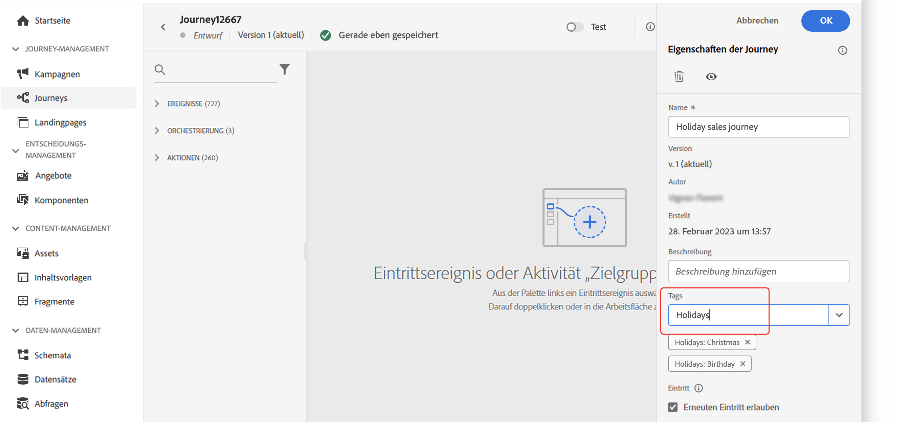
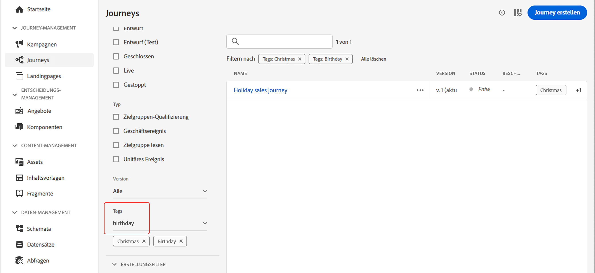
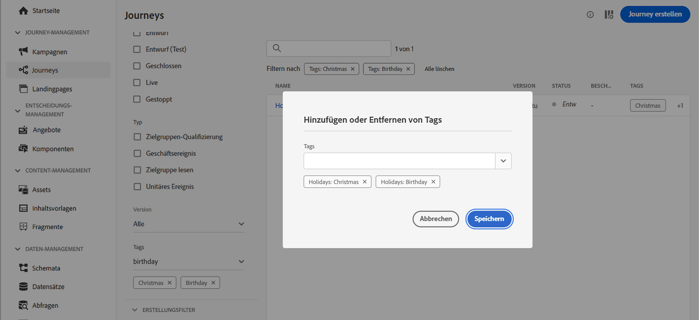

# Verwalten von Tags in Journeys {#journey_tags}

Mit Journey Optimizer können Sie Ihre Journeys mithilfe von Tags organisieren. Tags sind eine schnelle und einfache Möglichkeit, Objekte zu klassifizieren, um die Suche zu verbessern. 

## Tags vs. Namenskonventionen {#tags-vs-naming}

Teams verwenden häufig komplexe Namenskonventionen, um Metadaten direkt in Journey-Namen zu speichern - z. B.: *Lifecycle Marketing - Bildung - Customer Onboarding V2 - App Education - Q3 2025*. Dieser Ansatz hat zwar gute Absichten, weist jedoch eine wichtige Schwäche auf: Da die Arbeit von Team-Mitgliedern skaliert werden kann, wird die Konvention nur selten konsistent angewendet, und die Navigation auf Journey-Listen wird immer schwieriger.

**Tag-Kategorien** in Journey Optimizer bieten eine bessere Alternative. Anstatt Metadaten im Namen zu kodieren, fügen Sie jedem Journey kategorisierte Tags hinzu (z. B. Team, Ziel, Phase, Quartal) und verwenden Filter, um sie zu finden. Journey-Namen können sich dann auf das konzentrieren, worauf es wirklich ankommt: auf den Meilenstein, der vom Kunden vorangetrieben wird.

Vorteile von Tag-Kategorien gegenüber Namenskonventionen:

* **Konsistenz** - Tags werden aus einer kontrollierten Liste ausgewählt und nicht frei eingegeben.
* **Filterability** - Jede beliebige Kombination von Tag-Werten kann verwendet werden, um die Journey-Liste sofort in Abschnitte zu unterteilen.
* **Clarity** - Journey-Namen bleiben kurz und Meilenstein-fokussiert.
* **Skalierbarkeit** - Das Hinzufügen einer neuen Metadatendimension bedeutet, dass eine neue Tag-Kategorie erstellt wird, anstatt eine Namenskonvention neu zu schreiben.

Informationen zu empfohlenen Setup-Workflows finden Sie [Einrichten von Tag-Kategorien für die Journey-Verwaltung](#tags-setup) unten.

## Hinzufügen von Tags zu einer Journey

Mit dem Feld **Tags** in den Journey-Eigenschaften können Sie Tags für Ihre Journey definieren. Sie können entweder ein vorhandenes Tag auswählen oder ein neues erstellen. Geben Sie den Anfang des Namens des gewünschten Tags ein und wählen Sie es aus der Liste aus. Wenn es nicht verfügbar ist, klicken Sie auf **Erstellen**, um ein neues zu erstellen und zu Ihrer Journey hinzuzufügen. Sie können beliebig viele Tags definieren.

Die Liste der definierten Tags wird unter dem Feld **Tags** angezeigt.

>[!NOTE]
>
> Bei Tags wird die Groß-/Kleinschreibung nicht beachtet.
> 
> Wenn Sie eine Journey duplizieren oder eine neue Version einer Journey erstellen, bleiben Tags erhalten.

## Filtern nach Tags

In der Journey-Liste wird eine spezielle Spalte angezeigt, sodass Sie Ihre Tags einfach visualisieren können.

Es ist auch ein Filter verfügbar, um nur Journeys mit bestimmten Tags anzuzeigen.

Sie können Tags zu beliebigen Typen von Journeys (Live, Entwurf usw.) hinzufügen oder daraus entfernen. Klicken Sie auf das Symbol **Mehr Aktionen** neben der Journey und wählen Sie **Tags bearbeiten** aus.

## Verwalten von Tags

Admins können Tags löschen und mithilfe des Menüs **Tags** unter **ADMINISTRATION** nach Kategorien organisieren. In dieser [Dokumentation](https://experienceleague.adobe.com/docs/experience-platform/administrative-tags/overview.html?lang=de) finden Sie weitere Informationen.

>[!NOTE]
>
> In Journeys definierte Tags werden der integrierten Kategorie „Nicht kategorisiert“ hinzugefügt.

## Einrichten von Tag-Kategorien für die Journey-Verwaltung {#tags-setup}

Führen Sie diese Schritte aus, um eine komplexe Namenskonvention durch einen Tag-basierten Ansatz in Ihrem gesamten Team zu ersetzen.

**Schritt 1 - Tag-Kategorien erstellen (Admin)**

Erstellen Sie unter **[!UICONTROL Administration]** > **[!UICONTROL Tags]** eine Kategorie für jedes Metadatenattribut, das Ihr Team derzeit als Journey-Namen kodiert - zum Beispiel: *Team*, *Marketing-Ziel*, *Campaign*, *Phase*, *Quartal*.

**Schritt 2 - Füllen Sie jede Kategorie mit Tag-Werten (Admin)**

Erstellen Sie innerhalb jeder Kategorie die Tags, die alle möglichen Werte darstellen. Beispielsweise könnte die Kategorie *Phase* Folgendes enthalten: *Awareness*, *Onboarding*, *Retention*, *Win-back*.

**Schritt 3 - Tags beim Erstellen von Journeys (Anwendende) anwenden**

Wählen Sie bei jeder Erstellung einer neuen Journey das entsprechende Tag aus jeder Kategorie in den Journey-Eigenschaften aus. Eine Journey trägt in der Regel ein Tag pro Kategorie.

**Schritt 4 - Benennen Sie die Journey für den Meilenstein, filtern Sie nach Tags**

Konzentrieren Sie den Journey-Namen weiterhin auf den zugrunde liegenden Kunden-Meilenstein (z. B. *Erste Treuetransaktion*). Verwenden Sie Tag-Filter in der Journey-Liste, um Journey mithilfe einer beliebigen Kombination von Metadaten zu finden, ohne auf das Parsen von Namen angewiesen zu sein.

>[!TIP]
>
>Eine ausführliche Erläuterung dieses Ansatzes und seiner Vorteile in großem Maßstab finden Sie unter [Best Practices für fortgeschrittene Journey in Journey Optimizer](https://experienceleague.adobe.com/en/perspectives/best-practices-for-advanced-journeys-in-journey-optimizer){target="_blank"}.
