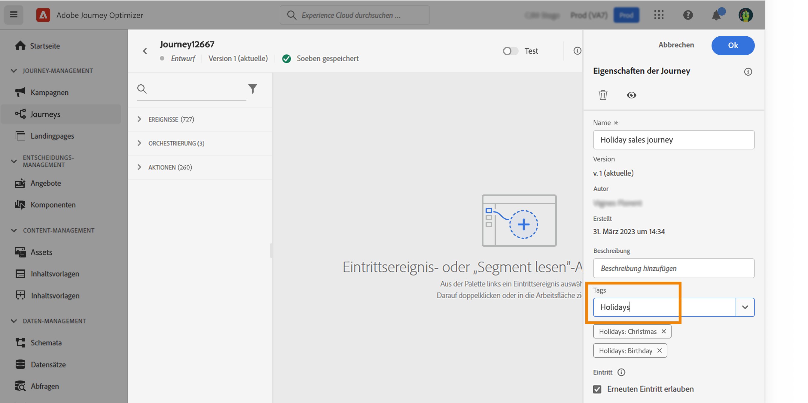
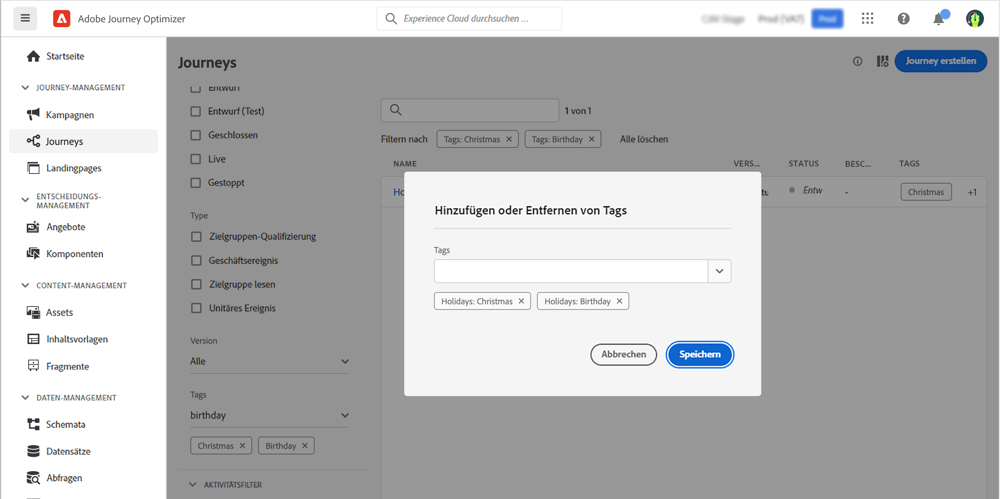

# Verwalten von Tags in Journeys {#journey_tags}

Mit Journey Optimizer können Sie Ihre Journeys mithilfe von Tags organisieren. Tags sind eine schnelle und einfache Möglichkeit, Objekte zu klassifizieren, um die Suche zu verbessern. 

>[!AVAILABILITY]
>
> Einheitliche Tags befinden sich derzeit in der Betaversion. Dokumentation und Funktionalitäten können sich ändern.

## Hinzufügen von Tags zu einer Journey

Mit dem Feld **Tags** in den Journey-Eigenschaften können Sie Tags für Ihre Journey definieren. Sie können entweder eine vorhandenes Tag auswählen oder ein neues erstellen. Geben Sie den Anfang des Namens des gewünschten Tags ein und wählen Sie es aus der Liste aus. Wenn es nicht verfügbar ist, klicken Sie auf **Erstellen**, um ein neues zu erstellen und zu Ihrer Journey hinzuzufügen. Sie können beliebig viele Tags definieren.

Die Liste der definierten Tags wird unter dem Feld **Tags** angezeigt.

>[!NOTE]
>
> Bei Tags wird die Groß-/Kleinschreibung nicht beachtet.
> 
> Wenn Sie eine Journey duplizieren oder eine neue Version einer Journey erstellen, bleiben Tags erhalten.

## Filtern nach Tags

In der Journey-Liste wird eine spezielle Spalte angezeigt, sodass Sie Ihre Tags einfach visualisieren können.

Es ist auch ein Filter verfügbar, um nur Journeys mit bestimmten Tags anzuzeigen.

Sie können Tags zu beliebigen Typen von Journeys (Live, Entwurf usw.) hinzufügen oder daraus entfernen. Klicken Sie auf das Symbol **Mehr Aktionen** neben der Journey und wählen Sie **Tags bearbeiten** aus.

## Verwalten von Tags

Admins können Tags löschen und mithilfe des Menüs **Tags** unter **ADMINISTRATION** nach Kategorien organisieren. In dieser [Dokumentation](https://experienceleague.adobe.com/docs/experience-platform/administrative-tags/overview.html?lang=de) finden Sie weitere Informationen.

>[!NOTE]
>
> In Journeys definierte Tags werden der integrierten Kategorie „Nicht kategorisiert“ hinzugefügt.
