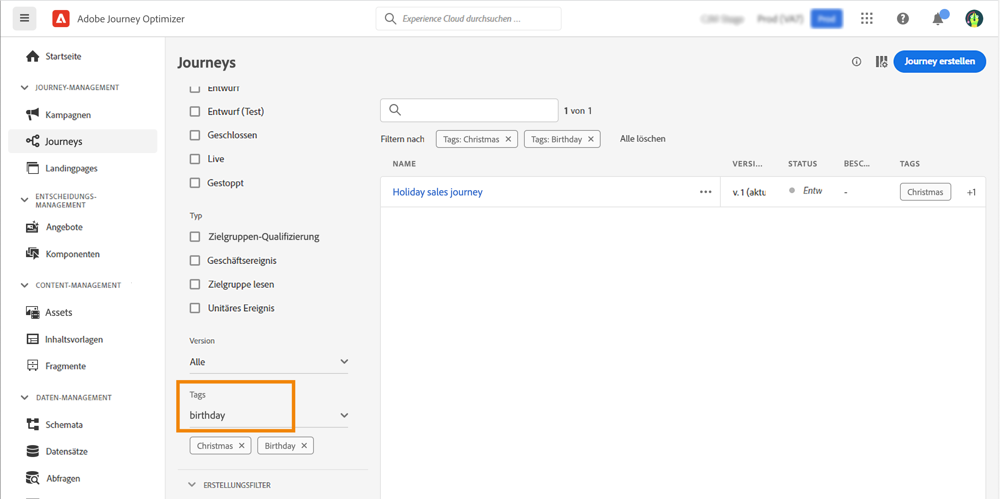

# Tags in Journey verwalten {#journey_tags}

Als Journey Optimizer-Anwender können Sie Ihre Journey mithilfe von Tags organisieren. Tags sind eine schnelle und einfache Möglichkeit, Objekte zu klassifizieren, um die Suche zu verbessern.

>[!CAUTION]
>
> Einheitliche Tags befinden sich derzeit in der Betaversion. Dokumentation und Funktionalitäten können sich ändern.

## Wichtige Hinweise

* Bei Tags wird zwischen Groß- und Kleinschreibung unterschieden
* Um ein Tag vollständig zu löschen, müssen Sie es aus allen Objekten löschen.
* Wenn Sie eine Journey duplizieren oder eine neue Version erstellen, bleiben Tags erhalten.

## Tags beim Erstellen einer Journey hinzufügen

Die **Tags** -Feld in den Journey-Eigenschaften können Sie Tags für Ihre Journey definieren. Sie können entweder ein vorhandenes Tag auswählen oder ein neues erstellen. Geben Sie den Namen des gewünschten Tags ein und wählen Sie es aus der Liste aus. Wenn sie nicht verfügbar ist, klicken Sie auf **Erstellen** , um eine neue zu erstellen und sie zu Ihrer Journey hinzuzufügen. Sie können beliebig viele Tags definieren.

Die Liste der definierten Tags wird unter dem Feld angezeigt. Sie können sie löschen.

## Tags bearbeiten und filtern

In der Journey-Liste wird eine eigene Spalte angezeigt, sodass Sie Ihre Tags einfach visualisieren können.

Es ist auch ein Filter verfügbar, der nur Journey mit bestimmten Tags anzeigt.

Sie können Tags beliebiger Journey (Live, Entwurf usw.) hinzufügen oder löschen. Klicken Sie auf **Mehr Aktionen** neben dem Journey klicken und auswählen **Tags bearbeiten**.

## Fortgeschrittene Optionen

Administratoren können Tags hinzufügen und sie anhand der Kategorien mithilfe der Variablen **Tags** Menü, unter **VERWALTUNG**. In dieser [Dokumentation](https://experienceleague.adobe.com/docs/experience-platform/administrative-tags/overview.html) finden Sie weitere Informationen.
