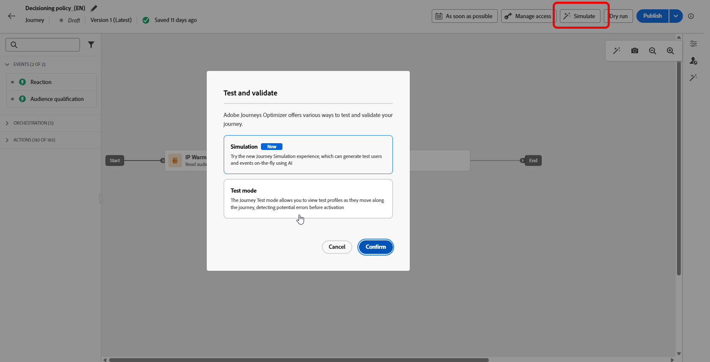
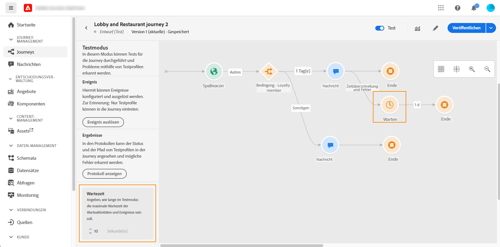
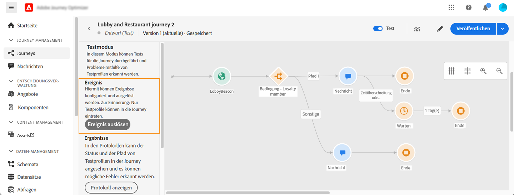
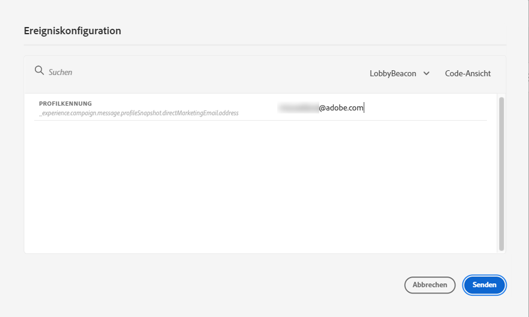
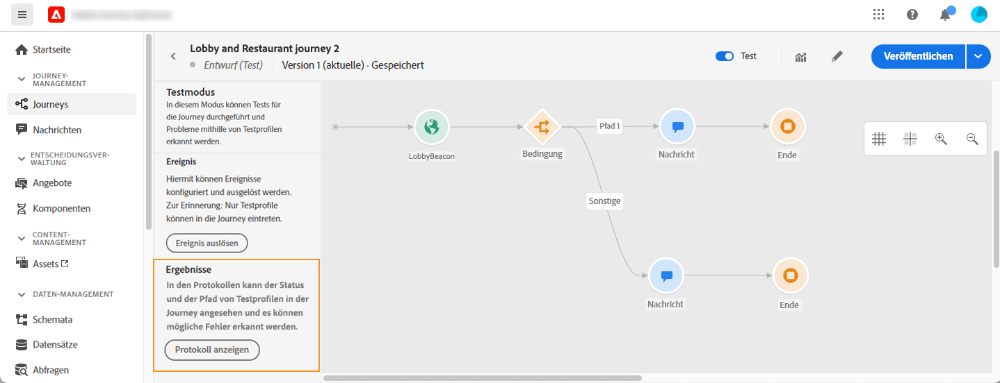
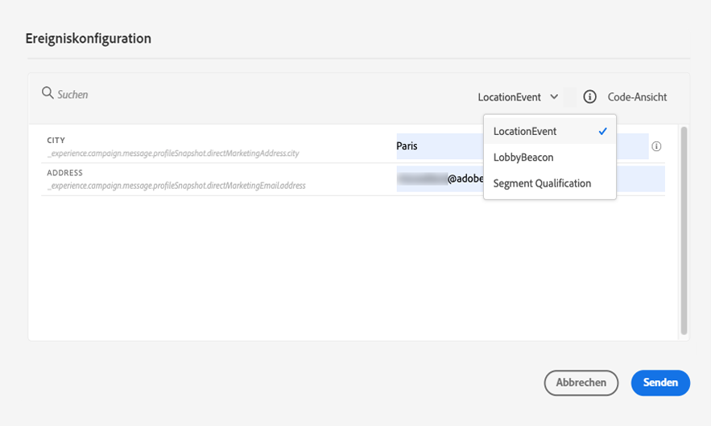
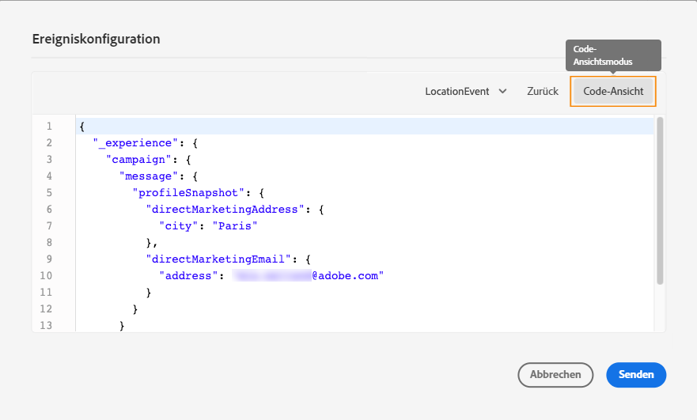
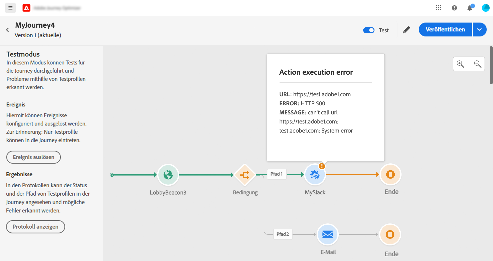
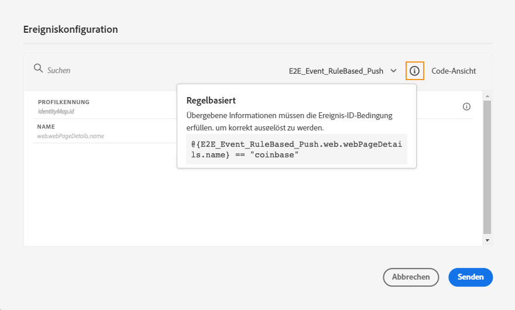
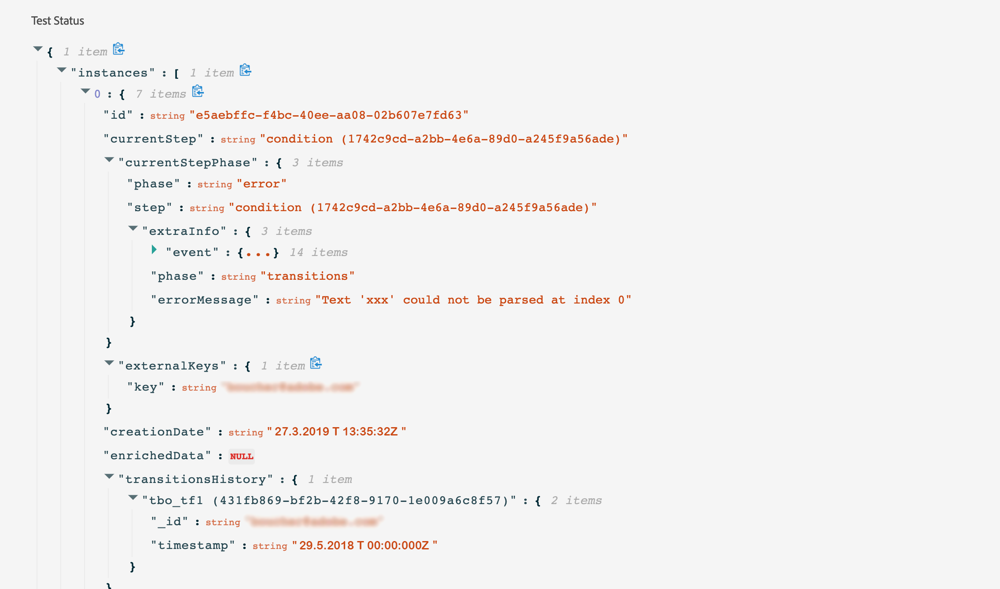

# Testen der Journey{#testing_the_journey}

>[!CONTEXTUALHELP]
>id="ajo_journey_test"
>title="Testen der Journey"
>abstract="Verwenden Sie Testprofile, um Ihre Journey vor der Veröffentlichung zu testen. Auf diese Weise können Sie analysieren, wie sich Kontakte in der Journey bewegen, und Fehler vor der Veröffentlichung beheben."
>additional-url="https://experienceleague.adobe.com/de/docs/journey-optimizer/using/orchestrate-journeys/create-journey/journey-dry-run" text="Journey-Probelauf"

Nachdem Sie Ihre Journey erstellt haben, können Sie sie vor dem Veröffentlichen testen. [!DNL Adobe Journey Optimizer] bietet den „Testmodus“ als Möglichkeit, Testprofile anzuzeigen, während sie sich auf der Journey bewegen, und potenzielle Fehler vor der Aktivierung zu erkennen. Mit Schnelltests können Sie überprüfen, ob die Journeys ordnungsgemäß funktionieren, sodass Sie sie sicher veröffentlichen können.

Nur Testprofile können im Testmodus in eine Journey eintreten. Sie können entweder neue Testprofile erstellen oder vorhandene Profile in Testprofile umwandeln. Weiterführende Informationen zu Testprofilen finden Sie in [diesem Abschnitt](../audience/creating-test-profiles.md).

Adobe Journey Optimizer bietet zwei Möglichkeiten zum Testen und Validieren Ihres Journey:

* **[Simulation](simulate-journey.md#test-users)**: Setzen Sie die Journey auf **[!UICONTROL Simulation]** und verwenden Sie simulierte Benutzende (temporäre Profile, die Sie ohne vorab erstellte Profile in Adobe Experience Platform erstellen oder im laufenden Betrieb generieren).

* **[Testmodus](#test-profiles)**: Persistente Profile, die in Adobe Experience Platform explizit als Testprofile gekennzeichnet sind. Sie können in mehreren Testsitzungen wiederverwendet werden. Diese Methode wird für Tests mit konsistenten, vordefinierten Profildaten empfohlen. [Erfahren Sie, wie Sie Testprofile erstellen](../audience/creating-test-profiles.md).

>[!NOTE]
>
>Vor dem Testen Ihrer Journey müssen Sie alle Fehler beheben, falls vorhanden. Wie Sie Fehler vor dem Testen feststellen können, erfahren Sie [in diesem Abschnitt](../building-journeys/troubleshooting.md). Wenn Testprofile im Testmodus nicht fortgesetzt werden, finden Sie weitere Informationen unter [Fehlerbehebung bei Transitionen im Testmodus](troubleshooting-execution.md#troubleshooting-test-transitions).

## Wichtige Hinweise {#important_notes}

Lesen Sie diese Hinweise, bevor Sie Tests auf Ihrem Journey durchführen.

### Allgemeine Einschränkungen

* **Nur Testprofile**: Nur Personen, die im Echtzeit-Kundenprofil-Service als „Testprofile“ gekennzeichnet sind, können im Testmodus in eine Journey eintreten. [Erfahren Sie, wie Sie Testprofile erstellen](../audience/creating-test-profiles.md).
* **Namespace-Anforderung**: Der Testmodus ist nur für Entwurfs-Journeys verfügbar, die einen Namespace verwenden. Der Testmodus muss überprüfen, ob eine Person, die die Journey betritt, ein Testprofil ist oder nicht, und muss daher in der Lage sein, [!DNL Adobe Experience Platform] zu erreichen.
* **Profil-Limit**: Während einer einzelnen Testsitzung können maximal 100 Testprofile in eine Journey eintreten.
* **Ereignisauslösung**: Ereignisse können nur über die Benutzeroberfläche ausgelöst werden. Ereignisse können nicht mithilfe einer API von externen Systemen ausgelöst werden.
* **Benutzerdefinierte Upload-Zielgruppen**: Der Journey-Testmodus unterstützt keine Attributanreicherung von [benutzerdefinierten Upload-Zielgruppen](../audience/custom-upload.md).

### Verhalten während und nach dem Test

* **Deaktivieren des Testmodus**: Wenn Sie den Testmodus deaktivieren, werden alle Profile entfernt, die sich derzeit in der Journey befinden oder zuvor in diese eingetreten sind, und das Reporting wird gelöscht.
* **Flexible Reaktivierung**: Sie können den Testmodus beliebig oft aktivieren/deaktivieren.
* **Automatische Deaktivierung**: Journeys, die im Testmodus **eine Woche lang** inaktiv bleiben, werden automatisch auf den Entwurfsstatus zurückgesetzt, um die Leistung zu optimieren und eine überflüssige Ressourcenlast zu verhindern.
* **Bearbeiten und Veröffentlichen**: Während der Testmodus aktiv ist, können Sie die Journey nicht ändern. Sie können die Journey jedoch direkt veröffentlichen, ohne den Testmodus zuvor deaktivieren zu müssen.

### Ausführung

* **Aufspaltungsverhalten**: Wenn die Journey eine Aufspaltung erreicht, wird immer die oberste Verzweigung ausgewählt. Ordnen Sie Verzweigungen neu an, wenn Sie einen anderen Pfad testen möchten.
* **Ereigniszeitplanung** - Wenn die Journey mehrere Ereignisse enthält, jedes Ereignis der Reihe nach mit einem Trigger versehen. Wird ein Ereignis zu früh (bevor der erste Warteknoten abgeschlossen ist) oder zu spät (nach der konfigurierten maximalen Wartezeit) gesendet, wird das Ereignis verworfen. Das Profil wird dann an einen Zeitüberschreitungspfad gesendet. Bestätigen Sie immer, dass alle Verweise auf Ereignis-Payload-Felder gültig bleiben, indem Sie die Payload im definierten Fenster senden.
* **Aktives Datumsfenster** - Stellen Sie sicher, dass das konfigurierte Fenster [Start- und Enddatum/-](journey-properties.md#dates)) die aktuelle Zeit enthält, wenn Sie den Testmodus starten. Andernfalls werden ausgelöste Testereignisse im Hintergrund verworfen. Weitere Informationen zur Behebung dieses Problems finden Sie [auf dieser Seite](troubleshooting-execution.md#troubleshooting-test-transitions).
* **Reaktionsereignisse**: Für Reaktionsereignisse mit einem Timeout beträgt die minimale und die standardmäßige Wartezeit 40 Sekunden.
* **Testdatensätze**: Im Testmodus ausgelöste Ereignisse werden in dedizierten Datensätzen gespeichert, die wie folgt gekennzeichnet sind: `JOtestmode - <schema of your event>`
* **Freigegebene Infrastruktur**: Der Testmodus wird auf derselben Infrastruktur ausgeführt wie die Produktion. Bei hohem Traffic-Aufkommen kann es zu Verzögerungen beim E-Mail-Versand oder bei der Ereignisverarbeitung kommen. Prüfen Sie in diesem Fall die Plattform-Traffic-Dashboards oder wiederholen Sie Ihre Tests außerhalb der Spitzenzeiten.

<!--
* Fields from related entities are hidden from the test mode.
-->

## Aktivieren des Testmodus

Verwenden Sie die **[!UICONTROL Testmodus]**-Methode, wenn Sie Ihren Journey mit bereits in Adobe Experience Platform erstellten Testprofilen testen möchten.

1. Um den Testmodus zu aktivieren, klicken Sie auf die Schaltfläche **[!UICONTROL Simulieren]** und wählen Sie **[!UICONTROL Testmodus]**.

   

1. Wenn die Journey mindestens eine Aktivität vom Typ **Warten** enthält, stellen Sie den Parameter **[!UICONTROL Wartezeit]** ein, um die Dauer jeder Warteaktivität und jedes Timeouts bei einem Ereignis im Testmodus festzulegen. Die Standardzeit für Wartezeiten und der Timeout für Ereignisse beträgt 10 Sekunden. Dadurch erhalten Sie die Testergebnisse schnell.

   

   >[!NOTE]
   >
   >Wenn in einer Journey ein Reaktionsereignis mit einem Timeout verwendet wird, beträgt der Standard- und Mindestwert für die Wartezeit 40 Sekunden. Weitere Informationen finden Sie in diesem [Abschnitt](../building-journeys/reaction-events.md).

1. Verwenden Sie die Schaltfläche **[!UICONTROL Ereignis auslösen]**, um Ereignisse zu konfigurieren und an die Journey zu senden.

   

1. Konfigurieren Sie die verschiedenen erwarteten Felder. Geben Sie im Feld **Profilkennung** den Wert des Felds ein, das zum Identifizieren des Testprofils verwendet wird. Das kann beispielsweise die E-Mail-Adresse sein. Vergewissern Sie sich, dass Ereignisse gesendet werden, die im Zusammenhang mit Testprofilen stehen. Weitere Informationen finden Sie in [diesem Abschnitt](#firing_events).

   

1. Nachdem die Ereignisse eingegangen sind, klicken Sie auf die Schaltfläche **[!UICONTROL Protokoll anzeigen]**, um das Testergebnis anzuzeigen und zu überprüfen. Weitere Informationen finden Sie in [diesem Abschnitt](#viewing_logs).

   

1. Wenn ein Fehler auftritt, deaktivieren Sie den Testmodus, ändern Sie Ihre Journey und testen Sie sie erneut. Nach Abschluss der Tests können Sie Ihre Journey veröffentlichen. Weitere Informationen finden Sie auf [dieser Seite](../building-journeys/publish-journey.md).

## Arbeitsbeispiel: Validieren einer einfachen Journey {#test-walkthrough}

Im folgenden Beispiel wird erläutert, wie Sie eine Journey testen, die mit einem unitären Ereignis beginnt, eine E-Mail sendet, 10 Minuten wartet und dann eine Push-Benachrichtigung sendet.

So validieren Sie das Journey End-to-End:

1. Aktivieren Sie den Testmodus, indem Sie **[!UICONTROL Testmodus]** in der oberen rechten Ecke klicken. Die Arbeitsfläche wechselt in den Testmodus und die Schaltfläche **[!UICONTROL Trigger an event]** wird angezeigt.
1. Stellen Sie **[!UICONTROL Wartezeit]** auf **10 Sekunden** ein, damit der Warteknoten während des Tests schnell abgeschlossen wird.
1. Klicken Sie auf **[!UICONTROL Trigger eines Ereignisses]**, wählen Sie Ihr Ereignis aus und geben Sie eine Testprofilkennung ein (z. B. die E-Mail-Adresse eines Profils, das in Adobe Experience Platform als Testprofil gekennzeichnet ist).
1. Klicken Sie auf **[!UICONTROL Senden]**. Der visuelle Fluss wird auf der Arbeitsfläche angezeigt und färbt sich grün, wenn das Profil die einzelnen Schritte durchläuft.
1. Klicken Sie **[!UICONTROL Protokoll anzeigen]** und bestätigen Sie Folgendes in der JSON-Ausgabe:
   * `currentstep` entspricht der Aktivität, die das Profil erwartungsgemäß aufweist.
   * `phase` zeigt `running` an, während sich das Profil in einem Warteknoten befindet, und `finished`, wann es das Ende erreicht.
   * Es sind keine `actionExecutionErrors` Einträge vorhanden.
1. Aktualisieren Sie das Protokoll nach 10 Sekunden. Das Profil sollte über den Warteknoten hinaus fortgeschritten sein und die Push-Aktion ausgelöst haben.
1. Wenn alle Schritte `finished` anzeigen und keine Fehler protokolliert werden, deaktivieren Sie den Testmodus und veröffentlichen Sie die Journey.

>[!TIP]
>
>Wenn das Profil überhaupt nicht im Protokoll aufgeführt wird, überprüfen Sie Folgendes:
>* Die eingegebene Profilkennung wird in [!DNL Adobe Experience Platform] als Testprofil gekennzeichnet.
>* Das konfigurierte Start- und Enddatum der Journey enthält die aktuelle Zeit. Außerhalb dieses Fensters ausgelöste Ereignisse werden im Hintergrund verworfen. [Weitere Informationen](troubleshooting-execution.md#troubleshooting-test-transitions).

## Auslösen Ihrer Ereignisse {#firing_events}

>[!CONTEXTUALHELP]
>id="ajo_journey_test_configuration"
>title="Konfigurieren des Testmodus"
>abstract="Wenn Ihre Journey mehrere Ereignisse enthält, wählen Sie ein Ereignis aus der Dropdown-Liste aus. Konfigurieren Sie dann für jedes Ereignis die weitergeleiteten Felder und die Ausführung des Ereignisversands."

Verwenden Sie die Schaltfläche **[!UICONTROL Ereignis auslösen]**, um ein Ereignis zu konfigurieren, das eine Person zum Eintritt in eine Journey veranlasst.

### Voraussetzungen {#trigger-events-prerequisites}

Als Voraussetzung müssen Sie wissen, welche Profile in [!DNL Adobe Experience Platform] als Testprofile gekennzeichnet sind. Der Testmodus lässt nur diese Profile in der Journey zu.

Das Ereignis muss eine ID enthalten. Die erwartete ID hängt von der Ereigniskonfiguration ab. Es kann sich beispielsweise um eine ECID oder eine E-Mail-Adresse handeln. Der Wert dieses Schlüssels muss im Feld **Profilkennung** hinzugefügt werden.

Wenn Ihre Journey den Testmodus nicht aktivieren kann und dabei der Fehler `ERR_MODEL_RULES_16` ausgegeben wird, stellen Sie im Falle von Kanalaktionen sicher, dass das verwendete Ereignis einen [Identity-Namespace](../audience/get-started-identity.md) enthält.

Der Identity-Namespace dient dazu, die Testprofile eindeutig zu identifizieren. Wenn beispielsweise die E-Mail-Adresse zur Identifizierung der Testprofile verwendet wird, sollte der Identity-Namespace **E-Mail** ausgewählt werden. Wenn die eindeutige Kennung die Telefonnummer ist, sollte der Identity-Namespace **Telefon** ausgewählt werden.

>[!NOTE]
>
>* Beim Trigger eines Ereignisses im Testmodus wird ein reales Ereignis generiert, d. h. es treffen auch andere Journey, die dieses Ereignis überwachen.
>
>* Stellen Sie sicher, dass jedes Ereignis im Testmodus in der richtigen Reihenfolge und innerhalb des konfigurierten Wartefensters ausgelöst wird. Bei einer Wartezeit von beispielsweise 60 Sekunden darf das zweite Ereignis erst nach Ablauf dieser Wartezeit von 60 Sekunden und vor Ablauf des Timeout-Limits ausgelöst werden.
>

### Ereigniskonfiguration {#trigger-events-configuration}

Wenn Ihre Journey mehrere Ereignisse enthält, wählen Sie ein Ereignis aus der Dropdown-Liste aus. Konfigurieren Sie dann für jedes Ereignis die weitergeleiteten Felder und die Ausführung des Ereignisversands. Über die Benutzeroberfläche können Sie die richtigen Informationen in die Ereignis-Payload eingeben und sicherstellen, dass der Informationstyp korrekt ist. Der Testmodus speichert die zuletzt in einer Testsitzung verwendeten Parameter zur späteren Verwendung.

Über die Benutzeroberfläche können Sie einfache Ereignisparameter übergeben. Wenn Sie Sammlungen oder andere erweiterte Objekte in dem Ereignis übergeben möchten, können Sie **[!UICONTROL Code-Ansicht]** auswählen, um den gesamten Code der Payload anzuzeigen und ihn zu ändern. Beispielsweise können Sie die von technischen Anwendenden erstellten Ereignisinformationen kopieren und einfügen.

Ein technischer Anwender kann diese Benutzeroberfläche auch verwenden, um Payloads für Ereignisse zu erstellen und Ereignisse auszulösen, ohne ein Tool eines Drittanbieters verwenden zu müssen.

Wenn Sie auf die Schaltfläche **[!UICONTROL Senden]** klicken, beginnt der Test. Der Fortschritt des Kontakts in der Journey wird durch einen visuellen Verlauf dargestellt. Der Pfad wird immer grüner, je weiter sich der Kontakt in der Journey bewegt. Tritt ein Fehler auf, wird auf dem entsprechenden Schritt ein Warnsymbol angezeigt. Sie können den Cursor darauf platzieren, um weitere Informationen zum Fehler anzuzeigen und genaue Details aufzurufen (sofern verfügbar).

Wenn Sie im Bildschirm für die Ereigniskonfiguration ein anderes Testprofil auswählen und den Test erneut ausführen, wird der visuelle Verlauf geleert und stattdessen der Pfad des neuen Kontakts angezeigt.

Beim Öffnen einer Journey im Test ist der angezeigte Pfad der des zuletzt durchgeführten Tests

## Testmodus für regelbasierte Journeys {#test-rule-based}

Der Testmodus ist für Journeys, bei denen ein regelbasiertes Ereignis verwendet wird, ebenfalls verfügbar. Weitere Informationen zu regelbasierten Ereignissen finden Sie auf [dieser Seite](../event/about-events.md).

Beim Auslösen eines Ereignisses können Sie im Bildschirm **Ereigniskonfiguration** die Ereignisparameter definieren, nach denen der Test als bestanden gilt. Durch Klicken auf das QuickInfo-Symbol oben rechts können Sie die Ereignis-ID-Bedingung anzeigen. Außerdem ist neben jedem Feld, das Teil der Regelauswertung ist, ebenfalls eine QuickInfo verfügbar.

## Testmodus für Geschäftsereignisse {#test-business}

Nutzen Sie bei Verwendung von [Geschäftsereignis](../event/about-events.md) den Testmodus, um einen einzelnen Testprofileintritt in die Journey auszulösen, das Ereignis zu simulieren und die richtige Profil-ID zu übergeben. Sie müssen die Ereignisparameter und die Kennung des Testprofils übergeben, das während des Tests in die Journey eintritt. Im Testmodus ist kein Modus „Code-Ansicht“ für Journeys auf der Basis von Geschäftsereignissen verfügbar.

Beachten Sie, dass Sie beim ersten Trigger eines Geschäftsereignisses die Definition des Geschäftsereignisses nicht in derselben Testsitzung ändern können. Sie können nur festlegen, dass derselbe Kontakt oder eine andere Einzelperson in die Journey eintritt, die dieselbe oder eine andere Kennung übergibt. Wenn Sie die Geschäftsereignis-Parameter ändern möchten, müssen Sie den Testmodus stoppen und erneut beginnen.

## Anzeigen von Protokollen {#viewing_logs}

>[!CONTEXTUALHELP]
>id="ajo_journey_test_logs"
>title="Testmodusprotokolle"
>abstract="Mit der Schaltfläche **Protokoll anzeigen** können Sie Testergebnisse im JSON-Format anzeigen. Diese Ergebnisse geben die Anzahl der Kontakte innerhalb der Journey sowie ihren Status an."

Mit der Schaltfläche **[!UICONTROL Protokoll anzeigen]** können Sie die Testergebnisse anzeigen. Auf dieser Seite werden die aktuellen Informationen der Journey im JSON-Format angezeigt. Mit einer Schaltfläche können Sie ganze Knoten kopieren. Sie müssen die Seite manuell aktualisieren, um die Testergebnisse der Journey zu aktualisieren.

>[!NOTE]
>
>In den Testprotokollen werden bei einem fehlerhaften Aufruf eines Drittanbietersystems (Datenquelle oder Aktion) der Fehlercode und die Fehlerantwort angezeigt.

Die Anzahl der Kontakte (technisch als Instanzen bezeichnet), die sich derzeit auf der Journey befinden, wird angezeigt. Für jede Person werden die folgenden Informationen angezeigt:

* _ID_: die interne ID des Kontakts in der Journey. Diese kann zum Debugging verwendet werden.
* _currentstep_: der Schritt, in dem sich der Kontakt in der Journey befindet. Es wird empfohlen, Ihren Aktivitäten Labels zu geben, damit Sie sie leichter identifizieren können.
* _currentstep_ > phase: der Status der Journey des Kontakts (Läuft, Abgeschlossen, Fehler, Zeitüberschreitung). Weitere Informationen finden Sie unten.
* _currentstep_ > _extraInfo_: Beschreibung des Fehlers und andere kontextuelle Informationen.
* _currentstep_ > _fetchErrors_: Informationen zu Datenfehlern beim Abrufen, die während dieses Schritts aufgetreten sind.
* _externalKeys_: der Wert für die im Ereignis definierte Schlüsselformel.
* _enrichedData_: die Daten, die die Journey abgerufen hat, falls sie Datenquellen verwendet hat.
* _transitionHistory_: die Schritte, denen der betreffende Kontakt folgte. Bei Ereignissen wird die Payload angezeigt.
* _actionExecutionErrors_: Informationen zu den aufgetretenen Fehlern.

Hier eine Liste der verschiedenen Status der Journey eines Kontakts:

* _Läuft_: der Kontakt befindet sich derzeit in der Journey.
* _Beendet_: der Kontakt befindet sich am Ende der Journey.
* _Fehler_: der Kontakt wird aufgrund eines Fehlers in der Journey gestoppt.
* _Zeitüberschreitung_: der Kontakt wird aufgrund eines Schritts, der zu viel Zeit in Anspruch genommen hat, in der Journey gestoppt.

Wenn ein Ereignis im Testmodus ausgelöst wird, wird automatisch ein Datensatz mit dem Namen der Quelle generiert.

Der Testmodus erstellt automatisch ein Erlebnisereignis und sendet es an [!DNL Adobe Experience Platform]. Der Name der Quelle für dieses Erlebnis-Ereignis lautet „Journey Orchestration Test-Ereignisse“.

