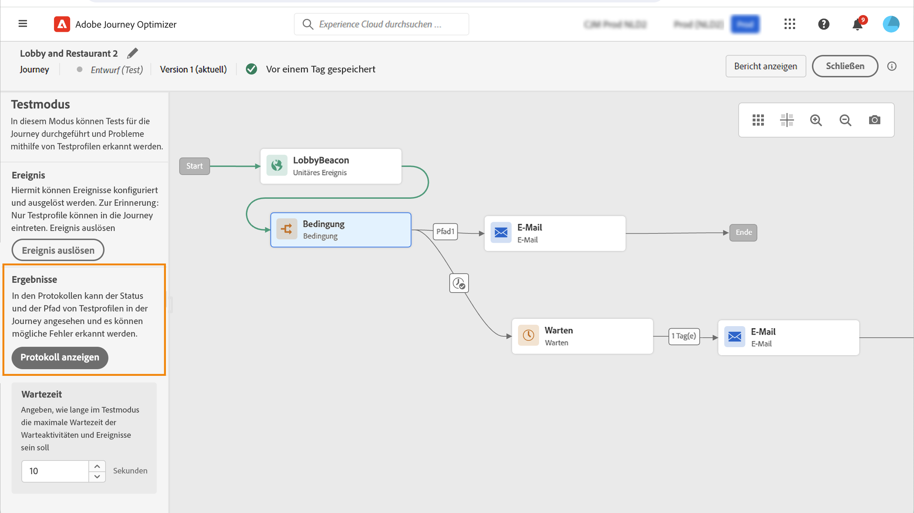

# Testen der Journey{#testing_the_journey}

>[!CONTEXTUALHELP]
>id="ajo_journey_test"
>title="Testen der Journey"
>abstract="Verwenden Sie Testprofile, um Ihre Journey vor der Veröffentlichung zu testen. Auf diese Weise können Sie analysieren, wie Kontakte in der Journey fließen, und Fehler vor der Veröffentlichung beheben."

Verwenden Sie Testprofile, um Ihre Journey vor der Veröffentlichung zu testen. Mit diesem Modus können Sie einen Test Ihrer Journey durchführen und Probleme mithilfe von Testprofilen identifizieren.

Nur Testprofile können in eine Journey im Testmodus eintreten. Sie können entweder neue Testprofile erstellen oder vorhandene Profile in Testprofile umwandeln. Weitere Informationen zu Testprofilen finden Sie in [diesem Abschnitt](../segment/creating-test-profiles.md).

>[!NOTE]
>
>Vor dem Testen Ihrer Journey müssen Sie alle Fehler beheben, falls vorhanden. Erfahren Sie, wie Sie Fehler vor dem Testen in überprüfen können. [diesem Abschnitt](../building-journeys/troubleshooting.md#checking-for-errors-before-testing).

Gehen Sie wie folgt vor, um den Testmodus zu verwenden:

1. Um den Testmodus zu aktivieren, aktivieren Sie die **[!UICONTROL Test]** Umschalten, in der oberen rechten Ecke.

   

1. Wenn die Journey mindestens eine **Warten** -Aktivität, legen Sie die **[!UICONTROL Wait time]** -Parameter, um die Dauer jeder Warteaktivität und jedes Ereignis-Timeouts im Testmodus festzulegen. Die Standardzeit beträgt 10 Sekunden für Wartezeiten und Ereignis-Timeouts. Dadurch wird sichergestellt, dass Sie die Testergebnisse schnell erhalten.

   

   >[!NOTE]
   >
   >Wenn ein Reaktionsereignis mit einer Zeitüberschreitung in einer Journey verwendet wird, beträgt der Standardwert für die Wartezeit und der Mindestwert 40 Sekunden. Siehe [diesem Abschnitt](../building-journeys/reaction-events.md).

1. Verwenden Sie die **[!UICONTROL Trigger an event]** -Schaltfläche zum Konfigurieren und Senden von Ereignissen an die Journey.

   

1. Konfigurieren Sie die verschiedenen erwarteten Felder. Im **Profilkennung** geben Sie den Wert des Felds ein, das zur Identifizierung des Testprofils verwendet wird. Dies kann beispielsweise die E-Mail-Adresse sein. Senden Sie Ereignisse im Zusammenhang mit Testprofilen. Siehe [diesem Abschnitt](#firing_events).

   

1. Nachdem die Ereignisse eingegangen sind, klicken Sie auf die **[!UICONTROL Show log]** -Schaltfläche, um das Testergebnis anzuzeigen und zu überprüfen. Siehe [diesem Abschnitt](#viewing_logs).

   

1. Wenn ein Fehler auftritt, deaktivieren Sie den Testmodus, ändern Sie Ihre Journey und testen Sie sie erneut. Nach Abschluss der Tests können Sie Ihre Journey veröffentlichen. Siehe [diese Seite](../building-journeys/publishing-the-journey.md).

## Wichtige Hinweise {#important_notes}

* Es wird eine Schnittstelle bereitgestellt, über die Ereignisse für die getestete Journey ausgelöst werden können. Ereignisse können jedoch auch von Drittanbietersystemen wie Postman gesendet werden.
* Nur Kontakte, die im Echtzeit-Kundenprofildienst als &quot;Testprofile&quot;gekennzeichnet sind, dürfen in die getestete Journey eintreten. Siehe hierzu [Abschnitt](../segment/creating-test-profiles.md).
* Der Testmodus ist nur in Entwurfs-Journeys verfügbar, die einen Namespace verwenden. Der Testmodus muss überprüfen, ob eine Person, die in die Journey eintritt, ein Testprofil ist oder nicht, und muss daher in der Lage sein, Adobe Experience Platform zu erreichen.
* Die maximale Anzahl von Testprofilen, die während einer Testsitzung in eine Journey eintreten können, beträgt 100.
* Wenn Sie den Testmodus deaktivieren, werden die Journeys von allen Personen geleert, die in der Vergangenheit daran teilgenommen haben oder sich derzeit darin befinden. Außerdem wird die Berichterstellung gelöscht.
* Sie können den Testmodus beliebig oft aktivieren/deaktivieren.
* Sie können Ihre Journey nicht ändern, wenn der Testmodus aktiviert ist. Im Testmodus können Sie die Journey direkt veröffentlichen, ohne den Testmodus zuvor deaktivieren zu müssen.
* Beim Erreichen einer Aufspaltung wird immer der obere Zweig ausgewählt. Sie können die Position der geteilten Verzweigungen neu organisieren, wenn der Test einen anderen Pfad wählen soll.
* Um die Leistung zu optimieren und eine veraltete Ressourcennutzung zu verhindern, wechseln alle Journeys im Testmodus, die seit einer Woche nicht ausgelöst wurden, zurück zum **Entwurf** Status.

## Auslösen Ihrer Ereignisse {#firing_events}

>[!CONTEXTUALHELP]
>id="ajo_journey_test_configuration"
>title="Testmodus konfigurieren"
>abstract="Wenn Ihre Journey mehrere Ereignisse enthält, wählen Sie über die Dropdownliste ein Ereignis aus. Konfigurieren Sie dann für jedes Ereignis die weitergeleiteten Felder und die Ausführung des Ereignisversands."

Verwenden Sie die **[!UICONTROL Trigger an event]** -Schaltfläche, um ein Ereignis zu konfigurieren, durch das eine Person in die Journey eintritt.

>[!NOTE]
>
>Wenn Sie ein Ereignis im Testmodus auslösen, wird ein echtes Ereignis generiert, d. h. es trifft auch auf andere Journeys zu, die dieses Ereignis überwachen.

Als Voraussetzung müssen Sie wissen, welche Profile in Adobe Experience Platform als Testprofile gekennzeichnet sind. Der Testmodus lässt nur diese Profile in der Journey zu und das Ereignis muss eine ID enthalten. Die erwartete ID hängt von der Ereigniskonfiguration ab. Es kann sich beispielsweise um eine ECID oder eine E-Mail-Adresse handeln. Der Wert dieses Schlüssels muss im **Profilkennung** -Feld.

Wenn Ihre Journey mehrere Ereignisse enthält, wählen Sie über die Dropdownliste ein Ereignis aus. Konfigurieren Sie dann für jedes Ereignis die weitergeleiteten Felder und die Ausführung des Ereignisversands. Über die Benutzeroberfläche können Sie die richtigen Informationen in der Ereignis-Payload übermitteln und sicherstellen, dass der Informationstyp korrekt ist. Der Testmodus speichert die letzten Parameter, die in einer Testsitzung verwendet werden, zur späteren Verwendung.

Über die Benutzeroberfläche können Sie einfache Ereignisparameter übergeben. Wenn Sie Sammlungen oder andere erweiterte Objekte in dem Ereignis übergeben möchten, können Sie auf **[!UICONTROL Code View]** um den gesamten Code der Payload anzuzeigen und zu ändern. Beispielsweise können Sie von einem technischen Anwender vorbereitete Ereignisinformationen kopieren und einfügen.

Ein technischer Anwender kann diese Schnittstelle auch verwenden, um Ereignis-Payloads zu erstellen und Ereignisse auszulösen, ohne ein Tool eines Drittanbieters verwenden zu müssen.

Wenn Sie auf **[!UICONTROL Send]** -Schaltfläche, beginnt der Test. Der Fortschritt des Kontakts in der Journey wird durch einen visuellen Fluss dargestellt. Der Pfad wird immer grüner, wenn sich der Kontakt über die Journey bewegt. Wenn ein Fehler auftritt, wird ein Warnsymbol auf dem entsprechenden Schritt angezeigt. Sie können den Cursor darauf platzieren, um weitere Informationen zum Fehler anzuzeigen und auf alle Details zuzugreifen (sofern verfügbar).

Wenn Sie im Bildschirm zur Ereigniskonfiguration ein anderes Testprofil auswählen und den Test erneut ausführen, wird der visuelle Verlauf gelöscht und zeigt den Pfad der neuen Person an.

Beim Öffnen einer Journey im Test entspricht der angezeigte Pfad dem zuletzt ausgeführten Test.

Der visuelle Fluss funktioniert unabhängig davon, ob das Ereignis über die Oberfläche oder extern ausgelöst wird (z. B. mit Postman).

## Testmodus für regelbasierte Journeys {#test-rule-based}

Der Testmodus ist auch für Journeys verfügbar, die ein regelbasiertes Ereignis verwenden. Weitere Informationen zu regelbasierten Ereignissen finden Sie unter [diese Seite](../event/about-events.md).

Beim Auslösen eines Ereignisses wird die Variable **Ereigniskonfiguration** -Bildschirm können Sie die Ereignisparameter definieren, die beim Test bestanden werden sollen. Sie können die Ereignis-ID-Bedingung anzeigen, indem Sie auf das QuickInfo-Symbol oben rechts klicken. Neben jedem Feld, das Teil der Regelauswertung ist, steht auch eine QuickInfo zur Verfügung.

## Testmodus für Geschäftsereignisse {#test-business}

Bei Verwendung von [Geschäftsereignis](../event/about-events.md)verwenden Sie den Testmodus, um einen einzelnen Testprofileintritt in die Journey auszulösen, das Ereignis zu simulieren und die richtige Profil-ID zu übergeben. Sie müssen die Ereignisparameter und die Kennung des Testprofils übergeben, das in den Test der Journey eintreten wird. Sie können die **[!UICONTROL Up to 100 profiles at once]** -Option, die für andere segmentbasierte Journeys vorhanden ist. Im Testmodus ist kein Code-Ansichtsmodus für Journeys verfügbar, der auf Geschäftsereignissen basiert.

Beachten Sie, dass Sie beim ersten Auslösen eines Geschäftsereignisses die Definition des Geschäftsereignisses nicht in derselben Testsitzung ändern können. Sie können nur dieselbe Person oder eine andere Person in die Journey eintreten lassen, die dieselbe oder eine andere Kennung übergibt. Wenn Sie die Geschäftsereignisparameter ändern möchten, müssen Sie den Testmodus beenden und erneut starten.

## Protokolle anzeigen {#viewing_logs}

>[!CONTEXTUALHELP]
>id="ajo_journey_test_logs"
>title="Testmodusprotokolle"
>abstract="Die Schaltfläche Protokoll anzeigen zeigt Testergebnisse im JSON-Format an. Diese Ergebnisse zeigen die Anzahl der Kontakte innerhalb der Journey und ihren Status an."

Die **[!UICONTROL Show log]** -Schaltfläche können Sie die Testergebnisse anzeigen. Auf dieser Seite werden die aktuellen Informationen der Journey im JSON-Format angezeigt. Mit einer Schaltfläche können Sie ganze Knoten kopieren. Sie müssen die Seite manuell aktualisieren, um die Testergebnisse der Journey zu aktualisieren.

>[!NOTE]
>
>In den Testprotokollen werden bei einem Fehler beim Aufrufen eines Drittanbietersystems (Datenquelle oder Aktion) der Fehlercode und die Fehlerantwort angezeigt.

Die Anzahl der Kontakte (technisch gesehen werden sie Instanzen genannt), die sich derzeit innerhalb der Journey befinden, wird angezeigt. Im Folgenden finden Sie nützliche Informationen, die für jede Person angezeigt werden:

* _ID_: die interne ID des Kontakts in der Journey. Dies kann zum Debugging verwendet werden.
* _currentstep_: den Schritt, in dem sich der Kontakt in der Journey befindet. Es wird empfohlen, Ihren Aktivitäten Titel hinzuzufügen, um sie leichter zu identifizieren.
* _currentstep_ > phase: den Status der Journey des Kontakts (Läuft, Beendet, Fehler oder Zeitüberschreitung). Weitere Informationen finden Sie unten.
* _currentstep_ > _extraInfo_: Beschreibung des Fehlers und andere kontextbezogene Informationen.
* _currentstep_ > _fetchErrors_: Informationen zu Datenfehlern beim Abrufen, die während dieses Schritts aufgetreten sind.
* _externalKeys_: den Wert für die im Ereignis definierte Schlüsselformel.
* _enrichedData_: die Daten, die die Journey abgerufen hat, wenn die Journey Datenquellen verwendet.
* _transitionHistory_: die Liste der Schritte, denen der Kontakt folgte. Bei Ereignissen wird die Payload angezeigt.
* _actionExecutionErrors_ : Informationen zu den aufgetretenen Fehlern.

Im Folgenden finden Sie die verschiedenen Status der Journey eines Kontakts:

* _Läuft_: der Kontakt sich derzeit in der Journey befindet.
* _Abgeschlossen_: der Kontakt sich am Ende der Journey befindet.
* _Fehler_: der Kontakt wird aufgrund eines Fehlers in der Journey gestoppt.
* _Zeitüberschreitung_: der Kontakt wird aufgrund eines Schritts, der zu viel Zeit in Anspruch genommen hat, in der Journey gestoppt.

Wenn ein Ereignis im Testmodus ausgelöst wird, wird automatisch ein Datensatz mit dem Namen der Quelle generiert.

Der Testmodus erstellt automatisch ein Erlebnisereignis und sendet es an Adobe Experience Platform. Der Name der Quelle für dieses Erlebnisereignis lautet &quot;Journey Orchestration Test Events&quot;.

