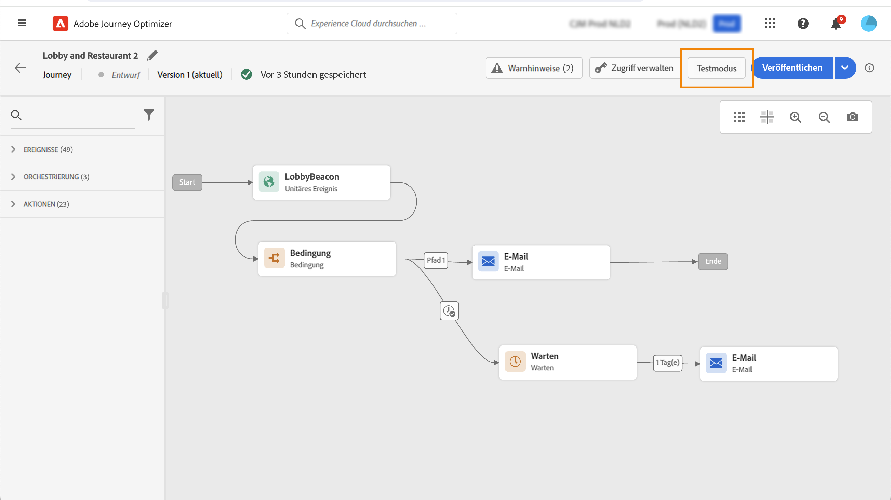
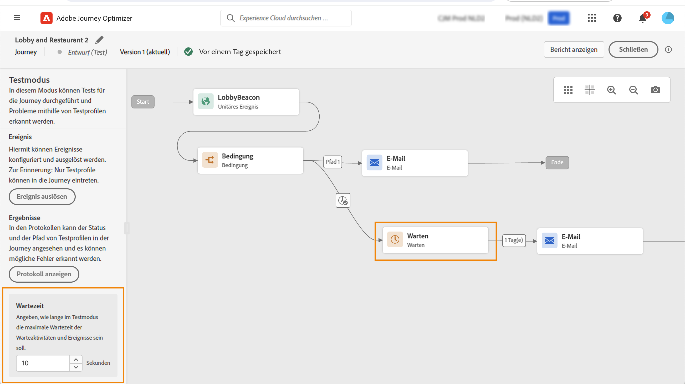
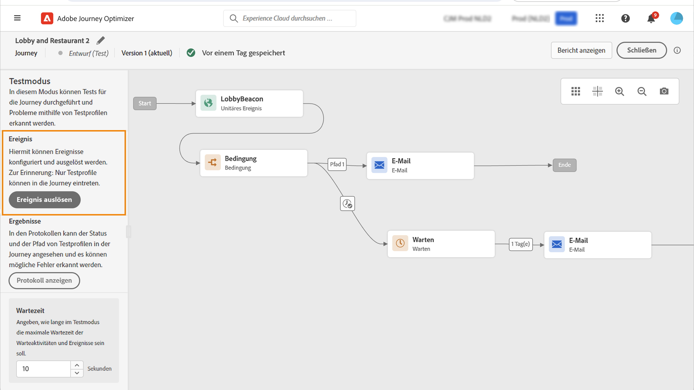
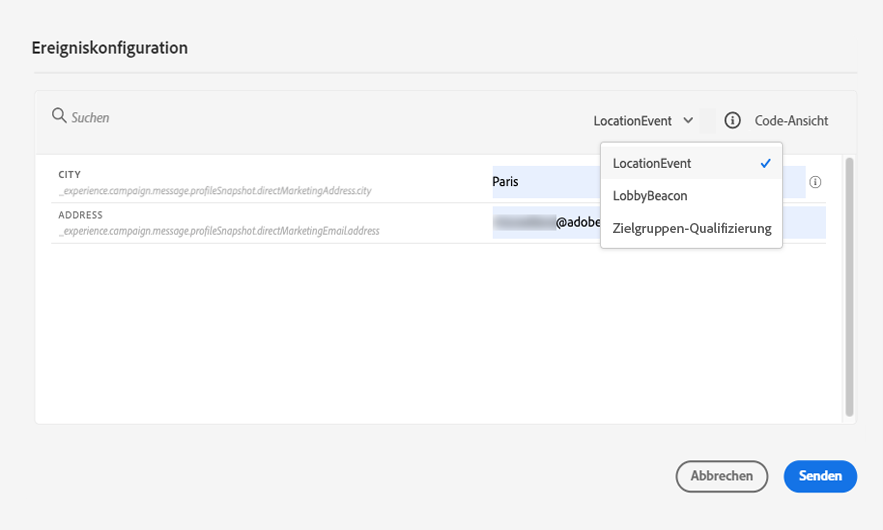

# Testen einer Journey{#testing_the_journey}

>[!CONTEXTUALHELP]
>id="ajo_journey_test"
>title="Testen einer Journey"
>abstract="Verwenden Sie Testprofile, um Ihre Journey vor der Veröffentlichung zu testen. Auf diese Weise können Sie analysieren, wie sich Kontakte in der Journey bewegen, und Fehler vor der Veröffentlichung beheben."

Verwenden Sie Testprofile, um Ihre Journey vor der Veröffentlichung zu testen. In diesem Modus können Tests für die Journey durchgeführt und Probleme mithilfe von Testprofilen erkannt werden.

Nur Testprofile können im Testmodus in eine Journey eintreten. Sie können entweder neue Testprofile erstellen oder vorhandene Profile in Testprofile umwandeln. Weiterführende Informationen zu Testprofilen finden Sie in [diesem Abschnitt](../segment/creating-test-profiles.md).

>[!NOTE]
>
>Vor dem Testen Ihrer Journey müssen Sie alle Fehler beheben, falls vorhanden. Wie Sie Fehler vor dem Testen feststellen können, erfahren Sie in [diesem Abschnitt](../building-journeys/troubleshooting.md#checking-for-errors-before-testing).

Gehen Sie wie folgt vor, um den Testmodus zu verwenden:

1. Um den Testmodus zu aktivieren, aktivieren Sie in der rechten oberen Ecke den Umschalter **[!UICONTROL Test]**.

   

1. Wenn die Journey mindestens eine Aktivität vom Typ **Warten** enthält, stellen Sie den Parameter **[!UICONTROL Wartezeit]** ein, um die Dauer jeder Warteaktivität und jeder maximalen Wartezeit bei einem Ereignis im Testmodus festzulegen. Die Standardzeit für Wartezeiten und die maximale Wartezeit für Ereignisse beträgt 10 Sekunden. Dadurch erhalten Sie die Testergebnisse schnell.

   

   >[!NOTE]
   >
   >Wenn in einer Journey ein Reaktionsereignis mit einer maximalen Wartezeit verwendet wird, beträgt der Standard- und Mindestwert für die Wartezeit 40 Sekunden. Weitere Informationen finden Sie in diesem [Abschnitt](../building-journeys/reaction-events.md).

1. Verwenden Sie die Schaltfläche **[!UICONTROL Ereignis auslösen]**, um Ereignisse zu konfigurieren und an die Journey zu senden.

   

1. Konfigurieren Sie die verschiedenen erwarteten Felder. Geben Sie im Feld **Profilkennung** den Wert des Felds ein, das zum Identifizieren des Testprofils verwendet wird. Das kann beispielsweise die E-Mail-Adresse sein. Vergewissern Sie sich, dass Ereignisse gesendet werden, die im Zusammenhang mit Testprofilen stehen. Weitere Informationen finden Sie in [diesem Abschnitt](#firing_events).

   

1. Nachdem die Ereignisse eingegangen sind, klicken Sie auf die Schaltfläche **[!UICONTROL Protokoll anzeigen]**, um das Testergebnis anzuzeigen und zu überprüfen. Weitere Informationen finden Sie in [diesem Abschnitt](#viewing_logs).

   

1. Wenn ein Fehler auftritt, deaktivieren Sie den Testmodus, ändern Sie Ihre Journey und testen Sie sie erneut. Nach Abschluss der Tests können Sie Ihre Journey veröffentlichen. Weitere Informationen finden Sie auf [dieser Seite](../building-journeys/publishing-the-journey.md).

## Wichtige Hinweise {#important_notes}

* Es wird eine Benutzeroberfläche bereitgestellt, über die Ereignisse für die getestete Journey ausgelöst werden können. Ereignisse können aber auch von Drittanbietersystemen wie Postman gesendet werden.
* Nur Kontakte, die im Echtzeit-Kundenprofil als „Testprofile“ gekennzeichnet sind, dürfen an der getesteten Journey teilnehmen. Siehe diesen [Abschnitt](../segment/creating-test-profiles.md).
* Der Testmodus ist nur in Entwurfs-Journeys verfügbar, die einen Namespace verwenden. Der Testmodus muss prüfen, ob eine Person, die auf die Journey zugreift, ein Testprofil ist oder nicht, und muss daher in der Lage sein, Adobe Experience Platform zu erreichen.
* Die maximale Anzahl von Testprofilen, die während einer Testsitzung auf eine Journey zugreifen können, beträgt 100.
* Wenn Sie den Testmodus deaktivieren, werden alle Personen, die in der Vergangenheit an der Journey teilgenommen haben oder sich derzeit darin befinden, aus der Journey entfernt. Dabei werden auch die Berichte gelöscht.
* Sie können den Testmodus beliebig oft aktivieren/deaktivieren.
* Sie können Ihre Journey nicht ändern, wenn der Testmodus aktiviert ist. Im Testmodus können Sie die Journey direkt veröffentlichen, ohne den Testmodus zuvor deaktivieren zu müssen.
* Beim Erreichen einer Aufspaltung wird immer die obere Verzweigung gewählt. Wenn der Test einen anderen Pfad wählen soll, können Sie die Position der aufgespaltenen Verzweigungen neu anordnen.
* Um die Leistung zu optimieren und eine überflüssige Ressourcennutzung zu verhindern, wechseln alle Journeys im Testmodus, die seit einer Woche nicht ausgelöst wurden, wieder in den **Entwurfsstatus**.

## Auslösen Ihrer Ereignisse {#firing_events}

>[!CONTEXTUALHELP]
>id="ajo_journey_test_configuration"
>title="Konfigurieren des Testmodus"
>abstract="Wenn Ihre Journey mehrere Ereignisse enthält, wählen Sie ein Ereignis aus der Dropdown-Liste aus. Konfigurieren Sie dann für jedes Ereignis die weitergeleiteten Felder und die Ausführung des Ereignisversands."

Verwenden Sie die Schaltfläche **[!UICONTROL Ereignis auslösen]**, um ein Ereignis zu konfigurieren, das eine Person zum Eintritt in eine Journey veranlasst.

>[!NOTE]
>
>Wenn Sie ein Ereignis im Testmodus auslösen, wird ein reales Ereignis generiert, d. h. es beeinflusst auch andere Journeys, die dieses Ereignis überwachen.

Als Voraussetzung müssen Sie wissen, welche Profile in Adobe Experience Platform als Testprofile gekennzeichnet sind. Der Testmodus lässt nur diese Profile in der Journey zu und das Ereignis muss eine ID enthalten. Die erwartete ID hängt von der Ereigniskonfiguration ab. Es kann sich beispielsweise um eine ECID oder eine E-Mail-Adresse handeln. Der Wert dieses Schlüssels muss im Feld **Profilkennung** hinzugefügt werden.

Wenn Ihre Journey mehrere Ereignisse enthält, wählen Sie ein Ereignis aus der Dropdown-Liste aus. Konfigurieren Sie dann für jedes Ereignis die weitergeleiteten Felder und die Ausführung des Ereignisversands. Über die Benutzeroberfläche können Sie die richtigen Informationen in der Ereignis-Payload angeben und prüfen, ob der Informationstyp korrekt ist. Der Testmodus speichert die zuletzt in einer Testsitzung verwendeten Parameter zur späteren Verwendung.

Über die Benutzeroberfläche können Sie einfache Ereignisparameter übergeben. Wenn Sie Sammlungen oder andere erweiterte Objekte in dem Ereignis verwenden möchten, können Sie auf **[!UICONTROL Code-Ansicht]** klicken, um den gesamten Code der Payload anzuzeigen und zu ändern. Beispielsweise können Sie die von einem technischen Anwender erstellten Ereignisinformationen kopieren und einfügen.

Ein technischer Anwender kann diese Benutzeroberfläche auch verwenden, um Payloads für Ereignisse zu erstellen und Ereignisse auszulösen, ohne ein Tool eines Drittanbieters verwenden zu müssen.

Wenn Sie auf die Schaltfläche **[!UICONTROL Senden]** klicken, beginnt der Test. Der Fortschritt des Kontakts in der Journey wird durch einen visuellen Verlauf dargestellt. Der Pfad wird immer grüner, je weiter sich der Kontakt in der Journey bewegt. Tritt ein Fehler auf, wird auf dem entsprechenden Schritt ein Warnsymbol angezeigt. Sie können den Cursor darauf platzieren, um weitere Informationen zum Fehler anzuzeigen und genaue Details aufzurufen (sofern verfügbar).

Wenn Sie im Bildschirm für die Ereigniskonfiguration ein anderes Testprofil auswählen und den Test erneut ausführen, wird der visuelle Verlauf geleert und stattdessen der Pfad des neuen Kontakts angezeigt.

Beim Öffnen einer Journey im Test ist der angezeigte Pfad der des zuletzt durchgeführten Tests

Der visuelle Fluss funktioniert unabhängig davon, ob das Ereignis über die Benutzeroberfläche oder extern ausgelöst wird (z. B. mit Postman).

## Testmodus für regelbasierte Journeys {#test-rule-based}

Der Testmodus ist für Journeys, bei denen ein regelbasiertes Ereignis verwendet wird, ebenfalls verfügbar. Weitere Informationen zu regelbasierten Ereignissen finden Sie auf [dieser Seite](../event/about-events.md).

Beim Auslösen eines Ereignisses können Sie im Bildschirm **Ereigniskonfiguration** die Ereignisparameter definieren, nach denen der Test als bestanden gilt. Durch Klicken auf das QuickInfo-Symbol oben rechts können Sie die Ereignis-ID-Bedingung anzeigen. Außerdem ist neben jedem Feld, das Teil der Regelauswertung ist, ebenfalls eine QuickInfo verfügbar.

## Testmodus für Geschäftsereignisse {#test-business}

Nutzen Sie bei Verwendung von [Geschäftsereignis](../event/about-events.md) den Testmodus, um einen einzelnen Testprofileintritt in die Journey auszulösen, das Ereignis zu simulieren und die richtige Profil-ID zu übergeben. Sie müssen die Ereignisparameter und die Kennung des Testprofils übergeben, das während des Tests in die Journey eintritt. Die Option **[!UICONTROL Bis zu 100 Profile gleichzeitig]**, die für andere segmentbasierte Journeys verfügbar ist, können Sie nicht verwenden. Im Testmodus ist kein Modus „Code-Ansicht“ für Journeys auf der Basis von Geschäftsereignissen verfügbar.

Beachten Sie, dass Sie beim ersten Trigger eines Geschäftsereignisses die Definition des Geschäftsereignisses nicht in derselben Testsitzung ändern können. Sie können nur festlegen, dass derselbe Kontakt oder eine andere Einzelperson in die Journey eintritt, die dieselbe oder eine andere Kennung übergibt. Wenn Sie die Geschäftsereignis-Parameter ändern möchten, müssen Sie den Testmodus beenden und erneut beginnen.

## Anzeigen von Protokollen {#viewing_logs}

>[!CONTEXTUALHELP]
>id="ajo_journey_test_logs"
>title="Testmodusprotokolle"
>abstract="Mit der Schaltfläche „Protokoll anzeigen“ können Sie Testergebnisse im JSON-Format anzeigen. Diese Ergebnisse geben die Anzahl der Kontakte innerhalb der Journey sowie ihren Status an."

Mit der Schaltfläche **[!UICONTROL Protokoll anzeigen]** können Sie die Testergebnisse anzeigen. Auf dieser Seite werden die aktuellen Informationen der Journey im JSON-Format angezeigt. Mit einer Schaltfläche können Sie ganze Knoten kopieren. Sie müssen die Seite manuell aktualisieren, um die Testergebnisse der Journey zu aktualisieren.

>[!NOTE]
>
>In den Testprotokollen werden bei einem fehlerhaften Aufruf eines Drittanbietersystems (Datenquelle oder Aktion) der Fehlercode und die Fehlerantwort angezeigt.

Die Anzahl der Kontakte (technisch gesehen handelt es sich um Instanzen), die sich derzeit innerhalb der Journey befinden, wird angezeigt. Außerdem finden Sie hier nützliche Informationen zu jedem Kontakt:

* _ID_: die interne ID des Kontakts in der Journey. Diese kann zum Debugging verwendet werden.
* _currentstep_: der Schritt, in dem sich der Kontakt in der Journey befindet. Es wird empfohlen, Ihren Aktivitäten Titel zu geben, damit Sie sie leichter identifizieren können.
* _currentstep > phase_: der Status der Journey des Kontakts (Läuft, Beendet, Fehler, Zeitüberschreitung). Weitere Informationen finden Sie unten.
* _currentstep_ > _extraInfo_: Beschreibung des Fehlers und andere kontextuelle Informationen.
* _currentstep_ > _fetchErrors_: Informationen zu Datenfehlern beim Abrufen, die während dieses Schritts aufgetreten sind.
* _externalKeys_: der Wert für die im Ereignis definierte Schlüsselformel.
* _enrichedData_: die Daten, die die Journey abgerufen hat, falls sie Datenquellen verwendet hat.
* _transitionHistory_: die Schritte, denen der betreffende Kontakt folgte. Bei Ereignissen wird die Payload angezeigt.
* _actionExecutionErrors_: Informationen zu den aufgetretenen Fehlern.

Hier eine Liste der verschiedenen Status der Journey eines Kontakts:

* _Läuft_: der Kontakt befindet sich derzeit in der Journey.
* _Beendet_: der Kontakt befindet sich am Ende der Journey.
* _Fehler_: der Kontakt wird aufgrund eines Fehlers in der Journey gestoppt.
* _Zeitüberschreitung_: der Kontakt wird aufgrund eines Schritts, der zu viel Zeit in Anspruch genommen hat, in der Journey gestoppt.

Wenn ein Ereignis im Testmodus ausgelöst wird, wird automatisch ein Datensatz mit dem Namen der Quelle generiert.

Der Testmodus erstellt automatisch ein Erlebnis-Ereignis und sendet es an Adobe Experience Platform. Der Name der Quelle für dieses Erlebnis-Ereignis lautet „Journey Orchestration Test-Ereignisse“.

