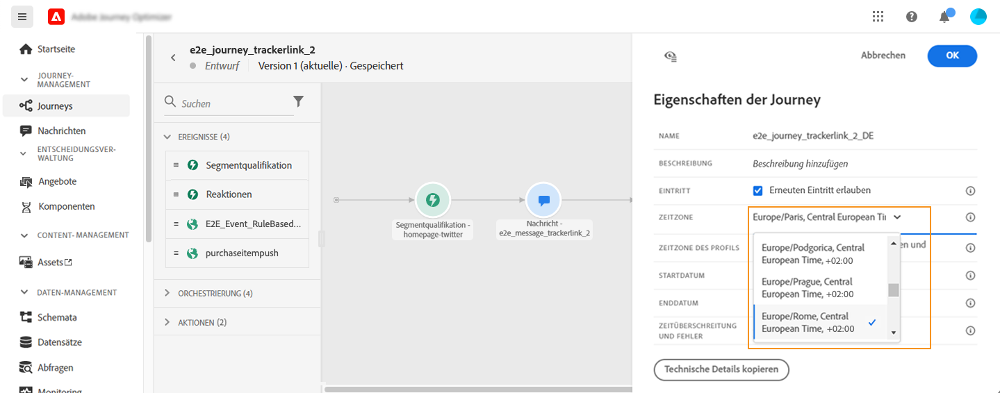
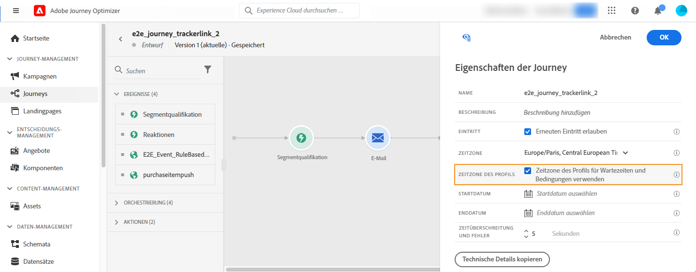

# Zeitzonen-Management {#timezone_management}

>[!CONTEXTUALHELP]
>id="ajo_journey_properties_time_zone"
>title="Journey-Zeitzone"
>abstract="Wählen Sie die Zeitzone der Journey aus. Wenn Sie eine feste Zeitzone verwenden, ist diese für alle Kontakte gleich, die in die Journey eintreten."

Sie können eine Zeitzone in den [Eigenschaften](../building-journeys/journey-properties.md#timezone) Ihrer Journey festlegen.

Um die Eigenschaften der Journey aufzurufen, wählen Sie das Stiftsymbol oben rechts im Bildschirm aus.

Diese Zeitzone wird für jede Aktivität der Journey verwendet, die ein Zeitelement enthält, z. B.:

* [Zeitbedingung](../building-journeys/conditions.md#time_condition)
* [Bedingung für das Datum](../building-journeys/conditions.md#date_condition)
* [Benutzerdefinierte Wartezeit](../building-journeys/wait-activity.md#custom)

<!--
* [Fixed date wait](../building-journeys/wait-activity.md#fixed_date)
-->

Sie können eine [feste Zeitzone](#fixed-timezone) auswählen oder die Zeitzone verwenden, die [im Benutzerprofil definiert ist](#timezone-from-profiles).

## Definieren einer festen Zeitzone {#fixed-timezone}

Die Zeitzone kann fest definiert werden. Löschen Sie die vordefinierte Zeitzone und wählen Sie eine aus der Dropdown-Liste aus. Wenn Sie eine feste Zeitzone verwenden, ist diese für alle Kontakte gleich, die die Journey beginnen.

Wählen Sie dazu im Bereich **[!UICONTROL Journey-Eigenschaften]** eine Zeitzone aus.

## Zeitzone des Profils verwenden {#timezone-from-profiles}

>[!CONTEXTUALHELP]
>id="ajo_journey_properties_profile_time_zone"
>title="Zeitzone des Profils verwenden"
>abstract="Aktivieren Sie diese Option, um bei den Aktivitäten **Warten** und **Bedingung** die Zeitzone des Echtzeitprofils zu verwenden. Wenn für ein Profil eine Zeitzone definiert wurde, wird diese abgerufen und in der Journey verwendet. Andernfalls wird die im Zeitzonenfeld definierte Zeitzone verwendet."

Wenn das Eintrittsereignis der Journey über einen Namespace verfügt, d. h. die Journey den Echtzeit-Kundenprofil-Service von [!DNL Adobe Experience Platform] erreichen kann, empfiehlt es sich, die auf Profilebene definierte Zeitzone zu verwenden. Aktivieren Sie dazu in den **Eigenschaften** die Option **Zeitzone des Profils für Wartezeiten und Bedingungen verwenden**. Diese Option ist nicht standardmäßig aktiviert.

Wenn für ein Profil eine Zeitzone definiert wurde, wird diese abgerufen und von der Journey verwendet. Ist dies nicht der Fall, wird die im Zeitzonenfeld definierte Zeitzone verwendet.

>[!NOTE]
>
>Die Zeitzone des Profils verwendet das Feld **timeZone** in der Feldergruppe **Voreinstellungsdetails**.

## Verwenden von Zeitzonen in Ausdrücken {#timezone-in-expressions}

Das Start- und Enddatum einer Journey kann nicht mit einer bestimmten Zeitzone verknüpft werden. Es wird automatisch mit der Zeitzone der Instanz verbunden.
