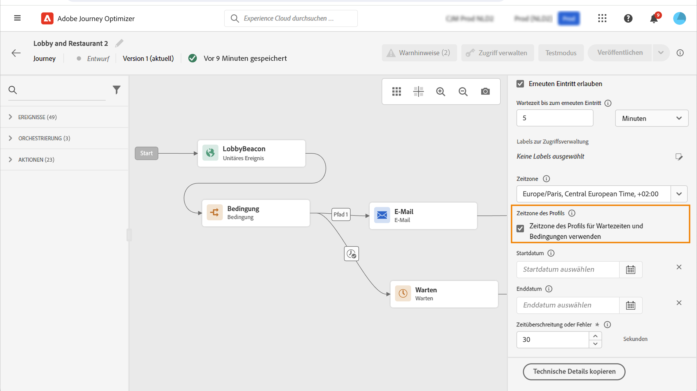

# Zeitzonen-Management {#timezone_management}

Sie können eine Zeitzone in den [Eigenschaften](../building-journeys/journey-gs.md#change-properties) Ihrer Journey festlegen.

Um die Eigenschaften der Journey aufzurufen, klicken Sie auf das Stiftsymbol oben rechts im Bildschirm.

Diese Zeitzone wird für jede Aktivität der Journey verwendet, die ein Zeitelement enthält, z. B.: 

* [Bedingung für die Uhrzeit](../building-journeys/condition-activity.md#time_condition)
* [Bedingung für das Datum](../building-journeys/condition-activity.md#date_condition)
* [Benutzerdefinierte Wartezeit](../building-journeys/wait-activity.md#custom)
* [Wartezeit mit festgelegtem Datum](../building-journeys/wait-activity.md#fixed_date)

Sie können eine Zeitzone auswählen oder die Zeitzone verwenden, die im Benutzerprofil definiert ist.

>[!NOTE]
>
>Die Zeitzone des Profils verwendet das Feld **timeZone** in der Feldergruppe **Voreinstellungsdetails**.

## Definieren einer festen Zeitzone {#fixed-timezone}

Die Zeitzone kann auch fest definiert werden. Löschen Sie die vordefinierte Zeitzone und wählen Sie eine aus der Dropdown-Liste aus. Wenn Sie eine feste Zeitzone verwenden, ist diese für alle Kontakte gleich, die die Journey beginnen.

Wählen Sie dazu im Bereich **[!UICONTROL Journey-Eigenschaften]** eine Zeitzone aus.

## Verwenden von Profilen zur Definition der Zeitzone einer Journey {#timezone-from-profiles}

Wenn das Eintrittsereignis der Journey einen Namespace hat, d. h. die Journey hat Zugriff auf den Echtzeit-Kundenprofil-Service von Adobe Experience Platform, wird die Zeitzone mit jener im Profil des Kontakts vordefiniert, der sich in der Journey befindet.

Wenn eine Zeitzone im Adobe Experience Platform-Profil definiert ist, kann sie in der Journey abgerufen werden.

Wenn das Profil des Kontakts keine Zeitzone enthält, wird die im Zeitzonenfeld definierte Zeitzone abgerufen.

Aktivieren Sie dazu in den **[!UICONTROL Eigenschaften]** die Option **[!UICONTROL Zeitzone des Profils in Timern und Bedingungen verwenden]**.

## Verwenden von Zeitzonen in Ausdrücken {#timezone-in-expressions}

Das Start- und Enddatum einer Journey kann nicht mit einer bestimmten Zeitzone verknüpft werden. Es wird automatisch mit der Zeitzone der Instanz verbunden.
