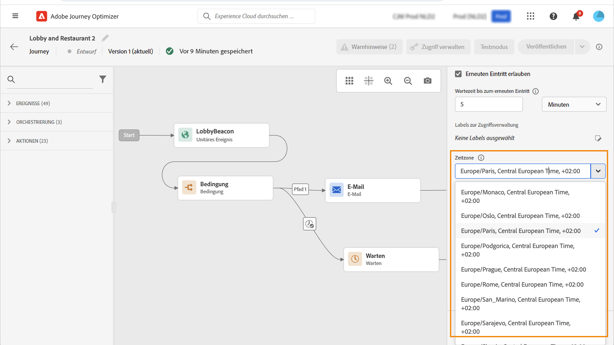

# Zeitzonen-Management {#timezone_management}

Sie können eine Zeitzone im [properties](../building-journeys/journey-gs.md#change-properties) Ihrer Journey.

Um auf die Journey-Eigenschaften zuzugreifen, klicken Sie auf das Stiftsymbol oben rechts im Bildschirm.

Diese Zeitzone wird für jede Aktivität der Journey verwendet, die ein Zeitelement enthält, z. B.:

* [Zeitbedingung](../building-journeys/condition-activity.md#time_condition)
* [Datumsbedingung](../building-journeys/condition-activity.md#date_condition)
* [Benutzerdefinierte Wartezeit](../building-journeys/wait-activity.md#custom)

<!--
* [Fixed date wait](../building-journeys/wait-activity.md#fixed_date)
-->

Sie können eine Zeitzone auswählen oder die im Benutzerprofil definierte Zeitzone verwenden.

>[!NOTE]
>
>Die Zeitzone des Profils funktioniert mit der **timeZone** im Feld **Präferenzdetails** Feldergruppe.

## Definieren einer festen Zeitzone {#fixed-timezone}

Die Zeitzone kann auch festgelegt werden. Löschen Sie die vordefinierte Zeitzone und wählen Sie eine aus der Dropdownliste aus. Wenn Sie eine feste Zeitzone verwenden, ist diese für alle Kontakte gleich, die in die Journey eintreten.

Gehen Sie dazu im **[!UICONTROL Journey Properties]** ein, wählen Sie eine Zeitzone aus.

## Verwenden Sie Profile, um die Zeitzone der Journey zu definieren {#timezone-from-profiles}

Wenn das Eintrittsereignis der Journey einen Namespace hat, d. h. die Journey den Echtzeit-Kundenprofildienst von Adobe Experience Platform erreichen kann, sollten Sie die auf Profilebene definierte Zeitzone verwenden. Gehen Sie dazu in **Eigenschaften**, check **Verwenden der Zeitzone des Profils in Wartezeiten und Bedingungen**. Diese Option ist standardmäßig nicht aktiviert.

Wenn für ein Profil eine Zeitzone definiert wurde, wird diese abgerufen und von der Journey verwendet. Ist dies nicht der Fall, wird die im Zeitzonenfeld definierte Zeitzone verwendet.

## Verwenden von Zeitzonen in Ausdrücken {#timezone-in-expressions}

Das Start- und Enddatum einer Journey kann nicht mit einer bestimmten Zeitzone verknüpft werden. Sie werden automatisch der Zeitzone der Instanz zugeordnet.
