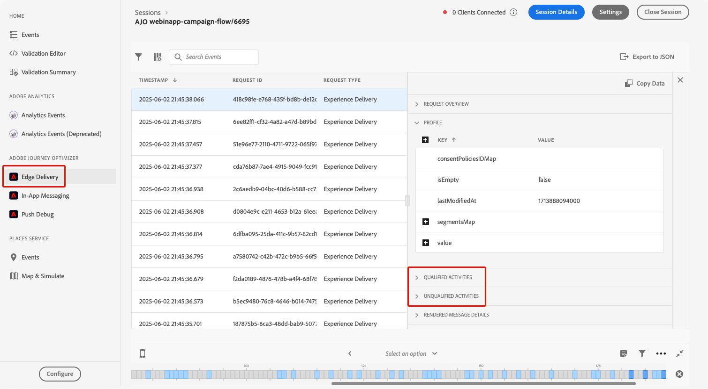

# Fehlerbehebung bei eingehenden Aktionen in Journeys {#troubleshooting-inbound-actions}

Eingehende Aktionen wie In-App-, Web- und Code-basierte Erlebnisse sind wichtige Komponenten von [!DNL Journey Optimizer], da sie während der Journey eine personalisierte Interaktion mit Benutzenden ermöglichen. Es kann jedoch zu unerwartetem Verhalten kommen, z. B. fehlende eingehende Inhalte oder die Fortsetzung des Versands nach dem Verlassen der Journey durch ein Profil.

Dieses Handbuch enthält eine schrittweise Anleitung zum Debugging von Fehlern im Zusammenhang mit eingehenden Aktionen in einer Journey, damit diese vor Kontaktaufnahme mit dem Support unabhängig identifiziert und behoben werden können.

<!--This guide addresses the two most common scenarios with inbound actions in a journey. They are as follows:

* A profile enters the inbound step, but the user does not receive the expected inbound content.
* A user continues to receive inbound content even after the profile exits the journey.
-->

## Voraussetzungen {#prerequisites}

Vor dem Beginn der Fehlerbehebung muss Folgendes sichergestellt sein:

1. Richten Sie eine **Assurance**-Sitzung ein. Weitere Informationen hierzu finden Sie in der Dokumentation zu [[!DNL Adobe Experience Platform] Assurance](https://experienceleague.adobe.com/de/docs/experience-platform/assurance/tutorials/using-assurance){target="_blank"}.

1. Navigieren Sie zur Journey mit der eingehenden Aktion, um den Journey-Namen und die Versions-ID abzurufen.

   >[!NOTE]
   >
   >Die Journey-Versions-ID befindet sich in der URL nach „Journey/“ (z. B: *86232fb1-2932-4036-8198-55dfec606fd7*).

   

1. Klicken Sie auf die eingehende Aktion, um deren Details anzuzeigen. Rufen Sie Label und ID der eingehenden Aktion ab.

   

1. Rufen Sie Namespace und ID des Profils ab, um das Profil mit den Problemen zu identifizieren. Je nach Konfiguration kann der Namespace beispielsweise ECID, E-Mail oder Kunden-ID sein. Weitere Informationen zum Suchen eines Profils sind in der [Dokumentation zu Experience Platform](https://experienceleague.adobe.com/de/docs/experience-platform/profile/ui/user-guide#browse-identity){target="_blank"} verfügbar.

## Szenario 1: Die Benutzenden haben den eingehenden Inhalt nicht erhalten {#scenario-1}

In diesem Szenario ist ein Profil in die eingehende Aktion in der Journey eingetreten, aber selbst nach 30 Minuten wird der entsprechende eingehende Inhalt nicht auf dem Gerät/Client beim Schritt zur Einrichtung des Triggers angezeigt.

### Vorab-Prüfungen {#pre-checks}

1. **Eingehender Journey-Datensatz ist für die Profilaufnahme aktiviert**

   Die eingehende Aktion verwendet den **eingehenden Journey**-Datensatz für die Profilaktualisierungen während der Ausführung. Der Datensatz muss für Profile in der aktuellen Sandbox aktiviert sein. [Weitere Informationen zu Datensätzen](../data/get-started-datasets.md)

2. **In Plattform-Identitäten definierte „joai“-Identität**

   Die eingehende Aktion verwendet den **joai**-Namespace im Profil `segmentMembership`, um das Profil für den eingehenden Schritt zu aktivieren. Dieser muss in Plattform-Identitäten für die Sandbox definiert worden sein. Weitere Informationen zu [Experience Platform Identity Service](https://experienceleague.adobe.com/de/docs/experience-platform/identity/home){target="_blank"}

### Debugging-Schritte {#debugging-steps}

Das folgende Diagramm zeigt die Sequenz der zu befolgenden Debugging-Schritte:

{width="70%" align="center"}

### Schritt 1: Überprüfen, ob das Gerät/der Client den Inhalt von Edge Network erhält {#step-1}

Überprüfen Sie zunächst ob das Gerät/der Client den erwarteten Inhalt erhält.

>[!BEGINTABS]

>[!TAB In-App-Kanal]

1. Gehen Sie zur [Assurance](https://experienceleague.adobe.com/de/docs/experience-platform/assurance/tutorials/using-assurance){target="_blank"}-Sitzung und wählen Sie im linken Panel **In-App-Nachrichten** aus.

1. Klicken Sie in der Registerkarte **[!UICONTROL Nachrichten auf Gerät]** auf die Dropdown-Liste **[!UICONTROL Nachrichten]**.

   {width="80%"}

1. Suchen Sie nach einer Nachricht mit dem Journey-Namen gefolgt von „– In-App-Nachricht“. Falls vorhanden, bedeutet dies, dass die In-App-Nachricht auf dem Gerät/Client vorhanden ist und das Problem möglicherweise mit dem In-App-Trigger zusammenhängt.

1. Wenn die Nachricht nicht gefunden wurde, wurde die In-App-Nachricht nicht vom Gerät/Client empfangen. <!--Go to the [next step](#step-2) for further debugging.-->

>[!TAB Web-Kanal]

Besuchen Sie die Seite und überprüfen Sie die Registerkarte „Netzwerk“ oder die Edge-Antwort-Payload im Abschnitt **[!UICONTROL Edge Delivery]** der [Assurance](https://experienceleague.adobe.com/de/docs/experience-platform/assurance/tutorials/using-assurance){target="_blank"}-Sitzung.

>[!TAB Code-basierter Erlebniskanal]

Führen Sie mit dem [Adobe-API](https://developer.adobe.com/data-collection-apis/docs/api/) eine cURL-Anfrage durch und überprüfen Sie die Edge-Antwort-Payload im Abschnitt **[!UICONTROL Edge Delivery]** der [Assurance](https://experienceleague.adobe.com/de/docs/experience-platform/assurance/tutorials/using-assurance){target="_blank"}-Sitzung.

>[!ENDTABS]

### Schritt 2: Überprüfen, ob Edge Network den Inhalt zurückgibt {#step-2}

In diesem Schritt wird sichergestellt, dass Edge Network den erwarteten eingehenden Inhalt zurückgibt, der auf dem Gerät/Client gerendert werden soll.

Wenn ein Profil in eine eingehende Aktion in einer Journey eintritt, wird es automatisch in ein spezielles Zielgruppensegment (im **joai**-Namespace) qualifiziert, das der eingehenden Journey-Aktion entspricht.

Wenn ein Client eine Anfrage an Edge Network für ein bestimmtes Profil und eine bestimmte Oberfläche sendet, ist das Profil nur dann für den Empfang von Inhalten für die eingehenden Journey-Aktionen qualifiziert, die auf diese Oberfläche abzielen, wenn das Profil derzeit Mitglied des entsprechenden **joai**-Segments ist.

Gehen Sie wie folgt vor, um das Verhalten von Edge Network zu debuggen.

1. Öffnen Sie die Ansicht **[!UICONTROL Edge Delivery]** in der Assurance-Sitzung. Diese Ansicht enthält Informationen über die Ausführung der eingehenden Aktion auf dem Edge Network-Server. Weitere Informationen finden Sie in der [Dokumentation zu Adobe Experience Platform](https://experienceleague.adobe.com/de/docs/experience-platform/assurance/view/edge-delivery){target="_blank"}.

1. Überprüfen Sie, ob die Edge-Aktivität, die der eingehenden Aktion entspricht, in den Abschnitten **[!UICONTROL Qualifizierte Aktivitäten]** oder **[!UICONTROL Nicht qualifizierte Aktivitäten]** aufgeführt ist.

   

   * Wenn es sich im Abschnitt **Qualifizierte Aktivitäten** befindet, hat sich das Profil für die eingehende Journey-Aktion qualifiziert und der Inhalt sollte zurückgegeben werden.
   * Wenn es sich im Abschnitt **Nicht qualifizierte Aktivitäten** befindet, hat sich das Profil nicht für die eingehende Journey-Aktion qualifiziert. Weitere Informationen sind in den Ausschlussgründen enthalten.
   * Wenn sich das Profil in **keinem Abschnitt** befindet, trat entweder ein Problem mit der Veröffentlichung der eingehenden Journey-Aktion in Edge Network auf oder der angeforderte Oberflächen-URI stimmte nicht mit den Kanalkonfigurationseinstellungen für die eingehende Aktion überein.

   >[!NOTE]
   >
   >Um die Edge-Aktivität in der **Assurance**-Sitzung zu finden, suchen Sie nach der Aktivität, bei der **[!UICONTROL audienceNamespace]**&#x200B;**joai** lautet und die **[!UICONTROL audienceSegmentId]** &lt;*JourneyVersionID*>_&lt;*JourneyActionID*> ist (Beispiel: *86232fb1-2932-4036-8198-55dfec606fd7_708f718d-8503-4427-ad8d-8e28979b554c*).

   {width="70%"}

1. Wenn sich die Aktivität im Abschnitt **[!UICONTROL Nicht qualifizierte Aktivitäten]** befindet und der Ausschlussgrund *„Segment ist nicht aktiv“* ist, bedeutet dies, dass der Edge Network-Versand-Server das Profil nicht für Teil des entsprechenden Zielgruppensegments **joai** hält.

   Sie können überprüfen, ob das **joai**-Segment in der Profilansicht des Edge Network-Versand-Servers vorhanden ist, indem Sie das **segmentsMap**-Element des Profilabschnitts öffnen und nach dem Vorhandensein der **joai**-Segment-ID suchen.

1. Wenn der Edge Network-Versand-Server das Profil nicht als im entsprechenden **joai**-Segment enthalten anzeigt, wird mit dem nächsten Schritt fortgefahren.<!--use the Platform Profile viewer UI to check if the expected **joai** segment is in a realized state in the Edge profile. Learn more in the [Experience Platform Profile UI documentation](https://experienceleague.adobe.com/en/docs/experience-platform/profile/ui/user-guide){target="_blank"}-->

### Schritt 3: Überprüfen, ob die „joai“-Zielgruppen-Zugehörigkeit auf Edge Network übertragen wurde {#step-3}

In diesem Schritt wird überprüft, ob das Edge-Profil beim Eintritt in die eingehende Journey-Aktion korrekt aktualisiert wurde und ob das Profil in das entsprechende **joai**-Segment qualifiziert wurde.

Wenn ein Profil in ein **joai**-Segment qualifiziert wird, wird das Profil zunächst im Hub aktualisiert und dann die Segmentzugehörigkeit an das Edge-Profil projiziert, damit es vom Edge Network-Versand-Server verwendet werden kann.

>[!NOTE]
>
>Die Übertragung von Hub zu Edge kann 15 bis 30 Minuten ab dem Zeitpunkt dauern, an dem das Profil im Hub aktualisiert wird.

Das Vorhandensein des **joai**-Segments in den `segmentMembership`-Attributen des Edge-Profils kann folgendermaßen überprüft werden.

1. Navigieren Sie zum Menü **[!UICONTROL Kunde]** > **[!UICONTROL Profile]** im linken [!DNL Journey Optimizer]-Navigationsbereich und suchen Sie das Profil mithilfe von Namespace und ID. Weitere Informationen zu [Echtzeit-Kundenprofilen](../audience/get-started-profiles.md)

1. Wählen Sie die Registerkarte **[!UICONTROL Attribute]** und dann die Ansicht **[!UICONTROL Edge]** aus.

1. Klicken Sie auf **[!UICONTROL JSON anzeigen]**, um die JSON-Ansicht für das Profil zu öffnen.

   {width="80%"}

1. Wechseln Sie zum Attribut `segmentMembership` und überprüfen Sie, ob die Segmentkennung &lt;*JourneyVersionID>*_&lt;*JourneyActionID*> im Namespace **joai** vorhanden ist und sich im Status **[!UICONTROL Realisiert]** <!--or existing?-->befindet.

   {width="90%"}

   * Wenn vorhanden, wurde das **joai**-Segment, das der eingehenden Journey-Aktion entspricht, korrekt in das Edge-Profil aufgenommen.

   * Wenn das Profil nicht in der Profilansicht des Edge Network-Versand-Servers angezeigt wird, besteht eventuell ein Problem damit, wie der Versand-Server das Edge-Profil lädt.

1. Wenn die **joai**-Segment-ID nicht vorhanden ist oder sich im Status **[!UICONTROL Ausgetreten]** befindet, bedeutet dies, dass sie (noch) nicht an Edge übertragen wurde.

   Warten Sie 15 bis 30 Minuten, bis die `segmentMembership`-Werte von Hub zu Edge übertragen wurden. Wenn es immer noch nicht vorhanden ist, fahren Sie mit dem nächsten Schritt fort.

<!--The next step is to check whether the audience segment is present in the profile on the Hub.-->

### Schritt 4: Überprüfen, ob die Zielgruppen-Zugehörigkeit „joai“ im Hub-Profil vorhanden ist {#step-4}

In diesem Schritt wird überprüft, ob das Hub-Profil beim Eintritt in die eingehende Journey-Aktion korrekt aktualisiert wurde und ob das Profil in das entsprechende **joai**-Segment qualifiziert wurde.

>[!NOTE]
>
>Die Aufnahme der **joai**-Segmentzugehörigkeit in das Hub-Profil kann 15 bis 30 Minuten ab dem Zeitpunkt dauern, an dem das Profil in die eingehende Journey-Aktion eintrat.

Das Vorhandensein des **joai**-Segments im `segmentMembership`-Attribut des Hub-Profils kann folgendermaßen überprüft werden.

1. Navigieren Sie zum Menü **[!UICONTROL Kunde]** > **[!UICONTROL Profile]** im linken [!DNL Journey Optimizer]-Navigationsbereich und suchen Sie das Profil mithilfe von Namespace und ID. Weitere Informationen zu [Echtzeit-Kundenprofilen](../audience/get-started-profiles.md)

1. Wählen Sie die Registerkarte **[!UICONTROL Attribute]** und dann die Ansicht **[!UICONTROL Hub]** aus.

1. Klicken Sie auf **[!UICONTROL JSON anzeigen]**, um die JSON-Ansicht für das Profil zu öffnen.

1. Wechseln Sie zum Attribut **[!UICONTROL segmentMembership]** und überprüfen Sie, ob die Segment-ID &lt;*JourneyVersionID>*_&lt;*JourneyActionID*> im **joai**-Namespace vorhanden ist und sich im Status **[!UICONTROL Realisiert]** <!--or existing?--> befindet.

   * Wenn vorhanden, wurde das **joai**-Segment, das der eingehenden Journey-Aktion entspricht, korrekt in das Hub-Profil aufgenommen.

   * Wenn es nach mindestens 30 Minuten nicht im Edge-Profil gefunden wird, liegt eventuell ein Problem mit dem Edge-Projektionssystem vor.

1. Wenn die **joai**-Segment-ID nicht vorhanden ist oder sich im Status **[!UICONTROL Ausgetreten]** befindet, bedeutet dies, dass das Profil beim Eintritt in die entsprechende eingehende Journey-Aktion (noch) nicht korrekt in das spezielle **joai**-Zielgruppensegment qualifiziert wurde.

   Warten Sie 15 bis 30 Minuten, bis die `segmentMembership`-Werte in das Hub-Profil aufgenommen wurden. Wenn es immer noch nicht vorhanden ist, fahren Sie mit dem nächsten Schritt fort.

### Schritt 5: Wenn der Client/das Gerät immer noch nicht den erwarteten Inhalt erhält {#step-5}

Wenn alle oben genannten Schritte durchgeführt wurden und das erwartete Verhalten nicht eintritt (nach einer Wartezeit von 30 bis 60 Minuten, um die Segmentzugehörigkeit auf Edge Network zu übertragen), wenden Sie sich an die Adobe-Kundenunterstützung oder den Adobe-Support.

Fügen Sie so viele Details wie möglich aus den Debugging-Schritten hinzu, z. B.:

* den Schritt, in dem das unerwartete Verhalten auftritt;
* die ID der Journey-Version;
* die ID der Journey-Aktion;
* die vollständige Assurance-Verfolgung;
* die JSON-Ansicht des Edge-Profils;
* die JSON-Ansicht des Hub-Profils;
* usw.

## Szenario 2: Die Benutzenden erhalten den eingehenden Inhalt weiterhin {#scenario-2}

Dieses Szenario ist das Gegenteil von [Szenario 1](#scenario-1): Das Profil hat die Journey verlassen, aber die Benutzenden erhalten weiterhin den eingehenden Inhalt.

Wenn ein Profil eine Journey verlässt, sollte es sich nicht mehr für die **joai**-Zielgruppensegmente qualifizieren, die den eingehenden Aktionen in der Journey entsprechen.

Führen Sie dieselben Debugging-Schritte wie für [Szenario 1](#debugging-steps) durch, um zu überprüfen, ob das Hub-Profil, das Edge-Profil und der Edge Network-Versand-Server den Segmentzugehörigkeitsstatus des entsprechenden **joai**-Segments korrekt widerspiegeln und ob der Client den eingehenden Inhalt nicht mehr erhält.

<!--

## Reference Section {#reference-section}

- [Assurance Setup Guide](https://experienceleague.adobe.com/en/docs/experience-platform/assurance/tutorials/using-assurance)
- [[!DNL Adobe Experience Platform] Documentation](https://experienceleague.adobe.com/docs/experience-platform/home.html)
- [Streaming Ingestion APIs Troubleshooting](https://experienceleague.adobe.com/docs/experience-platform/ingestion/streaming/troubleshooting.html)

-->
