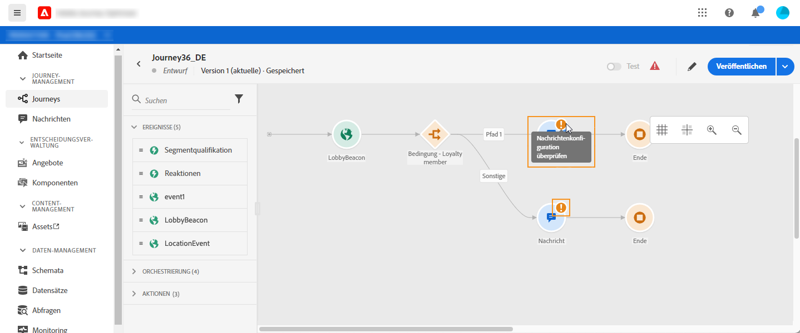
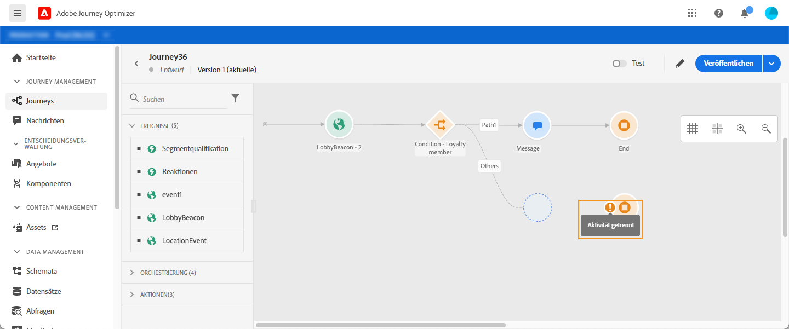
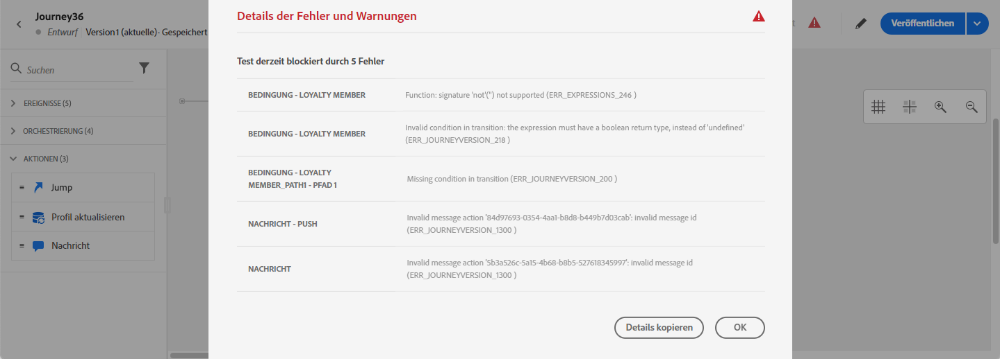

# Fehlerbehebung{#concept_nlv_bcv_2fb}


In diesem Abschnitt erfahren Sie, wie Sie Journey vor dem Testen oder Veröffentlichen beheben können. Alle unten aufgeführten Prüfungen können durchgeführt werden, wenn sich die Journey im Testmodus befindet oder die Journey live ist. Die Empfehlung besteht darin, alle unten aufgeführten Prüfungen im Testmodus durchzuführen und dann mit der Veröffentlichung fortzufahren. Siehe [diese Seite](../building-journeys/testing-the-journey.md).

## Vor dem Testen auf Fehler überprüfen{#section_h3q_kqk_fhb}

Überprüfen Sie vor dem Testen und Veröffentlichen der Journey, ob alle Aktivitäten ordnungsgemäß konfiguriert sind. Sie können keine Tests oder Veröffentlichungen durchführen, wenn das System weiterhin Fehler erkennt.

Fehler werden mit einem Warnsymbol auf den Aktivitäten auf der Arbeitsfläche angezeigt. Platzieren Sie den Cursor auf das Ausrufezeichen, um die Fehlermeldung anzuzeigen. Wenn Sie auf die Aktivität klicken, sollte die Zeile mit einer Warnung angezeigt werden. Wenn beispielsweise ein Pflichtfeld leer ist, wird ein Fehler angezeigt.



Wenn auf der Arbeitsfläche beispielsweise zwei Aktivitäten getrennt sind, wird eine Warnmeldung angezeigt.



Neben dem Umschalter **[!UICONTROL Test]** und der Schaltfläche **[!UICONTROL Veröffentlichen]** kann ein Warnzeichen angezeigt werden. Dieses Warnzeichen zeigt Systemfehler an und verhindert die Aktivierung des Testmodus oder die Journey-Veröffentlichung. In den meisten Fällen werden vom System erkannte Fehler mit Fehlern in Verbindung gebracht, die auf den Aktivitäten sichtbar sind, gelegentlich aber mit anderen Problemen. In diesem Fall können Sie sie anzeigen und versuchen, das Problem anhand der Fehlerbeschreibung zu identifizieren. Wenn Sie das Problem nicht identifizieren können, können Sie die Details kopieren und an den Administrator oder den Support senden. Beachten Sie, dass Fehler, die den Test blockieren, und Fehler, die die Veröffentlichung blockieren, ähnlich sind.

Das System erkennt zwei Arten von Problemen: Fehler und Warnungen. Fehler blockieren die Veröffentlichung und die Aktivierung des Tests. Warnungen weisen auf potenzielle Probleme hin, die die Aktivierung oder Veröffentlichung von Tests nicht blockieren. Daraufhin werden eine Beschreibung des Problems und eine Ausgabe-Protokoll-ID des Typs ERR_XXX_XXX angezeigt. Dies hilft dem technischen Support bei der Identifizierung des Problems.

Auf dem Zeichen neben dem Umschalter **[!UICONTROL Test]** und der Schaltfläche **[!UICONTROL Veröffentlichen]** können zwei verschiedene Farben angezeigt werden. Das Zeichen wird bei Fehlern rot angezeigt. Es wird bei Warnungen orange angezeigt.



Fehler und Warnungen, die für die Journey gelten, werden zuerst in der Liste angezeigt. Fehler und Warnungen in Bezug auf bestimmte Aktivitäten werden nach, nach der Reihenfolge der Aktivität oder nach dem Erscheinungsbild im Journey von links nach rechts aufgelistet. Die Schaltfläche **[!UICONTROL Details kopieren]** kopiert technische Informationen über die Journey, die das Supportteam zur Fehlerbehebung verwenden kann.

Wenn in einer Aktion oder einer Bedingung ein Fehler auftritt, wird die Journey einer einzelnen Instanz beendet. Die einzige Möglichkeit, den Vorgang fortzusetzen, besteht darin, das Kontrollkästchen **[!UICONTROL Hinzufügen einen alternativen Pfad im Falle eines Timeouts oder eines Fehlers]** zu markieren. Siehe [diesen Abschnitt](../building-journeys/using-the-journey-designer.md#paths).

## Überprüfen, ob Ereignis ordnungsgemäß gesendet werden{#section_rqz_11t_dgb}

Der Ausgangspunkt einer Journey ist immer ein Ereignis. Sie können Tests mit Tools wie Postman durchführen.

Sie können überprüfen, ob der API-Aufruf, den Sie über diese Tools senden, richtig gesendet wurde oder nicht. Wenn Sie einen Fehler zurückerhalten, bedeutet dies, dass Ihr Aufruf ein Problem hat. Überprüfen Sie erneut die Nutzlast, den Header (und insbesondere die Organisations-ID) und die Ziel-URL. Sie können Ihren Administrator fragen, welche URL Sie treffen sollten.

Ereignisse werden nicht direkt von der Quelle an die Journey weitergeleitet. Tatsächlich sind Journey auf die Streaming-APIs von Adobe Experience Platform angewiesen. Daher können Sie bei Problemen mit Ereignissen auf [diese Seite](https://experienceleague.adobe.com/docs/experience-platform/ingestion/streaming/troubleshooting.html) für die Fehlerbehebung bei Streaming-APIs verweisen.

## Überprüfen, ob Personen die Journey eingeben{#section_x4v_zzs_dgb}

Journey Berichte misst die Eingänge der Menschen in eine Journey in Echtzeit.

Wenn Sie das Ereignis erfolgreich senden, aber keinen Eingang in die Journey sehen, bedeutet das, dass etwas schiefgeht zwischen dem Ereignis senden und dem Ereignis Empfang in der Journey.

Im Folgenden finden Sie einige Punkte, die der Administrator überprüfen sollte:

* Sind Sie sicher, dass sich die Journey, bei der Sie das eingehende Ereignis erwarten, im Testmodus oder live befindet?
* Haben Sie Ihr Ereignis gespeichert, bevor Sie die Nutzlast aus der Payload-Vorschau kopiert haben?
* Enthält Ihre Ereignis-Nutzlast eine Ereignis-ID?
* Haben Sie die richtige URL erreicht?
* Haben Sie die Nutzlaststruktur der Streaming Ingestion APIs mithilfe der Vorschau für die Nutzlaststruktur im Bereich &quot;Ereignis-Konfiguration&quot;befolgt? Siehe [diese Seite](../event/about-creating.md#preview-the-payload).
* Haben Sie die richtigen Schlüssel/Wert-Paare in der Kopfzeile Ihres Ereignisses verwendet?

   ```
   X-gw-ims-org-id - your ORGID
   Content-type - application/json
   ```

## Überprüfen der Navigation durch die Journey{#section_l5y_yzs_dgb}

Journey Berichte misst den Fortschritt von Einzelpersonen innerhalb einer Journey. Es ist einfach herauszufinden, wo und warum eine Person angehalten wurde.

Im Folgenden sind einige Punkte zu prüfen:

* Ist das auf eine Bedingung zurückzuführen, die die Person ausschließt? Zum Beispiel ist die Krankheit &quot;Geschlecht = männlich&quot;und die Person eine Frau. Diese Prüfung kann von einem Geschäftsbenutzer durchgeführt werden, wenn die Bedingung nicht zu komplex ist.
* Ist dies auf einen Aufruf an eine Datenquelle zurückzuführen, die nicht reagiert? Wenn die Journey im Test ist, können diese Informationen in Testmodusprotokollen angezeigt werden. Wenn die Journey live ist, kann ein Administrator Direktaufrufe an die Datenquelle testen und die erhaltene Antwort überprüfen. Ein Administrator kann die Journey auch Duplikat und testen.

## Überprüfen, ob Nachrichten erfolgreich gesendet werden{#section_qb1_yzs_dgb}

Wenn Einzelpersonen den richtigen Weg in die Journey gehen, aber keine Nachrichten erhalten, die sie empfangen sollten, können Sie prüfen, ob:

* Journey Optimizer hat die Anfrage zum Senden der Nachricht korrekt berücksichtigt. Ein Geschäftsbenutzer kann auf die Nachricht zugreifen, die gesendet werden soll, und prüfen, ob der Zeitpunkt der letzten Ausführung der Ausführungszeit Ihres Journey entspricht. Er kann auch die neuesten API-Aufrufe/Ereignis überprüfen.
* Journey Optimizer hat die Nachricht erfolgreich gesendet. In den Versandprotokollen der Nachricht können Sie den Status jeder Ausführung sehen. Sie können sehen, ob es grün, rot ist und was das Problem war. Ein Geschäftsbenutzer kann auf diesen Bildschirm zugreifen und die Protokolle zur weiteren Prüfung an einen Administrator senden.

Bei einer über eine benutzerdefinierte Aktion gesendeten Meldung kann während des Journey-Tests nur geprüft werden, ob der Aufruf des Systems der benutzerdefinierten Aktion zu einem Fehler führt oder nicht. Wenn der Aufruf an das externe System, das mit der benutzerdefinierten Aktion verknüpft ist, nicht zu einem Fehler führt, sondern nicht zum Senden einer Nachricht führt, sollten einige Untersuchungen auf der Seite des externen Systems durchgeführt werden.
