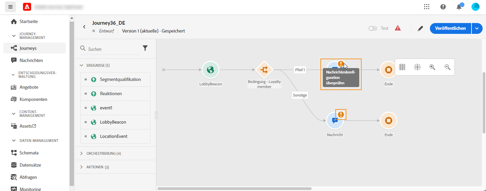
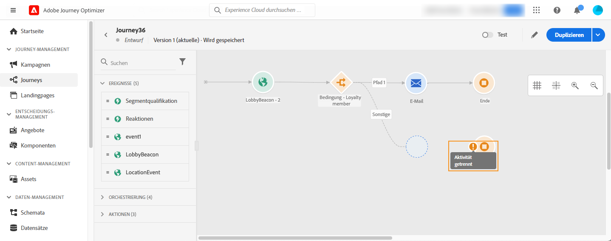
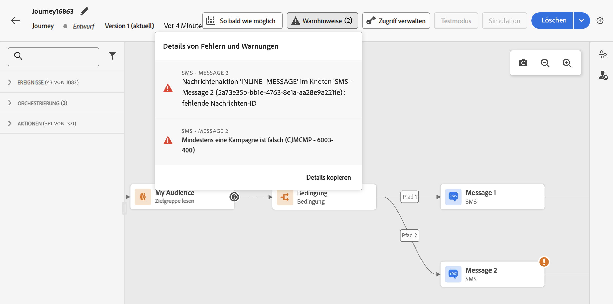

# Fehlerbehebung vor dem Testen der Journey {#troubleshooting}

>[!BEGINSHADEBOX]

**Auf dieser Seite:** Erfahren Sie, wie Sie Aktivitäts- und Journey-Konfigurationsfehler vor dem Testen oder Veröffentlichen finden und beheben können, damit Ihr Journey problemlos ausgeführt werden kann.

>[!ENDSHADEBOX]

In diesem Abschnitt erfahren Sie, wie Sie Probleme bei Journeys vor dem Testen oder Veröffentlichen beheben können. Alle unten aufgeführten Prüfungen können durchgeführt werden, wenn sich die Journey im Testmodus befindet oder live ist. Wir empfehlen, alle unten aufgeführten Prüfungen im Testmodus vorzunehmen und dann mit der Veröffentlichung fortzufahren. Weitere Informationen zum Testmodus finden Sie auf [dieser Seite](../building-journeys/testing-the-journey.md).

[Auf dieser Seite](troubleshooting-execution.md) erfahren Sie, wie Sie Fehler bei Journey-Ereignissen beheben und wie Sie prüfen, ob Profile in Ihre Journey eingetreten sind, wie sie diese durchlaufen und ob Nachrichten gesendet werden. Wenn trotz aufgenommener Ereignisse keine Profile in Ihre ereignisbasierte Journey eintreten, stellen Sie sicher, [&#x200B; die Datentypen für Ereignisbedingungen mit dem Ereignisschema &#x200B;](troubleshooting-execution.md#verify-event-identity-and-rule-data-types).

[Auf dieser Seite](troubleshooting-inbound.md) erfahren Sie, wie Sie Fehler bei eingehenden Aktionen beheben.

## Fehler in Aktivitäten {#activity-errors}

Überprüfen Sie vor dem Testen und Veröffentlichen Ihrer Journey, ob alle Aktivitäten ordnungsgemäß konfiguriert sind. Es können keine Tests oder Veröffentlichungen vorgenommen werden, solange das System noch Fehler findet.

Fehler werden in der Arbeitsfläche mit einem Warnsymbol auf den Aktivitäten selbst angezeigt. Platzieren Sie den Cursor auf dem Ausrufezeichen, um die entsprechende Fehlermeldung anzuzeigen. Wenn Sie die Aktivität auswählen, sollte die fehlerhafte Zeile mit einer Warnung angezeigt werden. Beispiel:

* wird ein Fehler angezeigt, wenn ein Pflichtfeld leer ist.

  

* Wenn zwei Aktivitäten auf der Arbeitsfläche getrennt werden, wird eine Warnung angezeigt.

  

## Fehler in der Journey {#canvas-errors}

Fehler werden auch über die Schaltfläche **[!UICONTROL Warnungen]** oberhalb der Arbeitsfläche angezeigt. Über diese Schaltfläche können Sie Fehler anzeigen, die vom System erkannt wurden und die Aktivierung des Testmodus oder die Veröffentlichung der Journey verhindern.

Das System erkennt zwei Arten von Problemen: **Fehler** und **Warnungen**. Fehler blockieren die Veröffentlichung und Testaktivierung. Warnungen weisen auf mögliche Probleme hin, blockieren aber nicht die Testaktivierung oder Veröffentlichung. Angezeigt werden eine Beschreibung des Problems sowie eine Problem-Protokoll-ID vom Typ ERR_XXX_XXX. Dies kann dazu beitragen, das Problem zu identifizieren.

<!--Most of the time, errors detected by the system are linked to errors visible on the activities but they can also relate to other issues. In all cases, check alerts and resolve the issue using to the error description. If you cannot identify the issue, use the **[!UICONTROL Copy details]** button to store the alerts, and send them to your administrator.-->

Fehler und Warnungen, die die gesamte Journey betreffen, werden in der Liste zuerst aufgeführt. Fehler und Warnungen, die einzelne Aktivitäten betreffen, werden danach aufgeführt (anhand der Aktivitätsreihenfolge oder des Auftretens in der Journey von links nach rechts). Unten in der Liste der Warnungen können Sie über die Schaltfläche **[!UICONTROL Details kopieren]** technische Informationen über die Journey kopieren, die zur Fehlerbehebung nützlich sind. Eine Liste der kopierten Felder (einschließlich Informationen zum Anhalten und Fortsetzen) finden Sie unter [Technische Details kopieren](journey-properties.md#access-properties) unter Journey-Eigenschaften.

## Hinzufügen eines alternativen Pfads {#canvas-add-path}

Für den Fall eines Fehlers können Sie eine Ausweichaktion für die folgenden Journey-Aktivitäten definieren: **[!UICONTROL Optimieren]** und **[!UICONTROL Aktion]**.

Wenn in einer Aktion oder einer Bedingung ein Fehler auftritt, wird die Journey des Kontakts gestoppt. Die einzige Möglichkeit zur Fortsetzung der Journey besteht in der Behebung des Problems. Um eine Unterbrechung der Journey zu vermeiden, können Sie auch die Option **[!UICONTROL Alternativen Pfad hinzufügen, falls eine Zeitüberschreitung oder ein Fehler auftritt]** in den Eigenschaften der Aktivität aktivieren. Weiterführende Informationen finden Sie in [diesem Abschnitt](../building-journeys/using-the-journey-designer.md#paths).

+++ KI-Wissensreferenz

Dieser Abschnitt enthält strukturiertes Wissen zur Unterstützung von Interpretation, Abrufen und Antworten auf Fragen zu diesem Thema.

Zum vollständigen Verständnis sollten diese Informationen mit der Dokumentation auf dieser Seite kombiniert werden. Keine der beiden Quellen ist für Einzelpersonen gedacht. Die Seite beschreibt die Funktion, während dieser Abschnitt zusätzlichen Kontext bietet, der dabei hilft, Begriffe, Absichten, Anwendbarkeit und Begrenzungen zu unterscheiden.

* **TL;DR:** Auf dieser Seite wird beschrieben, wie Sie Konfigurationsfehler und -warnungen auf einer Journey identifizieren und beheben können, bevor Sie in den Testmodus wechseln oder veröffentlichen.

**intents:**

* Identifizieren Sie Konfigurationsfehler auf Aktivitätsebene, bevor Sie eine Journey testen oder veröffentlichen.
* Unterscheiden Sie im Bedienfeld Warnhinweise zwischen Sperrfehlern und nicht blockierenden Warnungen
* Verwenden Sie die Fehlerprotokoll-ID (Format ERR_XXX_XXX), um Journey-Probleme zu diagnostizieren
* Kopieren Sie technische Journey-Details, um sie für Administratoren zur Fehlerbehebung freizugeben
* Alternativen Pfad hinzufügen, um zu verhindern, dass einzelne Journey bei einem Fehler oder einer Zeitüberschreitung angehalten werden

**Glossar:**

* **Schaltfläche „Warnhinweise**: Canvas-Steuerelement, das alle vom System erkannten Fehler und Warnungen aufdeckt, die die Veröffentlichung oder Testaktivierung blockieren *(produktspezifisch)*
* **ERR_XXX_XXX**: Problemprotokoll-ID-Format, das jedem erkannten Problem zugewiesen ist und zum Identifizieren und Kommunizieren von Fehlern verwendet wird *(produktspezifisch)*
* **Alternativpfad**: Eine Fallback-Verzweigung, die zu einer Aktions- oder Bedingungsaktivität hinzugefügt wird und die den Journey fortsetzt, wenn ein Fehler oder eine Zeitüberschreitung auftritt *(produktspezifisch)*

**Leitplanken:**

* Sie können den Testmodus nicht aktivieren oder eine Journey veröffentlichen, wenn die Blockierungsfehler weiterhin ungelöst sind.
* Warnungen blockieren weder die Veröffentlichung noch die Testaktivierung, weisen jedoch auf mögliche Probleme hin.
* Alternative Pfade sind nur für Aktivitäten des Typs Optimieren und Aktion verfügbar.

**Terminologie:**

* Kanonischer Name: Warnhinweise — Akronym: none — Varianten: Warnhinweisbedienfeld, Schaltfläche „Warnhinweise“
* Synonyme: „errors“ = „blockierende Probleme“; „warnungen“ = „nicht blockierende Probleme“
* Verwechseln Sie nicht: „Fehler“ (Veröffentlichung blockieren) ≠ „Warnungen“ (Veröffentlichung nicht blockieren)

**FAQ:**

* **F: Was ist der Unterschied zwischen einem Fehler und einer Warnung in Journey Optimizer?** — Fehler blockieren sowohl die Aktivierung des Testmodus als auch das Journey der Veröffentlichung. Warnungen weisen auf mögliche Probleme hin, verhindern jedoch nicht das Testen oder Veröffentlichen.
* **F: Wo kann ich alle Fehler auf meinem Journey sehen?** — Klicken Sie auf die Schaltfläche Warnhinweise oberhalb der Arbeitsfläche, um eine konsolidierte Liste aller vom System erkannten Fehler und Warnungen anzuzeigen.
* **F: Was sollte ich tun, wenn ich ein Problem nicht in der Fehlerbeschreibung identifizieren kann?** — Verwenden Sie die Schaltfläche Details kopieren unten in der Liste Warnhinweise , um technische Informationen zu erfassen und an Ihren Administrator zu senden.
* **F: Kann ich eine Journey für Einzelpersonen auch dann ausführen, wenn bei einer Aktion ein Fehler auftritt?** — Ja, aktivieren Sie die Option „Alternativen Pfad im Falle einer Zeitüberschreitung oder eines Fehlers hinzufügen“ in den Eigenschaften der Aktivität, um einen Fallback-Pfad zu definieren.
* **F: Wann sollte ich diese Fehlerbehebungsprüfungen durchführen?** — Alle Prüfungen können im Testmodus oder bei Live-Journey durchgeführt werden. Es wird empfohlen, alle Probleme im Testmodus vor der Veröffentlichung zu beheben.

+++
