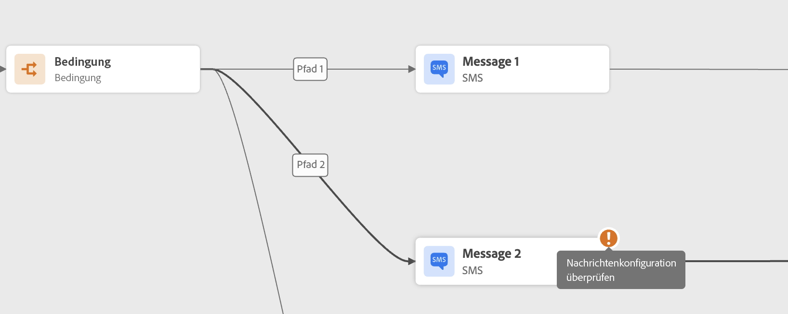

# Fehlerbehebung vor dem Testen der Journey {#troubleshooting}

In diesem Abschnitt erfahren Sie, wie Sie Probleme bei Journeys vor dem Testen oder Veröffentlichen beheben können.  Alle unten aufgeführten Prüfungen können durchgeführt werden, wenn sich die Journey im Testmodus befindet oder live ist. Wir empfehlen, alle unten aufgeführten Prüfungen im Testmodus vorzunehmen und dann mit der Veröffentlichung fortzufahren. Weitere Informationen zum Testmodus finden Sie auf [dieser Seite](../building-journeys/testing-the-journey.md).

[Auf dieser Seite](troubleshooting-execution.md) erfahren Sie, wie Sie Fehler bei Journey-Ereignissen beheben und wie Sie prüfen, ob Profile in Ihre Journey eingetreten sind, wie sie diese durchlaufen und ob Nachrichten gesendet werden.

[Auf dieser Seite](troubleshooting-inbound.md) erfahren Sie, wie Sie Fehler bei eingehenden Aktionen beheben.

## Fehler in Aktivitäten {#activity-errors}

Überprüfen Sie vor dem Testen und Veröffentlichen Ihrer Journey, ob alle Aktivitäten ordnungsgemäß konfiguriert sind. Es können keine Tests oder Veröffentlichungen vorgenommen werden, solange das System noch Fehler findet.

Fehler werden in der Arbeitsfläche mit einem Warnsymbol auf den Aktivitäten selbst angezeigt. Platzieren Sie den Cursor auf dem Ausrufezeichen, um die entsprechende Fehlermeldung anzuzeigen. Wenn Sie die Aktivität auswählen, sollte die fehlerhafte Zeile mit einer Warnung angezeigt werden. Beispiel:

* wird ein Fehler angezeigt, wenn ein Pflichtfeld leer ist.

  

* Wenn zwei Aktivitäten auf der Arbeitsfläche getrennt werden, wird eine Warnung angezeigt.

  

## Fehler in der Journey {#canvas-errors}

Fehler werden auch über die Schaltfläche **[!UICONTROL Warnungen]** oberhalb der Arbeitsfläche angezeigt. Über diese Schaltfläche können Sie Fehler anzeigen, die vom System erkannt wurden und die Aktivierung des Testmodus oder die Veröffentlichung der Journey verhindern.

Das System erkennt zwei Arten von Problemen: **Fehler** und **Warnungen**. Fehler blockieren die Veröffentlichung und Testaktivierung. Warnungen weisen auf mögliche Probleme hin, blockieren aber nicht die Testaktivierung oder Veröffentlichung. Angezeigt werden eine Beschreibung des Problems sowie eine Problem-Protokoll-ID vom Typ ERR_XXX_XXX. Dies kann dazu beitragen, das Problem zu identifizieren.

<!--Most of the time, errors detected by the system are linked to errors visible on the activities but they can also relate to other issues. In all cases, check alerts and resolve the issue using to the error description. If you cannot identify the issue, use the **[!UICONTROL Copy details]** button to store the alerts, and send them to your administrator.-->

Fehler und Warnungen, die die gesamte Journey betreffen, werden in der Liste zuerst aufgeführt. Fehler und Warnungen, die einzelne Aktivitäten betreffen, werden danach aufgeführt (anhand der Aktivitätsreihenfolge oder des Auftretens in der Journey von links nach rechts). Unten in der Liste der Warnungen können Sie über die Schaltfläche **[!UICONTROL Details kopieren]** technische Informationen über die Journey kopieren, die zur Fehlerbehebung nützlich sind.

## Hinzufügen eines alternativen Pfads {#canvas-add-path}

Für den Fall eines Fehlers können Sie eine Ausweichaktion für die folgenden Journey-Aktivitäten definieren: **[!UICONTROL Optimieren]** und **[!UICONTROL Aktion]**.

Wenn in einer Aktion oder einer Bedingung ein Fehler auftritt, wird die Journey des Kontakts gestoppt. Die einzige Möglichkeit zur Fortsetzung der Journey besteht in der Behebung des Problems. Um eine Unterbrechung der Journey zu vermeiden, können Sie auch die Option **[!UICONTROL Alternativen Pfad hinzufügen, falls eine Zeitüberschreitung oder ein Fehler auftritt]** in den Eigenschaften der Aktivität aktivieren. Weiterführende Informationen finden Sie in [diesem Abschnitt](../building-journeys/using-the-journey-designer.md#paths).
