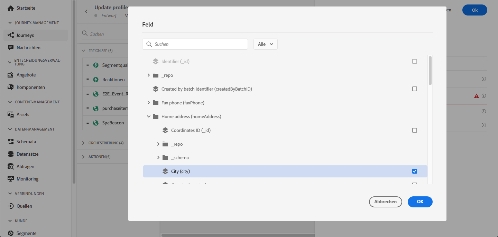
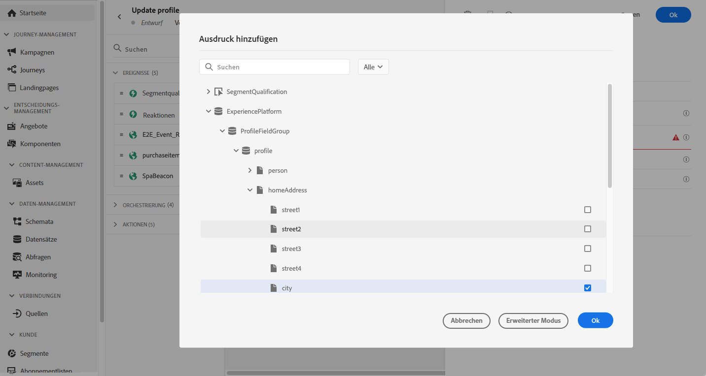
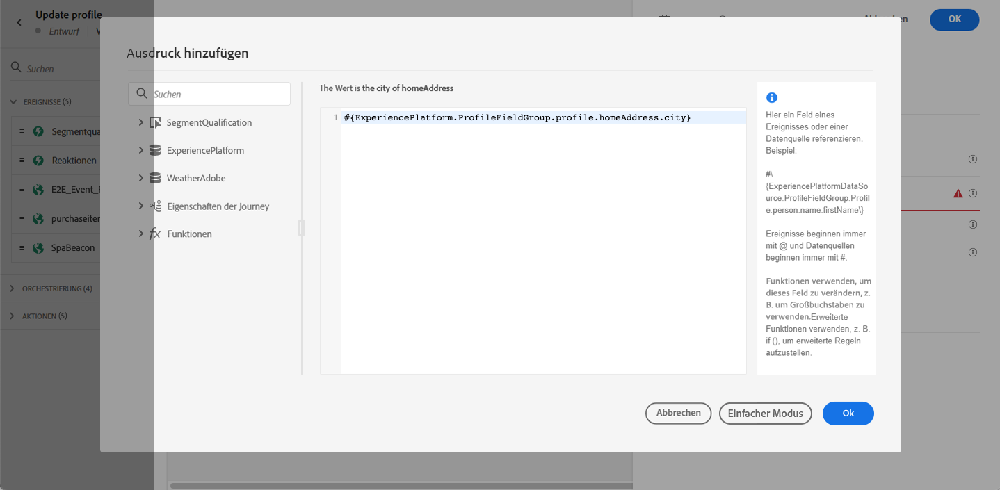
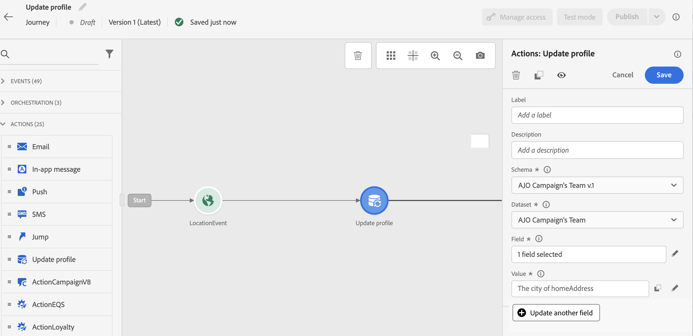

# Profil aktualisieren {#update-profile}

>[!CONTEXTUALHELP]
>id="ajo_journey_update_profiles"
>title="Aktivität „Profil aktualisieren“"
>abstract="Mit der Aktionsaktivität „Profil aktualisieren“ können Sie ein vorhandenes [!DNL Adobe Experience Platform]-Profil mit Informationen aus dem Ereignis, einer Datenquelle oder unter Verwendung eines bestimmten Werts aktualisieren."

Verwenden Sie die Aktionsaktivität **[!UICONTROL Profil aktualisieren]**, um ein vorhandenes [!DNL Adobe Experience Platform] anzureichern oder zu korrigieren, während ein Kunde eine Journey durchläuft. Sie können Feldwerte aus einem Journey-Ereignis, einer konfigurierten Datenquelle oder einem statischen Wert festlegen, sodass Profildaten präzise und ausführbar bleiben, ohne die Journey-Arbeitsfläche verlassen zu müssen. Bevor Sie diese Aktivität konfigurieren, überprüfen Sie die [Leitplanken und Einschränkungen](#guardrails) die gelten.

## Auswahl der Datensätze {#dataset-selection}

Die Aktivität **[!UICONTROL Profil aktualisieren]** erfordert einen eigenen Datensatz, um Aktualisierungen zu speichern. Da diese Aktivität nur den [Profilspeicher](https://experienceleague.adobe.com/docs/experience-platform/profile/home.html?lang=de#profile-data-store){target="_blank"} (nicht den Datalake) aktualisiert, sollten alle Aktualisierungen in einem [profilaktivierten Datensatz gespeichert werden, &#x200B;](https://experienceleague.adobe.com/de/docs/experience-platform/catalog/datasets/user-guide#enable-profile){target="_blank"} speziell für **[!UICONTROL Profil aktualisieren]**.

>[!CAUTION]
>
>Verwenden Sie keinen Datensatz, der auch für die Batch- oder Streaming-Aufnahme verwendet wird. Andere Aufnahmedurchgänge überschreiben die Änderungen, die durch die Aktion **[!UICONTROL Profil aktualisieren]** vorgenommen wurden, sodass Profilattribute verschwinden oder zu ihren vorherigen Werten zurückkehren. Wenn Sie dieses Verhalten beobachten, stellen Sie in Adobe Experience Platform sicher, dass keine andere Aufnahme in denselben Datensatz schreibt. Anweisungen zur Fehlerbehebung finden Sie unter [Beheben von Profilaktualisierungsfehlern in Adobe Journey Optimizer](https://experienceleague.adobe.com/de/docs/experience-cloud-kcs/kbarticles/ka-26352){target="_blank"}.

Darüber hinaus ist für **[!UICONTROL Konfiguration der Aktivität]** Profil aktualisieren“ kein [Identity-Namespace“ &#x200B;](https://experienceleague.adobe.com/de/docs/experience-platform/identity/features/namespaces){target="_blank"}. Stellen Sie daher sicher, dass der ausgewählte Datensatz denselben **[!UICONTROL Identity-Namespace]** verwendet, den die Journey gestartet hat, da dieser Namespace für diese Aktualisierungen verwendet wird. Die Identitätszuordnung kann auch vom ausgewählten Datensatz verwendet werden. Wenn Sie keinen Datensatz mit dem richtigen Identity-Namespace auswählen oder einen Datensatz verwenden, der Identitätszuordnung verwendet, schlägt **[!UICONTROL Aktivität „Profil aktualisieren]** fehl.

## Konfigurieren der Aktivität Profil aktualisieren . {#use-profile-update}

Gehen Sie wie folgt vor, um die Aktivität **[!UICONTROL Profil aktualisieren]** auf Ihrem Journey zu konfigurieren.

1. Beginnen Sie mit der Gestaltung Ihres Journey. Weitere Informationen finden Sie unter [Erstellen der ersten Journey](../building-journeys/journey-gs.md).

1. Legen Sie im Abschnitt **[!UICONTROL Aktion]** der Palette die Aktivität **[!UICONTROL Profil aktualisieren]** auf der Arbeitsfläche ab.

   

1. Wählen Sie ein Schema aus der Liste aus.

   >[!NOTE]
   >
   >Nur Felder, die bereits im ausgewählten XDM-Profilschema vorhanden sind, können ausgewählt werden. Wenn das benötigte Feld nicht aufgeführt ist, fügen Sie es zuerst zum Schema in Adobe Experience Platform hinzu.

1. Klicken Sie auf **[!UICONTROL Feld]**, um das Feld auszuwählen, das Sie aktualisieren möchten.

   

1. Wählen Sie einen Datensatz aus der Liste aus.

   >[!NOTE]
   >
   >Die Aktion **[!UICONTROL Profil aktualisieren]** aktualisiert die Profildaten in Echtzeit, sie aktualisiert jedoch keine Datensätze. Die Datensatzauswahl ist erforderlich, da das Profil ein Eintrag ist, der mit einem Datensatz verknüpft ist.

1. Klicken Sie auf das Feld **[!UICONTROL Wert]**, um den gewünschten Wert zu definieren:

   * Mit dem einfachen Ausdruckseditor können Sie ein Feld aus einer Datenquelle oder aus dem eingehenden Ereignis auswählen.

     

   * Wenn Sie einen bestimmten Wert definieren oder erweiterte Funktionen nutzen möchten, wählen Sie [**[!UICONTROL Erweiterter Modus]**](expression/expressionadvanced.md) aus.

     

1. Um zusätzliche Profilattribute in derselben Aktion zu aktualisieren, klicken Sie auf **[!UICONTROL Anderes Feld aktualisieren]** und wiederholen Sie die Feld- und Werteauswahl. Sie können bis zu fünf Feld/Wert-Paare in einer einzelnen Aktion **[!UICONTROL Profil aktualisieren]** hinzufügen. Siehe [Leitplanken und Einschränkungen](#guardrails).

Die Aktivität **[!UICONTROL Profil aktualisieren]** ist jetzt konfiguriert.

## Testen der Profilaktualisierung {#using-the-test-mode}

Beachten Sie, dass [Testmodus](testing-the-journey.md) Profilaktualisierungen sofort auf das Testprofil wirken und nicht simuliert werden.

Nur Testprofile können im Testmodus in eine Journey eintreten. Sie können entweder ein neues Testprofil erstellen oder ein vorhandenes Profil in ein Testprofil konvertieren. In [!DNL Adobe Experience Platform] können Profilattribute über einen CSV-Dateiimport oder API-Aufruf aktualisiert werden. Eine schnellere Alternative besteht darin, eine Aktivität vom Typ **[!UICONTROL Profil aktualisieren]** innerhalb der Journey selbst zu verwenden, um das boolesche Feld „Testprofil“ auf „true“ zu setzen.

Weiterführende Informationen dazu, wie Sie ein vorhandenes Profil in ein Testprofil umwandeln, finden Sie in [&#x200B; Abschnitt](../audience/creating-test-profiles.md#create-test-profiles-csv).

## Leitlinien und Einschränkungen {#guardrails}

* Die **[!UICONTROL Profil aktualisieren]**-Aktion kann nur in Journey mit einem [Namespace](../event/about-creating.md#select-the-namespace) verwendet werden.
* Die Aktion aktualisiert nur vorhandene Felder, sie erstellt keine neuen Profilfelder.
* Die Aktion unterstützt nur einfache Feldtypen (Zeichenfolge, Zahl, boolescher Wert). XDM-Felder, die als Auflistungen, vorgeschlagene Werte, Objekt-Arrays oder komplexe Sammlungen (z. B. Produktlisten) definiert sind, werden nicht unterstützt.
* Sie können die Aktion **[!UICONTROL Profil aktualisieren]** nicht verwenden, um [Erlebnisereignisse](../event/about-events.md) wie einen Kauf zu generieren.
* Wie bei jeder anderen Aktion können Sie einen [alternativen Pfad im Falle eines Fehlers oder einer Zeitüberschreitung) &#x200B;](using-the-journey-designer.md#paths). Zwei Aktionen können nicht parallel geschaltet werden.
* Es ist nicht garantiert, dass Profilaktualisierungen sofort nachgelagert in derselben Journey verfügbar sind. Vermeiden Sie es, eine Aktion, die ein Feld direkt nach der Aktion **[!UICONTROL Profil aktualisieren]** liest, die es schreibt, zu platzieren, da der aktualisierte Wert möglicherweise noch nicht angezeigt wird.
* Die Aktivität **[!UICONTROL Profil aktualisieren]** aktualisiert nur den [Profilspeicher](https://experienceleague.adobe.com/docs/experience-platform/profile/home.html?lang=de#profile-data-store){target="_blank"}, nicht den Data Lake.
* Bis zu fünf Feld/Wert-Paare können in einer einzigen Aktion **[!UICONTROL Profil aktualisieren]** aktualisiert werden. Verwenden Sie die Schaltfläche **[!UICONTROL Weiteres Feld aktualisieren]**, um weitere Paare hinzuzufügen.
* Gruppieren Sie zur Leistungsverbesserung mehrere Attributaktualisierungen in einer einzelnen Aktion **[!UICONTROL Profil aktualisieren]** anstatt eine Aktion pro Attribut zu verwenden.
