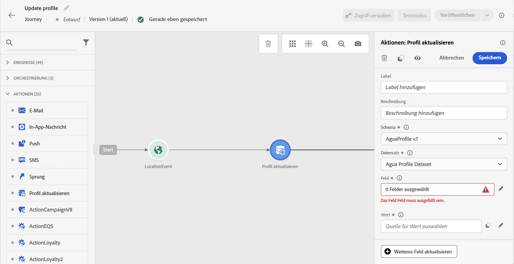
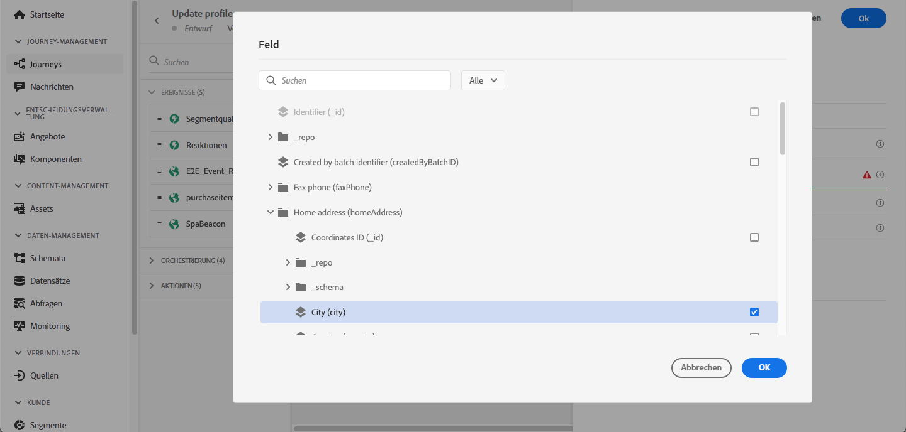
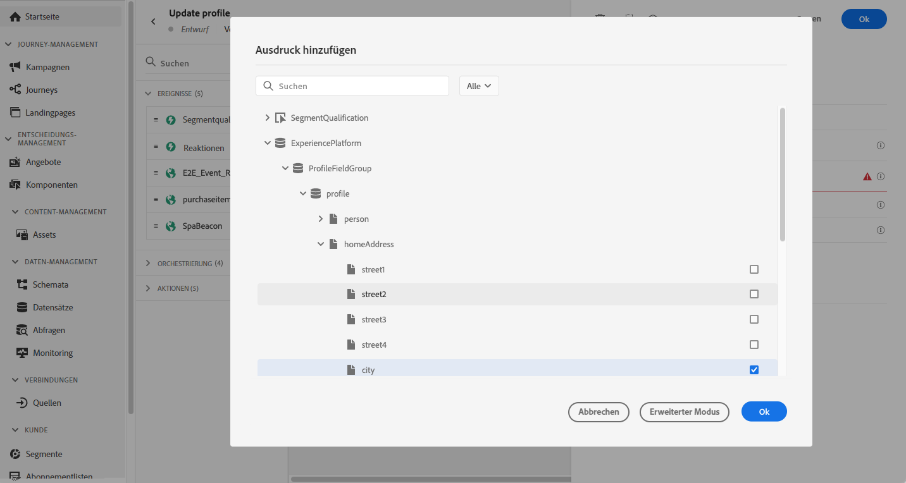
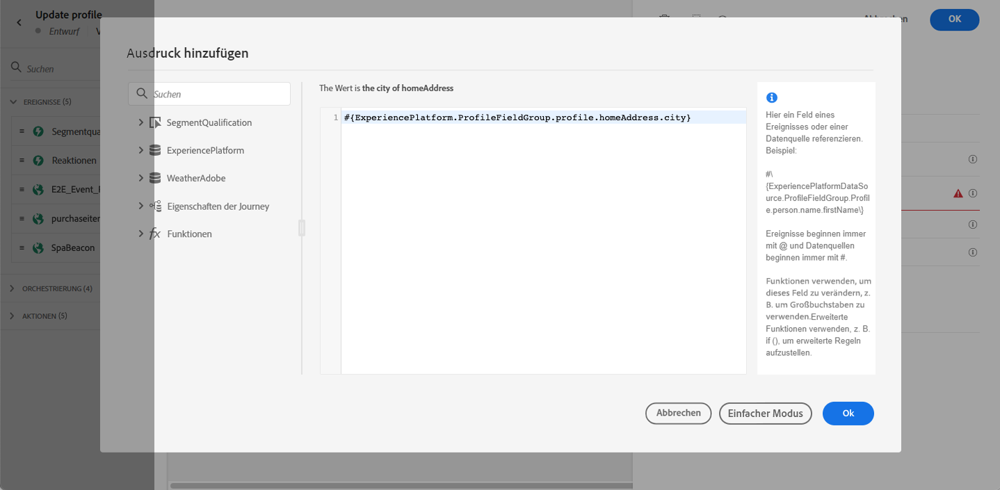
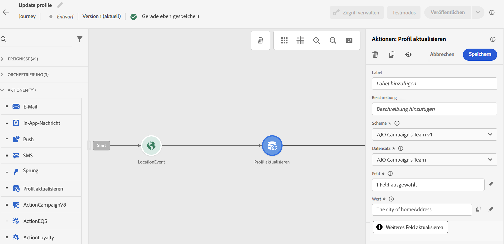

# Profil aktualisieren {#update-profile}

>[!BEGINSHADEBOX]

**Auf dieser Seite:** Erfahren Sie, wie Sie mit der Aktionsaktivität Profil aktualisieren ein vorhandenes Adobe Experience Platform-Profil anreichern oder korrigieren können, wenn ein Kunde eine Journey durchläuft.

>[!ENDSHADEBOX]

>[!CONTEXTUALHELP]
>id="ajo_journey_update_profiles"
>title="Aktivität „Profil aktualisieren“"
>abstract="Mit der Aktionsaktivität „Profil aktualisieren“ können Sie ein vorhandenes [!DNL Adobe Experience Platform]-Profil mit Informationen aus dem Ereignis, einer Datenquelle oder unter Verwendung eines bestimmten Werts aktualisieren."

Verwenden Sie die Aktionsaktivität **[!UICONTROL Profil aktualisieren]**, um ein vorhandenes [!DNL Adobe Experience Platform] anzureichern oder zu korrigieren, während ein Kunde eine Journey durchläuft. Sie können Feldwerte aus einem Journey-Ereignis, einer konfigurierten Datenquelle oder einem statischen Wert festlegen, sodass Profildaten präzise und ausführbar bleiben, ohne die Journey-Arbeitsfläche verlassen zu müssen. Bevor Sie diese Aktivität konfigurieren, überprüfen Sie die [Leitplanken und Einschränkungen](#guardrails) die gelten.

## Auswahl der Datensätze {#dataset-selection}

Die Aktivität **[!UICONTROL Profil aktualisieren]** erfordert einen eigenen Datensatz, um Aktualisierungen zu speichern. Da diese Aktivität nur den [Profilspeicher](https://experienceleague.adobe.com/docs/experience-platform/profile/home.html?lang=de#profile-data-store){target="_blank"} (nicht den Datalake) aktualisiert, sollten alle Aktualisierungen in einem [profilaktivierten Datensatz gespeichert werden, ](https://experienceleague.adobe.com/de/docs/experience-platform/catalog/datasets/user-guide#enable-profile){target="_blank"} speziell für **[!UICONTROL Profil aktualisieren]**.

>[!CAUTION]
>
>Verwenden Sie keinen Datensatz, der auch für die Batch- oder Streaming-Aufnahme verwendet wird. Andere Aufnahmedurchgänge überschreiben die Änderungen, die durch die Aktion **[!UICONTROL Profil aktualisieren]** vorgenommen wurden, sodass Profilattribute verschwinden oder zu ihren vorherigen Werten zurückkehren. Wenn Sie dieses Verhalten beobachten, stellen Sie in Adobe Experience Platform sicher, dass keine andere Aufnahme in denselben Datensatz schreibt. Anweisungen zur Fehlerbehebung finden Sie unter [Beheben von Profilaktualisierungsfehlern in Adobe Journey Optimizer](https://experienceleague.adobe.com/de/docs/experience-cloud-kcs/kbarticles/ka-26352){target="_blank"}.

Darüber hinaus ist für **[!UICONTROL Konfiguration der Aktivität]** Profil aktualisieren“ kein [Identity-Namespace“ ](https://experienceleague.adobe.com/de/docs/experience-platform/identity/features/namespaces){target="_blank"}. Stellen Sie daher sicher, dass der ausgewählte Datensatz denselben **[!UICONTROL Identity-Namespace]** verwendet, den die Journey gestartet hat, da dieser Namespace für diese Aktualisierungen verwendet wird. Die Identitätszuordnung kann auch vom ausgewählten Datensatz verwendet werden. Wenn Sie keinen Datensatz mit dem richtigen Identity-Namespace auswählen oder einen Datensatz verwenden, der Identitätszuordnung verwendet, schlägt **[!UICONTROL Aktivität „Profil aktualisieren]** fehl.

## Konfigurieren der Aktivität „Profil aktualisieren“ {#use-profile-update}

Gehen Sie wie folgt vor, um die Aktivität **[!UICONTROL Profil aktualisieren]** auf Ihrem Journey zu konfigurieren.

1. Beginnen Sie mit der Gestaltung Ihres Journey. Weitere Informationen finden Sie unter [Erstellen der ersten Journey](../building-journeys/journey-gs.md).

1. Legen Sie im Abschnitt **[!UICONTROL Aktion]** der Palette die Aktivität **[!UICONTROL Profil aktualisieren]** auf der Arbeitsfläche ab.

   

1. Wählen Sie ein Schema aus der Liste aus.

   >[!NOTE]
   >
   >Nur Felder, die bereits im ausgewählten XDM-Profilschema vorhanden sind, können ausgewählt werden. Wenn das benötigte Feld nicht aufgeführt ist, fügen Sie es zuerst zum Schema in Adobe Experience Platform hinzu.

1. Klicken Sie auf **[!UICONTROL Feld]**, um das Feld auszuwählen, das Sie aktualisieren möchten.

   

1. Wählen Sie einen Datensatz aus der Liste aus.

   >[!NOTE]
   >
   >Die Aktion **[!UICONTROL Profil aktualisieren]** aktualisiert die Profildaten in Echtzeit, sie aktualisiert jedoch keine Datensätze. Die Datensatzauswahl ist erforderlich, da das Profil ein Eintrag ist, der mit einem Datensatz verknüpft ist.

1. Klicken Sie auf das Feld **[!UICONTROL Wert]**, um den gewünschten Wert zu definieren:

   * Mit dem einfachen Ausdruckseditor können Sie ein Feld aus einer Datenquelle oder aus dem eingehenden Ereignis auswählen.

     

   * Wenn Sie einen bestimmten Wert definieren oder erweiterte Funktionen nutzen möchten, wählen Sie [**[!UICONTROL Erweiterter Modus]**](expression/expressionadvanced.md) aus.

     

1. Um zusätzliche Profilattribute in derselben Aktion zu aktualisieren, klicken Sie auf **[!UICONTROL Anderes Feld aktualisieren]** und wiederholen Sie die Feld- und Werteauswahl. Sie können bis zu fünf Feld/Wert-Paare in einer einzelnen Aktion **[!UICONTROL Profil aktualisieren]** hinzufügen. Siehe [Leitplanken und Einschränkungen](#guardrails).

Die Aktivität **[!UICONTROL Profil aktualisieren]** ist jetzt konfiguriert.

## Testen der Profilaktualisierung {#using-the-test-mode}

Beachten Sie, dass [Testmodus](testing-the-journey.md) Profilaktualisierungen sofort auf das Testprofil wirken und nicht simuliert werden.

Nur Testprofile können im Testmodus in eine Journey eintreten. Sie können entweder ein neues Testprofil erstellen oder ein vorhandenes Profil in ein Testprofil konvertieren. In [!DNL Adobe Experience Platform] können Profilattribute über einen CSV-Dateiimport oder API-Aufruf aktualisiert werden. Eine schnellere Alternative besteht darin, eine Aktivität vom Typ **[!UICONTROL Profil aktualisieren]** innerhalb der Journey selbst zu verwenden, um das boolesche Feld „Testprofil“ auf „true“ zu setzen.

Weiterführende Informationen dazu, wie Sie ein vorhandenes Profil in ein Testprofil umwandeln, finden Sie in [ Abschnitt](../audience/creating-test-profiles.md#create-test-profiles-csv).

## Leitlinien und Einschränkungen {#guardrails}

* Die **[!UICONTROL Profil aktualisieren]**-Aktion kann nur in Journey mit einem [Namespace](../event/about-creating.md#select-the-namespace) verwendet werden.
* Die Aktion aktualisiert nur vorhandene Felder, sie erstellt keine neuen Profilfelder.
* Die Aktion unterstützt nur einfache Feldtypen (Zeichenfolge, Zahl, boolescher Wert). XDM-Felder, die als Auflistungen, vorgeschlagene Werte, Objekt-Arrays oder komplexe Sammlungen (z. B. Produktlisten) definiert sind, werden nicht unterstützt.
* Sie können die Aktion **[!UICONTROL Profil aktualisieren]** nicht verwenden, um [Erlebnisereignisse](../event/about-events.md) wie einen Kauf zu generieren.
* Wie bei jeder anderen Aktion können Sie einen [alternativen Pfad im Falle eines Fehlers oder einer Zeitüberschreitung) ](using-the-journey-designer.md#paths). Zwei Aktionen können nicht parallel geschaltet werden.
* Es ist nicht garantiert, dass Profilaktualisierungen sofort nachgelagert in derselben Journey verfügbar sind. Vermeiden Sie es, eine Aktion, die ein Feld direkt nach der Aktion **[!UICONTROL Profil aktualisieren]** liest, die es schreibt, zu platzieren, da der aktualisierte Wert möglicherweise noch nicht angezeigt wird.
* Die Aktivität **[!UICONTROL Profil aktualisieren]** aktualisiert nur den [Profilspeicher](https://experienceleague.adobe.com/docs/experience-platform/profile/home.html?lang=de#profile-data-store){target="_blank"}, nicht den Data Lake.
* Bis zu fünf Feld/Wert-Paare können in einer einzigen Aktion **[!UICONTROL Profil aktualisieren]** aktualisiert werden. Verwenden Sie die Schaltfläche **[!UICONTROL Weiteres Feld aktualisieren]**, um weitere Paare hinzuzufügen.
* Gruppieren Sie zur Leistungsverbesserung mehrere Attributaktualisierungen in einer einzelnen Aktion **[!UICONTROL Profil aktualisieren]** anstatt eine Aktion pro Attribut zu verwenden.

+++ KI-Wissensreferenz

Dieser Abschnitt enthält strukturiertes Wissen zur Unterstützung von Interpretation, Abrufen und Antworten auf Fragen zu diesem Thema.

Zum vollständigen Verständnis sollten diese Informationen mit der Dokumentation auf dieser Seite kombiniert werden. Keine der beiden Quellen ist für Einzelpersonen gedacht. Die Seite beschreibt die Funktion, während dieser Abschnitt zusätzlichen Kontext bietet, der dabei hilft, Begriffe, Absichten, Anwendbarkeit und Begrenzungen zu unterscheiden.

* **TL;DR:** Auf dieser Seite wird erläutert, wie Sie die Aktivität „Profil aktualisieren“ konfigurieren können, um ein vorhandenes Adobe Experience Platform-Profil mit Daten aus Journey-Ereignissen, Datenquellen oder statischen Werten anzureichern oder zu korrigieren, wenn ein Kunde eine Journey durchläuft.

**intents:**

* Konfigurieren Sie die Aktivität Profil aktualisieren , um vorhandene Profilattribute während eines Journey zu ändern
* Wählen Sie einen profilaktivierten Datensatz aus, der sich mit der Aktualisierung von Profilaktionen beschäftigt
* Zuordnen von Feldwerten aus Journey-Ereignissen, Datenquellen oder statischen Werten zu Profilattributen
* Mehrere Profilattribute (bis zu fünf) in einer Aktivität aktualisieren
* Testprofil-Updates im Journey-Testmodus

**Glossar:**

* **Aktivität „Profil aktualisieren**: Eine Aktionsaktivität, die in Echtzeit neue Werte in bestehende Felder in einem Adobe Experience Platform-Profil schreibt, während sich ein Profil durch einen Journey-*bewegt (produktspezifisch)*
* **Profilspeicher**: Der Adobe Experience Platform-Speicher, der Echtzeit-Kundenprofildaten enthält, die sich vom Data Lake *(produktspezifisch)*
* **Identity-Namespace**: Eine Kennzeichnung, die Identitätskontexte unterscheidet (z. B. E-Mail, CRM-ID), die dem aktualisierten Profil entsprechen *(produktspezifisch)*
* **Profil-aktivierter Datensatz**: Ein Adobe Experience Platform-Datensatz, der so konfiguriert ist, dass er Datensätze zum einheitlichen *beiträgt (produktspezifisch)*

**Leitplanken:**

* Die Aktion Profil aktualisieren kann nur in Journeys verwendet werden, für die ein Namespace definiert ist.
* Die Aktion aktualisiert nur vorhandene XDM-Felder, sie kann keine neuen Profilfelder erstellen.
* Es werden nur einfache Feldtypen (Zeichenfolge, Zahl, boolescher Wert) unterstützt; Auflistungen, Objekt-Arrays und komplexe Auflistungen werden nicht unterstützt.
* Die Aktion kann keine Erlebnisereignisse wie Käufe generieren.
* Mit einer einzigen Aktion Profil aktualisieren können bis zu fünf Feld/Wert-Paare aktualisiert werden.
* Geben Sie den dedizierten Datensatz nicht für Batch- oder Streaming-Aufnahmeprozesse frei, da andere Aufnahmedurchgänge Profiländerungen überschreiben und aktualisieren.
* Profilaktualisierungen sind in derselben Journey-Ausführung möglicherweise nicht sofort nachgelagert verfügbar.
* Die Aktivität aktualisiert nur den Profilspeicher, nicht den Data Lake.

**Terminologie:**

* Kanonischer Name: Profil aktualisieren — Akronym: none — Varianten: Aktivität Profil aktualisieren, Aktion Profil aktualisieren
* Synonyme: „Profile Store“ = „Echtzeit-Kundenprofil-Store“
* Verwechseln Sie nicht: „Profilspeicher“ (durch diese Aktivität aktualisiert) ≠ „Data Lake“ (durch diese Aktivität nicht aktualisiert)

**FAQ:**

* **F: Kann die Aktivität Profil aktualisieren neue Profilfelder erstellen?** - Nein, es können nur Felder aktualisiert werden, die bereits im ausgewählten XDM-Profilschema vorhanden sind.
* **F: Warum sollte ich einen dedizierten Datensatz für Profilaktualisierungsaktionen verwenden?** — Die Freigabe des Datensatzes für die Batch- oder Streaming-Aufnahme kann dazu führen, dass andere Aufnahmedurchgänge die Änderungen überschreiben, die durch die Aktivität Profil aktualisieren vorgenommen wurden.
* **F: Sind Profilaktualisierungen für nachgelagerte Aktivitäten auf derselben Journey sofort sichtbar?** — Nein, aktualisierte Werte werden möglicherweise noch nicht angezeigt, wenn eine Aktion dasselbe Feld unmittelbar nach dem Schreiben durch die Aktivität Profil aktualisieren liest.
* **F: Wie viele Felder kann ich mit einer einzigen Aktion Profil aktualisieren?** — Über die Schaltfläche „Weiteres Feld aktualisieren“ können bis zu fünf Feld/Wert-Paare in einer Aktivität konfiguriert werden.
* **F: Werden Profilaktualisierungen im Testmodus angewendet?** — Ja, im Testmodus werden die Aktualisierungen sofort auf das Testprofil angewendet und nicht simuliert.

+++
