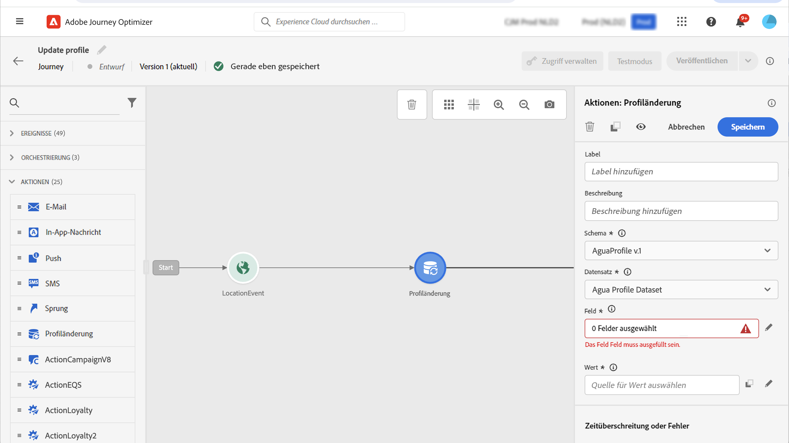
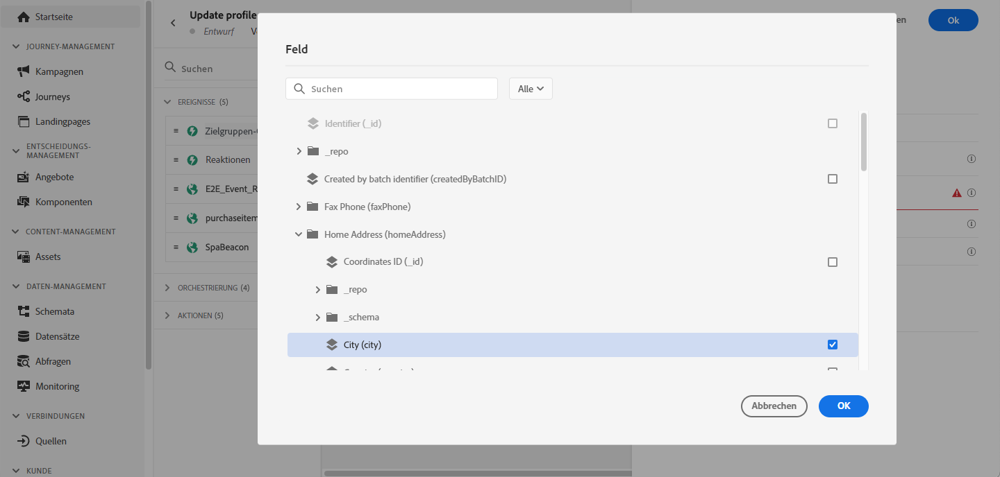

# Profil aktualisieren {#update-profile}

>[!CONTEXTUALHELP]
>id="ajo_journey_update_profiles"
>title="Aktivität „Profil aktualisieren“"
>abstract="Mit der Aktionsaktivität „Profil aktualisieren“ können Sie ein vorhandenes Adobe Experience Platform-Profil mit Informationen aus dem Ereignis, aus einer Datenquelle oder mit einem bestimmten Wert aktualisieren."

Mit der Aktionsaktivität **[!UICONTROL Profil aktualisieren]** können Sie ein vorhandenes Adobe Experience Platform-Profil mit Informationen aus einem Ereignis, aus einer Datenquelle oder mit einem bestimmten Wert aktualisieren.

## Empfehlungen

* Die Aktion **Profil aktualisieren** kann nur in Journeys verwendet werden, die mit einem Ereignis beginnen, das über einen Namespace verfügt.
* Die Aktion aktualisiert nur die vorhandenen Felder, sie erstellt keine neuen Profilfelder.
* Sie können die Aktion **Profil aktualisieren** nicht verwenden, um Erlebnisereignisse zu generieren, z. B. einen Kauf.
* Wie bei jeder anderen Aktion können Sie einen alternativen Pfad für den Fall eines Fehlers oder einer Zeitüberschreitung definieren, und Sie können nicht zwei Aktionen parallel platzieren.
* Die an Adobe Experience Platform gesendete Aktualisierungsanfrage erfolgt unmittelbar bzw. innerhalb einer Sekunde. Normalerweise dauert sie ein paar Sekunden, manchmal aber auch länger, ohne dass dies garantiert werden kann. Wenn eine Aktion beispielsweise „Feld 1“ verwendet, das durch die davor positionierte Aktion **Profil aktualisieren** aktualisiert wurde, sollte daher nicht davon ausgegangen werden, dass „Feld 1“ durch die Aktion aktualisiert wird.
* Die Aktivität **Profil aktualisieren** unterstützt keine XDM-Felder, die als Aufzählung definiert sind.
* Die Aktivität **[!UICONTROL Profil aktualisieren]** aktualisiert nur den [Profilspeicher](https://experienceleague.adobe.com/docs/experience-platform/profile/home.html?lang=de#profile-data-store){target="_blank"}, nicht den Data Lake.
* Beim Auswählen eines Datensatzes in der Aktivität **[!UICONTROL Profil aktualisieren]** wird empfohlen, einen nicht für Datenerfassungsflüsse bestimmten zu verwenden. weil **Profil aktualisieren** -Aktualisierungen werden nur im [Profilspeicher](https://experienceleague.adobe.com/docs/experience-platform/profile/home.html?lang=de#profile-data-store){target="_blank"}besteht die Gefahr, dass solche Änderungen durch einen Datenerfassungsfluss überschrieben werden.

  Darüber hinaus wird die **Profil aktualisieren** Für die Aktivitätskonfiguration ist kein Identitäts-Namespace erforderlich. Stellen Sie daher sicher, dass der ausgewählte Datensatz denselben Identitäts-Namespace verwendet, den die Journey gestartet hat, da dieser Namespace für diese Aktualisierungen verwendet wird. Die Identitätszuordnung kann auch vom ausgewählten Datensatz verwendet werden. Wenn Sie einen Datensatz mit dem richtigen Namespace oder einem Datensatz, der die Identitätszuordnung verwendet, nicht auswählen, führt dies dazu, dass **Profil aktualisieren** -Aktivität fehlschlagen.

## Verwenden der Profilaktualisierung

1. Entwerfen Sie Ihre Journey, indem Sie mit einem Ereignis beginnen. Weitere Informationen finden Sie in diesem [Abschnitt](../building-journeys/journey.md).

1. Legen Sie im Abschnitt **Aktion** der Palette die Aktivität **Profil aktualisieren** auf der Arbeitsfläche ab.

   

1. Wählen Sie ein Schema aus der Liste aus.

1. Klicken Sie auf **Feld**, um das Feld auszuwählen, das Sie aktualisieren möchten. Es kann nur ein Feld ausgewählt werden.

   

1. Wählen Sie einen Datensatz aus der Liste aus.

   >[!NOTE]
   >
   >Die Aktion **Profil aktualisieren** aktualisiert die Profildaten in Echtzeit, sie aktualisiert jedoch keine Datensätze. Die Datensatzauswahl ist erforderlich, da das Profil ein Eintrag ist, der mit einem Datensatz verknüpft ist.

1. Klicken Sie auf das Feld **Wert**, um den gewünschten Wert zu definieren:

   * Mit dem einfachen Ausdruckseditor können Sie ein Feld aus einer Datenquelle oder aus dem eingehenden Ereignis auswählen.

     

   * Wenn Sie einen bestimmten Wert definieren oder erweiterte Funktionen nutzen möchten, klicken Sie auf **Erweiterter Modus**.

     

Die Aktivität **Profil aktualisieren** ist jetzt konfiguriert.

## Verwenden des Testmodus {#using-the-test-mode}

Im Testmodus wird die Aktualisierung des Profils nicht simuliert. Die Aktualisierung wird für das Testprofil durchgeführt.

Nur Testprofile können im Testmodus in eine Journey eintreten. Sie können entweder ein neues Testprofil erstellen oder ein vorhandenes Profil in ein Testprofil umwandeln. In Adobe Experience Platform können Sie Profilattribute über einen CSV-Dateiimport oder API-Aufruf aktualisieren. Eine einfachere Methode besteht darin, die Aktionsaktivität **Profil aktualisieren** zu verwenden und das boolesche Feld „Testprofil“ von „false“ in „true“ zu ändern.

Weitere Informationen dazu, wie Sie ein vorhandenes Profil in ein Testprofil umwandeln, finden Sie in diesem [Abschnitt](../audience/creating-test-profiles.md#create-test-profiles-csv).
